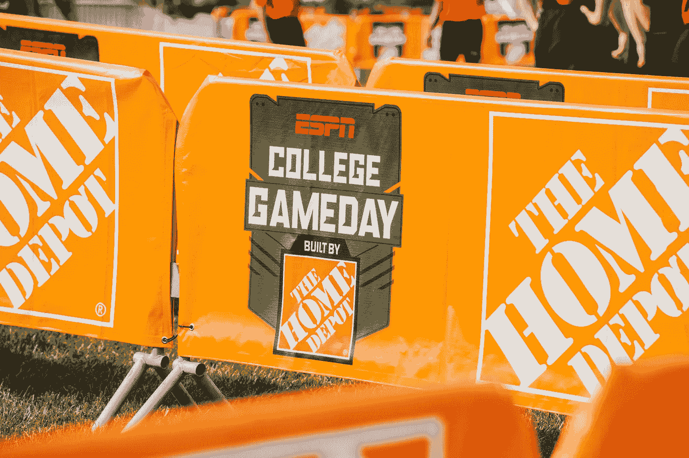

# 大学橄榄球联盟重组 — node2vec

> 原文：[`towardsdatascience.com/college-football-conference-realignment-node2vec-ba2e931bb1c?source=collection_archive---------10-----------------------#2023-08-08`](https://towardsdatascience.com/college-football-conference-realignment-node2vec-ba2e931bb1c?source=collection_archive---------10-----------------------#2023-08-08)

 [Giovanni Malloy](https://medium.com/@gspmalloy?source=post_page-----ba2e931bb1c--------------------------------)

·

[关注](https://medium.com/m/signin?actionUrl=https%3A%2F%2Fmedium.com%2F_%2Fsubscribe%2Fuser%2Fa0442a984e63&operation=register&redirect=https%3A%2F%2Ftowardsdatascience.com%2Fcollege-football-conference-realignment-node2vec-ba2e931bb1c&user=Giovanni+Malloy&userId=a0442a984e63&source=post_page-a0442a984e63----ba2e931bb1c---------------------post_header-----------) 发表在 [Towards Data Science](https://towardsdatascience.com/?source=post_page-----ba2e931bb1c--------------------------------) ·16 min read·2023 年 8 月 8 日

--

你已经阅读了这篇四部分博客的最后一部分。在本博客的第三部分中，我们尝试探索基于聚类的会议世界，其中类似的团队可以共享会议。在本博客中，我们将从电视和媒体网络的角度进行分析。我们将专注于创建一个为电视节目量身定制的精彩对阵阵容：每周都想象一个 [Camping World Kickoff Game](https://campingworldkickoff.com/about/)。换句话说，如果 ESPN 或 FOX 能够根据他们（及其股东）的喜好定制联盟，那么大学橄榄球的格局会是什么样子。在许多方面，这比前面的博客更具现实性。我们的想法是计算大学橄榄球中每场可能比赛的预期回报，贪婪地填充赛程以最大化回报，创建一个“梦幻”赛季，基于选定的对阵定义网络图，并根据图结构创建联盟。

照片由 [Jacob Rice](https://unsplash.com/@jrice_photography?utm_source=medium&utm_medium=referral) 提供，来源于 [Unsplash](https://unsplash.com/?utm_source=medium&utm_medium=referral)

本系列分为四个部分（详细动机见第一部分）：

1.  大学橄榄球联盟重组 — 使用 Python 的探索性数据分析

1.  大学橄榄球联盟重组 — 回归分析

1.  大学橄榄球联盟重组 — 聚类分析

1.  [大学橄榄球联盟重组 — node2vec](https://medium.com/towards-data-science/college-football-conference-realignment-node2vec-ba2e931bb1c)
