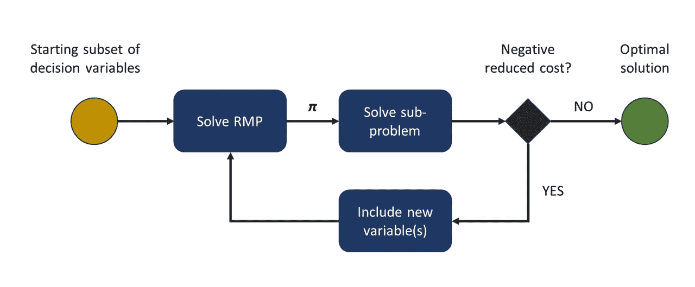
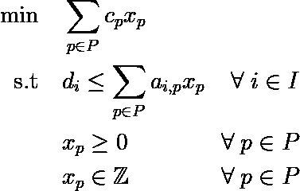
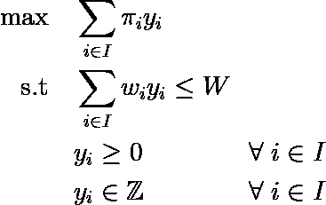
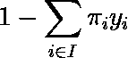

# 线性规划中的列生成与切割库存问题

> 原文：[`towardsdatascience.com/column-generation-in-linear-programming-and-the-cutting-stock-problem-3c697caf4e2b?source=collection_archive---------4-----------------------#2023-06-13`](https://towardsdatascience.com/column-generation-in-linear-programming-and-the-cutting-stock-problem-3c697caf4e2b?source=collection_archive---------4-----------------------#2023-06-13)

## 如何通过 Python 示例解决具有大量决策变量的线性问题

[](https://medium.com/@bruscalia12?source=post_page-----3c697caf4e2b--------------------------------)[](https://towardsdatascience.com/?source=post_page-----3c697caf4e2b--------------------------------) [布鲁诺·斯卡利亚·C·F·莱特](https://medium.com/@bruscalia12?source=post_page-----3c697caf4e2b--------------------------------)

·

[关注](https://medium.com/m/signin?actionUrl=https%3A%2F%2Fmedium.com%2F_%2Fsubscribe%2Fuser%2F3ce9b7482ef0&operation=register&redirect=https%3A%2F%2Ftowardsdatascience.com%2Fcolumn-generation-in-linear-programming-and-the-cutting-stock-problem-3c697caf4e2b&user=Bruno+Scalia+C.+F.+Leite&userId=3ce9b7482ef0&source=post_page-3ce9b7482ef0----3c697caf4e2b---------------------post_header-----------) 发表在 [Towards Data Science](https://towardsdatascience.com/?source=post_page-----3c697caf4e2b--------------------------------) ·9 分钟阅读·2023 年 6 月 13 日[](https://medium.com/m/signin?actionUrl=https%3A%2F%2Fmedium.com%2F_%2Fvote%2Ftowards-data-science%2F3c697caf4e2b&operation=register&redirect=https%3A%2F%2Ftowardsdatascience.com%2Fcolumn-generation-in-linear-programming-and-the-cutting-stock-problem-3c697caf4e2b&user=Bruno+Scalia+C.+F.+Leite&userId=3ce9b7482ef0&source=-----3c697caf4e2b---------------------clap_footer-----------)

--

[](https://medium.com/m/signin?actionUrl=https%3A%2F%2Fmedium.com%2F_%2Fbookmark%2Fp%2F3c697caf4e2b&operation=register&redirect=https%3A%2F%2Ftowardsdatascience.com%2Fcolumn-generation-in-linear-programming-and-the-cutting-stock-problem-3c697caf4e2b&source=-----3c697caf4e2b---------------------bookmark_footer-----------)

照片由 [Jean Vella](https://unsplash.com/es/@jean_vella?utm_source=medium&utm_medium=referral) 提供，刊登在 [Unsplash](https://unsplash.com/?utm_source=medium&utm_medium=referral)

一些来源于组合问题的线性规划（LP）问题由于涉及的大量变量变得难以处理（Gilmore & Gomory, 1961）。在这种问题中，*延迟列生成*是一个潜在的解决方案，因为它不会从一开始就将所有可能的决策变量包括在问题中。一个经典应用是裁切库存问题，在这个问题中，需要决定如何将给定宽度的卷材裁切成小块，以满足对特定裁切尺寸的需求。

在本文中，将介绍列生成的一些主要理论方面，并通过一维裁切库存问题进行说明。在解决方案中，将使用 Python 库*scipy*。有兴趣的人也可以在这个[git 仓库](https://github.com/bruscalia/optimization-demo-files/blob/c711c97e7bea736c23d0fa39500000fd52366117/mip/cutting_stock/cutting_stock.ipynb)中找到完整的代码。

如果你还不熟悉*线性规划*，在阅读我之前关于这一主题的介绍后，你可能会对这篇文章有更好的理解。

[](/linear-programming-theory-and-applications-c67600591612?source=post_page-----3c697caf4e2b--------------------------------) ## 线性规划：理论与应用

### 线性优化的主要概念及其在 Python 中的实现

towardsdatascience.com

如果你准备好深入了解更复杂的概念，并且希望通过实际示例来学习，欢迎加入。

# 列生成：概述

在使用*延迟列生成*来解决线性规划问题时，每次迭代时只考虑包含部分列的问题。这个问题被称为*限制主问题*（RMP）。在每次迭代中，RMP 会被求解，并得到其对应的最优对偶决策变量***π***。然后，算法使用这个结果来解决*子问题*或*定价问题*，旨在找到具有负的缩减成本的新决策变量。让我们回顾一下缩减成本的定义。

> 对于任何非基本变量，变量的缩减成本是指在该变量成为 LP 中某个最优解的基本变量之前，其目标函数系数必须改善的数量。*Winston & Goldberg (2004)*

因此，通过包含具有负缩减成本的变量，我们可能会期待在改善目标值方面的边际贡献。回顾对偶变量的经济解释作为*影子成本*。一个新的变量可能会导致与其在满足约束时所贡献的对偶变量相关的节省，同时其成本系数会增加总体成本。

通过解决*子问题*，我们识别出一组具有最低减值成本的列集合*S*。如果没有识别出负减值成本的列，我们就停止，因为***π***是原始问题的最优对偶解，与 RMP 的最优原始解结合，我们得到了最优的原始/对偶解对。否则，我们将*S*中的列附加到 RMP 中并进行迭代（Klabjan, 2005）。该过程由下图表示。



列生成方案。（图片由作者提供）

请注意，*子问题*是特定于问题的，在某些情况下，可能相当计算上昂贵，难以将其表述为*混合整数规划*问题。因此，考虑启发式方法和/或动态规划方法可能会有用，这些方法在每次迭代中返回多个负减值成本的列。在车辆路径问题的情况下，*子问题*通常是一个约束最短路径问题。那些对深入研究感兴趣的人可以参考 Irnich & Desaulniers（2005）以获取解决技术的见解。

现在记住，所呈现的*延迟列生成*方法解决了具有实值决策变量的*线性规划*问题。为了求解大型*整数*或*混合整数*程序，可以在求解松弛后采用一些启发式方法或使用分支与定价来施加整数约束。在后者方法中，应考虑不仅在初始 LP 解中生成的列，还应在解决整个树中的 LP 时生成新列。Barnhart 等（1998）对分支与定价进行了更深入的讨论。作者研究了常见问题、案例研究以及有关分支规则的有趣见解。

# 切割库存问题

假设我们有一个需求集*I*，每个需求量为*w*的片段数*d*。同时，假设我们有一个宽度为*W*的卷材，从中将生产切割。已知的切割模式集记作*P*。每个切割模式*p*的片段消耗一个卷材单位（*c* = 1），并产生宽度*wᵢ*的*aᵢₚ*单位。我们的目标是确定每个模式*p*的切割量*x*，以满足需求的同时最小化消耗的单位数量。我们可以将这个问题表述如下。



切割库存问题作为一个集合覆盖问题。（图片由作者提供）。

与需求约束***π***相关的对偶决策变量随后在定价问题（*子问题*）中用于寻找具有负*减值成本*的新模式。在切割库存问题的情况下，我们必须找到一个结合了不同宽度的片段的新模式，使其适应总宽度*W*，并且通过帮助满足物料需求，将带来比新成本更多的节省。这是一个背包问题，可以表述为以下形式。



切割库存定价问题。（作者提供的图像）。

其中 *yᵢ* 对应于在新切割模式中生产的宽度 *wᵢ* 的片数。

由于我们知道每个新模式的单位成本 *c* 为 1，我们可以通过以下方式计算新模式的减少成本：



新切割模式的减少成本。（作者提供的图像）。

在非负值的情况下，这应该会停止列生成算法。

为了获得切割库存问题的整数解，一种简单的启发式方法是将线性松弛中获得的分数值四舍五入。或者，也可以用在线性松弛中产生的模式集来解决线性问题，施加整数约束。我们将在本文中使用这两种策略。对于线性松弛接近完整整数模型的实例，这些策略可能会非常成功。在需求数量相对较少的其他实例中，可能会出现一些差异。

如果目标是获得精确的整数解，Branch & Price 方法可能是一个好的替代方案。在这种方法中，在对一些初始变量进行分支后，可能会在当前节点中包含具有减少成本的新列。那些对更多细节感兴趣的人可以参考 Carvalho (1998)和 Vance (1998)。

现在让我们动手实践一下！

# 解决方案

让我们开始切割库存问题的 Python 实现，其中 LP 松弛问题被解决到最优解，并且用迄今为止产生的模式解决整数模型。我们将使用*numpy*进行线性代数运算，*pandas*处理数据框，*scipy*进行优化算法，*matplotlib*可视化切割模式。

```py
import numpy as np
import pandas as pd
from scipy.optimize import linprog
import matplotlib.pyplot as plt
```

让我们导入一个数据集，该数据集是[JuMP 文档](https://jump.dev/JuMP.jl/stable/tutorials/algorithms/cutting_stock_column_generation/)中提出问题的修改版。

```py
dataset = pd.read_csv("data.txt", sep=" ")
```

并且让我们实例化问题参数。

```py
# Total width
W = 100.0

# Width and amount associated with each demand
w = dataset.w.values
d = dataset.d.values

# LP parameters
A = np.eye(dataset.shape[0]) * (W // w)
c = np.ones_like(w)
```

注意，为了初始化*A*矩阵，我引入了切割简单模式，这些模式产生了每种宽度需求的最大可行卷数。假设有对宽度 24 的卷的需求。这将导致初始切割模式的系数为 4，考虑到总宽度 *W* 为 100。

现在让我们定义一个函数来解决给定总宽度 *W*、与每个需求 *w* 相关的宽度向量以及当前对偶变量 *duals* 的*子问题*。

```py
def solve_knapsack(W, w, duals):
    return linprog(
        -duals, A_ub=np.atleast_2d(w), b_ub=np.atleast_1d(W),
        bounds=(0, np.inf), integrality=1,
    )
```

在主循环中，对于每个限制主问题的解，我们将使用来自*scipy*的*linprog*函数。*A*矩阵和需求向量都以其负值传递，因为*scipy*按惯例仅考虑“小于或等于”不等式。

```py
linprog(c, A_ub=-A, b_ub=-d, bounds=(0, None))
```

解决方案应该具有与需求相关的对偶变量的负值，这些值存储在*ineqlin.marginals*属性中。

探索对偶性概念时，还可以通过解决以下*LP*来获得对偶变量。

```py
linprog(-d, A_ub=A.T, b_ub=c, bounds=(0, None))
```

让我们把所有内容汇集到主循环中。

```py
# Initial solution
sol = linprog(c, A_ub=-A, b_ub=-d, bounds=(0, None))
sol_dual = linprog(-d, A_ub=A.T, b_ub=c, bounds=(0, None))
diff = np.abs(sol_dual.x + sol.ineqlin.marginals).sum()
print(f"Compare duality difference: {diff}")

# Iterate
for _ in range(1000):
    duals = -sol.ineqlin.marginals
    price_sol = solve_knapsack(W, w, duals)
    y = price_sol.x
    if 1 + price_sol.fun < -1e-4:
        print(f"Iteration: {_}; Reduced cost: {(1 + price_sol.fun):.3f}")
        A = np.hstack((A, y.reshape((-1, 1))))
        c = np.append(c, 1)
        sol = linprog(c, A_ub=-A, b_ub=-d, bounds=(0, None))
    else:
        break
```

最后，让我们尝试将线性松弛的解四舍五入以及仅考虑在*LP*中生成的列的整数解。

```py
sol_round = linprog(c, A_ub=-A, b_ub=-d, bounds=(0, np.inf), integrality=0)
print(f"Rounding solution {np.ceil(sol_round.x).sum()}")
sol = linprog(c, A_ub=-A, b_ub=-d, bounds=(0, np.inf), integrality=1)
print(f"Integer solution: {sol.x.sum()}")
```

应该返回：

+   四舍五入解：339.0

+   整数解：334.0

在这种情况下，我们可以通过对*LP*施加整数约束，而不仅仅是对松弛结果进行四舍五入，从而将结果提高近 2%。给那些愿意尝试 Branch & Price 的人一个小提示：334 是该实例的确切解。

最后，让我们尝试可视化新的切割模式：

```py
fig, ax = plt.subplots(figsize=[7, 3], dpi=100)
hmap = ax.imshow(A > 1e-6, cmap="Blues")
plt.axis('off')
fig.tight_layout()
plt.show()
```


切割库存问题中生成的切割模式。（作者提供的图片）。

我们使用列生成法解决了切割库存问题。

# 进一步阅读

容量受限的车辆路径问题（CVRP）首次由 Dantzig & Ramser（1959）提出，由于其组合性质，特别具有挑战性。作者在他们的原始论文中表明，即使对于小规模问题，可能的路径数量也极其庞大。例如，一个有 15 个需求点的对称问题有超过 6 × 10¹¹条可能的路径。我发现看到列生成如何在这些及相关问题中随着时间的推移被探索特别有趣。

尽管对于时间窗口约束严格的车辆路径问题，自 Desrochers 等（1992）的工作以来，列生成方法已经建立得很好，但 Branch & Price 在约束较少的实例上往往会失败。因此，纯列生成方法并未被认为是 CVRP 的有前途的方法。然而，Fukasawa 等（2006）将列生成方法结合到 Branch & Cut 算法中，证明了文献中若干实例的最优性。其他作者进一步改进了 CVRP 的 Branch-cut-and-Price 方法，我相信 Pecin 等（2017）的工作对于感兴趣的读者尤其吸引人。

# 结论

在这篇文章中，*延迟列生成*作为一种解决具有大量决策变量的线性程序的策略被介绍，而无需显式地考虑所有变量。介绍了经典的一维切割库存问题来说明该方法，并在 Python 中实现了一个解决方案备选方案。完整代码可在此[git 库](https://github.com/bruscalia/optimization-demo-files/blob/c711c97e7bea736c23d0fa39500000fd52366117/mip/cutting_stock/cutting_stock.ipynb)中获取。

# 参考文献

Barnhart, C., Johnson, E. L., Nemhauser, G. L., Savelsbergh, M. W., & Vance, P. H., 1998\. Branch-and-price: 列生成用于解决大型整数程序。*运筹学*，*46*(3)，316–329。

de Carvalho, J. V., 1998\. 使用列生成和分支界限法解决切割库存问题的精确解。*国际运筹学交易*，*5*(1)，35–44。

Dantzig, G. B., & Ramser, J. H., 1959\. 卡车调度问题. *管理科学*, *6*(1), 80–91.

Desrochers, M., Desrosiers, J., & Solomon, M., 1992\. 车辆路径问题与时间窗口的优化算法. *运筹学*, *40*(2), 342–354.

Fukasawa, R., Longo, H., Lysgaard, J., Aragão, M. P. D., Reis, M., Uchoa, E., & Werneck, R. F., 2006\. 容量车辆路径问题的鲁棒分支切割价格方法. *数学规划*, *106*, 491–511.

Gilmore, P. C., & Gomory, R. E., 1961\. 切割存货问题的线性规划方法. *运筹学*, *9*(6), 849–859.

Irnich, S., & Desaulniers, G., 2005\. *资源约束下的最短路径问题* (pp. 33–65). Springer US.

Klabjan, D., 2005\. 航空业的大规模模型. *列生成*, 163–195.

Pecin, D., Pessoa, A., Poggi, M., & Uchoa, E., 2017\. 容量车辆路径改进的分支切割价格方法. *数学规划计算*, *9*, 61–100.

Vance, P. H., 1998\. 一维切割存货问题的分支价格算法. *计算优化与应用*, *9*, 211–228.

Winston, W. L. & Goldberg, J. B., 2004\. *运筹学：应用与算法.* 第四版. Belmont, CA: Thomson Brooks/Cole Belmont.
