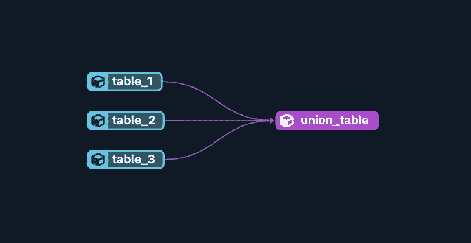

# 将 dbt 模型合并到一个目标表中

> 原文：[`towardsdatascience.com/combine-dbt-models-into-a-single-target-table-9873679ffd9b?source=collection_archive---------4-----------------------#2023-01-03`](https://towardsdatascience.com/combine-dbt-models-into-a-single-target-table-9873679ffd9b?source=collection_archive---------4-----------------------#2023-01-03)

## 涵盖 3 种模式及其权衡的教程

[](https://medium.com/@jaypeterman?source=post_page-----9873679ffd9b--------------------------------)[](https://towardsdatascience.com/?source=post_page-----9873679ffd9b--------------------------------) [Jay Peterman](https://medium.com/@jaypeterman?source=post_page-----9873679ffd9b--------------------------------)

·

[关注](https://medium.com/m/signin?actionUrl=https%3A%2F%2Fmedium.com%2F_%2Fsubscribe%2Fuser%2F9731dc608e6c&operation=register&redirect=https%3A%2F%2Ftowardsdatascience.com%2Fcombine-dbt-models-into-a-single-target-table-9873679ffd9b&user=Jay+Peterman&userId=9731dc608e6c&source=post_page-9731dc608e6c----9873679ffd9b---------------------post_header-----------) 发表在 [Towards Data Science](https://towardsdatascience.com/?source=post_page-----9873679ffd9b--------------------------------) ·6 分钟阅读·2023 年 1 月 3 日[](https://medium.com/m/signin?actionUrl=https%3A%2F%2Fmedium.com%2F_%2Fvote%2Ftowards-data-science%2F9873679ffd9b&operation=register&redirect=https%3A%2F%2Ftowardsdatascience.com%2Fcombine-dbt-models-into-a-single-target-table-9873679ffd9b&user=Jay+Peterman&userId=9731dc608e6c&source=-----9873679ffd9b---------------------clap_footer-----------)

--

[](https://medium.com/m/signin?actionUrl=https%3A%2F%2Fmedium.com%2F_%2Fbookmark%2Fp%2F9873679ffd9b&operation=register&redirect=https%3A%2F%2Ftowardsdatascience.com%2Fcombine-dbt-models-into-a-single-target-table-9873679ffd9b&source=-----9873679ffd9b---------------------bookmark_footer-----------)

作者提供的图片

如果你在寻找一种简单的方法来构建分析管道，dbt 很可能会在你的雷达上。它旨在使数据分析师/科学家专注于他们的专业领域，减少对数据工程师的依赖。

我注意到，刚接触 dbt 的新手经常会问一个共同的问题：如何将多个具有共同模式的 dbt 模型加载到一个目标表中？我将介绍一些可以适应不同用例的模式，并讨论一些权衡。

本教程的其余部分假设你已经设置了 dbt，并且对工具有一定的了解。即使你不熟悉，我认为你仍然可以提取一些有用的见解。本教程使用 BigQuery。

## 设置问题

这将是一个简单的示例，我们将结合 3 个 dbt 模型和一个简单的模式：

首先，我们将在`models`中创建一个新的目录，并将其命名为`dbt-test`。在`dbt-test`内部，我们将创建以下 4 个文件：

1.  **table_1.sql**

```py
{{ 
  config(
    materialized="table"
) }}

SELECT *
FROM UNNEST([1, 2, 3, 4]) AS a
```
