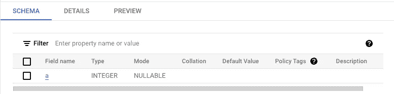
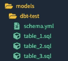

# 将 dbt 模型合并为一个单一目标表

> 原文：[`towardsdatascience.com/combine-dbt-models-into-a-single-target-table-9873679ffd9b`](https://towardsdatascience.com/combine-dbt-models-into-a-single-target-table-9873679ffd9b)

## 涵盖 3 种模式及其权衡的教程

[](https://medium.com/@jaypeterman?source=post_page-----9873679ffd9b--------------------------------)[](https://towardsdatascience.com/?source=post_page-----9873679ffd9b--------------------------------) [Jay Peterman](https://medium.com/@jaypeterman?source=post_page-----9873679ffd9b--------------------------------)

·发表于[Towards Data Science](https://towardsdatascience.com/?source=post_page-----9873679ffd9b--------------------------------) ·阅读时长 6 分钟·2023 年 1 月 3 日

--


作者提供的图片

如果你在寻找一种简单的方式来构建分析管道，dbt 可能会引起你的关注。它旨在赋能数据分析师/科学家专注于他们的专业领域，并减少对数据工程师的依赖。

我注意到新手在使用 dbt 时常常会提出一个共同的问题：如何将多个具有共同模式的 dbt 模型加载到一个单一的目标表中？我将介绍一些可以适应不同用例的模式，并讨论一些权衡。

本教程的其余部分假设你已经设置了 dbt，并且对使用该工具有一定的熟悉度。即使你没有，我认为你也可以获得一些有用的见解。本教程使用 BigQuery。

## 问题设置

这将是一个简单的示例，我们将结合 3 个具有简单模式的 dbt 模型：



作者提供的图片

要开始，我们将在`models`目录中创建一个新目录，并将其命名为`dbt-test`。在`dbt-test`内部，我们将创建以下 4 个文件：

1.  **table_1.sql**

```py
{{ 
  config(
    materialized="table"
) }}

SELECT *
FROM UNNEST([1, 2, 3, 4]) AS a
```

2\. **table_2.sql**

```py
{{ 
  config(
    materialized="table"
) }}

SELECT *
FROM UNNEST([45, 23, 1, 111]) AS a
```

3\. **table_3.sql**

```py
{{ 
  config(
    materialized="table"
) }}

SELECT *
FROM UNNEST([88, 55, 34, 342]) AS a
```

4\. **schema.yml**

```py
 version: 2

models:
    - name: table_1
    - name: table_2
    - name: table_3
    - name: union_table
```

注意：`union_table`将是目标表的名称（如下讨论）。

SQL 文件表示将加载到目标表中的上游表。现在`dbt-test`目录应如下所示：



作者提供的图片

## 模式 1：手动 UNION

第一个模式将简单地创建一个新模型，该模型将`UNION`我们所有的表，并将其物化为一个新表`union_table`。

**union_table.sql**

```py
 {{ 
  config(
    materialized="table"
) }}

SELECT *
FROM `dbt-test`.`dbt_test`.`table_1`
UNION ALL
SELECT *
FROM `dbt-test`.`dbt_test`.`table_2`
UNION ALL
SELECT *
FROM `dbt-test`.`dbt_test`.`table_3`
```

这个解决方案很可能是大多数 SQL 开发人员的起点，并且运行良好。这个模式强调简洁性/可读性，代价是扩展性。也就是说，如果我们需要 `UNION` 100 个表，或者表的数量经常变化，它将很快变得难以管理。此外，如果任何源表失败或不存在，整个模型都会失败。

## 模式 2：使用 for 循环进行 UNION

这个模式有助于扩展性，但可能以牺牲可读性为代价。要测试这个模式，请按如下所示修改 `union_table.sql` 的内容：

**union_table.sql**

```py
{{ 
  config(
    materialized="table"
) }}





  SELECT *
  FROM {{ ref(table) }}

  
    UNION ALL
  

```

这段代码最终实现了与模式 1 相同的目标输出，不过这次我们使用了 Jinja 的 for 循环。第一步是将包含所有上游表的数组分配给一个名为 `tables` 的变量。接着，我们将使用 for 循环遍历 `tables` 并通过 `FROM` 语句中的 `ref` 函数传递迭代变量 `table`。

在 `FROM` 语句之后，有一个条件语句控制是否将 `UNION ALL` 语句添加到该循环的迭代中。在这种情况下，我们需要在除了最后一次迭代之外的所有迭代中添加 `UNION ALL`。

为了帮助理解这个模型的功能，你可以查看编译后的 SQL 代码，这是运行 `dbt compile` 的结果。

```py
SELECT *
FROM `dbt-test`.`dbt_test`.`table_1`

UNION ALL

SELECT *
FROM `dbt-test`.`dbt_test`.`table_2`

UNION ALL

SELECT *
FROM `dbt-test`.`dbt_test`.`table_3`
```

正如你所看到的，这个 dbt 模型编译成与模式 1 相同的代码。虽然可读性可能比模式 1 差一些，但我认为它在维护和扩展性方面更容易。不过，我们仍然面临的问题是如果任何源表失败，整个模型都会失败。

要扩展这个模式，你需要更新 `tables` 数组以包含适当的 `UNION` 表。我认为这是对模式 1 的改进，但仍然可以更好。

## 模式 2.1：以编程方式包含正确的源表

这个模式为模式 2 添加了一个可扩展性的改进，它从 BigQuery 查询 `INFORMATION_SCHEMA.TABLES` 来获取需要包含在数组中的表。为了实现这一点，你必须遵循表的命名约定，在这个例子中是 `table_<id>`。

**union_table.sql**

```py
{{ config(materialized="table") }}
-- depends_on: {{ ref('table_1') }}
-- depends_on: {{ ref('table_2') }}
-- depends_on: {{ ref('table_3') }}


    SELECT table_name 
    FROM `dbt-test.dbt_test.INFORMATION_SCHEMA.TABLES`
    WHERE table_name LIKE 'table_%'






SELECT *
FROM {{ ref(table[0]) }}

  
    UNION ALL
  

```

这段代码查询 `INFORMATION_SCHEMA.TABLES` 以获取适当的表，通过过滤符合定义命名约定的表来实现。结果的 `data` 元素被保存到 `tables` 变量中。然后，我们可以像在模式 2 中一样遍历这个数组。

在模式 2.1 中，`tables` 不再是字符串数组（如模式 2 中的那样），而是一个 `tuples` 数组，格式如下：

```py
[("table_1",), ("table_2",), ("table_3",)]
```

由于迭代变量现在是 `tuple`，我们需要访问索引 0 处的元素。

编译后的代码应该很熟悉：

```py
-- depends_on: `dbt-test`.`dbt_test`.`table_1`
-- depends_on: `dbt-test`.`dbt_test`.`table_2`
-- depends_on: `dbt-test`.`dbt_test`.`table_3`

SELECT *
FROM `dbt-test`.`dbt_test`.`table_2`

UNION ALL

SELECT *
FROM `dbt-test`.`dbt_test`.`table_3`

UNION ALL

SELECT *
FROM `dbt-test`.`dbt_test`.`table_1`
```

到此为止，我们的模型扩展得相当好。然而，如果任何源表失败，它仍然会完全失败，这可能是期望的行为。

## 模式 3：使用 hooks 加载到目标表

要获得更灵活的加载模式，你可以尝试使用钩子。这个模式独立地将每个模型加载到目标表中，单个失败的模型不会破坏整个过程。

这里是一个如何修改`table_1.sql`以使用`post-hook`的示例：

```py
{{ config(
    materialized="table",
    post_hook="insert into `dbt-test.dbt_test.hook_table` select * from {{ this }}"
) }} 

SELECT * FROM UNNEST([1, 2, 3, 4]) AS a
```

在这个例子中，后钩子将在模型完成时运行 SQL 查询。在这种情况下，它将`INSERT`物化表到`hook_table`中。这个例子假设`hook_table`已经存在。

然后你需要将钩子添加到所有需要加载到目标表中的 dbt 模型中。如果某一个源表失败，其他表仍然应该会被加载到`hook_table`中。这里的权衡是你将失去数据源的可视性，而且规模扩展会变得更加困难。

## 结论

你刚刚学习了如何将多个 dbt 模型加载到一个目标表中。虽然这些示例很简单，但它们应该容易适应你的具体用例。感谢阅读，希望你觉得有用。
