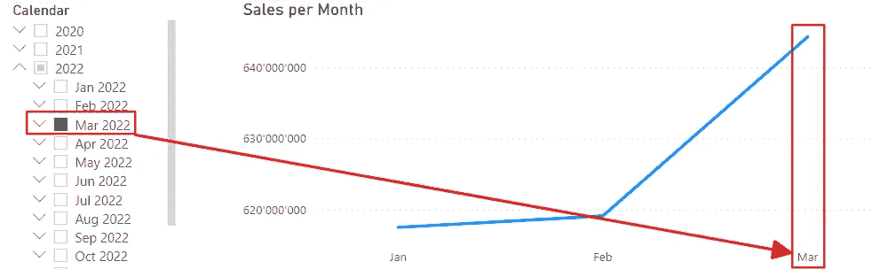

# 在 Power BI 中将实际数据和预测数据结合成一条连续的线

> 原文：[`towardsdatascience.com/combining-actuals-and-forecasts-in-one-continuous-line-in-power-bi-dc5fd3a66c6f`](https://towardsdatascience.com/combining-actuals-and-forecasts-in-one-continuous-line-in-power-bi-dc5fd3a66c6f)

## *在许多业务中，我们有实际销售数据和预测数据。我们可以将这些数据添加到一个折线图中，看到两条线。但我的一位客户问我是否可以得到一条连续的线，实际数据到所选月份，然后所有之后月份的预测数据。这是我如何做到的。*

[](https://medium.com/@salvatorecagliari?source=post_page-----dc5fd3a66c6f--------------------------------)[](https://towardsdatascience.com/?source=post_page-----dc5fd3a66c6f--------------------------------) [Salvatore Cagliari](https://medium.com/@salvatorecagliari?source=post_page-----dc5fd3a66c6f--------------------------------)

·发表在[Towards Data Science](https://towardsdatascience.com/?source=post_page-----dc5fd3a66c6f--------------------------------) ·11 分钟阅读·2023 年 8 月 12 日

--


图片由[Carlos Muza](https://unsplash.com/@kmuza?utm_source=medium&utm_medium=referral)提供，来源于[Unsplash](https://unsplash.com/?utm_source=medium&utm_medium=referral)

# 介绍

为了设定背景，让我们看看下面的图片：


图 1 — 实际数据和预测数据的折线图（图由作者提供）

对于这张图表，我只是输入了一些数字到 Excel 中，并从这些数字创建了一个折线图。

你可以看到实际销售和预测销售的线条彼此分开，这也是预期中的情况。

虽然在大多数情况下这没有问题，但我的客户希望对他的数据有不同的视图：


图 2 — 客户请求的目标视图（图由作者提供）

如你所见，目标是创建一条连续的线。从一月开始，然后按月显示实际数字，直到所选月份（在一个单独的切片器中设置）。然后继续显示预测数字。但在所选月份的切换点必须连接起来形成一条连续的线。

此外，当他更改月份选择时，切换点必须移动到所选月份。

嗯，这听起来很有趣。

# 方法

一开始，这个请求听起来很熟悉：我想选择一个特定的月份，然后看到全年的数据，并使用所选月份进行特定计算。

我在我过去的一篇文章中解释了这个解决方案：

[](/how-to-show-more-dates-than-selected-in-dax-bda0c4140121?source=post_page-----dc5fd3a66c6f--------------------------------) ## 如何在 DAX 中显示比选定日期更多的日期

### 如果用户想查看比选定年份更多的年份怎么办？让我们深入了解一下。

[towardsdatascience.com

简而言之：我需要一个日期表的副本，并将其链接到我的主日期表。

然后，我使用复制的日期表进行切片器，主日期表用于图表。

我可以使用 [CROSSFILTER()](https://dax.guide/crossfilter/) 函数关闭复制的日期表和主日期表之间的关系，以显示选定年份的所有月份。

到目前为止，一切顺利。

但现在我必须弄清楚如何在正确的位置计算正确的值。

# 解决方案路径（实际数据）

第一步是确保我可以使用复制的日期表从切片器中选择一个月份，并使用它来定义用于报告每月结果的年份。

挑战在于，没有任何逻辑，我最终只能看到选定月份的一个数据点：


图 3 — 没有特定逻辑的数据点（图由作者提供）

我必须向度量值中添加一些代码以进行更正，以便查看所有月份：

```py
Retail Sales (Using correct date) =
VAR SelYear = SELECTEDVALUE('Selection Date'[Year])

RETURN
  CALCULATE([Sum Retail Sales]
              ,'Date'[Year] = SelYear
              ,CROSSFILTER('Selection Date'[DateKey]
                            ,'Date'[DateKey]
                            ,None
                            )
              )
```

首先，我必须确定选定的年份。

然后我使用 [CALCULATE()](https://dax.guide/calculate/) 为选定年份添加过滤器。此外，我还使用 [CROSSFILTER()](https://dax.guide/crossfilter/) 函数关闭复制的日期表和主日期表之间的关系。

这是中间结果：


图 4 — 正确日期逻辑的结果（图由作者提供）

现在，无论我在切片器中选择哪个月份，结果都是一样的。只有当我选择不同年份的月份时，结果才会变化。

下一步是添加逻辑，仅计算到选定月份的实际销售结果。

例如：

+   我选择了五月，然后我看到从一月到五月的销售数据。

+   我选择了二月，然后我只看到一月和二月。

在这种情况下，我不能像这样向 CALCULATE()添加进一步的过滤器：

```py
Retail Sales (Using correct date) =
VAR SelYear = SELECTEDVALUE('Selection Date'[Year])

VAR LastSelDate = MAX('Selection Date'[Date])

RETURN
CALCULATE([Sum Retail Sales]
          ,'Date'[Year] = SelYear
          ,'Date'[Date] < LastSelDate
          ,CROSSFILTER('Selection Date'[DateKey]
                      ,'Date'[DateKey]
                      ,None
                      )
            )
```

这个过滤器会覆盖日期表中的任何过滤器，并为所有月份返回相同的值。

我需要确保在选定月份之后不会计算任何结果。

这是我想到的：

```py
Retail Sales (Using correct date) =
VAR SelYear = SELECTEDVALUE('Selection Date'[Year])

VAR LastSelDate = MAX('Selection Date'[Date])

VAR ActiveDate = CALCULATE(MAX('Date'[Date])
                          ,'Date'[Year] = SelYear
                          ,CROSSFILTER('Selection Date'[DateKey]
                                        ,'Date'[DateKey]
                                        ,None
                                        )
                          )

RETURN
IF(ActiveDate >= DATE(SelYear, 1, 1) &&
      ActiveDate <= LastSelDate
  ,CALCULATE([Sum Retail Sales]
            ,'Date'[Year] = SelYear
            ,CROSSFILTER('Selection Date'[DateKey]
                        ,'Date'[DateKey]
                        ,None
                        )
            )
)
```

首先，我从复制的日期表“选择日期”中确定最后选择的日期。例如，当我选择 2022 年 5 月时，我将获得 2022 年 5 月 31 日。对于 4 月，我将获得 2022 年 4 月 30 日。

接下来，我获取折线图中当前过滤上下文的最后日期。由于我在可视化中使用了主日期表，因此可以从中获取它。

但是，当我关闭与复制的日期表的关系时，我必须将年份限制为切片器选择的年份。这就是为什么我必须添加过滤器 'Date'[Year] = SelYear。

最后，我使用一个 IF 来确定是否必须返回一个值。

现在，量度仅返回到选定月份的结果。

如你所见，我的数据包含到 2022 年最大值。

但当我选择 2022 年 3 月时，我得到这个结果：



图 5 — 实际销售到 2022 年 3 月的量度结果（作者制作的图）

# 下一步 — 计算预测

现在，我必须从选定的月份开始计算预测。

我可以取用之前的量度，将 [IF()](https://dax.guide/if/) 更改为从选定的月份开始，直到年份结束：

```py
Retail Sales Forecast (Using correct date) =
VAR SelYear = SELECTEDVALUE('Selection Date'[Year])

VAR LastSelDate = MAX('Selection Date'[Date])

VAR ActiveDate = CALCULATE(MAX('Date'[Date])
                          ,'Date'[Year] = SelYear
                          ,CROSSFILTER('Selection Date'[DateKey]
                                        ,'Date'[DateKey]
                                        ,None
                                        )
                          )

RETURN
IF(ActiveDate >= LastSelDate &&
      ActiveDate <= DATE(SelYear, 12, 31)
   ,CALCULATE([Retail Sales Forecast]
        ,'Date'[Year] = SelYear
        ,CROSSFILTER('Selection Date'[DateKey]
                    ,'Date'[DateKey]
                    ,None
                    )
        )
)
```

如你所见，我只是将 IF() 语句修改为从选定的月份开始，并在实际年份结束时结束。

现在，我们接近最终结果：


图 6 — 未调整预测量度的结果（作者制作的图）

但现在我在这条线中有一个间隙。

记住我需要有一条连续的线吗？

为了实现这一点，我需要对我的量度做一个小的更改以计算预测：在选定的月份时，我必须返回实际销售数字。

修改后的量度如下：

```py
Retail Sales Forecast (Using correct date) =
VAR SelYear = SELECTEDVALUE('Selection Date'[Year])

VAR LastSelDate = MAX('Selection Date'[Date])

VAR ActiveDate = CALCULATE(MAX('Date'[Date])
                          ,'Date'[Year] = SelYear
                          ,CROSSFILTER('Selection Date'[DateKey]
                                      ,'Date'[DateKey]
                                      ,None
                                      )
                          )

RETURN
SWITCH(TRUE()
  ,ActiveDate = LastSelDate
    ,[Sum Retail Sales]
  ,ActiveDate >= LastSelDate &&
          ActiveDate <= DATE(SelYear, 12, 31)
    ,CALCULATE([Retail Sales Forecast]
              ,'Date'[Year] = SelYear
              ,CROSSFILTER('Selection Date'[DateKey]
                          ,'Date'[DateKey]
                          ,None
                          )
               )
  )
```

你可以看到，我用 [SWITCH()](https://dax.guide/switch/) 替换了 IF() 并添加了一个新条件，以检查“ActiveDate”是否等于“LastSelDate”。

最后的更改是将预测线更改为虚线，结果如预期：


图 7 — 最终结果（作者制作的图）

# 如果我们没有销售数据呢？

到目前为止，一切顺利。

但是，当用户选择一个实际销售的最后一个月份之后的月份时，会发生什么？


图 8 — 选择没有实际销售的月份时的间隙（作者制作的图）

我的客户说：好吧，我的用户可以理解这一点。所以，没问题。保持现状。

但对于这篇文章，我想给你一个可能的解决方案：当不存在实际销售数据时，返回预测值。

让我们将其转换为 SWITCH() 的额外条件：

```py
Retail Sales Forecast (Using correct date) =
VAR SelYear = SELECTEDVALUE('Selection Date'[Year])

VAR LastSelDate = MAX('Selection Date'[Date])

VAR ActiveDate = CALCULATE(MAX('Date'[Date])
                          ,'Date'[Year] = SelYear
                          ,CROSSFILTER('Selection Date'[DateKey]
                                      ,'Date'[DateKey]
                                      ,None
                                      )
                          )

VAR Forecast = CALCULATE([Retail Sales Forecast]
                          ,'Date'[Year] = SelYear
                          ,CROSSFILTER('Selection Date'[DateKey]
                                      ,'Date'[DateKey]
                                      ,None
                                      )
                          )

RETURN
SWITCH(TRUE()
  ,ISBLANK([Retail Sales (Using correct date)]), Forecast
  ,ActiveDate = LastSelDate
      ,[Sum Retail Sales]
  ,ActiveDate >= LastSelDate &&
          ActiveDate <= DATE(SelYear, 12, 31)
      ,Forecast
  )
```

看 SWITCH 的第一个条件：ISBLANK([Retail Sales (Using correct date)]), 预测

结果并不像最初需要的那样：


图 9 — 间隙已关闭的结果（作者制作的图）

不可能的是填补五月和六月之间的间隙。

原因在于，当我们评估零售销售量度时，仅当零售销售量度为空时，我们才会添加预测。因此，我们没有可能添加缺失的值。

此时数据不存在。

因此，唯一获得一条连续线的方法是冻结数据，即使在选择一个实际数据的最后一个月份之后的月份时，数据也保持不变。

为此，我遵循了以下过程：

1.  检查下一个月份是否包含销售结果。

1.  如果是，则返回所选月份的销售结果。

1.  如果不是，则获取最后的销售值并返回它。

1.  如果当前月份没有销售数据，则返回预测结果。

为了实现这一点，我需要一个度量值来获取当前月份之后的月份的销售数据：

```py
Sales next Month =
VAR LastActDate = CALCULATE(MAX('Date'[Date])
                          ,CROSSFILTER('Selection Date'[DateKey]
                          ,'Date'[DateKey]
                          ,None
                          )
                       )

VAR Result = CALCULATE([Sum Retail Sales]
                          ,'Date'[Date] > EOMONTH(LastActDate, 0)
                            && 'Date'[Date] <= EOMONTH(LastActDate, 1)
                          ,CROSSFILTER('Selection Date'[DateKey]
                                    ,'Date'[DateKey]
                                    ,None
                                    )
                          )

RETURN
  IF(ISBLANK([Retail Sales (Using correct date)]) = FALSE()
      ,Result)
```

通常，这个度量值会更容易编写。

但由于解决方案的具体要求，我需要这样做。

首先，我必须获取当前月份的最后日期 à 变量 LastActDate。

然后，我获取变量 LastActDate 之后的日期的销售结果（> [EOMONTH](https://dax.guide/eomonth)(‘Date’[Date], 0) 和在下一个月的最后日期之前或等于（<= EOMONTH(‘Date’[Date], 1)）。

但只有在度量值返回的实际销售值没有数据时，我才返回这个值（[ISBLANK()](https://dax.guide/isbank)）。

现在，我可以使用这个度量值来检查视觉中当前月份是否是最后一个具有实际销售数据的月份。如果是，返回最后已知的销售数据。之后，返回预测数据：

```py
Retail Sales Forecast (Using correct date) Full =
VAR SelYear = SELECTEDVALUE('Selection Date'[Year])

VAR LastSelDate = MAX('Selection Date'[Date])

VAR ActiveDate = CALCULATE(MAX('Date'[Date])
                        ,'Date'[Year] = SelYear
                        ,CROSSFILTER('Selection Date'[DateKey]
                                    ,'Date'[DateKey]
                                    ,None
                                    )
                         )

VAR Forecast = CALCULATE([Retail Sales Forecast]
                         ,'Date'[Year] = SelYear
                         ,CROSSFILTER('Selection Date'[DateKey]
                                    ,'Date'[DateKey]
                                    ,None
                                  )
                         )

VAR LastSalesDate = CALCULATE( MAX('Retail Sales'[Date])
                              ,REMOVEFILTERS('Date')
                              )

VAR LastMonthSales = CALCULATE([Sum Retail Sales]
                              ,REMOVEFILTERS('Date'[Date])
                              ,'Date'[Date] > EOMONTH(LastSalesDate, -1)
                                  && 'Date'[Date] <= EOMONTH(LastSalesDate, 0)
                              )

RETURN
SWITCH(TRUE()
  ,ISBLANK([Retail Sales (Using correct date)]) = FALSE() && ISBLANK([Sales next Month]) = TRUE(), [Retail Sales (Using correct date)]
  ,ISBLANK([Retail Sales (Using correct date)]), Forecast
  ,ActiveDate = LastSelDate
        ,[Sum Retail Sales]
  ,ActiveDate >= LastSelDate &&
      ActiveDate <= DATE(SelYear, 12, 31)
        ,Forecast
  )
```

因为我必须检查多个情况，所以我使用 SWITCH()来决定返回哪个值。

当我选择 2022 年 6 月或之后的时间时，我总是得到这个结果：


图 10 — 完整度量值的结果（作者提供的图）

请考虑我必须在图表中使用月份/年份列。我需要这个列，因为度量值必须知道当前的位置在哪个月份和年份。最初，只需知道我是哪个月份就足够了，因为我从切片器中获取年份。

在这种情况下，这已不再可能。因此，我必须更改用于月份的列。

这个度量值的大问题是计算结果几乎需要三秒钟。

而第一个度量值需要不到一秒钟来完成计算：


图 11 — 第一个版本与完整版本的执行时间比较（作者提供的图）

# CROSSFILTER()问题

微软的[CROSSFILTER()](https://learn.microsoft.com/en-us/dax/crossfilter-function)文档在备注部分指出：

在计算列或行级安全（RLS）规则中使用时，此函数在 DirectQuery 模式下不受支持。

不幸的是，DAX.guide 文档中没有提到[CROSSFILTER()](https://dax.guide/crossfilter/)的这一关键点。

我在一个客户的数据模型中遇到了这个问题。

如果在数据模型中实施 RLS，上述解决方案将不再有效。

替代 CROSSFILTER()函数的是使用[ALLEXCEPT()](https://dax.guide/allexcept/)。

使用 ALLEXCEPT()，我们可以从表中移除所有筛选器，但保留对一个或多个列的筛选器。

我们可以使用 ALLEXCEPT()来替代 CROSSFILTER()，同时保留‘Selection Date’表中的年份列的筛选。

销售度量看起来如下：

```py
[Retail Sales (Using correct date)] = 
 VAR SelYear = SELECTEDVALUE('Selection Date'[Year])

 VAR LastSelDate = MAX('Selection Date'[Date])

 VAR ActiveDate = CALCULATE(MAX('Date'[Date])
   ,ALLEXCEPT('Selection Date', 'Selection Date'[Year])
   )

 RETURN
 IF(ActiveDate >= DATE(SelYear, 1, 1) &&
     ActiveDate <= LastSelDate
   ,CALCULATE([Sum Retail Sales]
             ,ALLEXCEPT('Selection Date', 'Selection Date'[Year])
             )
   )
```

那么，为什么我们一开始不使用 ALLEXCEPT()呢？

这个版本比使用 CROSSFILTER()的版本更简洁易懂。

好的，让我们看看这两个版本的性能。

首先，让我们看看使用 CROSSFILTER()的版本的性能：


图 12 — 使用 CROSSFILTER()的度量的服务器时间（图由作者提供）

现在，让我们在 DAX Studio 中将度量更改为使用 ALLEXCEPT()的版本，并测量性能：


图 13 — 使用 ALLEXCEPT()的版本的服务器时间（图由作者提供）

如你所见，查询时间增加了一倍多。

此外，存储引擎（SE）部分从 46.7%缩减到 16.7%。这表明使用 ALLEXCEPT()的版本比使用 CROSSFILTER()的版本效率低。

主要原因是‘选择日期’和‘日期’表之间的关系保持活动状态，这两个表被连接在一起以获得结果。

而且公式引擎（FE）的处理时间比以前高得多。

你可以在我关于这个主题的文章中了解更多关于为什么这不好：

[](/how-to-get-performance-data-from-power-bi-with-dax-studio-b7f11b9dd9f9?source=post_page-----dc5fd3a66c6f--------------------------------) ## 如何使用 DAX Studio 从 Power BI 中获取性能数据

### 有时候我们的报告很慢，我们需要找出原因。我们将看到如何收集性能数据和...

towardsdatascience.com

所以，只要我们不受微软文档中上述声明的限制，就应使用 CROSSFILTER()方法。

# 结论

使用两个日期表的方法提供了增强报告能力的极大可能性。

但在计算特定结果时，比如下个月的销售额，它引入了一些复杂性。

无论如何，我建议探索这个模型以及它如何为你提供以前未知的解决方案开发方式。

直到今天，我使用这种方法构建了多个解决方案，之前我认为这是不可能的或非常复杂的开发或理解。

这里展示的解决方案的要求非常特殊，但在开发完整解决方案的过程中，我学到了很多。

最后，了解使用 CROSSFILTER()时的限制以及可用的替代方案是很重要的。

但与此同时，重要的是要知道替代方法的效率较低。


图片由[Riccardo Annandale](https://unsplash.com/@pavement_special?utm_source=medium&utm_medium=referral)在[Unsplash](https://unsplash.com/?utm_source=medium&utm_medium=referral)拍摄

# 参考文献

我使用了 Contoso 示例数据集，如我之前的文章中所示。你可以从微软[这里](https://www.microsoft.com/en-us/download/details.aspx?id=18279)免费下载 ContosoRetailDW 数据集。

Contoso 数据可以在 MIT 许可证下自由使用，具体描述见[这里](https://github.com/microsoft/Power-BI-Embedded-Contoso-Sales-Demo)。

我修改了数据集，只包含零售销售表，并添加了一个用于预测数据的派生表。

[](https://medium.com/@salvatorecagliari/subscribe?source=post_page-----dc5fd3a66c6f--------------------------------) [## 每当 Salvatore Cagliari 发布新内容时都会收到一封电子邮件。

### 每当 Salvatore Cagliari 发布新内容时，都会收到一封电子邮件。如果你还没有 Medium 账户，注册后将会创建一个…

medium.com](https://medium.com/@salvatorecagliari/subscribe?source=post_page-----dc5fd3a66c6f--------------------------------)
