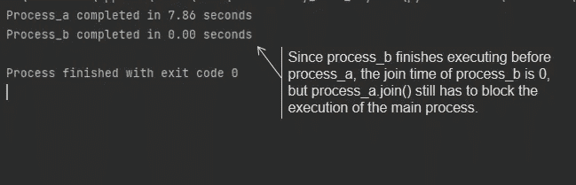
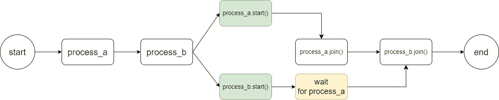
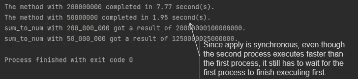
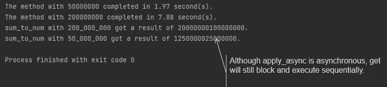
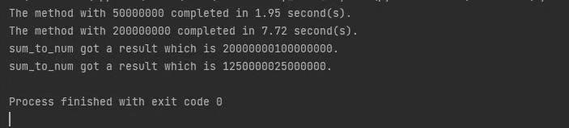
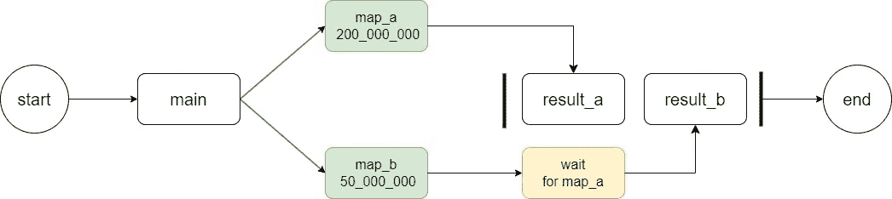
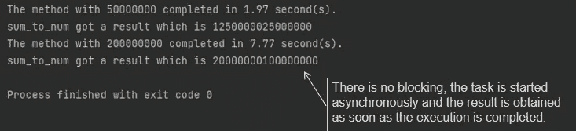
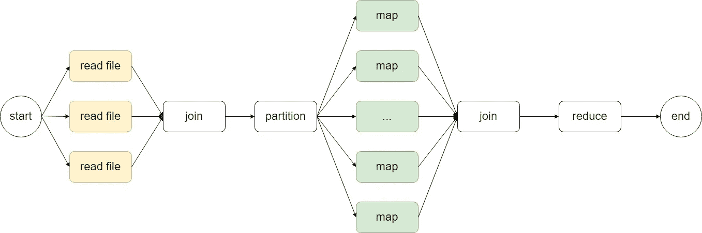
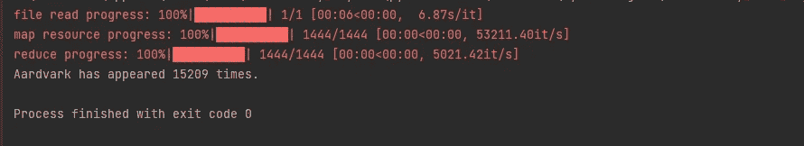

# 在 Python 中结合多进程和异步编程以提升性能

> 原文：[`towardsdatascience.com/combining-multiprocessing-and-asyncio-in-python-for-performance-boosts-15496ffe96b`](https://towardsdatascience.com/combining-multiprocessing-and-asyncio-in-python-for-performance-boosts-15496ffe96b)

## [PYTHON 并发](https://medium.com/@qtalen/list/python-concurrency-2c979347da3b)

## 使用实际示例演示 map-reduce 程序

[](https://qtalen.medium.com/?source=post_page-----15496ffe96b--------------------------------)[](https://towardsdatascience.com/?source=post_page-----15496ffe96b--------------------------------) [Peng Qian](https://qtalen.medium.com/?source=post_page-----15496ffe96b--------------------------------)

·发表于 [Towards Data Science](https://towardsdatascience.com/?source=post_page-----15496ffe96b--------------------------------) ·7 分钟阅读·2023 年 5 月 4 日

--


图片由 [Mitchell Luo](https://unsplash.com/@mitchel3uo?utm_source=medium&utm_medium=referral) 提供，来源于 [Unsplash](https://unsplash.com/?utm_source=medium&utm_medium=referral)

# 介绍

由于全局解释器锁（GIL）的存在，使用多线程来执行 CPU 密集型任务从未成为一个选项。随着多核 CPU 的普及，Python 提供了一种多进程解决方案来执行 CPU 密集型任务。但直到现在，直接使用多进程相关 API 仍然存在一些问题。

在我们开始之前，我们还有一小段代码来帮助演示：

该方法接受一个参数，并从 0 开始累加到该参数。打印方法执行时间并返回结果。

## 多进程的相关问题

如代码所示，我们直接创建并启动多个进程，并调用每个进程的 start 和 join 方法。然而，这里存在一些问题：

1.  join 方法不能返回任务执行的结果。

1.  join 方法会阻塞主进程，并按顺序执行。

即使后续任务比早期任务执行得更快，如下图所示：



截图显示了 join 的执行顺序。 图片由作者提供



尽管 `process_b` 首先完成执行，但仍需等待 `process_a`。 图片由作者提供

## 使用池（Pool）的问题

如果我们使用 `multiprocessing.Pool`，也会存在一些问题：

如代码所示，池的 `apply` 方法是同步的，这意味着在下一个 `apply` 任务开始执行之前，必须等待之前的 `apply` 任务完成。



[multiprocessing.Pool.apply](https://docs.python.org/3/library/multiprocessing.html#module-multiprocessing.pool) 方法是同步的。图片来源：作者

当然，我们可以使用 `apply_async` 方法来异步创建任务。但再次强调，你仍需使用 get 方法来阻塞性地获取结果。这使我们回到了 join 方法的问题：



尽管 [apply_async](https://docs.python.org/3/library/multiprocessing.html#multiprocessing.pool.Pool.apply_async) 是异步的，但 get 仍然会阻塞并按顺序执行。图片来源：作者

## 直接使用 ProcessPoolExecutor 的问题

那么，如果我们使用 `concurrent.futures.ProcessPoolExecutor` 来执行我们的 CPU 密集型任务，会怎么样呢？

如代码所示，一切看起来都很棒，并且调用方式就像 `asyncio.as_completed` 一样。但看看结果，它们仍然是按启动顺序获取的。这与 `asyncio.as_completed` 完全不同，后者是按照执行的顺序获取结果：



结果按启动顺序获取。图片来源：作者



迭代结果仍保持调用顺序并阻塞。图片来源：作者

## 使用 asyncio 的 `run_in_executor` 来修复它

幸运的是，我们可以使用 asyncio 来处理 IO 密集型任务，并使用它的 `run_in_executor` 方法以与 asyncio 相同的方式调用多进程任务。这不仅统一了并发和并行 API，还解决了我们上述遇到的各种问题：



结合 asyncio 和 ProcessPoolExecutor。图片来源：作者

由于上一篇文章中的示例代码完全模拟了我们应该如何调用并发进程的方法，许多读者在学习后仍然很难理解如何在实际编码中使用它。因此，在理解为什么我们需要在 asyncio 中执行 CPU 密集型并行任务之后，今天我们将使用一个现实世界的例子来解释如何同时处理 IO 密集型和 CPU 密集型任务，并欣赏 asyncio 为我们的代码带来的高效。

注意：在继续之前，如果你对使用 `asyncio.gather` 和 `asyncio.as_completed` 的实践感兴趣，你可以阅读我的这篇文章：

[](/use-these-methods-to-make-your-python-concurrent-tasks-perform-better-b693b7a633e1?source=post_page-----15496ffe96b--------------------------------) ## 使用这些方法提高 Python 并发任务的性能

### asyncio.gather、asyncio.as_completed 和 asyncio.wait 的最佳实践

[towardsdatascience.com

# 现实案例：并发文件读取和 map-reduce 数据处理

在今天的案例中，我们将解决两个问题：

1.  如何并发读取多个数据集，尤其是当数据集很大或很多时。如何使用 asyncio 提高效率。

1.  如何使用 asyncio 的`run_in_executor`方法来实现 MapReduce 程序并高效处理数据集。

在我们开始之前，我将通过图示向你解释我们的代码将如何执行：



图示展示了整个代码的工作原理。图片由作者提供

黄色部分表示我们的并发任务。由于 CPU 可以比 IO 从磁盘读取数据更快地处理内存中的数据，因此我们首先将所有数据集并发地读取到内存中。

在初步数据合并和切片后，我们来到了绿色部分，代表 CPU 并行任务。在这部分，我们将启动几个进程来映射数据。

最终，我们将在主进程中获取所有过程的中间结果，然后使用`reduce`程序获得最终结果。

# 数据准备和依赖项安装

## 数据准备

在这个案例中，我们将使用[Google Books Ngram Dataset](https://books.google.com/ngrams/info)，它按年份统计了 1500 年至 2012 年间各种书籍中每个字符串组合的频率。

Google Books Ngram 数据集是免费用于任何目的的，今天我们将使用下面这些数据集：

+   [`storage.googleapis.com/books/ngrams/books/googlebooks-eng-all-1gram-20120701-a.gz`](http://storage.googleapis.com/books/ngrams/books/googlebooks-eng-all-1gram-20120701-a.gz)

+   [`storage.googleapis.com/books/ngrams/books/googlebooks-eng-all-1gram-20120701-b.gz`](http://storage.googleapis.com/books/ngrams/books/googlebooks-eng-all-1gram-20120701-b.gz)

+   [`storage.googleapis.com/books/ngrams/books/googlebooks-eng-all-1gram-20120701-c.gz`](http://storage.googleapis.com/books/ngrams/ books/googlebooks-eng-all-1gram-20120701-c.gz)

我们的目标是统计结果集中的每个词的累计出现次数。

## 依赖项安装

为了并发读取文件，我们将使用`[aiofiles](https://pypi.org/project/aiofiles/)`库，它支持 asyncio 的并发实现。

如果你使用 pip，你可以按照以下方式安装：

```py
$ pip install aiofiles
```

如果你使用 Anaconda，你可以按照以下方式安装：

```py
$ conda install -c anaconda aiofiles
```

# 代码结构设计

由于这个案例相对简单，为了演示，我们将在这里使用`.py`脚本完成整个过程。

作为架构师，在开始之前，你应该根据流程图设计规划你的方法，并尝试遵循每个方法的“单一职责原则”。因此，每个方法一次只做一件事：

# 代码实现

接下来，我们将逐步实现每个方法，并最终将它们集成在`main`方法中一起运行。

## 文件读取

方法`read_file`将实现使用`aiofiles`读取单个文件：

方法`get_all_file_content`将启动文件读取任务，所有文件读取完成后，将每行文本合并到一个列表中并返回。

## 数据分组

方法`partition`将根据传递的 partition_size 将列表分解成多个较小的列表，并使用生成器来促进后续的迭代：

## 映射处理数据

方法`map_resource`是实际的映射方法。使用它从列表中读取每一行数据，使用单词作为键，将频率的总和作为值，最后返回一个字典结果。

## 将 asyncio 与多进程整合

方法`map_with_process`调用了 asyncio 的`run_in_executor`方法，根据 CPU 核心的数量启动一个进程池，并并行执行映射方法。最终结果由`asyncio.gather`方法合并成一个列表。

## 减少合并的数据

由于之前的映射过程最终得到的是多个进程处理的单词频率列表，我们还需要使用`reduce`方法将多个字典合并成一个最终结果，记录每个单词的最终频率。在这里，我们首先编写`reduce`过程的方法实现。

然后，我们直接调用`functools.reduce`方法来合并数据。

## 最后，实施主方法

最终，我们将所有的方法集成到`main`方法中并进行调用。

太棒了！我们得到了在所有数据集中单词 Aardvark 的频率总和。任务完成。

## 使用 tqdm 指示进度

在上一篇文章中，我们解释了如何使用[tqdm](https://github.com/tqdm/tqdm)来指示 asyncio 任务的进度。

## 使用 Tqdm 与 Asyncio 结合的 Python

### 监控并发任务进度的高效方法

[towardsdatascience.com

由于在现实世界中，大数据集的数据处理通常需要较长时间，在此过程中我们需要跟踪代码执行的进度，因此我们还需要在适当的地方添加`tqdm`进度条。

现在看起来专业多了。



添加`tqdm` API 后的结果截图。图片来自作者

# 结论

在今天的文章中，我们探讨了多进程代码的一些问题，比如获取每个进程结果的麻烦，以及无法按任务执行顺序获取结果的问题。

我们还探讨了将 asyncio 与`ProcessPoolExecutor`集成的可行性以及这种集成给我们带来的优势。例如，它统一了并发和并行编程的 API，简化了我们的编程过程，并允许我们按完成顺序获得执行结果。

最后，我们解释了如何通过一个实际案例，交替使用并发和并行编程技术，以帮助我们在数据科学任务中高效执行代码。

由于个人能力有限，难免有些地方存在不足，因此欢迎你的评论和修改，以便我们一起学习和进步。

在接下来的文章中，我们将深入探讨如何利用 loop.run_in_execute API 将多个 asyncio 并发任务分布到多个 CPU 核心，从而释放 CPU 的性能潜力。请点击这里了解：

[](/harnessing-multi-core-power-with-asyncio-in-python-1764404ce44f?source=post_page-----15496ffe96b--------------------------------) ## 利用 Python 中的 Asyncio 发挥多核性能

### 通过高效利用多个 CPU 核心来提升你的 Python 应用性能

towardsdatascience.com

通过[加入 Medium](https://medium.com/@qtalen/membership)，你将可以无限制地访问我的所有文章以及其他成千上万作者的文章。这只需要你花费一杯咖啡的钱，但对我来说是极大的鼓励。

本文最初发表于：[`www.dataleadsfuture.com/combining-multiprocessing-and-asyncio-in-python-for-performance-boosts/`](https://www.dataleadsfuture.com/combining-multiprocessing-and-asyncio-in-python-for-performance-boosts/)
