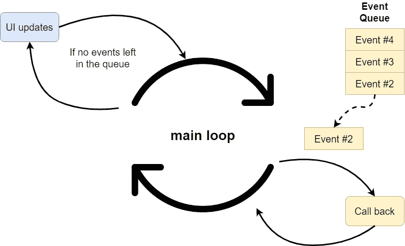
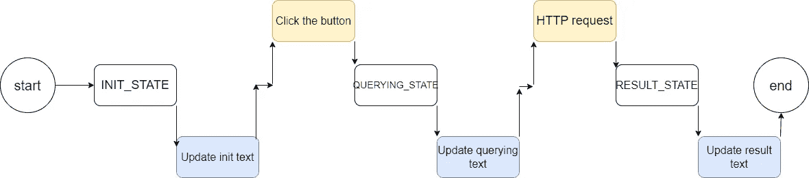
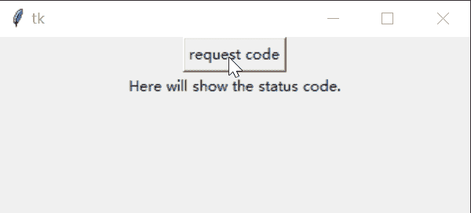
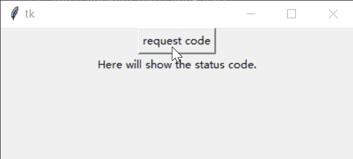
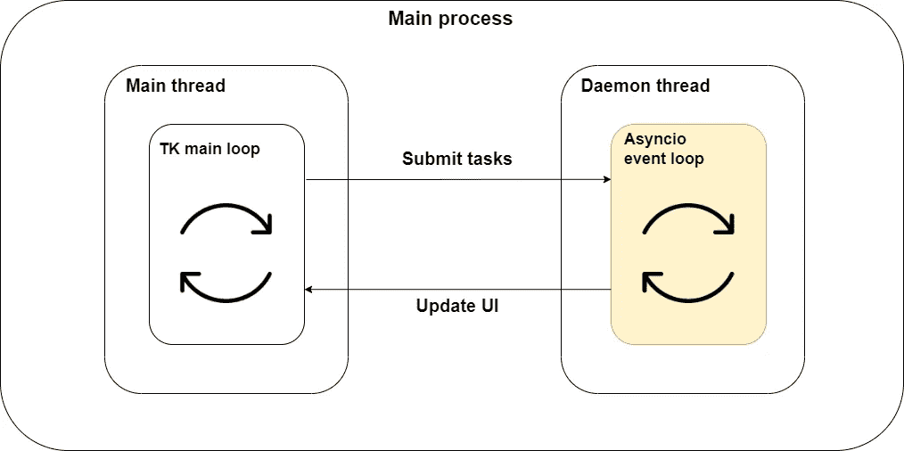
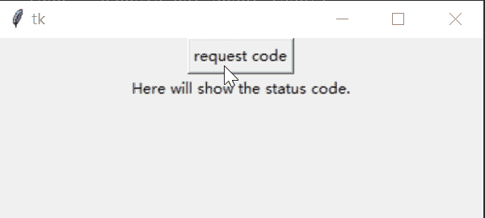

# 结合传统的基于线程的代码和 Python 中的 asyncio

> 原文：[`towardsdatascience.com/combining-traditional-thread-based-code-and-asyncio-in-python-dc162084756c`](https://towardsdatascience.com/combining-traditional-thread-based-code-and-asyncio-in-python-dc162084756c)

## [PYTHON CONCURRENCY](https://medium.com/@qtalen/list/python-concurrency-2c979347da3b)

## 结合同步和异步编程的综合指南

 [Peng Qian](https://qtalen.medium.com/?source=post_page-----dc162084756c--------------------------------)

·发表于[Towards Data Science](https://towardsdatascience.com/?source=post_page-----dc162084756c--------------------------------) ·6 分钟阅读·2023 年 5 月 15 日

--

图片来源：作者创建，[Canva](https://www.canva.com/)

# 简介

在这篇文章中，我将解释如何在不实现 asyncio 的 asyncio 程序中调用现有的 IO 阻塞代码，以及如何在基于线程模型的现有程序中调用 asyncio 代码。

在之前的文章中，我向你介绍了 asyncio，这是一种 Python 特性。asyncio 的性能非常高，在现代的高并发代码中使用 asyncio 将提升 IO 性能几个数量级。

但在现实世界中，我们并没有看到 asyncio 代码被使用得像预期的那样多。为什么会这样呢？

## 挑战 1：如何在 asyncio 代码中调用旧的 IO 阻塞代码

一种情况是，当我们使用 asyncio 实现新代码时，系统中仍然存在大量传统实现的 IO 阻塞程序。例如，微服务、文件操作等。即使你使用 asyncio 并直接调用这些阻塞 API，仍然无法实现高并发效果。

## 挑战 2：如何在现有的阻塞代码中调用 asyncio 以实现异步任务

在另一种情况下，现有代码已经实现了一套基于线程模型的架构。由于 asyncio 的事件循环是在当前线程中执行的，直接调用 asyncio 会阻塞现有代码的执行，无法实现并发执行的效果。

所以今天，我将通过一些现实生活中的例子来向你展示如何在这两种情况下实现 asyncio 调用。

# 第一部分：在基于 asyncio 的程序中调用 IO 阻塞代码

以 FastAPI 为例。FastAPI 是一个基于 asyncio 实现的高性能 web 框架。但通常情况下，web 应用程序的所有业务逻辑并不是都在 FastAPI 代码中实现的。有时我们需要调用几个早已实现的阻塞调用的微服务。我们该如何处理这种情况？

## 使用 run_in_executor 运行 IO-阻塞代码

在上一篇文章中，我们解释了如何使用 `loop.run_in_executor` API 将多个进程与 asyncio 集成，以实现高性能计算。

 ## 结合多进程和 asyncio 以提升 Python 性能

### 使用实际的例子来演示 map-reduce 程序

towardsdatascience.com

然而，IO 绑定的代码不适合多进程调用，但推荐用于多线程。好的一点是 `loop.run_in_executor` 的第一个参数接受 `concurrent.futures.ProcessPoolExecutor` 实现或 `concurrent.futures.ThreadPoolExecutor` 实现。因此，我们的示例代码如下：

首先，我们使用 `get_status` 方法通过 requests 包来模拟旧的微服务代码调用。

然后，我们分别在 web 应用程序的启动和关闭阶段管理 `ThreadPoolExecutor` 线程池的创建和销毁。

最后，我们在线程池中调用 IO 阻塞方法，并通过 `loop.run_in_executor` 在请求的响应方法中获取结果。

`loop.run_in_executor` 的默认 executor 参数可以是 None。这是因为 asyncio 启动后会在内部初始化一个默认的线程池。当 `run_in_executor` 的 executor 参数为 None 时，它会使用默认线程池来执行，因此我们不必在代码中管理线程池：

## 利用 [asyncio.to_thread](https://docs.python.org/3/library/asyncio-task.html#asyncio.to_thread)（Python 3.9+）

Python 3.9 引入了新的高级抽象 API `asyncio.to_thread`，从源代码中可以看到，它内部调用了 `loop.run_in_thread` 方法，executor 参数为 None：

因此，使用 `asyncio.to_thread` 将进一步简化代码。

# 第二部分：在传统线程基础程序中调用 asyncio 代码

另一个情况是我们的程序已经在现有代码中实现了循环。例如，大多数 GUI 程序使用事件循环来响应各种事件并更新 UI。

以 [tkinter](https://docs.python.org/3/library/tkinter.html) 为例。tkinter 启动时会启动一个主循环，这个主循环会阻塞主线程并不断循环。如下图所示：

tkinter 主循环是如何工作的。图片来自作者

## 直接调用同步 IO 代码会阻塞主循环

让我们以包含按钮和状态文本的 tkinter 程序为例：

这个程序使用状态机来实现。每 60 毫秒，代码根据程序的当前状态刷新相应的文本。

当我们点击 request_code 按钮时，工作流程理想情况下应该如下图所示：

tkinter 程序的工作流程。图片来自作者

但从执行结果来看，点击按钮时程序会挂起，状态文本直到 IO 阻塞代码执行完才会更新。这意味着在 IO 请求运行时，主循环被阻塞，导致 GUI 界面没有响应：

应用程序被阻塞且不显示查询文本。图片来自作者

## 使用 [asyncio.run](https://docs.python.org/3/library/asyncio-runner.html#asyncio.run) 运行 Asyncio 代码

我们能否用 [aiohttp](https://docs.aiohttp.org/en/stable/) 包替换 requests 包来实现 IO 请求的异步调用？

在这里，我们首先继承 `App` 类来实现一个新的类 `AppAsyncBase`。在这个新类中，我们使用 aiohttp 实现一个 `async_request` 方法，为后续的异步调用奠定基础：

读过我之前文章的读者会知道我们可以通过 `asyncio.run` 在同步代码中执行异步方法：

然后，我们通过继承 `AppAsyncBase` 实现一个新的类 `AppAsyncRun`。在这个新类中，我们重写 `request_remote` 方法，并使用 `asyncio.run` 直接调用 `async_request` 方法：

接下来，让我们看看结果。由于 asyncio 的 [事件循环](https://docs.python.org/3/library/asyncio-eventloop.html) 默认在主线程中执行，当事件循环运行时，它会阻塞主线程，从而使 tkinter 的主循环被阻塞且没有响应：

`asyncio.run` 会阻塞主循环。图片来自作者

## 将 Asyncio 与基于线程的程序集成

是否有解决事件循环阻塞问题的方法？

在这里，我们可以使用一个单独的 [守护线程](https://docs.python.org/3/library/threading.html#thread-objects)，然后将事件循环运行到守护线程中，这样 asyncio 的事件循环就不会阻塞主线程。图示如下：

结合 tkinter 和 asyncio 循环。图片来自作者

查看代码实现，我们首先继承 `AppAsyncBase` 类来实现一个新的类 `AppEventLoop`。接下来，重写 `request_remote` 方法并使用 `asyncio.run_coroutine_threadsafe` 来在事件循环中调用 `async_request` 方法。事件循环中的请求方法 `asyncio.run_coroutine_threadsafe` 也是线程安全的：

实现一个`run_event_loop`方法，在线程中调用`loop.run_forever`：

然后，使用`contextmanager`装饰器来管理守护线程的生命周期：

最后，在主方法中实现事件循环集成和应用启动，让我们看看结果：

在守护线程中独立运行的事件循环不再阻塞。图像来源：作者

完美！点击按钮，状态文本相应变化，整个 GUI 界面运行流畅，IO 调用从未阻塞 GUI。任务完成。

# 结论

尽管`asyncio`可以显著提高并发程序的执行性能，但由于它没有实现大量的遗留代码，所以尚未大规模使用。

今天的文章，通过真实世界的编码示例，展示了解决两个挑战的方案：

1.  如何在新的`asyncio`程序中以非阻塞方式调用旧的 IO 代码。

1.  如何在现有的同步程序中使用`asyncio`异步代码实现非阻塞执行。

欢迎留下评论和讨论。我会逐一回答。

通过[加入 Medium](https://medium.com/@qtalen/membership)，你将无限访问我和其他数千位作者的所有文章。这只需要你一杯咖啡的价格，但对我来说是极大的鼓励。

本文最初发表于：

[`www.dataleadsfuture.com/combining-traditional-thread-based-code-and-asyncio-in-python/`](https://www.dataleadsfuture.com/combining-traditional-thread-based-code-and-asyncio-in-python/)
