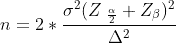
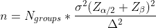
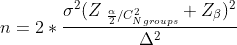
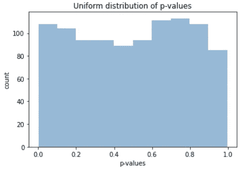

# 常见 AB 测试错误。第 2 卷

> 原文：[`towardsdatascience.com/common-ab-testing-mistakes-vol-2-3f3040a65e8b`](https://towardsdatascience.com/common-ab-testing-mistakes-vol-2-3f3040a65e8b)

## 让我们从错误中学习！

 [Mark Eltsefon](https://markeltsefon.medium.com/?source=post_page-----3f3040a65e8b--------------------------------)

·发表于[Towards Data Science](https://towardsdatascience.com/?source=post_page-----3f3040a65e8b--------------------------------) ·阅读时间 4 分钟·2023 年 4 月 13 日

--

一年前，我发布了一篇[文章](https://medium.com/towards-data-science/common-mistakes-during-a-b-testing-bdb9eefdc7f0)，讨论了 AB 测试中的常见错误。似乎很多人对实验挑战及其克服方法非常感兴趣。因此，我决定发布一篇关于人们常犯的下三个错误的文章。

通过避免这些常见错误，我们可以确保实验的可靠性、有效性和信息性，从而做出更好的决策，获得更成功的结果。

图片来自[圣巴巴拉](https://unsplash.com/@barbaris778?utm_source=medium&utm_medium=referral)在[Unsplash](https://unsplash.com/?utm_source=medium&utm_medium=referral)

## 将所需样本量乘以假设的数量

有一个著名的公式用于计算样本量。

图片由作者提供

它考虑了度量的方差、显著性水平、检验的功效和 MDE（最小可检测效应）。

然而，在进行多重假设检验时，人们常常犯的错误是简单地用组的数量替代“2”。

图片由作者提供

这是一种正确的方法吗？并不完全正确。增加假设的数量会导致 I 型错误率膨胀，因此我们需要控制 I 型错误率和显著性水平。为了控制它，通常使用 Bonferroni 校正。主要的思路是将 I 型错误率除以假设的数量。

每组之间的比较应该被视为一个独立的假设，而不仅仅是每一组。

> 因此，例如，当有 4 组时，假设的数量为 6，即组的可能组合数量。

我们正确的公式是：

作者提供的图片

让我们比较错误的方法和正确的方法。

例如，当 MDE 为 0.1，显著性水平为 0.05，检验功效为 0.8，方差为 1.5 时，错误的方法需要 7064 个样本，而正确的方法需要 10899 个样本。

在 7064 个样本后结束 AB 测试可能导致错误的决策。

## 未进行健康检查

大多数人匆忙进行 AB 测试而没有先进行健康检查。健康检查可以确保测试环境稳定且无偏。如果测试环境不稳定或有偏，测试结果可能无效且不可靠。

> 对历史数据进行 A/A 测试是这种检查的一个例子。在进行 A/A 测试时，关键是观察 p 值的分布，而不是关注单一数字，因为发现控制组和实验组之间的差异始终是可能的。

方法如下：

1.  选择样本大小。你应该选择与实际 A/B 测试中使用的公式和类似值相同的样本大小。

1.  创建控制组和实验组。必须使用生产系统中使用的相同分割算法，只需将其应用于历史数据。

1.  测量结果：测量两个组的结果。计算所需的指标。

1.  分析结果：比较两个组的结果，以确保它们在统计上相似。这可以通过计算 p 值来完成。

1.  重复步骤 1-5 至少一千次。

1.  在多次重复 A/A 测试后，检查获得的 p 值的分布。分布应该是均匀的。如果不是，说明你的健康检查不完整，需要进一步分析。

均匀的 P 值分布。作者提供的图片。

## 对负面结果漠不关心

事实上，忽视负面结果可能会对企业的利润产生严重后果。

首先，负面结果可以提供有关无效内容的宝贵信息。尽管对 AB 测试的正面结果感到兴奋很容易，但负面结果同样重要。它们可以揭示设计或策略中的缺陷，突出需要改进或进一步探索的领域。如果企业忽视负面结果，仅仅选择在测试中表现更好的选项，可能会错失有意义的改进机会。

此外，负面结果可能是某些东西未按预期工作的警告信号。例如，如果 AB 测试显示新设计变化实际上比以前的版本表现更差，这可能表明设计过程或用户体验存在更深层次的问题。在这种情况下忽视负面结果可能会导致用户参与度、客户忠诚度的下降，最终影响收入。

**感谢阅读，不要害怕犯错和学习。这是进步的唯一途径！**
