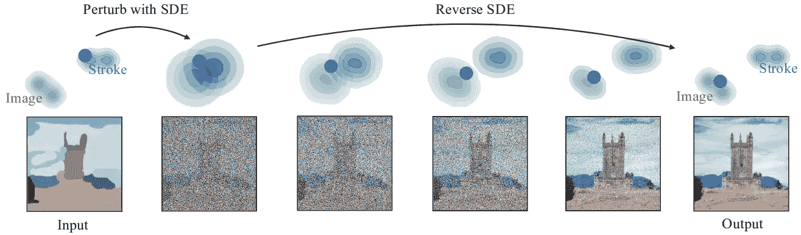

# 比较和解释 HuggingFace 扩散模型

> 原文：[`towardsdatascience.com/comparing-and-explaining-diffusion-models-in-huggingface-diffusers-a83d64348d90`](https://towardsdatascience.com/comparing-and-explaining-diffusion-models-in-huggingface-diffusers-a83d64348d90)

## DDPM、稳定扩散、DALL·E-2、Imagen、康定斯基 2、SDEdit、ControlNet、InstructPix2Pix 等

[](https://mnslarcher.medium.com/?source=post_page-----a83d64348d90--------------------------------)[](https://towardsdatascience.com/?source=post_page-----a83d64348d90--------------------------------) [Mario Larcher](https://mnslarcher.medium.com/?source=post_page-----a83d64348d90--------------------------------)

·发表于 [Towards Data Science](https://towardsdatascience.com/?source=post_page-----a83d64348d90--------------------------------) ·33 分钟阅读·2023 年 8 月 24 日

--


使用扩散器生成的图像。继续阅读以发现生成方法及其背后的理论。

# 目录

+   介绍

+   前提条件和建议材料

+   扩散器管道

+   管道：DDPM（扩散模型）

+   管道：稳定扩散文本到图像

+   管道：稳定扩散图像到图像（SDEdit）

+   管道：稳定扩散图像变异

+   管道：稳定扩散放大

+   管道：稳定扩散潜在放大

+   管道：unCLIP（Karlo/DALL·E-2）

+   管道：DeepFloyd IF（Imagen）

+   管道：康定斯基

+   管道：ControlNet

+   管道：指导 Pix2Pix

+   附录 — CLIP

+   附录 — VQGAN

+   附录 — 提示到提示

+   结论

+   致谢

# 介绍

随着对生成性 AI，包括图像生成的兴趣日益增长，许多优秀的资源开始变得可用，其中一些我将在下文中突出介绍。然而，根据我的经验，超越基础课程的进展需要付出大量的努力，因为高级主题的资源变得更加零散。

在本文中，我们将列出来自 [Hugging Face](https://huggingface.co/) [Diffusers](https://huggingface.co/docs/diffusers/index) 库的最流行的扩散模型，这是使用这项技术的主要工具。我们将简要解释这些模型，比较它们，并概述它们的优缺点。

本文的结构如下：我们将首先回顾一些对刚开始学习扩散模型的人员有价值的资源。之后，我们将简要解释 HuggingFace 的管道。最后，我们将深入探讨 [流行任务与管道](https://github.com/huggingface/diffusers#popular-tasks--pipelines) 部分中列出的每个管道。

到本文末尾，我希望你对主要的扩散模型及相关技术有一个扎实的掌握，并能够有效地应用它们。

# 先决条件和建议材料

为了充分理解本文，尽管我会尽力保持解释的直观性，但我建议对这些主题有一个基本的背景。在这一部分，我列出了我在自己学习过程中发现有用的三个资源。

## 实践深度学习编程者 - 第二部分

[](https://course.fast.ai/Lessons/part2.html?source=post_page-----a83d64348d90--------------------------------) [## 实践深度学习编程者 - 第二部分概述](https://course.fast.ai/Lessons/part2.html?source=post_page-----a83d64348d90--------------------------------)

### 在这门包含超过 30 小时视频内容的课程中，我们实现了令人惊叹的稳定扩散算法……

course.fast.ai](https://course.fast.ai/Lessons/part2.html?source=post_page-----a83d64348d90--------------------------------)

这无疑是我最喜欢的资源之一，这门课程不仅提供了对扩散模型的基本见解，还作为获取 Python 和深度学习基础编程技能的绝佳入门点。[Jeremy Howard](https://jeremy.fast.ai/) 教授采用了一种高效的方法，通过从实际应用开始，再深入理论复杂性。这种方法确保了清晰的理解，而不会使学习者被通常在标准课程中遇到的复杂数学公式所困扰。

此外，本课程作为 [第一部分](https://course.fast.ai/) 的无缝延续，不需要额外的特殊先决条件。无论你是新手还是经验丰富的学习者，这门课程都是掌握深度学习和扩散模型过程中宝贵的资产。

## Hugging Face 扩散模型课程

[](https://github.com/huggingface/diffusion-models-class?source=post_page-----a83d64348d90--------------------------------) [## GitHub - huggingface/diffusion-models-class: Hugging Face 扩散模型课程的资料](https://github.com/huggingface/diffusion-models-class?source=post_page-----a83d64348d90--------------------------------)

### Hugging Face 扩散模型课程的资料 - GitHub - huggingface/diffusion-models-class: 课程的资料……

github.com](https://github.com/huggingface/diffusion-models-class?source=post_page-----a83d64348d90--------------------------------)

在关于 Diffusers 库的文章中，不提及官方 Hugging Face 课程简直是疯狂的。这个课程目前有四讲，深入探讨了扩散模型，教你如何引导它们的生成，讨论了稳定扩散，并且最后介绍了一些很酷的高级内容，包括将这些概念应用到另一个领域——音频生成。

## 生成式深度学习，第 2 版

[](https://www.oreilly.com/library/view/generative-deep-learning/9781098134174/?source=post_page-----a83d64348d90--------------------------------) [## 生成式深度学习，第 2 版

### 生成式 AI 是科技领域最热门的话题。这本实用书教导机器学习工程师和数据科学家……

www.oreilly.com](https://www.oreilly.com/library/view/generative-deep-learning/9781098134174/?source=post_page-----a83d64348d90--------------------------------)

对于书籍爱好者来说，这是我在这一主题上的最爱之一。正如书名所示，这本书不仅仅探讨了扩散模型；它还涵盖了生成 AI 的广泛领域。它深入研究了图像生成模型，如生成对抗网络（GANs）和变分自编码器（VAEs），这些都是扩散模型的灵感来源并被应用于其中。第二版涵盖了截至 2023 年初的内容，探讨了如 DALL·E-2、CLIP、Imagen、稳定扩散等更近期的算法。

如果你已经探索过这些资源或类似的资源，你已经为接下来的内容做好了充分准备。如果没有，你可以去探索这些资源，或者继续阅读本文；我会尽量保持解释的简洁明了，我保证。

## 实用资源

+   **MOOC**：[实用深度学习课程 — 第二部分](https://course.fast.ai/Lessons/part2.html)

+   **MOOC**：[Hugging Face 扩散模型课程](https://github.com/huggingface/diffusion-models-class)

+   **书籍**：[生成式深度学习，第 2 版](https://www.oreilly.com/library/view/generative-deep-learning/9781098134174/)

**额外推荐**：我想介绍另一个我在撰写这篇文章时用来刷新一些概念的资源。我相信你也会喜欢。如果你有兴趣以一种有趣、简洁和清晰的方式了解 AI，我强烈推荐你去看看“[**AI Coffee Break with Letitia**](https://www.youtube.com/c/aicoffeebreak)”。相信我，它绝对值得探索和订阅！

# Diffusers Pipelines

## 什么是 Diffusers Pipelines？

来自 [Diffusers 文档](https://huggingface.co/docs/diffusers/api/pipelines/overview#pipelines)：

> Pipelines 提供了一种简单的方式，通过将所有必要的组件（多个独立训练的模型、调度器和处理器）打包到一个端到端的类中，从而运行最先进的扩散模型进行推理。Pipelines 是灵活的，可以适应使用不同的调度器或甚至模型组件。

在本文中，我们将讨论 Diffusers 库中最流行的管道背后的模型。尽管管道用于推理，但它们背后的理论对于这些模型的训练同样重要。有几种流行的训练技术没有专门的推理管道，主要是 [LoRA](https://arxiv.org/abs/2106.09685) 和 [DreamBooth](https://arxiv.org/abs/2208.12242)。我们在本文中不会涵盖它们，但对于后者，我已经写了专门的文章。随时查看：

[](/demystifying-dreambooth-a-new-tool-for-personalizing-text-to-image-generation-70f8bb0cfa30?source=post_page-----a83d64348d90--------------------------------) ## 揭秘 DreamBooth：一个个性化文本到图像生成的新工具

### 探索将无聊图像转化为创意杰作的技术

towardsdatascience.com

## 如何使用扩散管道

让我们从一个简单的例子学习：

```py
from diffusers import DiffusionPipeline
import torch

pipe = DiffusionPipeline.from_pretrained(
 "stabilityai/stable-diffusion-xl-base-1.0",
 torch_dtype=torch.float16,
 use_safetensors=True,
 variant="fp16",
)
pipe.to("cuda")

prompt = "A hugging face emoji planet in the solar sistem, detailed, 8k"

image = pipe(prompt=prompt).images[0]
image
```

这段代码就是我用来生成本文封面图像的全部内容。我们已经可以观察到一些东西：

+   尽管我使用的是 [Stable Diffusion XL](https://stability.ai/blog/stable-diffusion-sdxl-1-announcement)，但不必特定使用 `[StableDiffusionXLPipeline](https://huggingface.co/docs/diffusers/v0.20.0/en/api/pipelines/stable_diffusion/stable_diffusion_xl#diffusers.StableDiffusionXLPipeline)`；你可以使用更通用的类 `[DiffusionPipeline](https://huggingface.co/docs/diffusers/api/diffusion_pipeline#diffusers.DiffusionPipeline)`。`from_pretrained` 函数将根据仓库 ID（在这种情况下为 "stabilityai/stable-diffusion-xl-base-1.0"）或本地目录路径返回正确的类对象。

+   更改权重为半精度（float16）以加速处理是完全可能且通常推荐的，指定相应的变体。例如，你可以查看 [这里](https://huggingface.co/stabilityai/stable-diffusion-xl-base-1.0/tree/main/unet)，Stable Diffusion XL 的 U-Net 有 `diffusion_pytorch_model.f16` 和非 f16 模型。

+   建议尽可能使用 [safetensors](https://huggingface.co/docs/safetensors/index) 格式的权重。该格式避免了 pickle 的安全问题，并且速度更快。

+   强烈建议在 GPU 上执行此代码（`to("cuda")`），因为扩散模型计算密集。生成一次预测通常需要大约 20–50 次模型前向传播。

+   如果你重新运行此代码，将会得到不同的结果。扩散模型推理本质上是非确定性的，这意味着每次执行都会产生不同的结果（除非你故意强制一致性，例如固定随机种子等）。

总结来说，正如所观察到的，使用这些管道非常简单。这就是我选择专注于它们背后的理论的原因；在直观层面理解它对充分利用这些强大工具的能力至关重要。

## 有用的资源

+   **Diffusers 文档**: [管道](https://huggingface.co/docs/diffusers/api/pipelines/overview#pipelines)

+   **Diffusers 文档**: [Safetensors](https://huggingface.co/docs/safetensors/index)

# 管道: DDPM (扩散模型)

## **解密理论**

“[去噪扩散概率模型](https://arxiv.org/abs/2006.11239)” (DDPM) 让扩散模型首次受到关注。尽管常被称为这一主题的开创性论文，但扩散模型的概念早在 2015 年就在论文 “[使用非平衡热力学的深度无监督学习](https://arxiv.org/abs/1503.03585)” 中提出。下图概述了**扩散模型**的核心概念：


图 2 来源于 [去噪扩散概率模型](https://arxiv.org/abs/2006.11239)。

从右向左读取图像，我们观察到 **前向** 或 **扩散过程**，在此过程中我们逐步向图像中添加噪声 — 这是 Python 或任何其他编程语言中的简单过程。

现在，想象有一个工具可以部分去除噪声。这种工具可以将完全由噪声组成的图像转换为较少噪声的版本，从上图的左侧到右侧 — **反向过程**。但我们如何创建这个预测模型呢？根据 DDPM，我们使用 U-Net。给定一张有噪声的图像，U-Net 会预测添加的噪声（或直接预测去噪图像）。由于我们自己引入噪声，我们可以免费获得目标变量，从而以自监督的方式训练模型。

此处使用的 **U-Net** 不是 [2015 版本](https://arxiv.org/abs/1505.04597)；它是专门为此任务设计的现代改编版。为了简化 U-Net 的任务，我们不仅提供噪声图像，还将 **时间步** `t` 作为输入。较高的 `t` 对应于更有噪声的图像。这个时间步通过正弦位置嵌入引入到模型中，灵感来自 [Transformer](https://arxiv.org/abs/1706.03762)。Transformer 还派生出自注意力机制，在这种情况下专门针对图像。自注意力允许 16x16 分辨率块中的像素关注所有其他像素，提高了模型生成全球一致图像的能力。

最后，让我们介绍 **采样器** 或 **调度器** 的概念。根据 Diffusers 文档：

> 调度函数，在库中表示为*Schedulers*，接受训练模型的输出、扩散过程正在迭代的样本以及一个时间步，以返回去噪样本。这就是为什么调度器在其他扩散模型实现中也可能被称为*Samplers*。

实际上，调度器确定生成最终图像所需的步骤数，并建立将噪声图像转换为较少噪声变体的方法，利用模型的输出。这些调度器可以分为离散或连续两类，如文档中所述：

> 不同的算法使用可以是离散的（接受`int`输入），例如[DDPMScheduler](https://huggingface.co/docs/diffusers/v0.19.3/en/api/schedulers/ddpm#diffusers.DDPMScheduler)或[PNDMScheduler](https://huggingface.co/docs/diffusers/v0.19.3/en/api/schedulers/pndm#diffusers.PNDMScheduler)，也可以是连续的（接受`float`输入），例如基于分数的调度器[ScoreSdeVeScheduler](https://huggingface.co/docs/diffusers/v0.19.3/en/api/schedulers/score_sde_ve#diffusers.ScoreSdeVeScheduler)或`ScoreSdeVpScheduler`。

类似地，采样过程可以是随机的或确定性的。

如果你想深入了解采样器，那将需要一整篇独立的文章。如果这听起来很有趣，随时告诉我，我会很高兴进一步探讨！

## **应用与局限性**

[DDPMPipeline](https://huggingface.co/docs/diffusers/api/pipelines/ddpm#diffusers.DDPMPipeline)是用于**无条件图像生成**的流程，因此与我们将要探讨的允许更大控制的技术相比，其实际应用受到限制。此外，使用 DDPM 调度器的图像去噪过程相当慢；默认情况下，它需要 1000 步，即 U-Net 的 1000 次预测。鉴于这些考虑，目前对 DDPM 的兴趣主要是历史性的，因为后续工作在此基础上进行扩展。

## **有用的资源**

+   **扩散器文档**: [DDPM](https://huggingface.co/docs/diffusers/api/pipelines/ddpm)

+   **科学论文**: [使用非平衡热力学的深度无监督学习](https://arxiv.org/abs/1503.03585)（扩散模型）

+   **科学论文**: [去噪扩散概率模型](https://arxiv.org/abs/2006.11239)（DDPM）

# 流程: 稳定扩散文本到图像

## 揭示理论

到目前为止，主要的开源图像生成算法是[Stable Diffusion](https://stability.ai/blog/stable-diffusion-public-release)及其各种版本。Stable Diffusion 的初始版本是[CompVis](https://github.com/CompVis)、[Stability AI](https://stability.ai/)、[Runway](https://runwayml.com/about/)和[LAION](https://laion.ai/)的合作成果。该模型的主要特性是作为一个**潜在扩散** **模型** (**LDM**)，其扩散过程不是直接在图像/像素空间中进行，而是在潜在空间中进行。


图 3 来自[高分辨率图像合成与潜在扩散模型](https://arxiv.org/abs/2112.10752)。

实际操作中，在输入到 U-Net 之前，图像会使用[**变分自编码器**](https://arxiv.org/abs/1312.6114) (**VAE**) 压缩到潜在空间中。在去噪过程后，潜在表示会通过同一 VAE 的解码器转回图像。

另一个重要点是稳定扩散（Stable Diffusion）能够接受**文本提示**作为输入，部分控制生成的内容。文本首先使用基于 Transformer 的模型进行嵌入，然后通过**交叉注意力**机制映射到 U-Net 中。具体来说，Stable Diffusion v1 使用了 OpenAI 的**CLIP**文本编码器（参见附录 — CLIP）。

目前存在两个更多版本的 Stable Diffusion，每个版本都有其子变体。

**Stable Diffusion v2**之所以与原版不同，主要在于文本编码器转移到了[OpenCLIP](https://arxiv.org/abs/2212.07143)，这是 CLIP 的开源对应版本。尽管一般来说，可以预期后续版本的性能会有所提高，但在 Stable Diffusion v2 中这一断言并不确定。值得注意的是，**OpenCLIP**在[**LAION-5B**](https://laion.ai/blog/laion-5b/)子集上的训练不同于 OpenAI 的私有数据集，加上使用了高度限制的 NSFW 过滤器，使得 v2 在表示名人或模仿著名艺术家风格方面明显落后于 v1。这些限制在 v2.1 版本中得到了部分解决，后者引入了较不严格的过滤器和其他修改。有关更多见解，我发现[AssemblyAI](https://www.assemblyai.com/)的文章“[Stable Diffusion 1 vs 2 — 你需要知道的](https://www.assemblyai.com/blog/stable-diffusion-1-vs-2-what-you-need-to-know/)”特别具有信息量。

最后，Stability AI 最近推出了[**Stable Diffusion XL**](https://arxiv.org/abs/2307.01952) (**SD-XL**)，这是 v2 的重大跃进。这个版本在输出质量上与领先的闭源模型如[Midjourney](https://www.midjourney.com/home/?callbackUrl=%2Fapp%2F)竞争。

本版本的升级包括合并 CLIP 和 OpenCLIP 输出，使用更大的批量大小重新训练 VAE，并通过**指数移动平均**（**EMA**）技术实现权重跟踪。EMA 权重可以在推理过程中替代最终权重，从而普遍提升性能。这项技术有助于减少在最终迭代中通常出现的一些过拟合现象，通常会生成略微改进的推理权重。

同样重要的是 SD-XL 努力解决在训练期间使用平方随机裁剪所产生的问题。为增强这一方面，它采用了**裁剪参数条件**，这涉及到将决定图像如何裁剪的参数信息提供给模型，类似于时间步的处理。这可以防止生成无头图像等问题。同时，SD-XL 版本遵循现代实践，并且经过微调以处理**多种长宽比**，使用了[长宽比分桶](https://github.com/NovelAI/novelai-aspect-ratio-bucketing)。这与裁剪参数条件一起，显著提升了模型呈现横向和纵向场景的能力。

SD-XL 还引入了一个**精炼阶段**，其中另一个专注于高质量图像的 LDM 使用 SDEdit 引入的去噪过程，我们将在下一个管道中讨论这一点。

最后，还有一种技术并不总是在入门课程中介绍，即[**偏移噪声**](https://www.crosslabs.org/blog/diffusion-with-offset-noise)。我们需要修改初始噪声的主要原因是，实际上图像在前向过程中从未完全被擦除（因为我们执行了有限数量的步骤）。因此，模型在从纯噪声中学习时会遇到困难。引用 SD-XL 论文：

> 我们的模型在[14]的离散时间公式下进行训练，并且需要偏移噪声[11, 25]以获得令人满意的结果。

## 应用与局限

[StableDiffusionPipeline](https://huggingface.co/docs/diffusers/api/pipelines/stable_diffusion/text2img#diffusers.StableDiffusionPipeline)（文本到图像）允许基于文本提示生成图像。截至今天，我推荐使用 SD-XL 版本，它能够产生真正令人惊叹的结果。尽管 SD-XL 无疑是杰出的，但仍有各种失败情况。模型有时面临涉及详细空间排列和复杂描述的非常复杂提示的挑战。复杂的结构，例如人类手部，有时仍可能生成变形。尽管照片级真实感相当好，但仍未完美。偶尔会出现一种称为“**概念溢出**”的现象，例如，提示中的一种颜色被误认为或扩展到另一元素。SD-XL 生成的文本明显比过去更好，但有时，尤其是对于较长的文本，可能包含随机字符或不一致性。最后，重要的是要记住，像所有生成模型一样，这可能会无意中引入社会和种族偏见。

## 有用的资源

+   **Diffusers 文档**: [文本到图像](https://huggingface.co/docs/diffusers/api/pipelines/stable_diffusion/text2img)

+   **科学论文**: [使用潜在扩散模型进行高分辨率图像合成](https://arxiv.org/abs/2112.10752)（Stable Diffusion v1，请查看下面的文章，它为你解析了这篇论文）

+   **科学论文**: [SDXL: 改进高分辨率图像合成的潜在扩散模型](https://arxiv.org/abs/2307.01952)

+   **科学论文**: [对比语言-图像学习的可重复缩放定律](https://arxiv.org/abs/2212.07143)（OpenCLIP）

+   **科学博客**: [Stable Diffusion 1 与 2 — 你需要了解的内容](https://www.assemblyai.com/blog/stable-diffusion-1-vs-2-what-you-need-to-know/)

+   **科学博客**: [带偏移噪声的扩散](https://www.crosslabs.org/blog/diffusion-with-offset-noise)

+   **GitHub 页面**: [NovelAI 纵横比分桶](https://github.com/NovelAI/novelai-aspect-ratio-bucketing)

+   **附录**: CLIP

如果你有兴趣进一步探索 Stable Diffusion 背后的机制，可以查看我之前的文章：

[](/paper-explained-high-resolution-image-synthesis-with-latent-diffusion-models-f372f7636d42?source=post_page-----a83d64348d90--------------------------------) ## 论文解析 — 高分辨率图像合成与潜在扩散模型

### 虽然 OpenAI 凭借其生成文本模型主导了自然语言处理领域，但他们的图像……

towardsdatascience.com

# 流程：Stable Diffusion 图像到图像（SDEdit）

## 解开理论

有时我们希望从起始图像开始，该图像也可以由我们的粗略彩色笔触组成，并生成另一张图像，该图像尊重初始图像的结构，但其内容由文本提示决定。实现这一点的最简单技术是 [**SDEdit**](https://arxiv.org/abs/2108.01073)，它对应于**图像到图像**管道。



图 2 来自 [SDEdit: 使用随机微分方程引导图像合成与编辑](https://arxiv.org/abs/2108.01073)

在扩散过程中，我们可以选择从正向过程的较晚步骤开始，而不是从随机噪声开始，这样我们可以通过根据选定的起始时间步长加入噪声来生成输入。正如上图所示，即使在**笔触**的情况下，添加噪声也能使生成的图像包含在典型图像的分布中。这一点很重要，因为它使得模型可以仅用图像进行训练，但在推断时则使用我们的笔触作为输入。

值得注意的是，这种技术在**忠实性**和**现实性**之间存在权衡，具体取决于我们从正向过程中的哪个点开始。实际上，如果在生成过程中使用“强度”参数为 1，则输入图像将被忽略，而如果“强度”参数为 0，我们将获得相同的图像。当前的默认值是 `strength=0.8`。

最后，SDEdit 也可以用于**修复**，只需遮掩不希望修改的图像部分即可。

## 应用与限制

[StableDiffusionImg2ImgPipeline](https://huggingface.co/docs/diffusers/api/pipelines/stable_diffusion/img2img#diffusers.StableDiffusionImg2ImgPipeline) 是一个很好的管道，用于从一些笔触生成图像或基于文本提示修改起始图像。值得注意的是，这种技术的主要限制是无法通过文本提示请求生成图像结构的显著变化。生成图像的结构将继续受到起始结构的限制（除非选择非常接近 1 的强度值）。

## 有用资源

+   **Diffusers 文档**：[图像到图像](https://huggingface.co/docs/diffusers/api/pipelines/stable_diffusion/img2img)

+   **科学论文**：[SDEdit: 使用随机微分方程引导图像合成与编辑](https://arxiv.org/abs/2108.01073)

# 管道：稳定扩散图像变体

## 解开理论

[StableDiffusionImageVariationPipeline](https://huggingface.co/docs/diffusers/api/pipelines/stable_diffusion/image_variation#diffusers.StableDiffusionImageVariationPipeline) 是由 [Lambda](https://lambdalabs.com/) 开发的一个管道，类似于 Image-to-Image，允许生成输入图像的变体。


图像来自[Stable Diffusion Image Variations Model Card](https://huggingface.co/lambdalabs/sd-image-variations-diffusers)。

通常，在像文本到图像这样的任务中，生成是由文本提示条件控制的，该提示通过专门的编码器转换为嵌入。正如你可以在附录 — CLIP 中检查的那样，CLIP 有两个编码器：一个用于文本，一个用于图像。这两个编码器都以这样的方式映射输入，使得描述图像的文本具有与不描述图像的文本接近的嵌入，反之亦然。这个流程只是**用 CLIP 图像编码器替代 CLIP 文本编码器**。这样，生成不再由文本提示来控制，而是由一个图像控制，模型将图像解码为一个变体，而不是完全相同的图像。除非模型对特定概念过度拟合并能够从其潜在表示中准确再现。

## 应用与局限性

这是一个有趣的管道，用于获取与输入图像相似的图像。生成的图像可能不会完全保留原始图像的结构，如图像到图像的方法，但它们可能会保留其风格或关键特征。该技术的主要局限之一是对生成变异的控制不大。

## 有用的资源

+   **Diffusers 文档**：[图像变异](https://huggingface.co/docs/diffusers/api/pipelines/stable_diffusion/image_variation)

+   **模型卡**：[Stable Diffusion Image Variations Model Card](https://huggingface.co/lambdalabs/sd-image-variations-diffusers)

+   **附录**：CLIP

# 管道：Stable Diffusion Upscale

## 解开理论

[StableDiffusionUpscalePipeline](https://huggingface.co/docs/diffusers/api/pipelines/stable_diffusion/upscale#diffusers.StableDiffusionUpscalePipeline)是一个**超分辨率**管道，通过**4 倍**的因子增强输入图像的分辨率。


图像来自[Stable Diffusion x4 Upscaler Model Card](https://huggingface.co/stabilityai/stable-diffusion-x4-upscaler)。

所采用的方法，在原始潜在扩散论文中已介绍，涉及**将低分辨率图像与由 VAE 编码器生成的潜在变量串联**。然后模型基于这一输入训练以生成高分辨率图像。该模型由[CompVis](https://github.com/CompVis)、[Stability AI](https://stability.ai/)和[LAION](https://laion.ai/)的研究人员和工程师创建。

## 应用与局限性

这个管道的应用非常简单：提高输入图像的分辨率。

## 有用的资源

+   **Diffusers 文档**：[超分辨率](https://huggingface.co/docs/diffusers/api/pipelines/stable_diffusion/upscale)

+   **模型卡**：[Stable Diffusion x4 Upscaler Model Card](https://huggingface.co/stabilityai/stable-diffusion-x4-upscaler)

# 流程：稳定扩散潜在上采样

## 解开理论

不幸的是，我没有找到很多关于 **潜在上采样器** 的参考资料，这个模型由 [Katherine Crowson](https://github.com/crowsonkb) 与 [Stability AI](https://stability.ai/) 合作训练。无论如何，我认为可以安全地假设它的训练方式与超分辨率模型类似。那么，有什么不同呢？这个模型除了接受图像外，还接受潜在变量。它可以直接用于前一步生成的潜在变量，而无需从图像开始。


图片由 Tanishq Abraham 提供，来源于 [Stability AI](https://stability.ai/)，源自 [这条推文](https://twitter.com/StabilityAI/status/1590531958815064065)。

[StableDiffusionLatentUpscalePipeline](https://huggingface.co/docs/diffusers/api/pipelines/stable_diffusion/latent_upscale#diffusers.StableDiffusionLatentUpscalePipeline) **将输入图像的分辨率提高 2 倍**。

## 应用与限制

当我们打算从潜在变量而不是图像开始时，这个流程可以作为超分辨率流程的替代方案。

## 有用的资源

+   **Diffusers 文档**: [潜在上采样器](https://huggingface.co/docs/diffusers/api/pipelines/stable_diffusion/latent_upscale#diffusers.StableDiffusionLatentUpscalePipeline)

+   **模型卡**: [Stable Diffusion x2 潜在上采样器模型卡](https://huggingface.co/stabilityai/sd-x2-latent-upscaler)

# 流程：unCLIP (Karlo/**DALL·E-2**)

## 解开理论

你可能听说过 [unCLIP](https://huggingface.co/docs/diffusers/api/pipelines/unclip) 的另一个名字：DALL·E-2。Diffusers 中的版本源自 [kakaobrain](https://kakaobrain.com/) 的 [Karlo](https://github.com/KAKAOBRAIN/KARLO)。

较少描述原始 **unCLIP** 的工作原理。


图 2 来自 [Hierarchical Text-Conditional Image Generation with CLIP Latents](https://arxiv.org/abs/2204.06125)。

要理解 unCLIP，了解 CLIP 是很重要的。如果你对 CLIP 不熟悉，可以查看 附录 — CLIP。在上面的图片中，虚线上的部分代表 CLIP 本身。下面，我们观察 unCLIP。unCLIP 使用一种叫做“prior”的模型来预测 CLIP 图像嵌入，基于提供的提示的 CLIP 文本嵌入。预测的 CLIP 图像嵌入被输入到解码器中，转化为图像。生成的图像随后使用两个上采样器进行两次放大：第一次从 64x64 放大到 256x256，然后从 256x256 放大到 1024x1024。

论文将“**prior**”模型描述为：

> 对于扩散先验，我们训练一个仅解码的 Transformer，并在一个序列上使用因果注意力掩码，序列的顺序是：编码文本、CLIP 文本嵌入、扩散时间步的嵌入、加噪的 CLIP 图像嵌入，以及最终的嵌入，Transformer 的输出用于预测未加噪的 CLIP 图像嵌入。[…]

好吧，这相当令人困惑，不是吗？第一个问题：**我们为什么需要一个先验模型？** CLIP 不是训练来使文本嵌入接近其对应的图像嵌入吗？为什么不能直接使用它们？其实可以，如论文中所示，但结果会更差（虽然不是差得特别厉害）。简而言之，虽然“狗”的嵌入会比“猫”的图像嵌入更接近“狗”图像的嵌入，但文本嵌入和图像嵌入的簇并不重叠，而是保持着间隙。这一现象相当复杂，如果你有兴趣深入了解，我建议你看看“[注意间隙：理解多模态对比表示学习中的模态间隙](https://arxiv.org/abs/2203.02053)”。尽管如此，虽然我们明白图像和文本嵌入之间没有严格的等价关系，只是在两种模式下相同的概念比不同的概念更接近，但在我看来，没有强有力的理论理由说明直接使用文本嵌入不会产生类似的结果——这更是一个实验性的问题。

好吧，他们在这个扩散过程中使用了 Transformer 而不是 U-Net（因为目标是预测一个 1D 嵌入而不是图像）。然而，**他们为何使用了因果注意力掩码？** 我对此不太确定，即使是熟练的[ luciddrains](https://github.com/lucidrains)也似乎没有一个明确的理由。他的回应可以在[这里](https://github.com/lucidrains/DALLE2-pytorch/issues/46)找到。

另一个你可能有的疑问是：**我们如何输入加噪的 CLIP 图像嵌入**，如果 CLIP 图像嵌入正是我们想要预测的？回答这个问题，只需记住我们处理的是一个迭代的扩散过程，在开始时，加噪的图像嵌入将仅仅是……噪声。

最后，还有两个其他技巧。

第一个是**预测**不仅一个而是**两个 CLIP 图像嵌入**，**然后选择与 CLIP 文本嵌入更接近的那个**。

第二个技巧是使用 [无分类器引导](https://arxiv.org/abs/2207.12598)。**无分类器引导**现在是几乎所有扩散模型（包括稳定扩散）的技术。在训练过程中，这意味着偶尔去除文本条件（在这种情况下是 10%的时间）。在推断过程中，这意味着生成一个有文本条件的样本和一个没有文本条件的样本。两者之间的差异为我们提供了引导模型的方向（即由我们的文本提示给出的方向）。这种差异可以用来调整下一个扩散过程中的样本。

**解码器**的灵感来自于 [**GLIDE**](https://arxiv.org/abs/2112.10741) (**G**uided **L**anguage to **I**mage **D**iffusion for Generation and **E**diting) 的架构，并且加入了基于 CLIP 嵌入的条件。GLIDE 本身又受到了 [**ADM**](https://arxiv.org/abs/2105.05233) (**A**blated **D**iffusion **M**odel) 的启发，ADM 通过使用 Transformer 对提示进行编码，添加了文本条件。ADM 是一种增强型 U-Net，与介绍流行扩散模型的论文中使用的版本相比，增加了额外的注意力层和其他改进。

**上采样器**也是扩散模型（ADM），其中**噪声通过低分辨率图像添加到条件中**，以使其更为健壮。

好的，到目前为止，我们讨论了原始的 unCLIP/DALL·E-2。我们指出，Diffusers 中的实现源自 Karlo。那么，**Karlo 和 DALL·E-2 之间的区别是什么？**Karlo 和 DALL·E-2 之间的主要架构区别在于**Karlo**在超分辨率模块中进行了改进，以便从 64px 上采样到 256px。这个改进涉及一个仅由 7 个步骤组成的过程。在使用标准超分辨率模块执行前 6 个步骤后，附加的超分辨率模块使用 [VQGAN](https://arxiv.org/abs/2012.09841) 风格的损失进行了进一步的微调，见 附录 — VQGAN。

最后，重要的是要强调，尽管 Karlo 共享了非常相似的架构，**但它不是原始的 OpenAI DALL·E-2**。Karlo 和 DALL·E-2 在不同的数据集上进行过训练，也可能存在其他训练细节上的差异。因此，与原始模型相比，Karlo 生成的输出可能在质量上表现出显著差异。

## 应用与限制

unCLIP 的局限性和应用与 Stable Diffusion 的相似。这个模型提供的一个额外可能性是，生成**变化**图像的任务变得非常简单：获取一张图像，通过 CLIP 文本编码器传递，然后通过 unCLIP 解码器解码。你可能会问：**Stable Diffusion 更好，还是 unCLIP，更好，或者是我们即将看到的其他模型？**

对于这个问题的答案并不简单。首先，截至今天，**没有可靠的指标可以自动测量这些模型的性能**。如果你感兴趣，我可以写另一篇文章来讨论这个问题，但目前请知道，接近于像[**Fréchet inception distance**](https://en.wikipedia.org/wiki/Fr%C3%A9chet_inception_distance)（**FID**）这样的指标，最佳的论文总是报告**人工评估**，原因就是如此。其次，正如我们在意大利所说，“Non è bello quel che è bello ma è bello ciò che piace”（美丽的不是美丽的东西，而是被喜欢的东西），这意味着美是相对的，不同的人可能会根据自己的口味和图像的使用情况，偏好不同模型的“风格”。

这里有一个数据点，让你判断在本文介绍的文本到图像模型中你更喜欢哪个。


从左到右：[SD-XL 1.0 Base](https://huggingface.co/stabilityai/stable-diffusion-xl-base-1.0)、[Karlo v1 alpha](https://huggingface.co/kakaobrain/karlo-v1-alpha)（unCLIP）和[Kandinsky 2.2](https://huggingface.co/kandinsky-community/kandinsky-2-2-decoder)。

我使用提示“宇航员在丛林中，冷色调，柔和的颜色，详细，8k”生成了图像，从四次生成中选择了我最喜欢的图像，同时保持所有参数为默认设置。我没有包括 DeepFloyd IF，因为它需要接受特定的条款和条件才能使用。

在这种特定情况下，我认为 SD-XL 的结果最好，其次是 Kandinsky 2，而 unCLIP 的输出最不受欢迎，即使考虑到剩下的三张图像（未包括在此）明显更差。值得注意的是，unCLIP（Karlo）的默认图像大小为 256x256，而 SD-XL 生成 1024x1024 的图像，Kandinsky 2 生成 512x512 的图像（如果我们使用这些模型的 Diffusers 实现）。

作为最后的免责声明，请注意，这项测试仅使用了一个特定的提示，并且没有利用其他可用的参数来控制生成。每个模型都有其独特的优势，并且可以根据主题生成更具吸引力或不那么吸引人的输出。考虑到我们讨论的仅仅是改变几行代码，我强烈建议**在确定哪一个最符合你的需求之前，先对所有模型进行实验**。

## 有用资源

+   **Diffusers 文档**: [unCLIP](https://huggingface.co/docs/diffusers/api/pipelines/unclip)

+   **科学论文**: [基于 CLIP 潜变量的层次化文本条件图像生成](https://arxiv.org/abs/2204.06125) (unCLIP/DALL·E-2)

+   **科学论文**: [注意差距: 理解多模态对比表示学习中的模态差距](https://arxiv.org/abs/2203.02053)

+   **科学论文**: [GLIDE: 基于文本引导的扩散模型用于逼真图像生成与编辑](https://arxiv.org/abs/2112.10741)

+   **科学论文**: [扩散模型在图像合成上超越 GANs](https://arxiv.org/abs/2105.05233)

+   **科学论文**: [无分类器扩散引导](https://arxiv.org/abs/2207.12598)

+   **GitHub 页面**: [Karlo](https://github.com/kakaobrain/karlo)

+   **GitHub 页面**: [DALLE2-pytorch](https://github.com/lucidrains/DALLE2-pytorch)

+   **附录**: CLIP

+   **附录**: VQGAN

# 流程: DeepFloyd IF (Imagen)

## 解开理论

[DeepFloyd IF](https://www.deepfloyd.ai/deepfloyd-if) 是一个受 [**Imagen**](https://imagen.research.google/) 启发的模型，Imagen 是 Google 的文本到图像模型。


来自 [Google 关于 Imagen 的博客文章](https://imagen.research.google/) 的图像。

我们已经看到这些模型的所有元素；它们都使用一个文本到图像的扩散模型生成一个低分辨率图像，64x64。然后，这个图像通过另外两个模型被放大到更高的分辨率，首先是 256x256，然后是 1024x1024。

作为**文本编码器**，两个模型都使用由 Google 提供的大型预训练[**文本到文本转换 Transformer**](https://ai.googleblog.com/2020/02/exploring-transfer-learning-with-t5.html) (**T5**)，它将所有 NLP 任务重新框定为统一的文本到文本格式，其中输入和输出始终是文本字符串。所使用的文本编码器在 DeepFloyd IF/Imagen 中似乎是一个关键要素，因为 T5 比 CLIP 具有更广泛的语言理解能力。

与之前提出的模型类似，本案例中的扩散模型也实现为 U-Net。对于超分辨率模型，Imagen 引入了一个**高效 U-Net**，声称比之前的实现更简单、收敛更快、内存使用更高效。与之前的扩散模型相比，U-Net 的变化包括将一些参数从高分辨率块“转移”到低分辨率块（这些块具有更多通道，包含更多语义知识），在低分辨率下使用更多残差块，以及更改卷积操作相对于上下采样的顺序。在 Imagen 中，卷积之前进行下采样，反之对于上采样。

最后，Imagen 强调了**无分类器引导**的重要性。根据论文：

> 我们验证了近期的文本引导扩散工作 [16, 41, 54] 的结果，并发现增加无分类器指导权重可以改善图像-文本对齐，但会损害图像保真度，产生高度饱和和不自然的图像 [27]。

为了在不影响图像保真度的情况下改善图像-文本对齐，讨论了两种阈值处理方法。第一种是**静态阈值处理**，它将 x 预测值裁剪到范围 [-1, 1]，这是与训练数据 x 相同的范围。正是模型在训练期间见过的内容与推断过程中遇到的内容之间的差异导致了这个问题。静态阈值处理在大型指导权重下是必要的，但随着权重的增加，仍然会导致图像过度饱和和细节减少。因此，作者引入了**动态阈值处理**。这项技术最初选择绝对像素值的某个百分位数，例如 80%。如果这个百分位数的值 s 超过 1（即超过 20% 的像素绝对值大于 1），则所有超出范围 [-s, s] 的像素都会被裁剪。之后，值会通过 s 进行缩放，将所有内容带入范围 [-1, 1]。在归一化之前丢弃极端像素有助于缓解过度饱和问题。

**DeepFloyd IF** 看起来与 Imagen 非常相似，但由于没有深入探讨该架构细节的论文，因此不确定是否存在我可能遗漏的重要修改。根据作者的说法，DeepFloyd IF 的表现优于原始的 Imagen。

## 应用与局限

DeepFloyd IF 可以用于所有上述应用。然而，与 Stable Diffusion 和 unCLIP 不同，目前用户在使用之前需要接受 DeepFloyd LICENSE AGREEMENT。

## 有用资源

+   **扩散器文档**: [DeepFloyd IF](https://huggingface.co/docs/diffusers/api/pipelines/deepfloyd_if)

+   **科学博客**: [DeepFloyd IF](https://www.deepfloyd.ai/deepfloyd-if)

+   **科学博客**: [Imagen](https://imagen.research.google/)

+   **科学博客**: [探索 T5 的迁移学习: 文本到文本转换器](https://ai.googleblog.com/2020/02/exploring-transfer-learning-with-t5.html)

# 流水线: Kandinsky

## 解开理论

Kandinsky 是一个 [AI Forever](https://github.com/ai-forever) 模型，它继承了 DALL·E-2 和潜在扩散的最佳实践，同时引入了一些新想法。


来自 Kandinsky GitHub 页面。

就像 DALL·E-2 一样，Kandinsky 采用了一个**先验**模型（**扩散映射**）来基于 CLIP 文本嵌入预测 CLIP 图像嵌入。此外，类似于潜在扩散，这个扩散模型并不像 DALL·E-2/Imagen 那样**在像素空间中操作**，而是**在潜在空间中**。

一个重要的区别是 Kandinsky 的最新版本 2.2 和 2.1 使用了[**XLM-RoBERTa**](https://arxiv.org/abs/1911.02116)作为文本编码器，从而使模型**多语言**。

与 DALL·E-2 相比，**前一个模型的输出不会直接进入解码器**；而是首先导向一个潜在的扩散模型。

**解码器**是[**MoVQ**](https://arxiv.org/abs/2209.09002)，一个类似于 VQGAN 的模型（参考附录 — VQGAN），通过引入**空间条件归一化**来解决将相似的相邻补丁映射到相同代码本索引的问题。这种处理方法防止了在相邻内容相似的区域出现重复的伪影。此外，该模型还结合了多通道量化，以增强其灵活性。第二阶段中，自回归变换器被一个显著更快的[**掩码生成图像变换器**](https://arxiv.org/abs/2202.04200) (**MaskGIT**)所替代，这得益于其并行而非顺序的特性。

## 应用与局限性

我们已经看到 Kandinsky 的一个输出；这个模型无疑是目前最有前途的模型之一，并与当前最好的扩散模型竞争。它的使用和局限性类似于 Stable Diffusion。

## 有用的资源

+   **Diffusers 文档**: [Kandinsky](https://huggingface.co/docs/diffusers/api/pipelines/kandinsky)/[Kandinsky 2.2](https://huggingface.co/docs/diffusers/api/pipelines/kandinsky_v22)

+   **科学论文**: [无监督跨语言表示学习的规模](https://arxiv.org/abs/1911.02116) (XLM-RoBERTa)

+   **科学论文**: [MoVQ: 调制量化向量以生成高保真图像](https://arxiv.org/abs/2209.09002)

+   **科学论文**: [MaskGIT: 掩码生成图像变换器](https://arxiv.org/abs/2202.04200)

+   **科学博客**: [Kandinsky 2.1，或者+0.1 意味着很多](https://habr.com/ru/companies/sberbank/articles/725282/)（感谢谷歌翻译！）

+   **GitHub 页面**: [Kandinsky 2.2](https://github.com/ai-forever/Kandinsky-2)

+   **附录**: CLIP

+   **附录**: VQGAN

# 流程: ControlNet

## 解开理论

[**ControlNet**](https://arxiv.org/abs/2302.05543)是一种条件生成扩散模型的技术，控制生成内容的结构。在一定程度上，尽管这两种技术是互补的，但它类似于增强版的 SDEdit。主要思想是自动生成条件输入，如边缘图、分割图、关键点等，然后教导扩散模型生成符合这些条件输入结构的输出。在原始 ControlNet 论文中，使用了 Stable Diffusion 作为基础，但该技术可以应用于任何模型。


首先，创建了原始模型的副本。原始模型被冻结，而副本通过一系列零卷积与之链接。

**零卷积**简单来说就是一个 1x1 卷积，其中权重和偏置都初始化为零。这种初始化方式，加上原始模型的权重被冻结，确保了系统最初与起始模型完全相同，仅在逐渐开始使用条件引导生成的过程中，才会开始使用这些条件，而不会遗忘在广泛训练过程中最初学到的内容。

条件化涉及对输入进行某种形式的处理（通常是自动化的）。例如，我们可以使用[坎尼边缘检测器](https://en.wikipedia.org/wiki/Canny_edge_detector)从初始图像中提取边缘，并教导模型生成与原始图像结构一致但具有不同特征的变体，这些特征可以通过文本提示来引导。


潜在的**条件输入**仅受限于我们的想象力；作者提到了一十多种，随着时间的推移，社区正在发明新的条件输入。举几个例子：边缘（例如，通过[Canny](https://en.wikipedia.org/wiki/Canny_edge_detector)提取），人体姿势（例如，通过[OpenPifPaf](https://openpifpaf.github.io/intro.html)或[OpenPose](https://cmu-perceptual-computing-lab.github.io/openpose/web/html/doc/index.html)提取），语义图，深度图等等。显然，在训练过程中，自动化提取对于加速初始数据集的创建非常重要。在推断过程中，没有限制可以手动绘制分割图或甚至草图我们想要的内容，因为在训练过程中可以使用[HED](https://arxiv.org/abs/1504.06375)边界检测和各种强大的数据增强或替代技术来自动提供类似的输入，模仿人类草图。

## 应用与局限性

ControlNet 是那些欣赏生成艺术的人必备的工具之一。可以用合理有限的资源从头开始训练自己的 ControlNet，但通常这并非必要，你可以使用社区已经训练好的 ControlNet。这种技术的主要局限在于条件化通常依赖于有一个结构类似于期望结果的起始图像，或者手动生成一个等效的条件。最后，值得注意的是，还可以[结合多个 ControlNets](https://huggingface.co/docs/diffusers/main/en/api/pipelines/controlnet#combining-multiple-conditionings)，例如，将图像的一部分条件化为边缘，另一部分条件化为人体姿势。

## 有用的资源

+   **Diffusers 文档**：[ControlNet](https://huggingface.co/docs/diffusers/api/pipelines/controlnet)/[带有 Stable Diffusion XL 的 ControlNet](https://huggingface.co/docs/diffusers/api/pipelines/controlnet_sdxl)

+   **科学论文**：[将条件控制添加到文本到图像扩散模型](https://arxiv.org/abs/2302.05543)（ControlNet）

+   **科学博客**：[超快 ControlNet 与 🧨 Diffusers](https://huggingface.co/blog/controlnet)

# 流程：InstructPix2Pix

## 解开理论

[**InstructPix2Pix**](https://arxiv.org/abs/2211.09800) 是一种教学生成模型跟随人工编写指令进行图像编辑的方法。


该方法包括三个阶段。首先，生成一组输入字幕、编辑指令和编辑字幕。然后，使用另一种叫做 Prompt-to-Prompt 的技术（见 附录 — Prompt-to-Prompt）生成与输入和编辑字幕相关联的图像对数据集。最后，训练生成模型以根据给定的指令产生请求的修改。

**指令和编辑的字幕**，如图所示，**是半自动生成的**。[GPT-3](https://arxiv.org/abs/2005.14165)，由 OpenAI 开发的强大语言模型，经过了少量 LAION 字幕的微调，添加了手动制作的编辑指令和生成的编辑字幕。

到目前为止，我们拥有了所有的组件来**使用 Prompt-to-Prompt 生成原始图像的变体**。一个重要的方面是，根据给定的指令类型，生成的图像可能需要更多或更少地忠于原始图像。例如，考虑请求“将头发变成金色”和“将其变成米罗画”的区别。幸运的是，Prompt-to-Prompt 有一个参数可以调整对原始图像与提示之间的关注程度。不幸的是，这个参数因情况而异。

为了解决这个问题，InstructPix2Pix 为训练集中每个字幕生成了 100 对图像，改变这个参数。这些**对** **然后通过** CLIP 基于度量进行过滤：[**CLIP 中的方向相似度**](https://arxiv.org/abs/2108.00946)。这个度量衡量两个图像（在 CLIP 空间）之间的变化与两个图像字幕之间的变化的一致性。除了提高生成数据集的质量外，这种过滤还增强了模型对 Prompt-to-Prompt 和 Stable Diffusion 失败的鲁棒性。

为了输入文本编辑指令，作者重新使用了最初为字幕设计的相同文本条件机制。同时，对于需要修改的输入图像，他们仅在第一个卷积层中添加了输入通道。

最后，他们采用一种 **无分类器的扩散引导** 形式，根据文本对图像进行加权，从而在遵循编辑指令时，能够对图像如何紧密符合输入图像进行一定控制。


来自 [InstructPix2Pix: Learning to Follow Image Editing Instructions](https://arxiv.org/abs/2211.09800) 的公式 3。

## 应用与局限性

InstructPix2Pix 是一种非常有用的技术，当你希望通过文本修改图像时，而不显著改变与请求的修改无关的元素。这与生成两张图像，其中第二张图像只有略微修改的提示不同。显然，这种技术并非 100% 完美，且在要求更改视角、交换物体位置时会遇到问题，有时，尽管不如其他技术那样频繁，但它可能会导致图像发生意外的过度变化。

## 有用的资源

+   **Diffusers 文档**：[InstructPix2Pix](https://huggingface.co/docs/diffusers/api/pipelines/pix2pix)

+   **科学论文**：[InstructPix2Pix: Learning to Follow Image Editing Instructions](https://arxiv.org/abs/2211.09800)

+   **科学论文**：[语言模型是少样本学习者](https://arxiv.org/abs/2005.14165)（GPT-3）

+   **科学论文**：[StyleGAN-NADA: CLIP 指导的图像生成器领域适应](https://arxiv.org/abs/2108.00946)（CLIP 中的方向相似性）

+   **附录**：CLIP

+   **附录**：Prompt-to-Prompt

# 附录

# CLIP

[**CLIP**](https://openai.com/research/clip) 的基本理念既简单又强大：训练两个 Transformer 编码器，一个用于图像，一个用于文本，在一个关联图像和文本的数据集上进行训练，以便当文本指代图像时产生相似的嵌入，而在其他情况下产生不同的嵌入。对于图中所示的矩阵，目标是最大化对角线上的标量积总和，并最小化对角线外的标量积：


来自 [OpenAI 关于 CLIP 的博客文章](https://openai.com/research/clip) 的图像。

由于编码器的输出在进行标量积之前已被标准化，因此这些输出相当于测量两个向量之间的 [**余弦相似度**](https://en.wikipedia.org/wiki/Cosine_similarity)，即嵌入“指向相同方向”的程度。

## 有用的资源

+   **Hugging Face 文档**：[CLIP](https://huggingface.co/docs/transformers/model_doc/clip)

+   **科学博客**：[CLIP: Connecting text and images](https://openai.com/research/clip)

# VQGAN

在本节中，我将介绍 [VQGAN](https://arxiv.org/abs/2012.09841) 并简要提及 [VQVAE](https://arxiv.org/abs/1711.00937)。


图 2\. 来自 [Taming Transformers for High-Resolution Image Synthesis](https://arxiv.org/abs/2012.09841)。

在上图中，如果我们只考虑 *E*、*ẑ* 和 *G*，我们得到的是一个自编码器。VQGAN 在 **VQVAE** 的基础上建立，并采用一种称为**向量量化** (**VQ**) 的正则化技术。对于编码器输出 *ẑ* 的每个空间位置，对应的向量（其大小取决于 *ẑ* 中的通道数）会被替换为来自可学习“代码本”的最近向量。这有效地限制了推理过程中解码器的可能输入，使其只能是学习到的“代码”的组合，从而对潜在空间进行量化。

**VQVAE** 使用的**损失**函数 *L*VQ 由三部分组成。


来自 [Taming Transformers for High-Resolution Image Synthesis](https://arxiv.org/abs/2012.09841) 的公式 4。

第一个是 **重建损失**，*L*rec；第二项是当代码本中的元素距离编码器输出较远时对代码本的惩罚。第三项，也称为“**承诺损失**”，在编码器的输出嵌入距离代码本中的代码较远时对编码器进行惩罚（我们希望编码器“承诺”某个代码本）。

**VQGAN** 用**感知损失**替代了重建损失。具体而言，它使用 [**Learned Perceptual Image Patch Similarity**](https://arxiv.org/abs/1801.03924) (**LPIPS**)，利用预训练的 VGG16 网络从生成图像和目标图像中提取特征，然后计算这些特征之间的差异。

其次，它引入了一种**对抗**训练过程，使用 **基于块的** 判别器 *D*，旨在区分真实图像 (*x*) 和重建图像 (*x̂*)：


来自 [Taming Transformers for High-Resolution Image Synthesis](https://arxiv.org/abs/2012.09841) 的公式 5。

完整的目标如下：


来自 [Taming Transformers for High-Resolution Image Synthesis](https://arxiv.org/abs/2012.09841) 的公式 6。

这里，λ 代表使用以下公式计算的**自适应权重**：


来自 [Taming Transformers for High-Resolution Image Synthesis](https://arxiv.org/abs/2012.09841) 的公式 7。

当 *L*rec（对于 VQGAN，等同于感知损失）的梯度相对于解码器最后一层的梯度增强时，这个权重会增加。相反，当 *L*GAN 的梯度增强时，权重会减少。在实践中，这意味着如果 *L*GAN 对解码器输出过于敏感，其重要性会降低。反之，如果感知损失 (*L*rec) 展现出强烈的梯度，则 *L*GAN 的重要性会增加，从而确保两者之间的平衡。这种方法防止在一个项具有强梯度时另一个项被完全忽视，从而实现两个目标之间的平衡。

VQGAN 使用 **两阶段方法**。我们已经看到第一阶段，其中学习了编码器、代码本和解码器。在第二阶段，如论文标题所示的“驯化 Transformer”，该架构使用 **Transformer** 自回归地预测代码本中代码的索引。由于我们在训练过程中知道真实的索引（由编码器生成的），我们可以使用最大似然法训练 Transformer。在推断阶段，我们不使用编码器（因为我们没有输入图像，我们的目标是生成一张），而是利用训练好的 Transformer 生成索引序列，然后将其映射到代码，解码器将其转换为图像。

## 有用的资源

+   **Diffusers 文档**: [VQModel](https://huggingface.co/docs/diffusers/api/models/vq) (VQVAE)

+   **科学论文**: [神经离散表示学习](https://arxiv.org/abs/1711.00937) (VQVAE)

+   **科学论文**: [深度特征作为感知度量的非理性有效性](https://arxiv.org/abs/1801.03924) (LPIPS)

+   **科学论文**: [高分辨率图像合成中的 Transformer 驯化](https://arxiv.org/abs/2012.09841) (VQGAN)

# Prompt-to-Prompt

**Prompt-to-Prompt** 源于作者的一个关键观察：

> 我们深入分析了一个文本条件模型，并观察到交叉注意力层是控制图像空间布局与提示中每个词汇之间关系的关键。

基于此，该方法实质上涉及 **操控交叉注意力图**。


例如，假设我们想要修改一张用“猫骑自行车”的提示生成的图像，将自行车替换为汽车，同时尽可能保持其他元素不变。在这种情况下，我们可以生成一张更新提示的新图像，但将交叉注意力图固定为之前提示的图像，其中与“汽车”相关的权重变为原本与“自行车”相关的权重。

使用这个框架，现在可以做的不仅仅是简单的词汇替换。我们可以用它来对给定的词汇给予更多或更少的强调，甚至可以在提示中添加之前不存在的部分。在这种情况下，我们仅对共享部分重用注意力图。

然而，保持注意力图固定可能会过度限制场景的几何形状，这对于某些提示修改可能变得过于严格。为了控制对修改的关注程度以及保留初始场景几何的程度，**注入被限制在某个时间步** *τ*。


见于 [Prompt-to-Prompt 图像编辑与交叉注意力控制](https://arxiv.org/abs/2208.01626) 第 7 页的方程式。

这确保了在初步捕捉到场景的整体构图后，模型可以在扩散过程的后续步骤中（如有需要）修改几何形状。

## 实用资源

+   **科学论文**: [基于跨注意力控制的 Prompt-to-Prompt 图像编辑](https://arxiv.org/abs/2208.01626)

# 结论

让我们总结一下本文所涵盖的内容。为了揭示 Diffusers 中最受欢迎的管道背后的原理，我们了解了扩散模型，分析了关键的模型，如 DDPM、Stable Diffusion、unCLIP（Karlo/DALL·E-2）、DeepFloyd IF（Imagen）和 Kandinsky。此外，我们还探索了图像生成的控制技术，如 SDEdit、ControlNet 或 InstructPix2Pix。为了真正理解这些技术，我们还研究了重要的非扩散模型，如 CLIP、VQGAN 或像 Prompt-to-Prompt ([相关管道可能在你阅读本文时已准备好](https://github.com/huggingface/diffusers/issues/2121))。最后，扩散模型训练在某种程度上是一门艺术，因此我们还探讨了重要的技巧，如无分类器引导、偏移噪声、CLIP 过滤等。

希望你觉得这篇文章有帮助。欢迎以任何方式分享你的想法，我非常重视和考虑反馈。如果你想表示支持，分享这篇文章到社交网络是最好的方式。

# 致谢

首先，特别感谢 [AI Coffee Break](https://twitter.com/AICoffeeBreak?s=20) 的 Letitia Parcalabescu。她的帮助有两方面：首先，她的视频（[查看一下](https://www.youtube.com/AICoffeeBreak)，非常棒！）有助于刷新或澄清本文的一些概念；其次，她花时间阅读了初稿并提供了非常宝贵的反馈。关于这一点，我还要感谢 Towards Data Science 的审稿人，他们总是随时回答任何询问，并通过他们的见解提高了我写的文章的质量。最后，感谢你阅读到这里，真不容易 😊！

感谢你花时间阅读本文，欢迎留言或与我联系，分享你的想法或提出任何问题。要保持对我最新文章的更新，你可以关注我的 [Medium](https://medium.com/@mnslarcher)、[LinkedIn](https://www.linkedin.com/in/mnslarcher/) 或 [Twitter](https://twitter.com/mnslarcher)。

[](https://medium.com/@mnslarcher/membership?source=post_page-----a83d64348d90--------------------------------) [## 通过我的推荐链接加入 Medium - 马里奥·南塔奥·夏恩提·拉尔切尔

### 作为 Medium 的会员，你的会员费用的一部分将用于支持你阅读的作者，并且你可以完全访问所有故事……

medium.com](https://medium.com/@mnslarcher/membership?source=post_page-----a83d64348d90--------------------------------)
