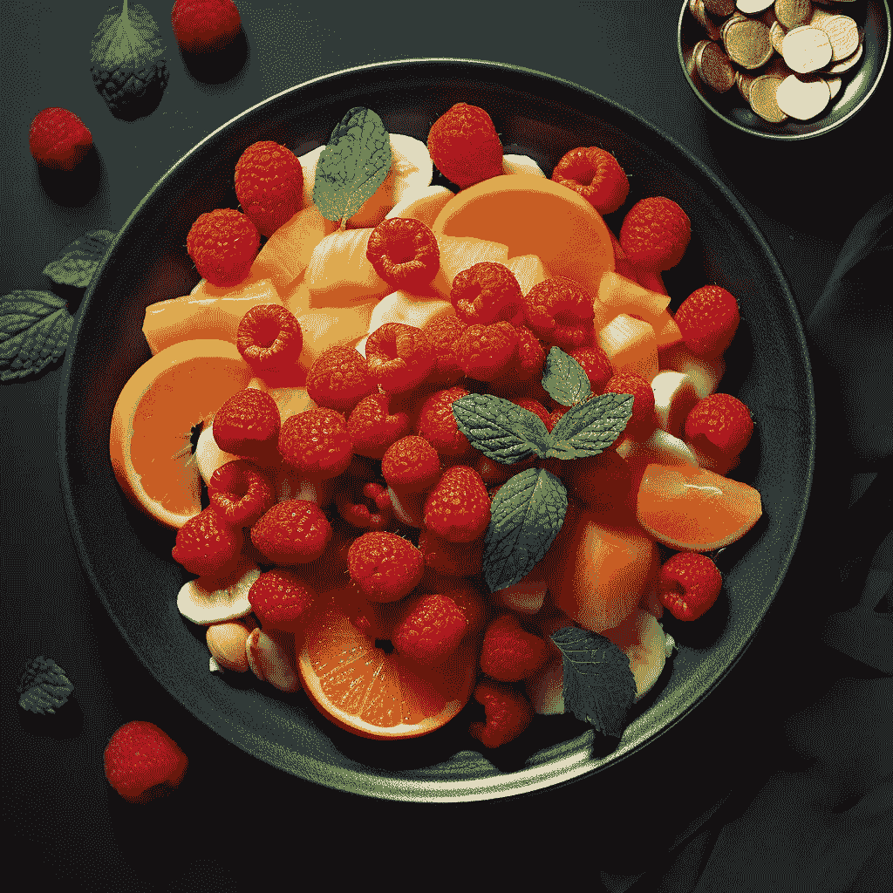

# 使用 Python 对比苹果和橙子

> 原文：[`towardsdatascience.com/comparing-apples-to-oranges-with-python-51a122252ecf?source=collection_archive---------10-----------------------#2023-10-06`](https://towardsdatascience.com/comparing-apples-to-oranges-with-python-51a122252ecf?source=collection_archive---------10-----------------------#2023-10-06)

## 通过水果沙拉示例说明预算优化

[](https://medium.com/@allaei?source=post_page-----51a122252ecf--------------------------------)[](https://towardsdatascience.com/?source=post_page-----51a122252ecf--------------------------------) [Hamed Seyed-allaei](https://medium.com/@allaei?source=post_page-----51a122252ecf--------------------------------)

·

[关注](https://medium.com/m/signin?actionUrl=https%3A%2F%2Fmedium.com%2F_%2Fsubscribe%2Fuser%2F117d57551e70&operation=register&redirect=https%3A%2F%2Ftowardsdatascience.com%2Fcomparing-apples-to-oranges-with-python-51a122252ecf&user=Hamed+Seyed-allaei&userId=117d57551e70&source=post_page-117d57551e70----51a122252ecf---------------------post_header-----------) 发表在 [Towards Data Science](https://towardsdatascience.com/?source=post_page-----51a122252ecf--------------------------------) ·8 分钟阅读·2023 年 10 月 6 日[](https://medium.com/m/signin?actionUrl=https%3A%2F%2Fmedium.com%2F_%2Fvote%2Ftowards-data-science%2F51a122252ecf&operation=register&redirect=https%3A%2F%2Ftowardsdatascience.com%2Fcomparing-apples-to-oranges-with-python-51a122252ecf&user=Hamed+Seyed-allaei&userId=117d57551e70&source=-----51a122252ecf---------------------clap_footer-----------)

--

[](https://medium.com/m/signin?actionUrl=https%3A%2F%2Fmedium.com%2F_%2Fbookmark%2Fp%2F51a122252ecf&operation=register&redirect=https%3A%2F%2Ftowardsdatascience.com%2Fcomparing-apples-to-oranges-with-python-51a122252ecf&source=-----51a122252ecf---------------------bookmark_footer-----------)

图片属于作者

你可能认为比较苹果和橙子是无谓的或不合逻辑的，但实际上，我们每天都在这样做——这正是艰难决策的本质。在选择一个苹果还是一个橙子时，这是一种挑战，与决定一个苹果还是两个苹果不同——两个显然更好。

生活中有很多比较：**自由**与**安全**，时间与金钱，即时满足与延迟满足，**成长**与**利润**等等。在这些场景中找到“最佳平衡点”或最优点通常需要一些优化技巧。

现在，如果选择范围扩展到香蕉、树莓，并且预算也要考虑进去呢？这就是简单决策演变成复杂选择的地方。当我们*深入探讨*优化和效用时，我们将发现一种有条理的方法可以帮助处理这些细节，无论是制作水果沙拉还是应对生活中的各种决策。

让我们通过一个故事来展示这个想法。很久以前，我举办了一次聚会，提供了一份大受欢迎的水果沙拉。制作一份的配方如下：

```py
|Ingredient|Quantity (gr)| Purpose   | Price per Kilo (€) |
|----------|-------------| -------   | ------------------ |
|Apple     | 50          | crunch    | 3                  |…
```
