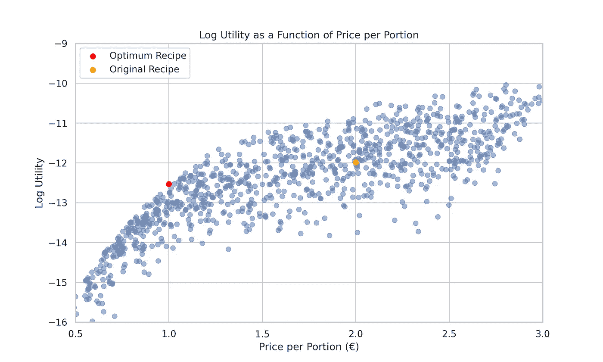
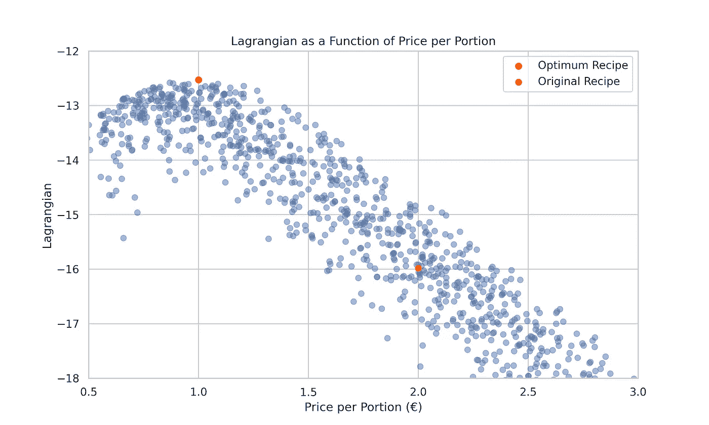

# 使用 python 对比苹果和橘子

> 原文：[`towardsdatascience.com/comparing-apples-to-oranges-with-python-51a122252ecf`](https://towardsdatascience.com/comparing-apples-to-oranges-with-python-51a122252ecf)

## 通过水果沙拉示例展示预算优化

[](https://medium.com/@allaei?source=post_page-----51a122252ecf--------------------------------)[](https://towardsdatascience.com/?source=post_page-----51a122252ecf--------------------------------) [Hamed Seyed-allaei](https://medium.com/@allaei?source=post_page-----51a122252ecf--------------------------------)

·发表于[Towards Data Science](https://towardsdatascience.com/?source=post_page-----51a122252ecf--------------------------------) ·8 分钟阅读·2023 年 10 月 6 日

--


图片属于作者

你可能认为将苹果与橘子进行比较是误导或不合逻辑的，但实际上，我们每天都会这么做——这是艰难决策的本质。选择一个苹果还是一个橘子是一种挑战，而不是决定一个苹果还是两个——两个明显更好。

生活中存在许多对比：**自由**与**安全**、时间与金钱、即时满足与延迟满足、**成长**与**利润**，等等。在这些场景中找到‘恰到好处’的区域或最佳点，通常需要一些优化。

那么，如果选择扩展到香蕉、覆盆子，并且还要考虑预算呢？这时，简单的决定演变成了一系列复杂的选择。随着我们深入优化和效用，我们将发现一种系统的方法如何能够应对这些细节，无论是在制作水果沙拉还是处理生活中的许多决策。

让我们用一个故事来展示这个想法。很久以前，我举办了一场派对，提供了一份非常受欢迎的水果沙拉。每份的配方如下：

```py
|Ingredient|Quantity (gr)| Purpose   | Price per Kilo (€) |
|----------|-------------| -------   | ------------------ |
|Apple     | 50          | crunch    | 3                  |
|Orange    | 50          | juiciness | 4                  |
|Banana    | 50          | creamy    | 3                  |
|Raspberry | 50          | beautify  | 30                 |
```

每份的费用大约是*2 €*。

现在，我被裁员了，资金紧张，但我仍然要招待相同的客人，并且他们的期望没有改变。不过，这次我的预算只有每份 1 欧元。

直接的想法可能是将量减半，但这样做是不可行的——每人 100 克是明显不足的，导致一半的客人空手而归。这个简单的解决方案显然是不理想的。

如果这个简单、次优的解决方案能让你满意，就到此为止。如果不满意，请继续阅读以获得更周到的解决方案。

如果你想看到**最佳**结果，并且厌恶数学和 python，可以跳到结果部分。如果你爱上了数学或 python，继续阅读。

钱不多但时间充裕，我决定系统地优化解决方案，以获得一个简单且最优的解决方案。

我们首先制定一个目标函数来衡量水果沙拉的享受程度。我们将使用[Cobb-Douglas](https://en.wikipedia.org/wiki/Cobb%E2%80%93Douglas_production_function)效用函数：

这个函数在经济学中很受欢迎，展示了不同因素如何贡献于效用或生产。在我们的情境下，它突出了每种水果的重要性——如果缺少任何一种水果，效用就会降到零，显示了每种成分的关键作用。在限制条件 *a+o+b+r = 200* 克下，函数在 *a = o = b = r = 50* 时最佳。不相信我？可以自己动手试试！

然而，现在我们的限制是预算，而不是份量大小。我们的目标是将每份价格保持在 1 欧元，将之前的预算减少一半。这给我们带来了方程：

为了在这一预算限制下微调每种水果的量，同时使用 Cobb-Douglas 效用函数，我们转向[Lagrange 乘子法](https://en.wikipedia.org/wiki/Lagrange_multiplier)。该方法有助于在某些约束条件下找到函数的最大值或最小值。为了简化任务，我们在进入拉格朗日量之前对 U 取对数，得出：



图 1：展示了对数效用与每份价格的关系，绘制了随机重量样本的图形。每个价格点都有一个对应的峰值效用，展示了成本与满意度之间的权衡。橙色和红色点分别表示原始配方和最优配方的效用值。

现在，让我们将拉格朗日量引入：

对于我们的水果沙拉来说是：

拉格朗日量是一个了不起的数学构造，它展示了水果成本与带来的快乐之间的权衡。把它想象成一个跷跷板：一边是我们对更多水果的渴望，另一边是严苛的预算限制。拉格朗日量帮助我们找到那个甜蜜点，在不超预算的情况下最大化享受。



图 2：图中展示了拉格朗日量与每份价格的关系，描绘了成本与享受之间的平衡。红色和橙色点分别表示最优和原始配方，红点指示了在预算限制内享受最大化的峰值。

对于那些擅长数学的人，这里有一个有趣的小贴士：这个优化问题是凸的，意味着它只有一个峰值，确保了唯一的最优解，这也使得数值方法的工作变得简单。这个特点简化了我们对完美水果沙拉的追求。

现在你已经掌握了效用和拉格朗日的基本概念，让我们深入数学。如果数学不是你的强项，但你喜欢 Python，可以直接跳到 Python 部分。

对于那些准备深入细节的，继续阅读：

通过求偏导数并将其设置为零，我们得到一组方程，所有方程通过变量 λ 连接在一起。结果如下：

从这里可以明显看出，所有方程通过 λ 连接在一起，如下所示：

这给我们一个解耦的方程系统；每种水果都有自己的方程，但都通过 λ 交织在一起。这种结构帮助我们找到 *a*，*o*，*b* 和 *r* 的最佳值，因为我们可以将它们表示为 λ 的函数：

此外，效用和总价格作为 λ 和预算的函数如下：

这六个方程只通过 λ 连接在一起。在这里，λ 作为影子价格，揭示了通过稍微放松预算而获得的额外价值。一旦知道了 λ，每个方程都可以单独解决，它们是 [**互斥且完全穷尽**](https://en.wikipedia.org/wiki/MECE_principle)**。** 在这里，λ 是那个唯一的参数。

> 一个参数来统治它们，
> 
> 一个参数来找出它们，
> 
> 一个参数来汇聚它们，
> 
> 并在黑暗中束缚它们。

将这些表达式代入预算约束方程后，我们发现 λ 等于 4。这导致我们得到每种成分的优化数量（以千克为单位）：*a=1/12*，*o=1/16*，*b=1/12*，和 *r=1/120*，总计正好是 *1 €* 对应 *238* 克的一份。

这种方法将水果的甜味与预算的苦涩约束和谐统一，展示了深思熟虑的优化如何帮助应对财务障碍。

# Python

深入了解下面的代码以可视化问题：

```py
import numpy as np
import matplotlib.pyplot as plt
import seaborn as sns

def calculate_log_utility(weights):
    """
    Calculate the log utility for the given weights of the fruits.
    :param weights: Dictionary containing the weights of each fruit.
    :return: Sum of the logarithm of the weights of the fruits.
    """
    return np.sum([np.log(weights[fruit]) for fruit in weights], axis=0)

def calculate_total_price(weights, prices):
    """
    Calculate the total price per portion for the given weights and prices of the fruits.
    :param weights: Dictionary containing the weights of each fruit.
    :param prices: Dictionary containing the prices of each fruit per kg.
    :return: Total price per portion.
    """
    return np.sum([weights[fruit] * prices[fruit] for fruit in weights], axis=0)

def calculate_lagrangian(weights, prices, lambda_value, budget):
    """
    Calculate the Lagrangian for the given weights, prices, lambda, and budget.
    :param weights: Dictionary containing the weights of each fruit.
    :param prices: Dictionary containing the prices of each fruit per kg.
    :param lambda_value: The value of the Lagrange multiplier.
    :param budget: The budget per portion.
    :return: Calculated Lagrangian value.
    """
    log_utility = calculate_log_utility(weights)
    total_price = calculate_total_price(weights, prices)
    return log_utility - lambda_value * (total_price - budget)

# Set the style of seaborn for better visualization
sns.set(style="whitegrid")

# Define the random weights for each fruit in kg.
weights = {
    'apple': np.random.rand(1000) * 0.075 + 0.02, 
    'orange': np.random.rand(1000) * 0.075 + 0.02,
    'banana': np.random.rand(1000) * 0.075 + 0.02,
    'raspberry': np.random.rand(1000) * 0.075 + 0.0001,
}

# Define the prices for each fruit in euros per kg.
prices = {
    'apple': 3, 'orange': 4, 'banana': 3, 'raspberry': 30
}

# Define the optimum and original recipes in kg.
recipes = {
    'optimum': {'apple': 1/12, 'orange': 1/16, 'banana': 1/12, 'raspberry': 1/120},
    'original': {'apple': 0.05, 'orange': 0.05, 'banana': 0.05, 'raspberry': 0.05}
}

# Plot Log Utility Graph
plt.figure(figsize=(10, 6))
sns.scatterplot(x=calculate_total_price(weights, prices), 
                y=calculate_log_utility(weights), alpha=0.5, edgecolor=None)
plt.scatter([calculate_total_price(recipes['optimum'], prices)], 
            [calculate_log_utility(recipes['optimum'])], color='red', label='Optimum Recipe')
plt.scatter([calculate_total_price(recipes['original'], prices)], 
            [calculate_log_utility(recipes['original'])], color='orange', label='Original Recipe')
plt.title('Log Utility as a Function of Price per Portion')
plt.xlabel('Price per Portion (€)')
plt.ylabel('Log Utility')
plt.xlim(0.5, 3)
plt.ylim(-16, -9)
plt.legend(loc='upper left')
plt.show()

# Define lambda_value and budget for Lagrangian Graph
lambda_value = 4  # Given value of lambda
budget = 1  # Given budget per portion

# Plot Lagrangian Graph
plt.figure(figsize=(10, 6))
sns.scatterplot(x=calculate_total_price(weights, prices), 
                y=calculate_lagrangian(weights, prices, lambda_value, budget), alpha=0.5, edgecolor=None)
plt.scatter([calculate_total_price(recipes['optimum'], prices)], 
            [calculate_lagrangian(recipes['optimum'], prices, lambda_value, budget)], color='red', label='Optimum Recipe')
plt.scatter([calculate_total_price(recipes['original'], prices)], 
            [calculate_lagrangian(recipes['original'], prices, lambda_value, budget)], color='orange', label='Original Recipe')
plt.title('Lagrangian as a Function of Price per Portion')
plt.xlabel('Price per Portion (€)')
plt.ylabel('Lagrangian')
plt.xlim(0.5, 3)
plt.ylim(-18, -12)
plt.legend(loc='upper right')
plt.show()
```

现在，让我们用 *sympy* 解方程：

```py
import numpy as np
import matplotlib.pyplot as plt
import seaborn as sns
import sympy as sp

# Setting the style of seaborn for better visualization
sns.set()

# Amounts of each fruit
a, o, b, r = sp.symbols('a o b r', positive=True, real=True)  # Quantities of apples, oranges, bananas, and raspberries

# Prices of each fruit per kilo
P_a, P_o, P_b, P_r = sp.symbols('P_a P_o P_b P_r', positive=True, real=True)  # Prices for apples, oranges, bananas, and raspberries per kilo

# Total price of the ingredients
P = a*P_a + o*P_o + b*P_b + r*P_r

# Budget
B = sp.Symbol('B', positive=True, real=True)  # Budget for the fruit salad

# Lagrange multiplier
λ = sp.Symbol('λ', positive=True, real=True)  # Lagrange multiplier

# Cobb-Douglas utility function in its logarithmic form
U_log = sp.ln(a) + sp.ln(o) + sp.ln(b) + sp.ln(r)

# The Lagrangian
L = U_log - λ * (P - B)

# Derive the first order conditions
foc_a = sp.diff(L, a)
foc_o = sp.diff(L, o)
foc_b = sp.diff(L, b)
foc_r = sp.diff(L, r)
foc_λ = sp.diff(L, λ)

# Solve for λ and the optimized quantities of each ingredient
solution = sp.solve((foc_a, foc_o, foc_b, foc_r, foc_λ), (a, o, b, r, λ), dict=True)

solution
```

运行第二段代码可以揭示出为满足我们的预算并最大化效用所需的确切水果数量。

# 结果

优化显示了每种成分的最佳量：

- 苹果：*83 克*。

- 橙子：*62 克*。

- 香蕉：*83 克*。

- 覆盆子：*8 克*。

总份量大小：*0.238 kg*，成本正好是 1 欧元。

我们保留了沙拉中的所有水果角色，聪明地调整了它们的比例。结果？通过将昂贵的覆盆子份额重新分配给更经济的苹果和香蕉，份量大幅增加了 *20%*。相当巧妙，不是吗？

这种方法创建了一个灵活的公式，能够适应价格变化、配方演变或预算调整，几乎无需额外努力。关键在于“一个参数” —— 我们平衡成本和满意度的数学钥匙。

现在，你的商业场景是否也反映了这个水果沙拉难题？需要类似的优化吗？联系我，我会为你制定一个解决方案，以在预算范围内平衡你的商业成分。

读得开心吗？点击下面的点赞按钮 —— 点赞越多，我越开心。这是我快乐的公式：

在这里，*n* 是拍手的次数，而“！”（阶乘）意味着将从 1 到 *n* 的所有正整数相乘。因此，*5!* 就是 *5*4*3*2*1 = 120*。

想分享吗？把这篇文章传递出去吧。你的分享将传播有趣的优化故事的快乐！

我很想听听你的想法，或者看看你在评论中分享的有趣优化点子。谁知道呢，你独特的问题可能会激发我下一篇故事的灵感！

与此同时，查看我另一篇有趣的文章：

[## 关于人工生命风险的声明](https://medium.com/@allaei/statement-on-organic-life-risk-7f1910feb1bf?source=post_page-----51a122252ecf--------------------------------)

### 人工生命（AL）专家和网络人物表达了他们对 AL 风险的担忧。

[medium.com](https://medium.com/@allaei/statement-on-organic-life-risk-7f1910feb1bf?source=post_page-----51a122252ecf--------------------------------)
