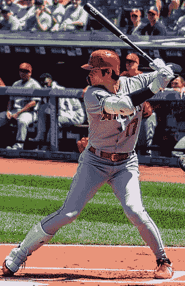
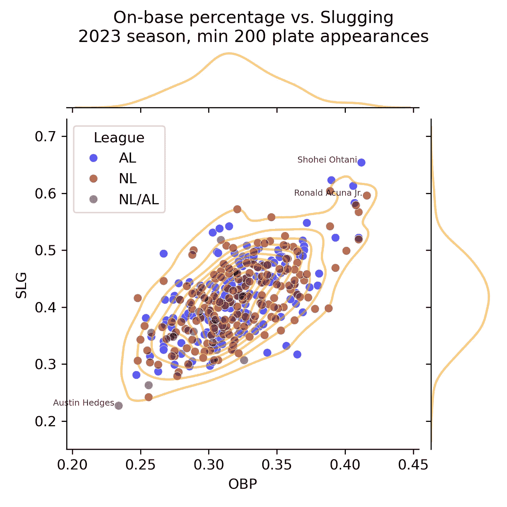
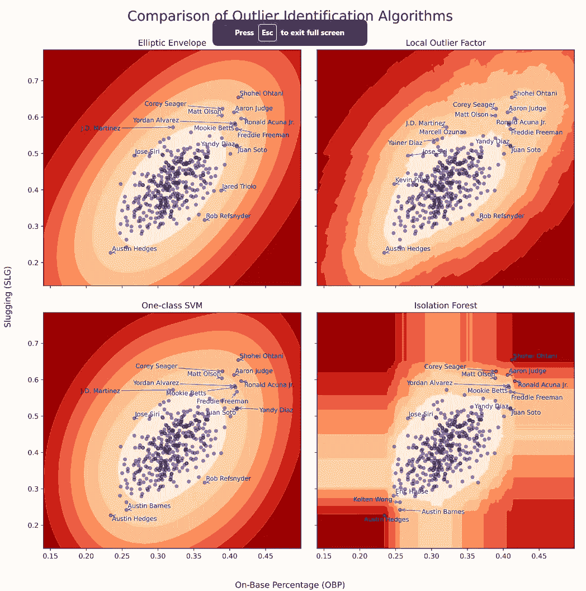

# 比较异常值检测方法

> 原文：[`towardsdatascience.com/comparing-outlier-detection-methods-956f4b097061?source=collection_archive---------1-----------------------#2023-12-16`](https://towardsdatascience.com/comparing-outlier-detection-methods-956f4b097061?source=collection_archive---------1-----------------------#2023-12-16)

## 使用 2023 年大联盟棒球的击球统计数据

[](https://medium.com/@andrews_or?source=post_page-----956f4b097061--------------------------------)[](https://towardsdatascience.com/?source=post_page-----956f4b097061--------------------------------) [约翰·安德鲁斯](https://medium.com/@andrews_or?source=post_page-----956f4b097061--------------------------------)

·

[关注](https://medium.com/m/signin?actionUrl=https%3A%2F%2Fmedium.com%2F_%2Fsubscribe%2Fuser%2F58a322305d14&operation=register&redirect=https%3A%2F%2Ftowardsdatascience.com%2Fcomparing-outlier-detection-methods-956f4b097061&user=John+Andrews&userId=58a322305d14&source=post_page-58a322305d14----956f4b097061---------------------post_header-----------) 发布于 [Towards Data Science](https://towardsdatascience.com/?source=post_page-----956f4b097061--------------------------------) ·12 分钟阅读·2023 年 12 月 16 日[](https://medium.com/m/signin?actionUrl=https%3A%2F%2Fmedium.com%2F_%2Fvote%2Ftowards-data-science%2F956f4b097061&operation=register&redirect=https%3A%2F%2Ftowardsdatascience.com%2Fcomparing-outlier-detection-methods-956f4b097061&user=John+Andrews&userId=58a322305d14&source=-----956f4b097061---------------------clap_footer-----------)

--

[](https://medium.com/m/signin?actionUrl=https%3A%2F%2Fmedium.com%2F_%2Fbookmark%2Fp%2F956f4b097061&operation=register&redirect=https%3A%2F%2Ftowardsdatascience.com%2Fcomparing-outlier-detection-methods-956f4b097061&source=-----956f4b097061---------------------bookmark_footer-----------)

Shohei Ohtani，照片由 [Erik Drost](https://www.flickr.com/photos/edrost88/) 拍摄，发布在 [Flikr](https://www.flickr.com/photos/edrost88/48484060286/in/album-72157629239820345/)，[CC BY 2.0](https://commons.wikimedia.org/w/index.php?curid=88998688)

*异常检测*是一种无监督机器学习任务，用于识别给定数据集中异常值（不寻常的观测值）。这个任务在许多实际场景中非常有用，因为我们可用的数据集已经被异常值“污染”。Scikit-learn [实现了几种异常检测算法](https://scikit-learn.org/stable/modules/outlier_detection.html)，在我们拥有*未污染*的基线时，我们也可以使用这些算法进行*新颖性检测*，这是一种半监督任务，预测新观测值是否为异常值。

# 概述

我们将比较的四种异常检测算法是：

+   [椭圆包络](https://scikit-learn.org/stable/modules/generated/sklearn.covariance.EllipticEnvelope.html)适用于低维度的正态分布数据。顾名思义，它使用多变量正态分布来创建一种距离度量，以将异常值与正常值分离。

+   [局部异常因子](https://scikit-learn.org/stable/modules/generated/sklearn.neighbors.LocalOutlierFactor.html)是通过将观测值的局部密度与其邻居的密度进行比较来判断异常值。密度远低于邻居的观测值被视为异常值。

+   [一类支持向量机（SVM）与随机梯度下降（SGD）](https://scikit-learn.org/stable/modules/generated/sklearn.linear_model.SGDOneClassSVM.html)是一个 O(n)的近似解法。请注意，O(n²)的[一类 SVM](https://scikit-learn.org/stable/modules/generated/sklearn.svm.OneClassSVM.html#sklearn.svm.OneClassSVM)在我们的小示例数据集上效果很好，但可能对你的实际用例不够实用。

+   [隔离森林](https://scikit-learn.org/stable/modules/generated/sklearn.ensemble.IsolationForest.html)是一种基于树的方法，其中异常值通过随机分割比正常值更快地被隔离。

由于我们的任务是无监督的，我们没有基准真值来比较这些算法的准确性。相反，我们希望了解它们的结果（特别是球员排名）之间的差异，并对它们的行为和局限性有一些直觉，以便知道何时优先选择某一算法。

让我们使用 2023 年大联盟棒球（MLB）赛季的两个击球手表现指标来比较这些技术：

+   上垒率（OBP），指击球手在每次打击机会中通过击球、走步或被投球击中到达垒位的比率

+   击球率（SLG），每次击球的平均总垒数

[还有许多更复杂的击球表现指标](https://library.fangraphs.com/offense/offensive-statistics-list/)，包括 OBP 加 SLG（OPS）、加权上垒率（wOBA）和调整后的加权创造分（WRC+）。然而，我们会看到，除了 [常用](https://www.mlb.com/glossary/miscellaneous/slash-line) 且易于理解之外，OBP 和 SLG 有中等相关性且近似正态分布，使它们非常适合用于这次比较。

# 数据集准备

我们使用 `pybaseball` 包来获取击球数据。这个 Python 包在 MIT [许可证](https://github.com/jldbc/pybaseball/blob/master/LICENSE)下发布，并从 [Fangraphs.com](https://www.fangraphs.com/leaders/major-league?pos=all&stats=bat&lg=all&qual=y&type=8&season=2023&month=0&season1=2023&ind=0)、[Baseball-Reference.com](https://www.baseball-reference.com/leagues/majors/2023-standard-batting.shtml) 及其他来源获取数据，这些来源又从大联盟棒球正式记录中获得数据。

我们使用 pybaseball 的 2023 年击球统计数据，这些数据可以通过 `batting_stats`（FanGraphs）或 `batting_stats_bref`（Baseball Reference）获得。结果是，从 Fangraphs 获得的球员名字 [格式更为正确](https://github.com/jldbc/pybaseball/issues/393)，但 Baseball Reference 中的球员团队和联赛在交易球员的情况下格式更佳。为了获得可读性更高的数据集，我们实际上需要合并三个表：FanGraphs、Baseball Reference 和一个键查找表。

```py
from pybaseball import (cache, batting_stats_bref, batting_stats, 
                        playerid_reverse_lookup)
import pandas as pd

cache.enable()  # avoid unnecessary requests when re-running

MIN_PLATE_APPEARANCES = 200

# For readability and reasonable default sort order
df_bref = batting_stats_bref(2023).query(f"PA >= {MIN_PLATE_APPEARANCES}"
                                        ).rename(columns={"Lev":"League",
                                                          "Tm":"Team"}
                                                )
df_bref["League"] = \
  df_bref["League"].str.replace("Maj-","").replace("AL,NL","NL/AL"
                                                  ).astype('category')

df_fg = batting_stats(2023, qual=MIN_PLATE_APPEARANCES)

key_mapping = \
  playerid_reverse_lookup(df_bref["mlbID"].to_list(), key_type='mlbam'
                         )[["key_mlbam","key_fangraphs"]
                          ].rename(columns={"key_mlbam":"mlbID",
                                            "key_fangraphs":"IDfg"}
                                  )

df = df_fg.drop(columns="Team"
               ).merge(key_mapping, how="inner", on="IDfg"
                      ).merge(df_bref[["mlbID","League","Team"]],
                              how="inner", on="mlbID"
                             ).sort_values(["League","Team","Name"])
```

# 数据探索

首先，我们注意到这些指标在均值和方差上有所不同，并且有中等程度的相关性。我们还注意到，每个指标相当对称，具有接近均值的中位数值。

```py
print(df[["OBP","SLG"]].describe().round(3))

print(f"\nCorrelation: {df[['OBP','SLG']].corr()['SLG']['OBP']:.3f}")
```

```py
 OBP      SLG
count  362.000  362.000
mean     0.320    0.415
std      0.034    0.068
min      0.234    0.227
25%      0.300    0.367
50%      0.318    0.414
75%      0.340    0.460
max      0.416    0.654

Correlation: 0.630
```

让我们使用以下内容来可视化这个联合分布：

+   球员的散点图，以国家联盟（NL）与美国联盟（AL）为颜色区分

+   球员的双变量核密度估计（KDE）图，使用高斯核平滑散点图以估计密度

+   每个指标的边际 KDE 图

```py
import matplotlib.pyplot as plt
import seaborn as sns

g = sns.JointGrid(data=df, x="OBP", y="SLG", height=5)
g = g.plot_joint(func=sns.scatterplot, data=df, hue="League",
                 palette={"AL":"blue","NL":"maroon","NL/AL":"green"},
                 alpha=0.6
                )
g.fig.suptitle("On-base percentage vs. Slugging\n2023 season, min "
               f"{MIN_PLATE_APPEARANCES} plate appearances"
              )
g.figure.subplots_adjust(top=0.9)
sns.kdeplot(x=df["OBP"], color="orange", ax=g.ax_marg_x, alpha=0.5)
sns.kdeplot(y=df["SLG"], color="orange", ax=g.ax_marg_y, alpha=0.5)
sns.kdeplot(data=df, x="OBP", y="SLG",
            ax=g.ax_joint, color="orange", alpha=0.5
           )
df_extremes = df[ df["OBP"].isin([df["OBP"].min(),df["OBP"].max()]) 
                 | df["OPS"].isin([df["OPS"].min(),df["OPS"].max()])
                ]

for _,row in df_extremes.iterrows():
    g.ax_joint.annotate(row["Name"], (row["OBP"], row["SLG"]),size=6,
                      xycoords='data', xytext=(-3, 0),
                        textcoords='offset points', ha="right",
                      alpha=0.7)
plt.show()
```



散点图的右上角显示了一个击球优秀的聚集群，与 SLG 和 OBP 分布的上尾部重合。这一小群球员在上垒 *和* 击出额外垒数方面表现优异。我们将他们视为异常值（因为他们与大多数球员群体的距离）还是内群体（因为他们彼此靠近）的判断取决于我们选择的算法定义。

# 应用异常值检测算法

Scikit-learn 的离群点检测算法通常具有`fit()`和`predict()`方法，但也有例外，并且不同算法的参数也有所不同。我们将逐个考虑每种算法，但我们将每种算法拟合到每个玩家的特征矩阵（n=2，m=453）。然后，我们将对每个玩家以及跨越每个特征范围的值网格进行评分，以帮助我们可视化预测函数。

要可视化决策边界，我们需要采取以下步骤：

1.  创建一个 2D 的`meshgrid`输入特征值。

1.  将`decision_function`应用于`meshgrid`上的每一点，这需要将网格展开。

1.  将预测结果重新调整为网格形状。

1.  绘制预测结果。

我们将使用 200x200 的网格来覆盖现有的观察结果以及一些填充，但你可以根据所需的速度和分辨率调整网格。

```py
import numpy as np

X = df[["OBP","SLG"]].to_numpy()

GRID_RESOLUTION = 200

disp_x_range, disp_y_range = ( (.6*X[:,i].min(), 1.2*X[:,i].max()) 
                               for i in [0,1]
                             )
xx, yy = np.meshgrid(np.linspace(*disp_x_range, GRID_RESOLUTION), 
                     np.linspace(*disp_y_range, GRID_RESOLUTION)
                    )
grid_shape = xx.shape
grid_unstacked = np.c_[xx.ravel(), yy.ravel()]
```

## 椭圆包络

椭圆包络的形状由数据的协方差矩阵决定，该矩阵在主对角线上给出特征`i`的方差，在`[i,j]`位置给出特征`i`和`j`的协方差。由于协方差矩阵对离群点敏感，该算法使用了最小协方差行列式（MCD）估计器，该估计器[推荐](https://scikit-learn.org/stable/modules/generated/sklearn.covariance.MinCovDet.html#sklearn.covariance.MinCovDet)用于单峰对称分布，通过`random_state`输入确定的洗牌以确保可重复性。这种稳健的协方差矩阵以后会再次派上用场。

因为我们想比较离群点分数的排名，而不是二元的离群点/内群体分类，我们使用`decision_function`对玩家进行评分。

```py
from sklearn.covariance import EllipticEnvelope

ell = EllipticEnvelope(random_state=17).fit(X)
df["outlier_score_ell"] = ell.decision_function(X)
Z_ell = ell.decision_function(grid_unstacked).reshape(grid_shape)
```

## 本地离群因子

这种隔离度量方法基于 k 近邻（KNN）。我们计算每个观察值到其最近邻的总距离来定义局部密度，然后将每个观察值的局部密度与其邻居的密度进行比较。局部密度远低于其邻居的观察值被视为离群点。

**选择邻居的数量：** 在 KNN 中，一个经验法则是让 K = sqrt(N)，其中 N 是你的观察数量。根据这个规则，我们得到一个接近 20 的 K（这恰好是 LOF 的默认 K）。你可以增加或减少 K 以减少过拟合或欠拟合。

```py
K = int(np.sqrt(X.shape[0]))

print(f"Using K={K} nearest neighbors.")
```

```py
Using K=19 nearest neighbors.
```

**选择距离度量：** 注意到我们的特征是相关的且具有不同的方差，因此欧几里得距离意义不大。我们将使用马哈拉诺比斯距离，它考虑了特征的尺度和相关性。

在计算马哈拉诺比斯距离时，我们将使用稳健的协方差矩阵。如果我们没有通过椭圆包络计算它，我们可以[直接](https://scikit-learn.org/stable/modules/generated/sklearn.covariance.MinCovDet.html)计算它。

```py
from scipy.spatial.distance import pdist, squareform

# If we didn't have the elliptical envelope already,
# we could calculate robust covariance:
#   from sklearn.covariance import MinCovDet
#   robust_cov = MinCovDet().fit(X).covariance_
# But we can just re-use it from elliptical envelope:
robust_cov = ell.covariance_

print(f"Robust covariance matrix:\n{np.round(robust_cov,5)}\n")

inv_robust_cov = np.linalg.inv(robust_cov)

D_mahal = squareform(pdist(X, 'mahalanobis', VI=inv_robust_cov))

print(f"Mahalanobis distance matrix of size {D_mahal.shape}, "
      f"e.g.:\n{np.round(D_mahal[:5,:5],3)}...\n...\n")
```

```py
Robust covariance matrix:
[[0.00077 0.00095]
 [0.00095 0.00366]]

Mahalanobis distance matrix of size (362, 362), e.g.:
[[0\.    2.86  1.278 0.964 0.331]
 [2.86  0\.    2.63  2.245 2.813]
 [1.278 2.63  0\.    0.561 0.956]
 [0.964 2.245 0.561 0\.    0.723]
 [0.331 2.813 0.956 0.723 0\.   ]]...
...
```

**拟合局部异常因子：**请注意，使用自定义距离矩阵需要将`metric="precomputed"`传递给构造函数，然后将距离矩阵本身传递给`fit`方法。（有关更多详细信息，请参见[文档](https://scikit-learn.org/stable/modules/generated/sklearn.neighbors.LocalOutlierFactor.html#sklearn.neighbors.LocalOutlierFactor.fit)。）

还需注意，与其他算法不同的是，在 LOF 中，我们被[指示](https://scikit-learn.org/stable/auto_examples/neighbors/plot_lof_novelty_detection.html)不要使用`score_samples`方法来为现有观察值打分；此方法仅应用于新颖性检测。

```py
from sklearn.neighbors import LocalOutlierFactor

lof = LocalOutlierFactor(n_neighbors=K, metric="precomputed", novelty=True
                        ).fit(D_mahal)

df["outlier_score_lof"] = lof.negative_outlier_factor_
```

**创建决策边界：**由于我们使用了自定义距离度量，我们还必须计算网格中每个点到原始观察值的自定义距离。在之前，我们使用空间度量`pdist`来计算单一集合中每个成员的成对距离，但现在我们使用`cdist`来返回第一个输入集合中每个成员到第二个集合中每个成员的距离。

```py
from scipy.spatial.distance import cdist

D_mahal_grid = cdist(XA=grid_unstacked, XB=X, 
                     metric='mahalanobis', VI=inv_robust_cov
                    )
Z_lof = lof.decision_function(D_mahal_grid).reshape(grid_shape)
```

## 支持向量机（SGD-一类 SVM）

SVM 使用核技巧将特征转化为更高维度，从而可以识别分隔超平面。径向基函数（RBF）核要求输入数据进行标准化，但正如[文档](https://scikit-learn.org/stable/modules/generated/sklearn.preprocessing.StandardScaler.html)中提到的，标准化器对异常值敏感，因此我们将使用`RobustScaler`。我们将缩放后的输入数据传递到 Nyström 核近似中，正如[文档](https://scikit-learn.org/stable/modules/generated/sklearn.linear_model.SGDOneClassSVM.html)中对`SGDOneClassSVM`的建议。

```py
from sklearn.pipeline import make_pipeline
from sklearn.preprocessing import RobustScaler
from sklearn.kernel_approximation import Nystroem
from sklearn.linear_model import SGDOneClassSVM

suv = make_pipeline(
            RobustScaler(),
            Nystroem(random_state=17),
            SGDOneClassSVM(random_state=17)
).fit(X)

df["outlier_score_svm"] = suv.decision_function(X)

Z_svm = suv.decision_function(grid_unstacked).reshape(grid_shape)
```

## Isolation Forest

这种基于树的方法进行隔离测量时会执行随机递归分区。如果隔离给定观察值所需的平均分割次数*低*，则该观察值被认为是*更强的*候选异常值。与随机森林和其他基于树的模型一样，Isolation Forest 不假设特征是正态分布的，也不要求对其进行缩放。默认情况下，它会构建 100 棵树。我们的示例只使用了两个特征，因此我们不启用特征抽样。

```py
from sklearn.ensemble import IsolationForest

iso = IsolationForest(random_state=17).fit(X)

df["outlier_score_iso"] = iso.score_samples(X)

Z_iso = iso.decision_function(grid_unstacked).reshape(grid_shape)
```

# 结果：检查决策边界

请注意，这些模型的预测具有不同的分布。我们应用`QuantileTransformer`使它们在给定网格上更具可视比较性。请参阅[文档](https://scikit-learn.org/stable/modules/generated/sklearn.preprocessing.QuantileTransformer.html)了解更多信息：

> *注意，这一变换是非线性的。它可能会扭曲在相同尺度下测量的变量之间的线性相关性，但使得在不同尺度下测量的变量更直接地可比较。*

```py
from adjustText import adjust_text
from sklearn.preprocessing import QuantileTransformer

N_QUANTILES = 8 # This many color breaks per chart
N_CALLOUTS=15  # Label this many top outliers per chart

fig, axs = plt.subplots(2, 2, figsize=(12, 12), sharex=True, sharey=True)

fig.suptitle("Comparison of Outlier Identification Algorithms",size=20)
fig.supxlabel("On-Base Percentage (OBP)")
fig.supylabel("Slugging (SLG)")

ax_ell = axs[0,0]
ax_lof = axs[0,1]
ax_svm = axs[1,0]
ax_iso = axs[1,1]

model_abbrs = ["ell","iso","lof","svm"]

qt = QuantileTransformer(n_quantiles=N_QUANTILES)

for ax, nm, abbr, zz in zip( [ax_ell,ax_iso,ax_lof,ax_svm], 
                            ["Elliptic Envelope","Isolation Forest",
                             "Local Outlier Factor","One-class SVM"], 
                            model_abbrs,
                            [Z_ell,Z_iso,Z_lof,Z_svm]
                           ):
    ax.title.set_text(nm)
    outlier_score_var_nm = f"outlier_score_{abbr}"

    qt.fit(np.sort(zz.reshape(-1,1)))
    zz_qtl = qt.transform(zz.reshape(-1,1)).reshape(zz.shape)

    cs = ax.contourf(xx, yy, zz_qtl, cmap=plt.cm.OrRd.reversed(), 
                     levels=np.linspace(0,1,N_QUANTILES)
                    )
    ax.scatter(X[:, 0], X[:, 1], s=20, c="b", edgecolor="k", alpha=0.5)

    df_callouts = df.sort_values(outlier_score_var_nm).head(N_CALLOUTS)
    texts = [ ax.text(row["OBP"], row["SLG"], row["Name"], c="b",
                      size=9, alpha=1.0) 
             for _,row in df_callouts.iterrows()
            ]
    adjust_text(texts, 
                df_callouts["OBP"].values, df_callouts["SLG"].values, 
                arrowprops=dict(arrowstyle='->', color="b", alpha=0.6), 
                ax=ax
               )

plt.tight_layout(pad=2)
plt.show()

for var in ["OBP","SLG"]:
    df[f"Pctl_{var}"] = 100*(df[var].rank()/df[var].size).round(3)

model_score_vars = [f"outlier_score_{nm}" for nm in model_abbrs]  
model_rank_vars = [f"Rank_{nm.upper()}" for nm in model_abbrs]

df[model_rank_vars] = df[model_score_vars].rank(axis=0).astype(int)

# Averaging the ranks is arbitrary; we just need a countdown order
df["Rank_avg"] = df[model_rank_vars].mean(axis=1)

print("Counting down to the greatest outlier...\n")
print(
    df.sort_values("Rank_avg",ascending=False
                  ).tail(N_CALLOUTS)[["Name","AB","PA","H","2B","3B",
                                      "HR","BB","HBP","SO","OBP",
                                      "Pctl_OBP","SLG","Pctl_SLG"
                                     ] + 
                             [f"Rank_{nm.upper()}" for nm in model_abbrs]
                            ].to_string(index=False)
)
```



```py
Counting down to the greatest outlier...

            Name  AB  PA   H  2B  3B  HR  BB  HBP  SO   OBP  Pctl_OBP   SLG  Pctl_SLG  Rank_ELL  Rank_ISO  Rank_LOF  Rank_SVM
   Austin Barnes 178 200  32   5   0   2  17    2  43 0.256       2.6 0.242       0.6        19         7        25        12
   J.D. Martinez 432 479 117  27   2  33  34    2 149 0.321      52.8 0.572      98.1        15        18         5        15
      Yandy Diaz 525 600 173  35   0  22  65    8  94 0.410      99.2 0.522      95.4        13        15        13        10
       Jose Siri 338 364  75  13   2  25  20    2 130 0.267       5.5 0.494      88.4         8        14        15        13
       Juan Soto 568 708 156  32   1  35 132    2 129 0.410      99.2 0.519      95.0        12        13        11        11
    Mookie Betts 584 693 179  40   1  39  96    8 107 0.408      98.6 0.579      98.3         7        10        20         7
   Rob Refsnyder 202 243  50   9   1   1  33    5  47 0.365      90.5 0.317       6.6         5        19         2        14
  Yordan Alvarez 410 496 120  24   1  31  69   13  92 0.407      98.3 0.583      98.6         6         9        18         6
 Freddie Freeman 637 730 211  59   2  29  72   16 121 0.410      99.2 0.567      97.8         9        11         9         8
      Matt Olson 608 720 172  27   3  54 104    4 167 0.389      96.5 0.604      99.2        11         6         7         9
   Austin Hedges 185 212  34   5   0   1  11    2  47 0.234       0.3 0.227       0.3        10         1         4         3
     Aaron Judge 367 458  98  16   0  37  88    0 130 0.406      98.1 0.613      99.4         3         5         6         4
Ronald Acuna Jr. 643 735 217  35   4  41  80    9  84 0.416     100.0 0.596      98.9         2         3        10         2
    Corey Seager 477 536 156  42   0  33  49    4  88 0.390      97.0 0.623      99.7         4         4         3         5
   Shohei Ohtani 497 599 151  26   8  44  91    3 143 0.412      99.7 0.654     100.0         1         2         1         1
```

# 分析与结论

看起来这四种实现大致一致于离群值的定义，但在评分和易用性上有一些明显的差异。

**椭圆包络**在椭圆的短轴周围有更窄的轮廓，因此它倾向于突出那些与特征之间的整体相关性相悖的有趣球员。例如，光芒队外场手何塞·西里在该算法下被认为是一个更大的离群值，因为他的 SLG（88th 百分位）高而 OBP（5th 百分位）低，这与一个在边界球上挥杆用力的激进打击手一致，要么击球力大，要么击球弱或没有击中。

椭圆包络也很容易使用而无需配置，并且提供了稳健的协方差矩阵。如果你有低维数据并且合理地期望其呈正态分布（尽管这种情况通常不成立），你可以先尝试这种简单的方法。

**单类 SVM** 具有更均匀的轮廓分布，因此它倾向于比椭圆包络更强调与整体相关方向一致的观察值。全明星一垒手弗雷迪·弗里曼（道奇队）和杨迪·迪亚斯（光芒队）在该算法下的排名明显高于其他算法，因为他们的 SLG 和 OBP 都非常出色（弗里曼分别为 99th 和 97th 百分位，迪亚斯分别为 99th 和 95th 百分位）。

RBF 核函数需要额外的标准化步骤，但在这个简单的示例中，它似乎也能很好地工作而无需微调。

**局部离群因子** 识别了之前提到的“小簇优秀”特征，轮廓呈双峰状（在图表中几乎不可见）。由于道奇队外场手/二垒手穆基·贝茨被其他优秀击球手如弗里曼、尤尔丹·阿尔瓦雷斯和罗纳德·阿库尼亚 Jr. 环绕，他在 LOF 下的离群值排名仅为第 20 位，而在其他算法下排名第 10 位或更高。相反，勇士队外场手马塞尔·奥祖纳的 SLG 稍低且 OBP 明显低于贝茨，但在 LOF 下他是更大的离群值，因为他的邻域较少。

LOF 是实现过程中最耗时的，因为我们创建了稳健的距离矩阵用于拟合和评分。我们也可能需要花一些时间调整 K。

**孤立森林** 倾向于强调特征空间角落的观察值，因为分割分布在各个特征上。替补捕手奥斯丁·赫奇斯在 2023 年为海盗队和游骑兵队效力，并于 2024 年签约守护者队，他在防守方面表现出色，但在 SLG 和 OBP 上是最差的击球手（至少有 200 次打击机会）。赫奇斯可以通过 OBP 或 OPS 的单次分割被孤立，使他成为最强的离群值。孤立森林是唯一一个没有将大谷翔平排名为最强离群值的算法：由于大谷在 OBP 上被罗纳德·阿库尼亚 Jr. 超越，大谷和阿库尼亚只能通过 *一个* 特征进行单次分割。

与常见的*监督*树基学习器一样，隔离森林算法不进行外推，使其更适合用于配合受污染的数据集进行离群点检测，而不是用于配合无异常数据集进行新奇检测（在这种情况下，它不会对新离群点给予比现有观察结果更强的评分）。

尽管隔离森林算法开箱即用效果良好，但它未能将**大谷翔平**排名为*棒球（以及可能所有职业体育）中的最伟大离群者*，这体现了任何离群点检测器的主要局限性：你用来训练它的数据。

我们不仅省略了防守统计数据（抱歉，奥斯汀·赫奇斯），还没有包含*投球*统计数据。因为投手们现在几乎不再尝试击球……除了大谷，他的赛季包括对打击率（BAA）排名第二和 earned run average（ERA）排名第 11 的表现（最少 100 局），还有一场完整的零封比赛，以及一场他击出两支本垒打并三振十名打者的比赛。

有人建议大谷翔平是一个伪装成人类的高级外星人，但更有可能的是有**两个**高级外星人伪装成同一个人。不幸的是，其中一个刚刚接受了肘部手术，并且在 2024 年不会投球……但另一个刚刚签下了一份创纪录的 10 年、7 亿美元合同。多亏了离群点检测，我们现在可以看到其中的原因！
