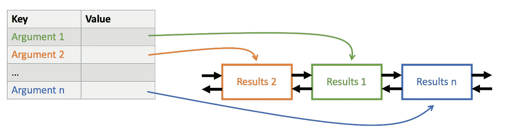
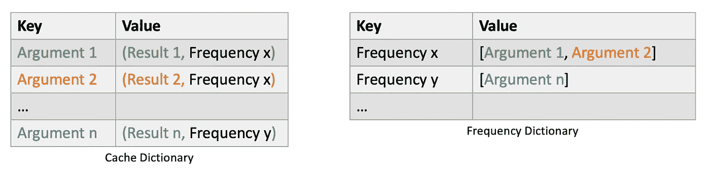
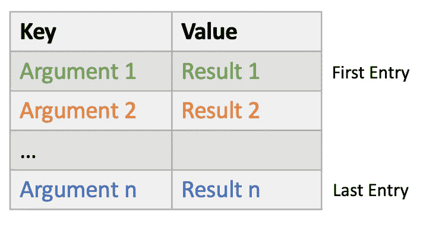

# 完整的 Python 缓存指南

> 原文：[`towardsdatascience.com/complete-guide-to-caching-in-python-b4e37a4bcebf`](https://towardsdatascience.com/complete-guide-to-caching-in-python-b4e37a4bcebf)

## 缓存如何工作及缓存函数的方法

[](https://kayjanwong.medium.com/?source=post_page-----b4e37a4bcebf--------------------------------)[](https://towardsdatascience.com/?source=post_page-----b4e37a4bcebf--------------------------------) [Kay Jan Wong](https://kayjanwong.medium.com/?source=post_page-----b4e37a4bcebf--------------------------------)

·发布于 [Towards Data Science](https://towardsdatascience.com/?source=post_page-----b4e37a4bcebf--------------------------------) ·阅读时间 7 分钟·2023 年 12 月 1 日

--


照片由 [Nana Smirnova](https://unsplash.com/@nananadolgo?utm_source=medium&utm_medium=referral) 提供，来源于 [Unsplash](https://unsplash.com/?utm_source=medium&utm_medium=referral)

当重复调用函数并使用相同参数时，会导致计算被重复执行。**记忆化** 在这种情况下非常有用，因为函数调用的结果可以被‘保存’以供将来使用。这将节省时间并优化代码，因为代码变得更少计算密集。**缓存** 是一个更通用的术语，用于指代存储任何数据。

本文将探讨不同的缓存策略、缓存考虑因素以及如何启用和实现不同类型的缓存（使用 Python 包和你的实现）！

# 目录

+   [缓存类型](https://medium.com/p/b4e37a4bcebf/#64d2)

+   [缓存考虑因素](https://medium.com/p/b4e37a4bcebf/#4de0)

+   [LRU 缓存](https://medium.com/p/b4e37a4bcebf/#b4c2)

+   [LFU 缓存](https://medium.com/p/b4e37a4bcebf/#b490)

+   [FIFO / LIFO 缓存](https://medium.com/p/b4e37a4bcebf/#420a)

# 缓存类型

根据你的需求，有几种缓存策略，例如：

+   **最少最近使用（LRU）**：移除最少最近使用的数据，是最常见的缓存类型

+   **最少频繁使用（LFU）**：移除最少频繁使用的数据

+   **先进先出（FIFO）**：移除最旧的数据

+   **后进先出（LIFO）**：移除最新的数据

+   **最近使用（MRU）**：移除最近使用的数据

+   **随机替换（RR）**：移除随机选择的数据

# 缓存考虑因素

在应用程序中使用缓存时，您应该考虑缓存的***内存占用***，因为它存储了额外的信息。如果在不同的实现之间进行选择，就架构和数据结构而言，有几个时间考虑因素，例如：

+   ***访问时间***：对于已经计算过的参数，结果应在`O(1)`时间内快速访问

+   ***插入时间***：对于新参数，数据应尽可能在`O(1)`时间内插入缓存（根据实现，有些可能需要`O(n)`时间，选择时请谨慎！）

+   ***删除时间***：当缓存满时，需要根据缓存策略删除数据。删除涉及识别要删除的数据，然后从内存中移除它们。

# 1 — 最少使用（LRU）缓存

> 通过为 Python 函数添加装饰器来实现



图 1：LRU 实现（图片由作者提供）

**工作原理**：它使用字典和双向链表。在字典中，键值对是提供的参数和双向链表中的条目。这使得根据提供的参数快速引用结果（`O(1)`访问时间）。由于参数可以作为字典键存储，因此它们必须是可哈希的。

在双向链表中，函数结果存储在条目中。条目按其最近性排序，并可以引用其直接前一个和下一个条目。这允许条目轻松插入或重新排序，并在缓存满时快速识别和删除最久未用的条目。

```py
from functools import lru_cache

@lru_cache
def fibonacci(n: int) -> int:
    return n if n < 2 else fibonacci(n - 1) + fibonacci(n - 2)
```

## 高级用法

通过实现以下功能来增强 LRU 缓存：

1.  使用`maxsize`参数设置最大缓存大小

1.  使用`maxsize=None`参数或`functools.cache`设置无限缓存大小。这意味着数据将永远不会被删除，这可能在内存占用的代价下带来时间改进。

1.  使用`.cache_info()`检索缓存命中和未命中的信息。缓存统计信息使我们能够评估缓存的访问效率。

1.  使用`cachetools.TTLCache`添加过期时间

1.  [将缓存与 CPU 内存使用挂钩](https://stackoverflow.com/questions/23477284/memory-aware-lru-caching-in-python)而不是缓存大小

```py
# 1\. Maximum cache size
@lru_cache(maxsize=1024)
def fibonacci(n: int) -> int:
    return n if n < 2 else fibonacci(n - 1) + fibonacci(n - 2)

# 2\. Unlimited cache size
@lru_cache(maxsize=None)
def fibonacci(n: int) -> int:
    return n if n < 2 else fibonacci(n - 1) + fibonacci(n - 2)

from functools import cache

@cache
def fibonacci(n: int) -> int:
    return n if n < 2 else fibonacci(n - 1) + fibonacci(n - 2)

# 3\. Retrieve caching information
fibonacci.cache_info()

# 4\. Add expiration time (requires pip install cachetools)
from cachetools import cached, TTLCache

@cached(cache=TTLCache(maxsize=100, ttl=60*60*5), info=True)
def fibonacci(n: int) -> int:
    return n if n < 2 else fibonacci(n - 1) + fibonacci(n - 2)
```

> **注意**：其他 Python 包实现了缓存，例如[fastcache](https://github.com/pbrady/fastcache)，但它们没有`functools.lru_cache`那么受欢迎或常用。

# 2 — 最少频繁使用（LFU）缓存

> 通过维护一个缓存字典和一个频率字典来实现

在线可以找到许多 LFU 缓存的实现，包括`cachedtools`，其使用方法类似于上一节中的 LRU 缓存。LFU 缓存可以使用哈希映射、单向链表或双向链表实现。

我发现维护两个字典是最优的方式，考虑到访问、插入和删除时间。通过使用哈希可以进一步提高内存使用效率。



图 2: LFU 实现（作者图片）

**工作原理**：它使用 2 个字典。在缓存字典中，键是提供的参数，值是一个包含函数结果和频率的元组。这允许快速检索函数结果（`O(1)`访问时间！）和频率（用于访问频率字典）。

在频率字典中，键是频率，值是提供的参数列表。存储提供的参数列表允许快速识别最不常用的参数，并从两个字典中逐出该参数及其结果。可以使用 Deque 代替列表，以便更快的访问、插入和删除时间。

> **警告**：在 LFU 缓存中，它对最近的条目有偏见，因为较新的条目可能没有现有条目的频率高——使得即使访问频率较低，也很难逐出较旧的条目。

```py
from collections import defaultdict, deque
from typing import Any, Deque, Dict, Tuple

class LFUCache:
    def __init__(self, maxsize: int | None = None):
        """
        Args:
            maxsize (int | None): Capacity of cache size, defaults to None
        """
        if maxsize and maxsize < 0:
            maxsize = 0
        self.maxsize = maxsize
        self.cache_dict: Dict[Any, Tuple[Any, int]] = {}
        self.freq_dict: Dict[int, Deque[Any]] = defaultdict(lambda: deque([]))
        self.hits, self.misses, self.curr_size = 0, 0, 0

    def cache_info(self) -> Dict[str, int | None]:
        """Report cache statistics"""
        return dict(
            hits=self.hits,
            misses=self.misses,
            maxsize=self.maxsize,
            currsize=self.curr_size,
        )

    def cache_clear(self) -> None:
        """Clear the cache and cache statistics"""
        self.cache_dict = {}
        self.freq_dict = defaultdict(lambda: deque([]))
        self.hits, self.misses, self.curr_size = 0, 0, 0

    def update(self, key: Any, value: Any) -> None:
        """Update frequency of key in cache and frequency dictionary.
        Removes key in frequency dictionary if necessary.

        Args:
            key (Any): Argument to function
            value (Any): Result of function
        """
        _, freq = self.cache_dict[key]
        self.cache_dict[key] = (value, freq + 1)
        self.freq_dict[freq].remove(key)
        self.freq_dict[freq + 1].append(key)
        if not len(self.freq_dict[freq]):
            del self.freq_dict[freq]

    def get(self, key: Any) -> Any:
        """Get value by key. Updates the hits and misses statistics.

        Args:
            key (Any): Argument to function

        Returns:
            (Any)
        """
        if key in self.cache_dict:
            self.hits += 1
            value, _ = self.cache_dict[key]
            self.update(key, value)
            return value
        self.misses += 1
        raise KeyError(f"{key} does not exist in cache.")

    def put(self, key: Any, value: Any) -> None:
        """Put value by key into cache and frequency dictionary.
        Check the capacity of the cache and delete the key-value if necessary.

        Args:
            key (Any): Argument to function
            value (Any): Result of function
        """
        if key in self.cache_dict:
            self.update(key, value)
        else:
            self.cache_dict[key] = (value, 1)
            self.freq_dict[1].append(key)
            self.curr_size += 1
            if self.maxsize is not None and self.curr_size > self.maxsize:
                remove_key = self.freq_dict[min(self.freq_dict)].popleft()
                del self.cache_dict[remove_key]
                self.curr_size -= 1
```

上面的代码片段改编自[这里](https://www.tutorialspoint.com/lfu-cache-in-python)，并做了一些调整。

要将 LFU 缓存作为装饰器使用，我们可以封装`LFUCache`类，并类似于`functools.lru_cache`来使用。可以按如下方式进行：

```py
from functools import wraps
from typing import Callable

def lfu_cache(maxsize: int | None = None) -> Any:
    cache = LFUCache(maxsize)

    def decorator(func: Callable[..., Any]) -> Any:

        @wraps(func)
        def wrapper(*args, **kwargs) -> Callable[..., Any]:
            key = hash(*args, **kwargs)
            try:
                result = cache.get(key)
                return result
            except KeyError:
                result = func(*args, **kwargs)
                cache.put(key, result)
            return result

        wrapper.cache = cache
        wrapper.cache_info = cache.cache_info
        wrapper.cache_clear = cache.cache_clear

        return wrapper
    return decorator

# Usage
@lfu_cache(maxsize=1024)
def fibonacci(n: int) -> int:
    return n if n < 2 else fibonacci(n - 1) + fibonacci(n - 2)

fibonacci.cache_info()
```

# 3 — 先进先出 (FIFO) / 后进先出 (LIFO) 缓存

> 通过维护一个有序字典实现



图 3: FIFO / LIFO 实现（作者图片）

**工作原理**：它使用一个有序字典，其中键值对是提供的参数和函数结果。字典按照提供的参数首次调用的时间进行排序。

这允许根据提供的参数快速引用结果（`O(1)`访问时间），条目可以根据缓存策略从前面或后面移除（`O(1)`插入和删除时间）。实现可以使用`cachedtools`，使用方式类似于上一节中的 LRU 缓存。为了说明这一点：

```py
# Requires pip install cachetools
from cachetools import cached, FIFOCache

@cached(cache=FIFOCache(maxsize=100), info=True)
def fibonacci(n: int) -> int:
    return n if n < 2 else fibonacci(n - 1) + fibonacci(n - 2)

# Retrieve caching information
fibonacci.cache_info()
```

希望你对缓存、缓存策略的类型及其考虑因素，以及使用 Python 库或你自己的实现有了更多了解！

# 相关链接

+   LRU 文档: [`docs.python.org/3/library/functools.html#functools.lru_cache`](https://docs.python.org/3/library/functools.html#functools.lru_cache)

+   LFU 文章: [`www.tutorialspoint.com/lfu-cache-in-python`](https://www.tutorialspoint.com/lfu-cache-in-python)

+   `cachetools` 官方 GitHub: [`github.com/tkem/cachetools`](https://github.com/tkem/cachetools)
