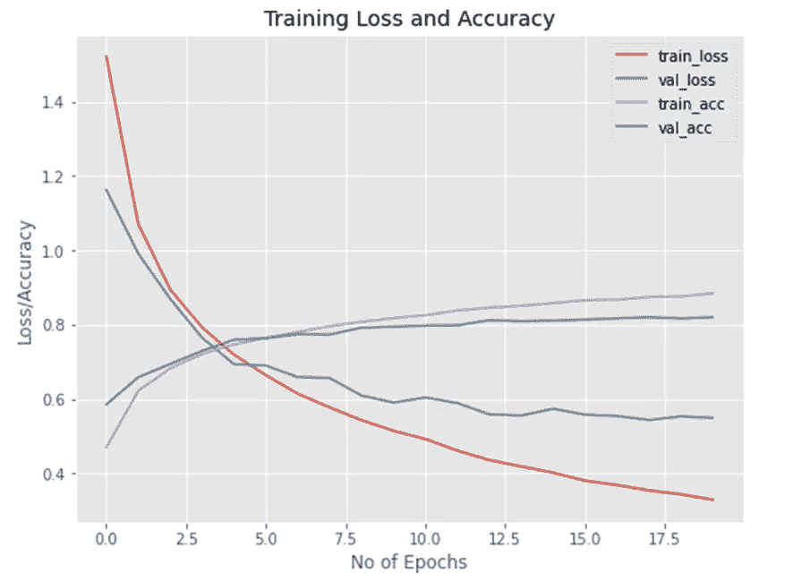

# 完整实现一个用于图像识别的迷你 VGG 网络

> 原文：[`towardsdatascience.com/complete-implementation-of-a-mini-vgg-network-for-image-recognition-849299480356`](https://towardsdatascience.com/complete-implementation-of-a-mini-vgg-network-for-image-recognition-849299480356)


照片由 [Guillaume de Germain](https://unsplash.com/@guillaumedegermain?utm_source=medium&utm_medium=referral) 提供，来源于 [Unsplash](https://unsplash.com/?utm_source=medium&utm_medium=referral)

## 用于更高效图像识别的深度卷积神经网络

[](https://rashida00.medium.com/?source=post_page-----849299480356--------------------------------)[](https://towardsdatascience.com/?source=post_page-----849299480356--------------------------------) [Rashida Nasrin Sucky](https://rashida00.medium.com/?source=post_page-----849299480356--------------------------------)

·发表于 [Towards Data Science](https://towardsdatascience.com/?source=post_page-----849299480356--------------------------------) ·7 分钟阅读·2023 年 2 月 27 日

--

VGG 网络是最流行的图像识别技术之一的基础。它值得学习，因为它打开了许多新的领域。要理解 VGGNet，你需要了解卷积神经网络（CNN）。如果你不熟悉 CNN 架构，请先阅读本教程：

[](/convolutional-neural-network-good-understanding-of-the-layers-and-an-image-classification-example-a280bc02c13e?source=post_page-----849299480356--------------------------------) ## 卷积神经网络：对层的良好理解及图像分类示例

### 内容丰富

towardsdatascience.com

在本文中，我们将只关注 VGGNet 的实现部分。因此，我们将在这里快速进行。

## 关于 VGG 网络

VGGNet 是一种可以更成功地提取特征的卷积神经网络（CNN）。在 VGGNet 中，我们堆叠了多个卷积层。VGGNet 可以是浅层的，也可以是深层的。在浅层 VGGNet 中，通常仅添加两组四个卷积层，如我们将很快看到的那样。而在深层 VGGNet 中，可以添加超过四个卷积层。两个常用的深层 VGGNet 是 VGG16，它总共使用 16 层，以及 VGG19，它总共使用 19 层。我们可以添加一个批量归一化层，也可以不添加。但在本教程中我将使用它。

你可以通过这个链接阅读更多关于架构的信息：

[](https://viso.ai/deep-learning/vgg-very-deep-convolutional-networks/?source=post_page-----849299480356--------------------------------) [## VGG 非常深的卷积网络 (VGGNet) - 你需要知道的 - viso.ai

### 我们使用 cookie 来提升您的浏览体验、提供个性化广告或内容，并分析我们的流量。通过…

viso.ai](https://viso.ai/deep-learning/vgg-very-deep-convolutional-networks/?source=post_page-----849299480356--------------------------------)

> **今天我们将研究 mini VGGNet。因此，它会更简单、更容易运行，但对于许多用例仍然很强大。**

miniVGGNet 的一个重要特点是**它使用所有的 3x3 滤波器**。这就是它能够如此出色地泛化的原因。让我们开始在 Keras 和 TensorFlow 中构建一个 mini VGGNet。

> 我使用了 Google Colaboratory 笔记本，并启用了 GPU。否则，训练速度非常慢。

## Mini VGG 网络开发、训练和评估

现在开始工作吧。我们将对其进行一些实验，以展示如何使用它。

这些是必要的导入：

```py
import tensorflow as tf
from keras.models import Sequential
from keras.layers.normalization import BatchNormalization
from keras.layers.convolutional import Conv2D
from keras.layers.convolutional import MaxPooling2D
from keras.layers.core import Activation
from keras.layers.core import Flatten
from keras.layers.core import Dropout
from keras.layers.core import Dense
from keras import backend as K
from sklearn.preprocessing import LabelBinarizer
from sklearn.metrics import classification_report
from keras.optimizers import SGD
from keras.datasets import cifar10
import matplotlib.pyplot as plt
import numpy as np
%matplotlib inline
```

这些导入文件真不少！

我们将使用**cifar-10 数据集**，这是一个在 TensorFlow 库中提供的公共数据集。

我使用了两个不同的网络作为实验。第一个是流行的。我之所以说流行，是因为我在[Kaggle](https://www.kaggle.com/code/akshat4112/minivggnet-from-scratch-on-cifar-10-with-bn)和其他一些教程中找到了这个[架构]。

```py
class MiniVGGNet:
 @staticmethod
 def build(width, height, depth, classes):
  # initialize the model along with the input shape to be
  # "channels last" and the channels dimension itself
  model = Sequential()
  inputShape = (height, width, depth)
  chanDim = -1

  if K.image_data_format() == "channels_first":
   inputShape = (depth, height, width)
   chanDim = 1

  # first CONV => Activation => CONV => Activation => POOL layer set
  model.add(Conv2D(32, (3, 3), padding="same",
   input_shape=inputShape))
  model.add(Activation("relu"))
  model.add(BatchNormalization(axis=chanDim))
  model.add(Conv2D(32, (3, 3), padding="same"))
  model.add(Activation("relu"))
  model.add(BatchNormalization(axis=chanDim))
  model.add(MaxPooling2D(pool_size=(2, 2)))
  model.add(Dropout(0.25))

  # second CONV => Activation => CONV => Activation => POOL layer set
  model.add(Conv2D(64, (3, 3), padding="same"))
  model.add(Activation("relu"))
  model.add(BatchNormalization(axis=chanDim))
  model.add(Conv2D(64, (3, 3), padding="same"))
  model.add(Activation("relu"))
  model.add(BatchNormalization(axis=chanDim))
  model.add(MaxPooling2D(pool_size=(2, 2)))
  model.add(Dropout(0.25))

  # Dense Layer
  model.add(Flatten())
  model.add(Dense(512))
  model.add(Activation("relu"))
  model.add(BatchNormalization())
  model.add(Dropout(0.5))

  # softmax classifier
  model.add(Dense(classes))
  model.add(Activation("softmax"))

  # return the constructed network architecture
  return model
```

让我们加载并准备我们的 cifar-10 数据集。

```py
(x_train, y_train), (x_test, y_test) = cifar10.load_data()
x_train = x_train.astype("float") / 255.0 
x_test = x_test.astype("float") / 255.0 
```

cifar-10 数据集有 10 个标签。这些是 cifar-10 数据集中的标签：

```py
labelNames = ["airplane", "automobile", "bird", "cat", "deer",
 "dog", "frog", "horse", "ship", "truck"]
```

使用 LabelBinarizer 将标签二值化：

```py
lb = LabelBinarizer()
y_train = lb.fit_transform(y_train)
y_test = lb.transform(y_test)
```

在这里编译模型。评估指标是“准确率”，我们将运行 10 个周期。

```py
optimizer = tf.keras.optimizers.legacy.SGD(learning_rate=0.01, decay=0.01/40, momentum=0.9,
                                           nesterov=True)
model = miniVGGNet.build(width = 32, height = 32, depth = 3, classes=10)
model.compile(loss='categorical_crossentropy', optimizer = optimizer,
              metrics=['accuracy'])
h = model.fit(x_train, y_train, validation_data=(x_test, y_test),
              batch_size = 64, epochs=10, verbose=1)
```

结果如下：

```py
Epoch 1/10
782/782 [==============================] - 424s 539ms/step - loss: 1.6196 - accuracy: 0.4592 - val_loss: 1.4083 - val_accuracy: 0.5159
Epoch 2/10
782/782 [==============================] - 430s 550ms/step - loss: 1.1437 - accuracy: 0.6039 - val_loss: 1.0213 - val_accuracy: 0.6505
Epoch 3/10
782/782 [==============================] - 430s 550ms/step - loss: 0.9634 - accuracy: 0.6618 - val_loss: 0.8495 - val_accuracy: 0.7013
Epoch 4/10
782/782 [==============================] - 427s 546ms/step - loss: 0.8532 - accuracy: 0.6998 - val_loss: 0.7881 - val_accuracy: 0.7215
Epoch 5/10
782/782 [==============================] - 425s 543ms/step - loss: 0.7773 - accuracy: 0.7280 - val_loss: 0.8064 - val_accuracy: 0.7228
Epoch 6/10
782/782 [==============================] - 421s 538ms/step - loss: 0.7240 - accuracy: 0.7451 - val_loss: 0.6757 - val_accuracy: 0.7619
Epoch 7/10
782/782 [==============================] - 420s 537ms/step - loss: 0.6843 - accuracy: 0.7579 - val_loss: 0.6564 - val_accuracy: 0.7715
Epoch 8/10
782/782 [==============================] - 420s 537ms/step - loss: 0.6405 - accuracy: 0.7743 - val_loss: 0.6833 - val_accuracy: 0.7706
Epoch 9/10
782/782 [==============================] - 422s 540ms/step - loss: 0.6114 - accuracy: 0.7828 - val_loss: 0.6188 - val_accuracy: 0.7848
Epoch 10/10
782/782 [==============================] - 421s 538ms/step - loss: 0.5799 - accuracy: 0.7946 - val_loss: 0.6166 - val_accuracy: 0.7898
```

经过 10 个周期后，训练数据的准确率为 79.46%，验证数据的准确率为 78.98%。

考虑到这一点，我想对这个网络做一些更改，看看结果如何。让我们重新定义上面的网络。我在整个网络中使用了 64 个滤波器，密集层中有 256 个神经元，最后一个 dropout 层中有 40%的 dropout。

这是新的 mini VGG 网络：

```py
class miniVGGNet:
  @staticmethod 

  def build(width, height, depth, classes):
    model = Sequential()
    inputShape = (height, width, depth)
    chanDim = -1 

    if K.image_data_format() == "channels_first":
      inputShape = (depth, height, width)
      chanDim = 1

    # first Conv => Activation => Conv => Activation => Pool layer set
    model.add(Conv2D(64, (3, 3), padding="same",
   input_shape=inputShape))
    model.add(Activation("relu"))
    model.add(BatchNormalization(axis=chanDim))
    model.add(Conv2D(64, (3, 3), padding="same"))
    model.add(Activation("relu"))
    model.add(BatchNormalization(axis=chanDim))
    model.add(MaxPooling2D(pool_size=(2, 2)))
    model.add(Dropout(0.25))

  # second Conv => Activation => Conv => Activation => Pool layer set
    model.add(Conv2D(64, (3, 3), padding="same"))
    model.add(Activation("relu"))
    model.add(BatchNormalization(axis=chanDim))
    model.add(Conv2D(64, (3, 3), padding="same"))
    model.add(Activation("relu"))
    model.add(BatchNormalization(axis=chanDim))
    model.add(MaxPooling2D(pool_size=(2, 2)))
    model.add(Dropout(0.25))

  # Dense Layer
    model.add(Flatten())
    model.add(Dense(300))
    model.add(Activation("relu"))
    model.add(BatchNormalization())
    model.add(Dropout(0.4))
    model.add(Dense(classes))
    model.add(Activation("softmax"))
    return model
```

我们将使用相同的优化参数和运行模型。但这里我使用了 20 个周期。

```py
optimizer = tf.keras.optimizers.legacy.SGD(learning_rate=0.01, decay=0.01/40, momentum=0.9,
                                           nesterov=True)
model = miniVGGNet.build(width = 32, height = 32, depth = 3, classes=10)
model.compile(loss='categorical_crossentropy', optimizer = optimizer,
              metrics=['accuracy'])
h = model.fit(x_train, y_train, validation_data=(x_test, y_test),
              batch_size = 64, epochs=20, verbose=1)
```

结果如下：

```py
Epoch 1/20
782/782 [==============================] - 22s 18ms/step - loss: 1.5210 - accuracy: 0.4697 - val_loss: 1.1626 - val_accuracy: 0.5854
Epoch 2/20
782/782 [==============================] - 14s 18ms/step - loss: 1.0706 - accuracy: 0.6219 - val_loss: 0.9913 - val_accuracy: 0.6586
Epoch 3/20
782/782 [==============================] - 14s 18ms/step - loss: 0.8947 - accuracy: 0.6826 - val_loss: 0.8697 - val_accuracy: 0.6941
Epoch 4/20
782/782 [==============================] - 14s 18ms/step - loss: 0.7926 - accuracy: 0.7208 - val_loss: 0.7649 - val_accuracy: 0.7294
Epoch 5/20
782/782 [==============================] - 14s 18ms/step - loss: 0.7192 - accuracy: 0.7470 - val_loss: 0.6937 - val_accuracy: 0.7593
Epoch 6/20
782/782 [==============================] - 13s 17ms/step - loss: 0.6641 - accuracy: 0.7640 - val_loss: 0.6899 - val_accuracy: 0.7639
Epoch 7/20
782/782 [==============================] - 13s 17ms/step - loss: 0.6141 - accuracy: 0.7805 - val_loss: 0.6589 - val_accuracy: 0.7742
Epoch 8/20
782/782 [==============================] - 13s 17ms/step - loss: 0.5774 - accuracy: 0.7960 - val_loss: 0.6565 - val_accuracy: 0.7734
Epoch 9/20
782/782 [==============================] - 14s 17ms/step - loss: 0.5430 - accuracy: 0.8077 - val_loss: 0.6092 - val_accuracy: 0.7921
Epoch 10/20
782/782 [==============================] - 14s 18ms/step - loss: 0.5145 - accuracy: 0.8177 - val_loss: 0.5904 - val_accuracy: 0.7944
Epoch 11/20
782/782 [==============================] - 13s 17ms/step - loss: 0.4922 - accuracy: 0.8256 - val_loss: 0.6041 - val_accuracy: 0.7975
Epoch 12/20
782/782 [==============================] - 14s 18ms/step - loss: 0.4614 - accuracy: 0.8381 - val_loss: 0.5889 - val_accuracy: 0.7981
Epoch 13/20
782/782 [==============================] - 14s 18ms/step - loss: 0.4358 - accuracy: 0.8457 - val_loss: 0.5590 - val_accuracy: 0.8120
Epoch 14/20
782/782 [==============================] - 13s 17ms/step - loss: 0.4186 - accuracy: 0.8508 - val_loss: 0.5555 - val_accuracy: 0.8092
Epoch 15/20
782/782 [==============================] - 13s 17ms/step - loss: 0.4019 - accuracy: 0.8582 - val_loss: 0.5739 - val_accuracy: 0.8108
Epoch 16/20
782/782 [==============================] - 14s 17ms/step - loss: 0.3804 - accuracy: 0.8658 - val_loss: 0.5577 - val_accuracy: 0.8136
Epoch 17/20
782/782 [==============================] - 13s 17ms/step - loss: 0.3687 - accuracy: 0.8672 - val_loss: 0.5544 - val_accuracy: 0.8170
Epoch 18/20
782/782 [==============================] - 13s 17ms/step - loss: 0.3541 - accuracy: 0.8744 - val_loss: 0.5435 - val_accuracy: 0.8199
Epoch 19/20
782/782 [==============================] - 13s 17ms/step - loss: 0.3438 - accuracy: 0.8758 - val_loss: 0.5533 - val_accuracy: 0.8167
Epoch 20/20
782/782 [==============================] - 13s 17ms/step - loss: 0.3292 - accuracy: 0.8845 - val_loss: 0.5491 - val_accuracy: 0.8199
```

如果你注意到，经过 10 个周期后，准确率略高于之前的网络，经过 20 个周期后准确率非常好。训练数据的准确率为 88.45%，验证数据的准确率为 81.99%。

在同一图表中展示训练和验证准确率以及训练和验证损失：

```py
%matplotlib inline
plt.close('all')
plt.style.use("ggplot")
plt.figure(figsize=(8, 6))
plt.plot(np.arange(0, 20), h.history["loss"], label="train_loss")
plt.plot(np.arange(0, 20), h.history["val_loss"], label="val_loss")
plt.plot(np.arange(0, 20), h.history["accuracy"], label="train_acc")
plt.plot(np.arange(0, 20), h.history["val_accuracy"], label="val_acc")
plt.title("Training Loss and Accuracy")
plt.xlabel("No of Epochs")
plt.ylabel("Loss/Accuracy")
plt.legend()
plt.show()
```



作者提供的图片

训练损失平稳下降，验证损失也有一些波动地下降。

## 结论

请随意进行实验。根据项目尝试不同的参数，看看效果如何。我们稍后将研究一个深度网络。

随时在 [Twitter](https://twitter.com/rashida048) 上关注我，并点赞我的 [Facebook](https://www.facebook.com/rashida.smith.161) 页面。

## 更多阅读

[OpenCV Python 中的简单边缘检测方法](https://towardsdatascience.com/easy-method-of-edge-detection-in-opencv-python-db26972deb2d?source=post_page-----849299480356--------------------------------) [## OpenCV Python 中的简单边缘检测方法

### 高效使用 Canny 边缘检测

[如何使用 OpenCV 进行阈值分割](https://towardsdatascience.com/how-to-perform-image-segmentation-with-thresholding-using-opencv-b2a78abb07ac?source=post_page-----849299480356--------------------------------) [## 如何使用 OpenCV 进行阈值分割

### 简单的、Otsu 和自适应阈值实现示例

[如何定义自定义层、激活函数和损失函数](https://towardsdatascience.com/how-to-define-custom-layer-activation-function-and-loss-function-in-tensorflow-bdd7e78eb67?source=post_page-----849299480356--------------------------------) [## 如何定义自定义层、激活函数和损失函数

### 逐步讲解和完整代码示例

[如何定义自定义层、激活函数和损失函数](https://towardsdatascience.com/how-to-define-custom-layer-activation-function-and-loss-function-in-tensorflow-bdd7e78eb67?source=post_page-----849299480356--------------------------------) [## 逐步教程：在 TensorFlow 中开发多输出模型

### 包含完整代码

[在 TensorFlow 中使用顺序 API 和函数 API 进行回归](https://towardsdatascience.com/a-step-by-step-tutorial-to-develop-a-multi-output-model-in-tensorflow-ec9f13e5979c?source=post_page-----849299480356--------------------------------) [## TensorFlow 中使用顺序 API 和函数 API 进行回归

### 展示几种不同类型的模型结构

[回归模型的 TensorFlow 实现](https://towardsdatascience.com/regression-in-tensorflow-using-both-sequential-and-function-apis-314e74b537ca?source=post_page-----849299480356--------------------------------)
