# 复利与指数分布

> 原文：[`towardsdatascience.com/compound-interest-and-the-exponential-distribution-402d5e7f446a`](https://towardsdatascience.com/compound-interest-and-the-exponential-distribution-402d5e7f446a)

## 你的抵押贷款是无记忆的，指数分布也是如此

 [Rohit Pandey](https://medium.com/@rohitpandey576?source=post_page-----402d5e7f446a--------------------------------)

·发表于 [Towards Data Science](https://towardsdatascience.com/?source=post_page-----402d5e7f446a--------------------------------) ·阅读时长 8 分钟·2023 年 5 月 24 日

--

使用开源许可证通过 midjourney 生成的图像。

# 欧拉数、指数分布与复利

在某些时刻会发生许多有趣的事件。例如，公交车到达公交站、高速公路上的事故、足球比赛中的进球。模拟这些时刻事件的过程称为“点过程”。这些过程中的一个重要考虑因素是从一个事件到下一个事件所需的时间。例如，假如你刚刚错过了一辆公交车，你还要等多久才能等到下一辆公交车？这个时间是一个随机变量，随机变量的选择决定了点过程。这个随机变量的一个选择是一些不是很随机的东西（确定性数字只是随机数字的一个特殊情况）。例如，公交车按时刻表到达，每 10 分钟一次。这可能听起来像是最简单的点过程，但还有更简单的情况。当事件之间的时间遵循指数分布时（这个过程叫做泊松过程），它就是一个简单的过程。它被称为指数分布是有原因的。它与欧拉数*e*和复利息有关。在这篇文章中，我们将探讨它们之间的联系。

# 复利

假设你在银行存入 1 美元。年利率为*x*。在年末，你的余额将是*(1+x)*。为了获得更多的钱，你要求银行每月支付利息而不是每年支付。由于利率为每年*x*，因此你在一个月内赚取的利息将是*x/12*。你会立即将这笔利息再投资。因此，在第二个月，你的投资变为*(1+x/12)*，这个数额再次按*(1+x/12)*增长，这意味着两个月后的金额是*(1+x/12)²*。重复 12 个月，你年末的余额将是*(1+x/12)¹²*。利用二项式定理，年末的新余额是：

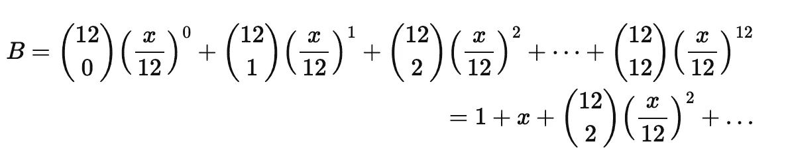

我们可以看到这比我们之前得到的*(1+x)*更多。这是有道理的，因为我们在几个月内获得了利息，利息被再投资并进一步赚取了利息。但是为什么只停留在*12* 个间隔呢？你希望尽可能频繁地进行复利。如果银行允许的话，每毫秒一次。我们将 12 个间隔推广到*n*个间隔，并使*n*非常大。在每个间隔后，我们的余额进一步增长*(1+x/n)^n*。在年末，我们将拥有的金额，

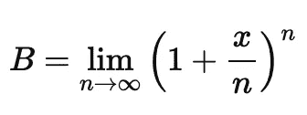

Eq (1)

使用二项式定理展开，

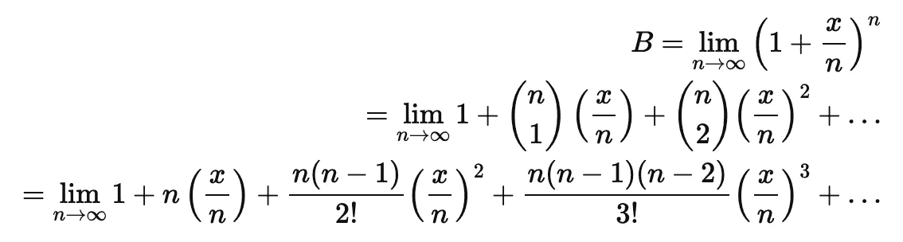

当*n*变得更大时，*n-1*、*n-2* 等几乎与*n*相同。因此，所有涉及*n*的项在分子和分母之间相互抵消（因为我们有*n→∞*），剩下的是：

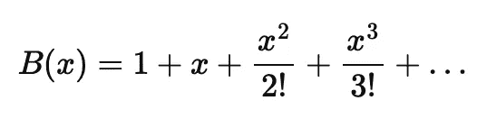

如果我们对*x*求导数，则会得到*B(x)*本身。如果我们将*x=1*代入，会得到一个非常特殊的数字。你能猜到是什么吗？从前两项很明显，这个数字大于*2*。

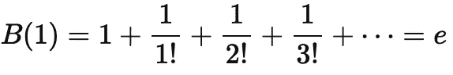

图像由中途生成，遵循开源许可证。

我们刚刚重新发现了著名的欧拉数，*e=2.71828..*。结果是，*B(x)=e^x*。这对我来说并不立即显而易见，但我们可以通过回到方程式 (1) 来看到这一点。

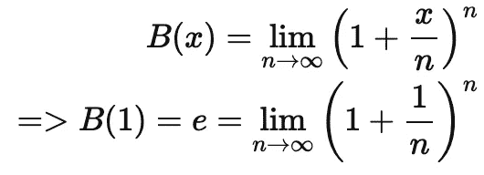

在第二个方程式中我们有*e*，但在第一个方程式中没有。括号内的*x/n* 项有点阻碍了这个。为了清理它，让我们通过定义变量来更改：

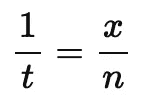

这将得到方程式 (1)：

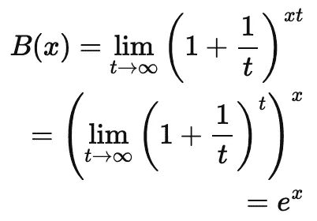

注意，像我们上面那样将*x*取出极限是允许的，适用于连续函数。

# 指数分布

所以这就是复利和数字*e*的动机。这一切与点过程和指数分布有什么关系？指数分布在连续时间内工作，并模拟直到某些事件（如车祸）的时间。

理解这一点的最好方法是考虑抛硬币的极限情况。

指数分布的声誉来自于它的无记忆性。事实上，它是唯一的连续无记忆分布。如果你在等待一个到达时间服从指数分布的公交车，那么已经等待了多久并不重要。

你需要等待的额外时间的分布是一样的，无论你刚到达还是已经等了十个小时。这一特性使得指数分布非常容易处理。

当我们将事物离散化时，更容易理解这一属性。与其在连续时间中等待公交车到来，不如想象每分钟抛一次硬币，等待看到正面。我们在看到第一个正面之前看到的反面次数是一个离散随机变量，因为它只能取非负整数值（与公交车到达时间不同，公交车到达时间可以是任何实数，如 3.4 分钟）。这种离散分布称为几何分布。

一个现实世界中的例子是赌场中的老虎机，赌徒不断玩直到赢得大奖。每次旋转都是独立的，这意味着几何分布也是无记忆的。当人们认为一台机器很久没有中奖，所以现在“该中奖了”，他们并没有考虑到过程的无记忆性质，从而陷入了“赌徒谬论”。

我们可以通过抛硬币来模拟机器的每个旋转。硬币正面朝上的概率是*p*。我们开始抛这枚硬币。我们没有看到正面的概率是多少呢？这意味着我们已经看到*k*次连续的反面。这个概率是：

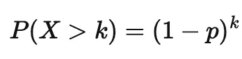

现在，我们要转到连续时间。因此，我们将连续的时间线划分为离散部分。硬币抛掷发生在每一个这些离散事件上。每个单位时间*t*被划分为一个大的离散部分数*d*。

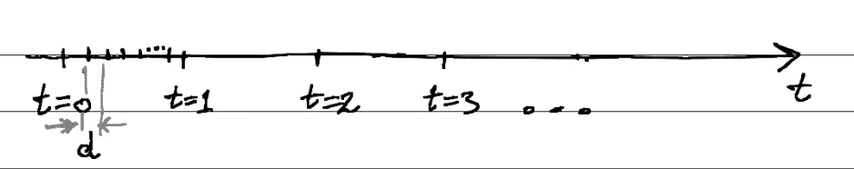

图：每个时间单位被划分为 d 个间隔，每个间隔的末尾抛一次硬币。

现在我们用*T*表示有趣事件（硬币正面朝上）发生的时间。为了得到*T*的分布，我们再次关注其生存函数，即*T*大于某个数*t*的概率。我们知道，在这个时间之前必须发生总共[t/d]次抛掷（其中[.]表示取整函数）。例如，如果*t=10*且每个时间单位被分成*3*部分，那么到那时已经发生了*[10/3] = [3.33] = 3*次抛掷。为了使这成为一个真正的连续时间过程，我们需要使*d*足够小，以至于消失。但随着我们使*d*变小，我们会发现抛掷次数增加。因此，我们的*p*也必须变小以进行补偿（否则，事件将变得非常频繁，以至于任何极小的时间间隔都会有许多事件发生）。因此，*p*和*d*变量必须同时趋近于*0*。利用上述离散情况的方程，得到时间*t*之前发生的抛掷次数以及我们的*p*和*d*变量必须趋近于*0*，我们得到*T*的生存函数：

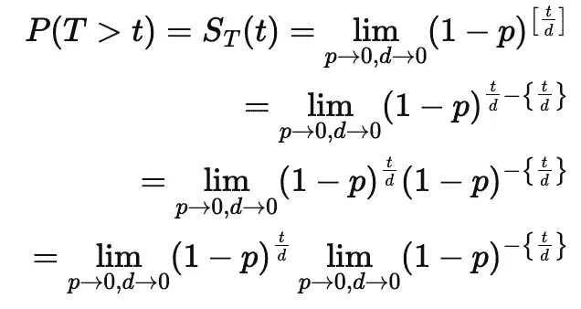

第二个极限就变成 1。

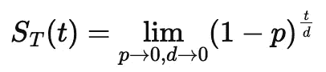

方程（3）

只有当*p*和*d*以线性关系同时减小到*0*时，这个极限才有趣。因为它们同时趋近于零，直线的截距必须为*0*。假设直线是：

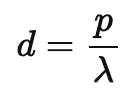

这是大多数人遇到麻烦的步骤。为什么突然出现这个方程？它从哪里来？如果我们问方程（3）中的双重极限等于什么，答案将是“这要看情况”。取决于*p*和*d*之间的关系。首先，我们知道*p*和*d*正在一起趋近于*0*。因此，它们之间的关系必须经过*(0,0)*。接下来，我们需要选择它们之间的函数形式。我们可以选择任何形式。但如果我们选择除线性关系以外的任何形式，我们会得到一个平凡的答案（例如任何*t*下的*0*或*1*），而得不到有趣的连续分布。

通过上述线性关系，方程（3）变为：

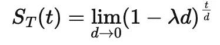

方程（3）

只有当*p*和*d*以线性关系同时减小到*0*时，这个极限才有趣。因为它们同时趋近于零，直线的截距必须为*0*。假设直线是：

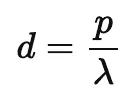

上述方程（3）变为：

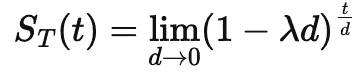

我们需要另一个替换，以使其与方程（1）对齐：

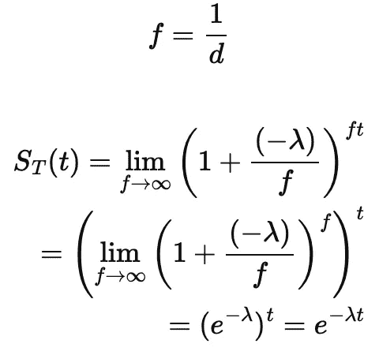

这是指数分布的生存函数。我们从几何分布出发，取极限并推导出指数分布，同时使用了复利的结果。
