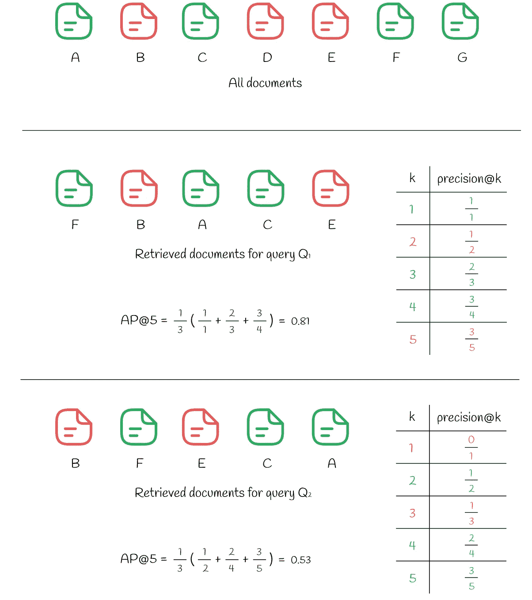
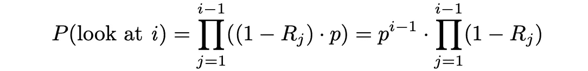

# 排名评估指标的综合指南

> 原文：[`towardsdatascience.com/comprehensive-guide-to-ranking-evaluation-metrics-7d10382c1025?source=collection_archive---------0-----------------------#2023-07-29`](https://towardsdatascience.com/comprehensive-guide-to-ranking-evaluation-metrics-7d10382c1025?source=collection_archive---------0-----------------------#2023-07-29)

## 探索丰富的指标选择，并找到适合你问题的最佳指标

 [Vyacheslav Efimov](https://medium.com/@slavahead?source=post_page-----7d10382c1025--------------------------------)

·

[关注](https://medium.com/m/signin?actionUrl=https%3A%2F%2Fmedium.com%2F_%2Fsubscribe%2Fuser%2Fc8a0ca9d85d8&operation=register&redirect=https%3A%2F%2Ftowardsdatascience.com%2Fcomprehensive-guide-to-ranking-evaluation-metrics-7d10382c1025&user=Vyacheslav+Efimov&userId=c8a0ca9d85d8&source=post_page-c8a0ca9d85d8----7d10382c1025---------------------post_header-----------) 发表在 [Towards Data Science](https://towardsdatascience.com/?source=post_page-----7d10382c1025--------------------------------) · 13 分钟阅读 · 2023 年 7 月 29 日 

--

# 介绍

排名是机器学习中的一个问题，其目标是以最合适的方式对文档列表进行排序，以便最相关的文档出现在顶部。排名出现在数据科学的多个领域，从推荐系统开始，在这些系统中，算法建议一组购买项目，直到 NLP 搜索引擎，通过给定的查询，系统尝试返回最相关的搜索结果。

自然产生的问题是如何评估排名算法的质量。与经典的机器学习一样，并不存在适用于任何类型任务的单一通用指标。为什么？原因很简单，因为每种指标都有其适用范围，这取决于特定问题的性质和数据特征。

这就是为什么了解所有主要指标对于成功解决任何机器学习问题至关重要。正是我们将在本文中做到的。

然而，在继续之前，让我们了解为什么某些流行指标通常不应被用于排名评估。通过考虑这些信息，将更容易理解其他更复杂指标存在的必要性。

*注意*。本文及使用的公式基于[Ilya Markov 的离线评估演示](https://drive.google.com/drive/folders/19OfEsLME1IR7bGPzVo8Dh31emcPNiaP_)。

# 指标

我们将在本文中讨论几种信息检索指标：

不同类型的指标

# 未排序的指标

设想一个推荐系统预测电影评分并向用户展示最相关的电影。评分通常表示一个正的实数。乍看之下，像*MSE*（*RMSE，MAE*等）这样的回归指标似乎是评估系统在保留数据集上的质量的合理选择。

*MSE*考虑了所有预测的电影，并测量真实标签与预测标签之间的平均平方误差。然而，最终用户通常只对显示在网站首页的前几项结果感兴趣。这表明，他们对搜索结果末尾的低评分电影并不真正感兴趣，这些电影在标准回归指标下也被同等估计。

下面的简单示例演示了一对搜索结果，并测量每个结果中的*MSE*值。

对两个查询的错误估计表明 MSE 是排名的糟糕指标。绿色文档是相关的，而红色文档是不相关的。文档列表按预测相关性排序（从左到右）。

尽管第二个搜索结果的*MSE*较低，但用户不会对这样的推荐感到满意。首先查看非相关项时，用户必须向下滚动才能找到第一个相关项。因此，从用户体验的角度来看，第一个搜索结果要好得多：用户对顶部的项感到满意，并继续使用，而不关心其他项。

相同的逻辑也适用于分类指标（*精确度*，*召回率*），这些指标也会考虑所有项目。

精确度和召回率公式

所有描述的指标有什么共同点？它们都平等对待所有项，并且不考虑高相关和低相关结果之间的差异。这就是为什么它们被称为**未排序**的原因。

通过上述两个相似的问题示例，我们在设计排名指标时需要关注的方面似乎更加明确：

> 一个排名指标应该对更相关的结果给予更高的权重，同时降低或忽略不太相关的结果。

# 排名指标

## Kendall Tau 距离

[Kendall Tau 距离](https://en.wikipedia.org/wiki/Kendall_tau_distance#:~:text=The%20Kendall%20tau%20rank%20distance,dissimilar%20the%20two%20lists%20are.) 基于排名逆序对的数量。

> **逆序对**是指文档 (i, j) 的一对，其中文档 i 的相关性大于文档 j，但在搜索结果中出现在 j 之后。

Kendall Tau 距离计算排名中的所有逆序对。逆序对越少，搜索结果越好。尽管该指标看起来合乎逻辑，但它仍然有一个缺点，这在下面的示例中有所展示。

尽管逆序对的数量较少，但从用户的角度来看，第二个排名仍然更差

似乎第二个搜索结果只有 8 个逆序对，比第一个结果的 9 个要好。类似于上面的*MSE*示例，用户只对第一个相关结果感兴趣。在第二种情况下经过几个不相关的搜索结果，用户体验会比第一种情况更差。

## Precision@k & Recall@k

与通常的*精确度*和*召回率*不同，我们可以考虑仅关注某个数量的前* k *个推荐项。这样，指标就不关心低排名的结果。根据所选的 *k* 值，相应的指标被称为*precision@k*（*“k 时的精确度”*）和*recall@k*（*“k 时的召回率”*）。它们的公式如下所示。

precision@k 和 recall@k 的公式

想象一下，前* k *个结果显示给用户，其中每个结果可能相关也可能不相关。*precision@k* 衡量前 *k* 个结果中相关结果的百分比。同时，*recall@k* 评估前 *k* 个相关结果占整个数据集中相关项总数的比例。

为了更好地理解这些指标的计算过程，让我们参考下面的示例。

precision@k 和 recall@k 计算示例。绿色文档表示相关项，而红色文档表示不相关项。

系统中有 7 个文档（命名为 *A* 到 *G*）。根据其预测，算法从中选择 *k = 5* 个文档给用户。如我们所见，前 *k = 5* 中有 3 个相关文档 *(A, C, G)*，这导致 *precision@5* 等于 *3 / 5*。同时，*recall@5* 考虑了整个数据集中相关项目的数量：其中有 4 个 *(A, C, F* 和 *G)*，使得 *recall@5 = 3 / 4*。

*recall@k* 随着 *k* 的增长总是增加，这使得该指标在某些情况下不完全客观。在边缘情况下，当系统中的所有项目都显示给用户时，*recall@k* 的值等于 100%。*precision@k* 不具备与 *recall@k* 相同的单调性，因为它衡量的是与前 *k* 个结果相关的排名质量，而不是整个系统中相关项目的数量。客观性是 *precision@k* 通常被实际应用中优于 *recall@k* 的原因之一。

## AP@k (平均精度) & MAP@k (均值平均精度)

普通的 *precision@k* 问题在于它没有考虑相关项在检索文档中的出现顺序。例如，如果检索到 10 个文档，其中 2 个是相关的，*precision@10* 将始终相同，尽管这 2 个文档在 10 个文档中的位置不同。例如，如果相关项位于位置 *(1, 2)* 或 *(9, 10)*，该指标会区分这两种情况，结果 *precision@10* 为 0.2。

然而，在实际应用中，系统应该对排名靠前的相关文档给予更高的权重，而不是排名靠后的。这一问题通过另一种指标 ***平均精度*** *(****AP****)* 得以解决。与普通 *precision* 相同，*AP* 的取值范围在 0 和 1 之间。

平均精度公式

*AP@k* 计算从 1 到 *k* 所有值的 *precision@i* 的平均值，其中第 *i* 个文档是相关的。

对两个查询计算的平均精度

在上图中，我们可以看到相同的 7 个文档。对查询 *Q₁* 的响应产生了 *k* = 5 个检索文档，其中 3 个相关文档位于索引 *(1, 3, 4)*。对每个位置 *i*，计算 *precision@i*：

+   *precision@1 = 1 / 1*

+   *precision@3 = 2 / 3*

+   *precision@4 = 3 / 4*

所有其他不匹配的索引 *i* 被忽略。*AP@5* 的最终值是以上精度的平均值：

+   *AP@5 = (precision@1 + precision@3 + precision@4) / 3 = 0.81*

为了比较，让我们看看对另一个查询 *Q₂* 的响应，该查询在前 *k* 个结果中也包含 3 个相关文档。然而，这次，2 个不相关的文档位于比前一个情况更高的位置（在位置 *(1, 3)*)，这导致 *AP@5* 较低，为 0.53。

有时需要评估算法在多个查询上的质量，而不是单个查询。为此，使用了**均值平均精度（*MAP*）**。它简单地取多个查询 *Q* 中 *AP* 的平均值：

平均精度公式

以下示例展示了如何计算针对 3 个不同查询的*MAP*：

计算三个查询的 AP 和 MAP

## RR（倒数排名）和 MRR（均值倒数排名）

有时用户只对第一个相关结果感兴趣。倒数排名是一种度量，返回一个介于 0 和 1 之间的数字，指示第一个相关结果距离顶部的远近：如果文档位于位置 *k*，则*RR*的值为 *1 / k*。

与*AP*和*MAP*类似，***均值倒数排名 (MRR)*** 衡量多个查询中的平均*RR*。

RR 和 MRR 公式

以下示例展示了如何计算 3 个查询的*RR*和*MRR*：

三个查询计算出的 RR 和 MRR

# 用户导向的度量

尽管排名度量考虑了项的排名位置，因此相对于未排名的度量更为优选，但它们仍然有一个显著的缺点：没有考虑用户行为的信息。

以用户为导向的方法对用户行为做出特定假设，并基于这些假设生成更适合排序问题的度量。

## DCG（折扣累积增益）和 nDCG（归一化折扣累积增益）

DCG 度量的使用基于以下假设：

> 高度相关的文档在搜索引擎结果列表中越早出现（排名越高）就越有用 — [维基百科](https://en.wikipedia.org/wiki/Discounted_cumulative_gain)

这一假设自然表示用户如何评估较高的搜索结果，与较低的结果相比。

在*DCG*中，每个文档都被分配一个增益值，表示特定文档的相关性。对于每个项，给定真实的相关性 *Rᵢ*（实际值），存在几种定义增益的方法。其中一种最流行的方法是：

DCG 中可能的增益公式

基本上，指数对相关项施加了强烈的强调。例如，如果给电影的评分在 0 到 5 之间，那么每部电影的相应评分将大约具有双倍的重要性，相比于评分减少 1 的电影：

相关性的增益函数

除此之外，根据排名位置，每个项会接收一个折扣值：项的排名位置越高，对应的折扣就越高。折扣作为一种惩罚，通过按比例减少项的增益。在实际应用中，折扣通常选择作为排名指数的对数函数：

DCG 中的折扣公式

排名位置的折扣函数

最后，*DCG@k* 定义为前 k 个检索项的增益与折扣之和：

一般的 DCG 公式

将 *gainᵢ* 和 *discountᵢ* 替换为上述公式后，表达式变为以下形式：

DCG 公式

为了使 *DCG* 指标更具可解释性，它通常通过完美排名时的 *DCGₘₐₓ* 最大可能值进行归一化，其中所有项按照其相关性被正确排序。结果的指标称为 *nDCG*，其值介于 0 和 1 之间。

nDCG 公式

下图展示了 5 个文档的 *DCG* 和 *nDCG* 计算示例。

对一组检索文档计算的 DCG 和 nDCG

## RBP（排名偏倚精度）

在 *RBP* 工作流中，用户并不打算检查所有可能的项。相反，他或她以概率 *p* 从一个文档顺序地移动到另一个文档，并以相反的概率 *1 — p* 在当前文档处终止搜索程序。每次终止决策都是独立的，不依赖于搜索的深度。根据所做的研究，这种用户行为在许多实验中被观察到。根据 [Rank-Biased Precision for Measurement of Retrieval Effectiveness](https://people.eng.unimelb.edu.au/jzobel/fulltext/acmtois08.pdf) 中的信息，工作流可以在下图中说明。

> 参数 p 被称为 **持久性**。

RBP 模型工作流

在这一范式中，用户总是查看第 *1* 个文档，然后以概率 *p* 查看第 *2* 个文档，以概率 *p²* 查看第 *3* 个文档，依此类推。最终，查看文档 *i* 的概率变为：

用户只有在文档 *i* 已经被查看并且搜索程序立即以概率 *1 — p* 终止时才会检查文档 *i*。

之后，可以估算期望的已查看文档数量。由于 *0 ≤ p ≤ 1*，下列级数是收敛的，表达式可以转化为以下格式：

同样，给定每个文档的相关性 *Rᵢ*，我们可以找到预期的文档相关性。更高的预期相关性值表示用户对他或她决定查看的文档会更满意。

最后，*RPB* 计算为期望文档相关性（效用）与期望检查文档数量的比率：

*RPB* 公式确保其值在 0 和 1 之间。通常，相关性分数是二值型（如果文档相关则为 1，否则为 0），但也可以取 0 到 1 之间的实际值。

应根据用户在系统中的持久性来选择适当的 *p* 值。较小的 *p* 值（小于 0.5）更强调排名靠前的文档。较大的 *p* 值则减少了对前几个位置的权重，并将其分配到较低的位置。有时可能很难找到一个好的持久性 *p* 值，因此最好进行几次实验并选择效果最佳的 *p*。

## ERR（期望倒数排名）

正如名称所示，这一指标测量了许多查询的平均倒数排名。

该模型类似于 *RPB*，但有一点不同：如果当前项目对用户是相关的（*Rᵢ*），则搜索过程结束。否则，如果项目不相关（*1 — Rᵢ*），则用户以概率 *p* 决定是否继续搜索过程。如果是，则搜索继续到下一个项目。否则，用户结束搜索过程。

ERR 模型工作流程

根据 [Ilya Markov 的离线评估演示](https://drive.google.com/drive/folders/19OfEsLME1IR7bGPzVo8Dh31emcPNiaP_)，我们来找出 *ERR* 计算的公式。

首先，让我们计算用户查看文档 i 的概率。基本上，这意味着所有 *i — 1* 个之前的文档都不相关，并且在每次迭代中，用户以概率 p 继续查看下一个项目：

如果用户停在文档 *i* 上，这意味着该文档已经被查看，并且以概率 *Rᵢ*，用户决定终止搜索过程。与此事件相对应的概率实际上与倒数排名相同，即 *1 / i*。

从现在开始，简单地使用期望值公式，可以估计期望的倒数排名：

> 参数 p 通常选择接近 1。

与 *RBP* 的情况一样，*Rᵢ* 的值可以是二值的，也可以是 0 到 1 之间的实际值。下面的图示例演示了 *ERR* 计算的一个例子，涉及一组 6 个文档。

ERR 计算。左侧和右侧分别显示了最佳和最差的可能排名。为简化起见，参数 p 选择为 1。

左侧，所有检索到的文档按相关性降序排列，得出最佳的*ERR*。与右侧情况相反，文档按相关性升序排列，导致最差的*ERR*。

ERR 公式假设所有相关性分数的范围是 0 到 1。如果初始相关性分数超出这个范围，则需要进行归一化。最常见的做法之一是通过指数归一化：

# 结论

我们讨论了信息检索中用于质量评估的所有主要指标。用户导向的指标更常使用，因为它们反映了真实用户行为。此外，*nDCG*、*BPR*和*ERR*指标相对于我们迄今为止看到的其他指标具有优势：它们能够处理多个相关性级别，使其更具通用性，而像*AP*、*MAP*或*MRR*这样的指标仅适用于二元相关性级别。

不幸的是，所有这些描述的指标要么是不连续的，要么是平坦的，使得在问题点的梯度为 0 或甚至未定义。因此，大多数排名算法难以直接优化这些指标。然而，许多研究已经在这一领域展开，许多先进的启发式方法已经出现在最流行的排名算法的背后，以解决这个问题。

# 资源

+   [肯德尔τ距离 | 维基百科](https://en.wikipedia.org/wiki/Kendall_tau_distance#:~:text=The%20Kendall%20tau%20rank%20distance,dissimilar%20the%20two%20lists%20are.)

+   [排名偏差精度测量检索效果](https://people.eng.unimelb.edu.au/jzobel/fulltext/acmtois08.pdf)

+   [折扣累积增益 | 维基百科](https://en.wikipedia.org/wiki/Discounted_cumulative_gain)

+   [排名偏差精度的不确定性](https://staff.cdms.westernsydney.edu.au/~lapark/publications/laparkRBP2016.pdf)

+   [信息检索，离线评估 | 伊利亚·马尔科夫](https://drive.google.com/drive/folders/19OfEsLME1IR7bGPzVo8Dh31emcPNiaP_)

*除非另有说明，所有图像均为作者所作。*
