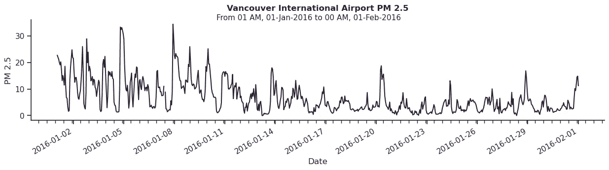

# 综合时间序列探索性分析

> 原文：[`towardsdatascience.com/comprehensive-time-series-exploratory-analysis-78bf40d16083`](https://towardsdatascience.com/comprehensive-time-series-exploratory-analysis-78bf40d16083)

## 深入分析空气质量数据

 [Erich Silva](https://medium.com/@erich.hs?source=post_page-----78bf40d16083--------------------------------)

·发表于[Towards Data Science](https://towardsdatascience.com/?source=post_page-----78bf40d16083--------------------------------) ·阅读时间 18 分钟·2023 年 11 月 25 日

--

由[Jason Blackeye](https://unsplash.com/@jeisblack?utm_source=unsplash&utm_medium=referral&utm_content=creditCopyText)拍摄的照片，刊登在[Unsplash](https://unsplash.com/collections/55366/my-first-collection/981603704225affe48a9007fc5094d84?utm_source=unsplash&utm_medium=referral&utm_content=creditCopyText)

你面临一个按时间戳索引的数据集。你的数据可能涉及存储需求和供应，你的任务是预测一个战略产品的理想补货间隔。或者你需要将历史销售信息转化为团队的关键行动洞察。也许你的数据是财务数据，包括历史利率和一系列股票价格。也许你需要建模市场波动性，并量化投资期限内的货币风险。从社会科学和能源分配到医疗保健和环境研究，例子数不胜数。但这些场景有什么共同点？第一，你有一个时间序列任务。第二，你肯定会从开始时进行**简明而全面的探索性分析**中受益。

## 目录

+   本文的目标

+   数据集描述

+   库和依赖

+   开始使用

+   全局视角

+   详细视图

+   缺失值

+   间歇性

+   季节性

+   皮尔逊相关

+   平稳性

+   一阶差分

+   自相关

+   参考文献

## 本文的目标

但进行**探索性时间序列分析**意味着什么呢？与其他数据科学问题不同，从时间序列数据中获取见解可能是棘手的，一切都不是简单的。你的数据可能具有重要的潜在趋势和季节性，或适合于其复杂的周期模式中的嵌套预测。区分由于数据生成过程中的失败造成的异常离群值与实际的异常情况（它们包含关键信息）可能是具有挑战性的。处理缺失值也可能不像你预期的那么简单。

本文将概述一个在研究时间序列数据集时对我有效的过程。你将跟随我探索细颗粒物的测量值，即 PM 2.5，它是空气污染和空气质量指数的主要来源之一。我将专注于制定一些最佳实践，特别注意细节，以生成清晰且高度信息化的可视化和统计摘要。

## 数据集描述

这里研究的数据来自加拿大不列颠哥伦比亚省温哥华市的四个监测站。它们包含从 2016 年 1 月 1 日到 2022 年 7 月 3 日的 PM 2.5（直径为 2.5 微米及以下的细颗粒）的一小时平均测量值，单位为 µg/m3（每立方米微克）。

PM 2.5 主要来自燃烧化石燃料，在城市中，通常源自汽车交通和建筑工地。另一个主要的污染源是森林和草地火灾，它们很容易被风吹走 [1]。

下图显示了我们将要探索的站点的大致位置。

**图 1.** 温哥华地图及空气监测站。作者在 Google Maps 中定制的地图。

数据集来自 [British Columbia Data Catalogue](https://catalogue.data.gov.bc.ca/)，根据发布者的说法，它尚未经过质量保证 [5]。对于你将在这里看到的版本，我已经处理了一些小问题，例如将负值测量（仅 6 个观察值中的 57k）标记为缺失值，并生成了一个包含我们选择的站点的主 DataFrame。

## 库和依赖

我们将使用 Python 3.9 以及绘图库 [Matplotlib](https://matplotlib.org/) 和 [Seaborn](https://seaborn.pydata.org/) 来进行可视化。对于统计测试和数据探索，我们将使用 [statsmodels](https://www.statsmodels.org/stable/index.html) Python 模块和 [SciPy](https://scipy.org/) 库。所有的数据处理和辅助任务将使用 [Pandas](https://pandas.pydata.org/) 和 [Numpy](https://numpy.org/) 处理。

这些软件包在流行的 Python 发行版和托管的笔记本中原生提供，如 Anaconda 和 Miniconda、Google Colab 或 Kaggle Notebooks。因此，本文中的每个代码示例都应该在你选择的环境中轻松复现。

## 开始使用

从导入我们的库开始，我们将调用`matplotlib.dates.mdates`和`datetime`模块来帮助我们处理 DateTime 索引。为了生成一致的可视化，我还喜欢先定义我们的图表样式和颜色调色板。那么让我们开始吧。

**图 2.** Seaborn “mako” 颜色调色板。图片由作者提供。

在读取.csv 文件后，我们将定义时间戳`DATE_PS`为 NumPy 的`datetime64`对象，并将其设为我们的 DataFrame 索引。这一步将启用一些 Pandas 时间序列功能，例如下文中用于在数据集中创建日期部分特征的功能。

**图 3.** 带有日期部分特征的主 DataFrame 切片。图片由作者提供。

## 全景视图

这里是我们将深入探讨的广阔视图——这是我们花一些时间初步了解数据的地方。

对于这个可视化，我们将使用 Seaborn 的关系图，它将从我们 DataFrame 的聚合长格式中读取。为此，我们将使用 Pandas 的`melt`和`resample`方法，并在 24 小时间隔内进行均值聚合。这将把数据粒度从每小时减少到每日平均测量值，从而减少生成图表所需的时间。

**图 4.** 监测站 PM 2.5 时间序列图。图片由作者提供。

通过在整个时间序列跨度内清晰地了解所有四个车站的数据，我们已经可以开始做一些记录：

+   存在一些主要的异常情况，它们似乎在夏季和初秋期间较为普遍。

+   这些异常似乎是由于大规模事件引起的，因为它们影响了所有四个车站，且大致发生在相同的时间段内。

+   如果仔细观察，**我在每个图表中都包含了一张淡灰色的散点图，显示了所有车站的数据**。通过这个细微的细节，可以看到例如 2017 年的异常在北温哥华的两个车站产生了重大影响（它们的 PM 2.5 值更高），而 2018 年的情况则相反。这种技术还确保所有四个折线图都在相同的 Y 轴范围内。

从第一个图表中可以汲取一些好的实践：

+   Matplotlib 允许高度自定义的轴刻度定位器和格式化器。在这个例子中，我使用了`mdates`模块中的`MonthLocator`来创建 X 轴上的**小月定位器**，这有助于整体可读性。

+   我们的图表标题或副标题中传递了从图表中预期的准确日期范围。之所以用“预期”是因为我们的可视化可能由于绘图周期两端的缺失值而被截断，这种做法可以帮助识别这些问题。这也是一个好的文档实践，记录你的发现。

很好的开始，但让我们稍微缩小视图。在下一节中，我们将查看较短的时间段，但现在保持原有的每小时粒度。

## 详细视图

从现在开始，我们将开始定义一些可以快速调用以生成定制可视化的函数。你可以将其视为建立一个*分析工具集*，这将在未来非常有帮助。

第一个函数将帮助我们查看特定时间段内的单独时间序列。我们将从查看 2017 年的北温哥华马洪公园站开始。

**图 5.** 2017 年北温哥华马洪公园 PM 2.5 图。图像由作者提供。

我们可以看到，除了主要异常外，还有局部较小的波动。在 2017 年年初和 12 月，也有较高波动性（在短时间内方差增加）的时期。

让我们进一步深入，查看异常范围之外的情况，以便在 Y 轴上分析我们在更窄范围内的值。

**图 6.** 2017 年 4 月 15 日至 7 月 1 日的北温哥华马洪公园 PM 2.5 图。图像由作者提供。

我们可以看到这里有一些缺失值。我们函数的`fill=True`参数有助于识别这些缺失值，并且是给数据中缺失情况提供视觉重点的好方法。这些最初难以察觉的小中断现在变得非常明显。

另一个你可能注意到的细节是 X 轴的自定义日期格式。对于上面的图，我增强了我们的`plot_sequence()`函数，添加了自定义的主要和次要定位器及格式化程序。这个新功能现在使我们的图表适应可视化的时间跨度，并相应地格式化 X 轴。下面是包含在函数中的代码片段。

现在我们知道我们的数据集有中断，所以让我们更好地查看一下。

## 缺失值

对于表格数据问题，在本节中，我们可能会专注于将 MAR（随机缺失）与 MNAR（非随机缺失）区分开来。相反，了解我们数据的性质（传感器时间测量），我们知道数据流中的中断可能不是有意的。因此，在这些情况下，区分孤立的缺失值与连续缺失值，以及完全缺失样本中的缺失值是更重要的。这里的可能性很广泛，如果你想了解更多，我专门撰写了一篇文章：

 ## 时间序列中的缺口处理

### 短序列和长序列插补的缺失分析和评估方法

towardsdatascience.com

现在，我们先从查看**缺失值热图**开始。我们将为此定义一个函数。

**图 7.** 缺失值热图。图片由作者提供。

热图很有用，因为它们允许我们量化缺失情况并**在时间轴上本地化它们**。从这里，我们可以标记：

+   我们没有完全缺失的样本（缺失值在一个时间段内同时出现）。这是可以预期的，因为来自监测站的数据流是独立的。

+   在时间轴的早期有很长的缺失值序列，随着时间的推移，数据的可用性似乎有所改善。

在后续部分的一些统计分析中，缺失值会带来问题。因此，我们将使用简单的技术来处理这些缺失值，比如：

+   Pandas `ffill()` 和 `bfill()` 方法。它们分别用于向前或向后填充最近的可用值。

+   使用 Pandas `interpolate()` 方法进行线性或样条插值。它利用相邻观察值绘制曲线来填充缺失的区间。

## 间歇性

根据我们数据的特性，我们不应期望出现负值。如开头所述，我在数据预处理时将其视为缺失值。让我们调用汇总统计来确认这一点。

**图 8.** 汇总统计。图片由作者提供。

我们看到每个站点的最小测量值为零，这引出了下一个问题。**我们的时间序列是否间歇性**？

当数据中有大量值恰好为零时，这种现象被称为间歇性。这种行为带来了特定的挑战，必须在模型选择过程中加以考虑。那么，我们的数据中零值出现的频率有多高呢？

**图 9.** 零值计数。图片由作者提供。

我们可以看到零值的数量可以忽略不计，因此我们没有间歇性序列。这是一个简单但至关重要的检查，特别是如果你的目标是预测的话。对于某些模型来说，预测绝对零可能比较困难，例如，如果你想预测需求，这可能会成为一个问题。你不想计划向你的客户交付三件产品，如果实际上他什么都不期望的话。

## 季节性

了解时间序列中的周期对规划建模阶段至关重要。如果你决定过度聚合数据，你可能会丢失较小周期的关键信息，或者这可以帮助你确定在更小粒度下进行预测的可行性。

我们将使用一些箱线图来开始查看这些数据。但首先，我们会暂时移除前 5%的百分位数，以便以更好的尺度查看数据。

在下一个函数中，我们将使用一系列箱线图来调查数据中的周期。我们还将把我们的颜色调色板映射到中位数值，以便作为另一个精美的视觉提示。

**图 10.** PM 2.5 每小时值。图片由作者提供。

这个初步图表返回每小时的测量值。这里我们可以看到：

+   从早上 9 点到下午 2 点，PM 2.5 值 consistently higher。

+   北温哥华以外的站点也在晚上 8 点到 10 点出现峰值。

+   早晨 2 点到 5 点的 PM 2.5 值最低。

现在查看周季节性以及一周内的值差异。

**图 11**。PM 2.5 每日值。图片由作者提供。

从这里我们可以看到：

+   周末的 PM 2.5 值较低。

+   星期二污染水平有略微上升的趋势。

最后，查看月度趋势。

**图 12**。PM 2.5 月度值。图片由作者提供。

我们可以观察到：

+   所有年份中 8 月的 PM 2.5 值 consistently higher。

+   南部站点在 6 月和 7 月的 PM 2.5 值较低，而北温哥华的站点在 1 月显示出较低的测量值。

最后，从这些图表中得出的更多良好实践：

+   不要简单使用你的颜色调色板，因为它们可能会误导你得出相同的解释。如果我们只是将`pallette=”mako”`传递给我们的箱线图，它会映射到 X 轴，而不是我们感兴趣的变量。

+   网格图是低维数据的强大信息容器，可以通过 Seaborn 的`relplot()`或 Matplotlib 的`subplots()`快速设置。

+   你可以利用 Seaborn 的`boxplot()` `order`参数来重新排序你的 X 轴。我用它重新排列了周几的 X 标签，使之有意义。

更详细的季节性视图可以通过我们时间序列的趋势-季节分解获得。然而，这将留到未来的文章中，我们可以更深入地探讨时间序列相似性和模型选择。如果你对此感兴趣，**确保关注我在 Medium 上的未来出版物**。

现在，让我们快速查看我们熟知的统计系数，以调查四个站点之间的**线性关系**。

## Pearson 相关

R 程序员可能对以下图表很熟悉。一个**相关图**是一种简洁且信息丰富的可视化，已在多个 R 库中实现，例如`GGally`包中的`ggpairs()`。相关图的上对角线显示了双变量相关性，即我们数据中数值变量之间的 Pearson 相关系数。在下对角线中，我们可以看到带有回归曲线的散点图。最后，在主对角线上，我们展示了每个变量的直方图和密度曲线。

以下代码是使用 Seaborn `PairGrid()`图表的改编实现，并且是我们分析工具集中的另一个函数。

**图 13**。所有四个站点的 PM 2.5 相关图。图片由作者提供。

正如预期的那样，我们的站点高度相关，尤其是那些彼此更近的站点，例如北温哥华的两个站点。

重要的是要注意，为了减轻计算时间，我们的数据被聚合成 6 小时的时间段。如果你在这个图上尝试更大的聚合时间段，你会看到相关系数的增加，因为均值聚合往往会平滑数据中的异常值。

如果你已经了解了时间序列分析，你现在可能会考虑其他值得检查的相关性。但首先，我们需要测试我们的时间序列是否**平稳**。

## 平稳性

平稳时间序列是指其统计特性随时间不变。换句话说，它具有一个恒定的均值、方差和自相关性，与时间无关[4]。

**多个预测模型依赖于时间序列平稳性**，因此在这一探索阶段测试其平稳性至关重要。我们的下一个函数将利用 statsmodels 实现的两个常用平稳性测试，即*Augmented Dickey-Fuller*（"ADF"）测试和*Kwiatkowski-Phillips-Schmidt-Shin*（"KPSS"）测试。

我将把两个测试的假设列在下面。请注意，它们有相反的原假设，因此我们将创建一个“决策”列，以便于解释它们的结果。你可以在[statsmodels 文档](https://www.statsmodels.org/dev/examples/notebooks/generated/stationarity_detrending_adf_kpss.html)中了解更多关于这两个测试的信息。

> **Augmented Dickey-Fuller (ADF)** 测试假设：
> 
> • **H0**: 时间序列样本中存在单位根 (**非平稳**)
> 
> • **Ha**: 时间序列样本中不存在单位根 (**平稳**)
> 
> **Kwiatkowski-Phillips-Schmidt-Shin (KPSS)** 测试假设：
> 
> • **H0**: 数据围绕常数是平稳的 (**平稳**)
> 
> • **Ha**: 时间序列样本中存在单位根 (**非平稳**)

现在一个恰当的问题是我们应该在什么尺度上检查平稳性。答案将高度依赖于你如何建模数据，而全面的探索性分析的一个目标正是帮助你做出这个决定。

为了说明目的，在接下来的例子中，我们将查看 2016 年 1 月和 2022 年 1 月的温哥华国际机场站数据，看看数据在 2016 年至 2022 年间是否有行为上的变化。

你可能还记得我们在“缺失值”部分提到过，我们可以使用 Pandas 的`ffill()`、`bfill()`和`interpolate()`方法来快速填补序列中的中断。你可以看到，我在我们的函数中定义了一个专用的`fillna`参数，以便选择这几种方法中的任意一种，快速处理缺失值，因为这两个测试只接受完整样本。

现在回到我们的结果。

**图 14.** 2016 年 1 月 ADF 和 KPSS 平稳性测试结果。图片由作者提供。

**图 15.** 2022 年 1 月 ADF 和 KPSS 平稳性测试结果。图片由作者提供。

我们可以看到，2016 年的两个测试都指示非平稳性，但 2022 年的结果则有所不同。[statsmodels 文档](https://www.statsmodels.org/dev/examples/notebooks/generated/stationarity_detrending_adf_kpss.html) 清楚地列出了当 ADF 和 KPSS 测试一起进行时的结果解释[6]：

> • **案例 1**：**两个测试均得出系列不是平稳的结论** — 该系列不是平稳的
> 
> **• 案例 2**：**两个测试均得出系列是平稳的结论** — 该系列是平稳的
> 
> **• 案例 3**：**KPSS 指示平稳性** 和 **ADF 指示非平稳性** — 该系列是趋势平稳的。**需要去除趋势** 以使系列严格平稳。去趋势后的系列平稳性进行了检查。
> 
> **• 案例 4**：**KPSS 指示非平稳性** 和 **ADF 指示平稳性** — 该系列是差分平稳的。**需要使用差分** 使系列平稳。差分系列的平稳性进行了检查。

如果你对所有四个站点进行多个月份的重复操作，你会发现 *案例 4* 在数据中占主导地位。这将引导我们进入下一个部分，即 **使用一阶差分使数据平稳**。

## 一阶差分

作为最常见的转换技术之一，对时间序列应用一阶或二阶差分被广泛使用，以使数据适合只能用于平稳时间序列的统计模型。在这里，我们将查看该技术在 2016 年 1 月的一个示例中的应用。但首先，让我们用我们的 `plot_sequence()` 函数查看转换前的原始数据。

**图 16.** 温哥华国际机场 2016 年 1 月的 PM 2.5 图。图片由作者提供。

我们可以看到，期间方差从月初到月底显著变化。均值 PM 2.5 也似乎从较高值变为较低且更稳定的值。这些是确认系列非平稳性的特征之一。

再次，Pandas 提供了一个非常方便的方法来对数据进行差分。我们将调用 `.diff()` 方法来创建数据的第一阶差分版本。然后再次绘制相同的时间段。

**图 17.** 温哥华国际机场 2016 年 1 月的 PM 2.5 差分图。图片由作者提供。

除了仍然存在的波动方差外，数据现在在均值附近明显更加稳定。我们可以再次调用我们的 `stationarity_test()` 函数来检查差分数据的平稳性。

**图 18.** 差分数据的 ADF 和 KPSS 平稳性测试结果。图片由作者提供。

这就是结果。我们可以对我们全面的探索性时间序列分析进行另一项检查，因为我们现在已确认：

+   我们处理的是非平稳时间序列。

+   一阶差分是使时间序列平稳的合适变换技术。

这最终将引导我们进入最后一节。

## 自相关

一旦我们的数据平稳了，我们可以研究其他关键的时间序列属性：**部分自相关**和**自相关**。用正式术语来说：

> **自相关函数（ACF）** 测量时间序列滞后值之间的线性关系。换句话说，它测量时间序列与自身的相关性。*[2]*
> 
> **部分自相关函数（PACF）** 测量在移除中间相关滞后值的影响后，时间序列中滞后值之间的相关性。这些被称为混杂变量。*[3]*

这两个指标可以通过称为相关图的统计图进行可视化。但首先，重要的是要对它们有更好的理解。

由于本文主要集中在探索性分析上，并且这些概念是统计预测模型的基础，因此我会简要说明，但请记住，这些都是建立稳固直觉的重要理念，尤其是在处理时间序列时。如果需要全面阅读，我推荐 Kaggle Notebooks 大师[Leonie Monigatti](https://medium.com/u/3a38da70d8dc?source=post_page-----78bf40d16083--------------------------------)的精彩核实文章“[时间序列：解读 ACF 和 PACF](https://www.kaggle.com/code/iamleonie/time-series-interpreting-acf-and-pacf)”。

如上所述，自相关测量时间序列如何与其之前的 *q* 滞后值相关。你可以将其视为数据子集与其自身向后移动 *q* 周期的拷贝之间的线性关系的度量。**自相关，或 ACF，是确定移动平均（MA）模型阶数 *q* 的重要指标**。

另一方面，部分自相关是时间序列与其 *p* 滞后版本的相关性，但现在仅涉及其**直接影响**。例如，如果我想检查 *t-3* 到 *t-1* 时间段的部分自相关与当前 *t0* 值的关系，我不会关注 *t-3* 如何影响 *t-2* 和 *t-1*，或者 *t-2* 如何影响 *t-1*。我将专注于 *t-3*、*t-2* 和 *t-1* 对当前时间戳 *t0* 的直接影响。**部分自相关，或 PACF，是确定自回归（AR）模型阶数 *p* 的重要指标。**

理解了这些概念后，我们现在可以回到我们的数据上。由于这两个指标通常一起分析，我们的最后一个函数将会将 PACF 和 ACF 图结合到一个网格图中，这将返回多个变量的相关图。它将利用 statsmodels 的`plot_pacf()`和`plot_acf()`函数，并将它们映射到 Matplotlib 的`subplots()`网格中。

请注意，两个 statsmodels 函数使用了相同的参数，唯一的例外是 `plot_pacf()` 图的 `method` 参数。

现在你可以尝试不同的数据聚合，但请记住，当重新采样时间序列时，每个滞后将代表不同的时间回溯。为了说明这一点，我们来分析 2016 年 1 月所有四个站点的 PACF 和 ACF，使用 6 小时聚合的数据集。

**图 19.** 2016 年 1 月的 PACF 和 ACF 相关图。图像由作者提供。

相关图返回的相关系数范围从 -1.0 到 1.0，并且有一个阴影区域表示显著性阈值。任何超出该范围的值都应被视为统计显著的。

根据上述结果，我们最终可以得出结论，在 6 小时聚合下：

+   滞后 1、2、3（t-6h、t-12h 和 t-18h）以及有时滞后 4（t-24h）具有显著的 PACF。

+   滞后 1 和 4（t-6h 和 t-24h）在大多数情况下显示出显著的 ACF。

并注意一些最终的好实践：

+   避免对长时间段的时间序列进行高粒度的相关图绘制（例如，对具有每小时测量数据集绘制一整年的相关图），因为随着样本量的增加，显著性阈值会缩小到零。

+   我为我们的函数定义了一个 `x_label` 参数，以便轻松地在 X 轴上标注每个滞后所代表的时间段。通常会看到没有这些信息的相关图，但轻松访问这些信息可以避免对结果的误解。

+   Statsmodels 的 `plot_acf()` 和 `plot_pacf()` 默认值设置为在图中包含 0 滞后相关系数。由于一个数字与其自身的相关性始终为 1，我已将我们的图从第一个滞后开始绘制，参数为 `zero=False`。这也改善了 Y 轴的刻度，使我们实际需要分析的滞后更加易读。

这样，我们已经全面探索了我们的时间序列。借助一系列可视化和分析功能，我们可以对数据有一个全面的理解。你还学习了一些在探索时间序列数据集时的最佳实践，以及如何用高质量的图表简洁且精炼地呈现这些数据。

## 喜欢这个故事吗？

*你可以在 Medium 上关注我，获取更多关于数据科学、机器学习、可视化和数据分析的文章。*

*你还可以在* [*LinkedIn*](https://www.linkedin.com/in/erich-hs/) *和* [*X*](https://twitter.com/EhsErich) *上找到我，我会在这些平台上分享这些内容的简短版本。*

[## 订阅 Erich Silva 的邮件更新](https://medium.com/subscribe/@erich.hs?source=post_page-----78bf40d16083--------------------------------)

### 订阅邮件更新，以便每当 Erich Silva 发布新内容时，你都会收到邮件。如果你还没有 Medium 帐户，将会创建一个…

[medium.com](https://medium.com/subscribe/@erich.hs?source=post_page-----78bf40d16083--------------------------------)

## 参考

[1] “卫生部门—细颗粒物（PM 2.5）问答。” 访问日期：2022 年 10 月 14 日。 [`www.health.ny.gov/environmental/indoors/air/pmq_a.htm`](https://www.health.ny.gov/environmental/indoors/air/pmq_a.htm)

[2] Peixeiro, Marco. “3\. 随机游走。” 论文。收录于*《Python 中的时间序列预测》*，第 30–58 页。O’Reilly Media，2022 年。

[3] Peixeiro, Marco. “5\. 建模自回归过程。” 论文。收录于*《Python 中的时间序列预测》*，第 81–100 页。O’Reilly Media，2022 年。

[4] Peixeiro, Marco. “8\. 季节性调整。” 论文。收录于*《Python 中的时间序列预测》*，第 156–179 页。O’Reilly Media，2022 年。

[5] 服务部，公民事务部。“BC 数据目录。” 英属哥伦比亚省。英属哥伦比亚省，2022 年 2 月 2 日。 [`www2.gov.bc.ca/gov/content/data/bc-data-catalogue`](https://www2.gov.bc.ca/gov/content/data/bc-data-catalogue)

[6] “平稳性和去趋势（ADF/KPSS）。” statsmodels。访问日期：2022 年 10 月 17 日。 [`www.statsmodels.org/dev/examples/notebooks/generated/stationarity_detrending_adf_kpss.html`](https://www.statsmodels.org/dev/examples/notebooks/generated/stationarity_detrending_adf_kpss.html)
