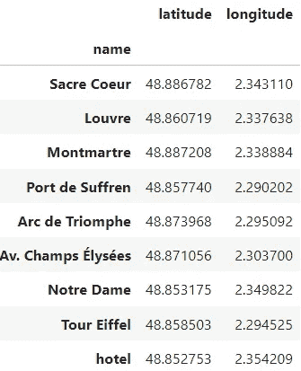
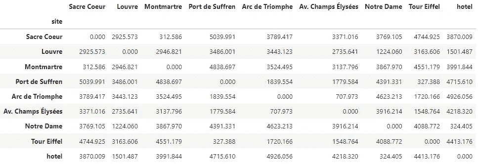
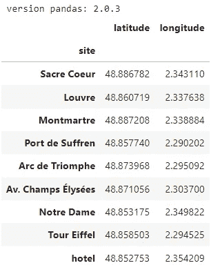
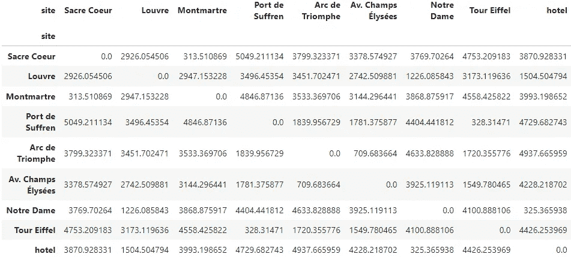
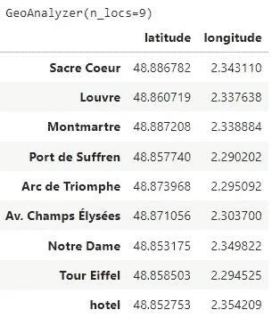

# 计算一组地点坐标的距离矩阵（Python 实现）

> 原文：[`towardsdatascience.com/compute-the-distance-matrix-of-a-set-of-sites-from-their-coordinates-in-python-d5fc92a0ba9e?source=collection_archive---------0-----------------------#2023-07-16`](https://towardsdatascience.com/compute-the-distance-matrix-of-a-set-of-sites-from-their-coordinates-in-python-d5fc92a0ba9e?source=collection_archive---------0-----------------------#2023-07-16)

## 轻松估算任意一对地点之间的距离，作为解决一般路由问题的起点

[](https://medium.com/@carlosjuribe?source=post_page-----d5fc92a0ba9e--------------------------------)[](https://towardsdatascience.com/?source=post_page-----d5fc92a0ba9e--------------------------------) [Carlos J. Uribe](https://medium.com/@carlosjuribe?source=post_page-----d5fc92a0ba9e--------------------------------)

·

[关注](https://medium.com/m/signin?actionUrl=https%3A%2F%2Fmedium.com%2F_%2Fsubscribe%2Fuser%2F4337eddb94ed&operation=register&redirect=https%3A%2F%2Ftowardsdatascience.com%2Fcompute-the-distance-matrix-of-a-set-of-sites-from-their-coordinates-in-python-d5fc92a0ba9e&user=Carlos+J.+Uribe&userId=4337eddb94ed&source=post_page-4337eddb94ed----d5fc92a0ba9e---------------------post_header-----------) 发表在 [Towards Data Science](https://towardsdatascience.com/?source=post_page-----d5fc92a0ba9e--------------------------------) ·13 分钟阅读·2023 年 7 月 16 日[](https://medium.com/m/signin?actionUrl=https%3A%2F%2Fmedium.com%2F_%2Fvote%2Ftowards-data-science%2Fd5fc92a0ba9e&operation=register&redirect=https%3A%2F%2Ftowardsdatascience.com%2Fcompute-the-distance-matrix-of-a-set-of-sites-from-their-coordinates-in-python-d5fc92a0ba9e&user=Carlos+J.+Uribe&userId=4337eddb94ed&source=-----d5fc92a0ba9e---------------------clap_footer-----------)

--

[](https://medium.com/m/signin?actionUrl=https%3A%2F%2Fmedium.com%2F_%2Fbookmark%2Fp%2Fd5fc92a0ba9e&operation=register&redirect=https%3A%2F%2Ftowardsdatascience.com%2Fcompute-the-distance-matrix-of-a-set-of-sites-from-their-coordinates-in-python-d5fc92a0ba9e&source=-----d5fc92a0ba9e---------------------bookmark_footer-----------)

由 DALL·E 3 生成的图像，作者的提示：“一张城市网络的地图，每个城市都连接到其他所有城市”

> *👁️* **这是关于“**[**Python 中的智能决策支持系统**](https://medium.com/@carlosjuribe/list/an-intelligent-decision-support-system-for-tourism-in-python-b6ba165b4236)**”项目的第 4 篇文章，** 我鼓励你查看一下，以获取整个项目的一般概述。如果你只对创建距离矩阵感兴趣，这篇文章已经足够，它是自包含的。如果你还想将距离矩阵应用于实际问题，这个系列将对你有兴趣。

本文将继续从[sprint 3](https://medium.com/@carlosjuribe/plan-optimal-trips-automatically-with-python-and-operations-research-models-part-2-fc7ee8198b6c)的最后一个地方开始：为旅行商问题构建优化模型，*在给定固定访问地点*及其对之间的距离的情况下。在第 4 轮中，我们将暂时从建模中绕开，**开发一个具有地理空间功能的类**，这将在我们尝试解决**一般性**旅行商问题时非常有用，即对于任意位置我们可能没有现成的距离数据的问题。我们在上一轮中提出了这个“需求”，将在这一轮中构建一个子系统来满足它。

# 目录

## 1. 上一轮迭代回顾

## 2. 读取输入数据

## 3. 从位置数据创建距离矩阵

+   3.1. 我是否需要付出额外的努力来获得额外的进展？

+   3.2. 带有的地理定位工具 `geopy`

+   3.3. 到达要点

+   3.4. 从坐标到距离矩阵

## 4. 完成！（类内部）

+   4.1. `GeoAnalyzer` 类设计

+   4.2. 类使用演示

## 5. 结论（或规划下一轮迭代）

# 1. 上一轮迭代回顾

在上一篇文章中，即[sprint 3](https://medium.com/@carlosjuribe/plan-optimal-trips-automatically-with-python-and-operations-research-models-part-2-fc7ee8198b6c)，我们进行了概念验证，展示了我们可以解决[旅行商问题](https://en.wikipedia.org/wiki/Travelling_salesman_problem)（TSP）对于一组站点，*前提是我们拥有每一对站点之间的距离*，作为距离矩阵：

[](/plan-optimal-trips-automatically-with-python-and-operations-research-models-part-2-fc7ee8198b6c?source=post_page-----d5fc92a0ba9e--------------------------------) ## 用 Python 实现、解决和可视化旅行商问题

### 学习如何将优化模型从数学翻译到 Python，优化它，并可视化解决方案以快速获得结果…

towardsdatascience.com

我们将距离矩阵视为已给定，因为在那个开发阶段，重点是*模型构建*，而不是*数据获取*。但是一旦模型准备好并且在我们的固定地点集上运行良好，我们很快意识到**我们需要一种方法来** **解决一般的 TSP 问题**（任意地点集的问题）。这种泛化是创建真正有用的 MVP 所必需的。因此，我们得出的自然下一步是找到一种**自动从我们兴趣点的坐标中获取距离矩阵**的方法，这一步我们将在本文中讨论。

这样做，我们的**新基本输入**将会简单自然得多，只需提供我们想要访问地点的地理坐标：



**图 1.** 兴趣点的坐标。 （图像由作者提供）

输出将是我们用作 TSP 模型输入的数据框，即输入地点的距离矩阵：



**图 2.** 给定一组地点的期望距离矩阵。 （图像由作者提供）

为了保持一致性，我们将使用到目前为止考虑的相同巴黎地点。在下一篇文章中，我们将把这个功能与旅行销售员问题的优化模型集成，得到一个更具多功能性的 MVP。

> ***🎯******牢记最终目标***
> 
> *让我们稍微回顾一下为什么要做这个。我们期望解决的原始实际问题是我们可以称之为的* ***旅行游客问题*** *(TTP)，即为一般游客制定* ***最佳旅行计划*** *的问题，* ***给定她的“个人”数据*** *(如偏好、预算等)* ***以及旅行“环境”数据*** *(如距离、价格、交通方式等)。*
> 
> *由于这个实际问题被认为过于复杂，我们在* [*第一个冲刺*](https://medium.com/@carlosjuribe/plan-an-optimal-trip-for-your-next-holidays-with-the-help-of-operations-research-and-python-481b1ea38fef)*中将其简化为其本质版，以启动解决方案的设计。这个“本质问题”被证明是* *旅行销售员问题* *(TSP)，在这个问题中，我们将要访问的点视为城市中游客的“兴趣点”。通过本文开发的功能，我们更接近于 TTP 的通用解决方案，以 TSP 作为解决方案的核心。*

# 2\. 读取输入数据

我们的基本输入现在是我们旅行中想要访问的地点的地理坐标。我们将“酒店”视为一种不同的地点，因为酒店本身并不是一个“感兴趣的地点”，而是我们必须在多日旅行中停留的地方。我们的酒店选择可能会因不同的旅行或不同的情况而有所不同，而一个城市中的感兴趣的地点则是相对“固定”的地方，许多旅行指南对此意见一致。当我们准备探索更高级的应用时，这种区分的有用性将变得更加明显。

因此，我将我们酒店的坐标存储在一个 CSV 文件 `location_hotel.csv` 中，将“感兴趣地点”的坐标存储在另一个 CSV 文件 `sites_coordinates.csv` 中。这两个 CSV 文件具有相同的结构，因此我们将它们读取并合并成一个包含所有地点的数据框：

```py
import pandas as pd

print(f"version pandas: {pd.__version__}")

DATA_FOLDER = ("https://raw.githubusercontent.com/carlosjuribe/"
               "traveling-tourist-problem/main/data")
FILE_LOCATION_HOTEL = "location_hotel.csv"
FILE_LOCATION_SITES = "sites_coordinates.csv"

df_sites = pd.concat([
    pd.read_csv(f"{DATA_FOLDER}/{FILE_LOCATION_SITES}", index_col='site'),
    pd.read_csv(f"{DATA_FOLDER}/{FILE_LOCATION_HOTEL}", index_col='site')
])

display(df_sites)
```



> ***ℹ️ 如何快速准备自己的位置数据***
> 
> 如果你想使用自己的网站列表来跟随本文，你需要复制我获取坐标的步骤：
> 
> 1\. 前往 [Google Maps](https://www.google.com/maps/) 并搜索你列表中的每个地点。
> 
> 2\. 每个地点将在地图上显示为一个点。右击每个点。出现的第一个元素是一对数字：你点击的点的纬度和经度。
> 
> 3\. 点击这些数字，它们将被保存到你的剪贴板中，准备粘贴到一个文件中，连同你为该点选择的名称一起。
> 
> 4\. 对所有地点重复步骤 1 到 3，你将得到一个等效于 `sites_coordinates.csv` 的文件。
> 
> 这个过程对于小规模的网站集非常有效，但如果你有数百个，甚至几十个地点，它会变得非常繁琐。在 [未来的一篇文章](https://example.org) 中，我们将创建一种自动化这个手动工作的方式，这叫做*地理定位*。

# 3\. 从位置数据创建距离矩阵

要构建距离矩阵，我们需要获得任何一对地点之间的距离。这听起来很简单，但“距离”实际上取决于上下文。我们是否考虑由如谷歌地图这样的地图应用程序报告的数字，这些应用程序考虑了街道网络、桥梁、公园，*等等*？如果是这样，我们考虑步行者行走的距离，还是汽车行驶的距离？或者只是连接这两个点的直线长度？显然，我们有许多可能的距离选择，每种选择的准确度不同。*我们必须回答的第一个问题是*：**在*我们的实际问题*的特定背景下，我们应该如何定义“距离”**，以及在*这个阶段*？

## 3.1\. 我是否应该多花点时间以获得更多的好处？

很自然地，我们会被诱惑使用准确的数据。最终，我们都知道准确性是内在有价值的，因此我们倾向于追求更准确的数据，越多越好。但我们也必须记住，更准确的数据意味着更复杂的代码和依赖，因此需要更多的开发时间和维护。由于我们遵循**敏捷的方法**，我们不让*最佳*成为*良好*的敌人，因此**我们将尽可能简单地开始，然后逐步增加复杂性，仅在必要时**。

在需要找到地点之间的距离时，我们可以像很多人一样，直接跳到基于第三方 API 的解决方案，这些方案需要应用密钥、凭据，甚至云服务提供商的信用卡号码。这种方法是可以的，但往往效率不高，因为我们可能会忘记**准确的信息带来附加价值，但也会带来附加成本**。

> *👁️* ***没有“免费准确性”这种事***
> 
> *记住通常我们总是“付出代价”来获取准确的数据（这与* [***信息的价值***](https://en.wikipedia.org/wiki/Value_of_information)*) 紧密相关）是另一个原因，为什么采取敏捷的方法来解决问题是更精简的做法。通过* ***从简单假设开始*** *关于“*所需的准确度*”，并在我们自己的问题数据上验证其有效性* ***，我们确保，如果我们最终需要提高数据的准确性，我们将“付出代价”，这种代价是* ***值得的*** *(预期的)* ***改进结果****。

所以我们从非常简单的开始。我们有坐标。**第一个想法**：这些坐标分布在相对于地球半径*非常小*的地球的地块上，因此我们可以将纬度视为 Y 坐标，将经度视为 X 坐标，在二维平面上进行计算，然后计算欧几里得距离（即通常所说的“直线”）。

+   优点：简单的距离公式，没有新的依赖或数据，地点之间的空间关系被保留。

+   缺点：纬度和经度是无量纲的数字，因此我们在解决问题时得到的数字将不是实际的距离。这意味着我们关心的一些信息，如总旅行距离，即使我们可以获得最佳路线，也不会提供。

缺点胜过优点，因此我们需要一种更复杂的方法（**但仍然简单**）。**第二个想法**：将坐标视为它们本身，即地球上的点，但将地球近似为一个球体。一个球体没有我们熟悉的欧几里得几何，因此我们需要一个非平凡的公式，在计算两个点之间的“直线”距离时考虑这种球面几何。所以现在只需使用地球的半径来实现这个公式。我们可以这样做，但我们会依赖一个已经做了这件事的著名库，而且效果更好。

## 3.2. 使用 `**geopy**` 的地理位置工具

如果这篇文章系列特别关注地理空间数据科学，那么花时间解释和实现[大圆距离](https://en.wikipedia.org/wiki/Great-circle_distance)的公式将是有价值的，这是一种计算球面上两点“直线”距离的良好基准选项。然而，这篇文章系列关于**基于优化的旅游规划系统**，因此，我们将依赖于[Geopy](https://geopy.readthedocs.io/en/stable/)来完成繁重的工作，而不是自制地理空间工具的公式。这样，我们可以专注于快速找到解决方案。

通过在 Anaconda 提示符（或在我们在[第一篇文章](https://medium.com/@carlosjuribe/plan-optimal-trips-automatically-with-python-and-operations-research-models-part-2-fc7ee8198b6c#:~:text=For%20organized%20people,in%20this%20series)中创建的 conda 环境内）运行以下命令来安装它：

```py
conda install -y -c conda-forge geopy=2.3.0
```

现在，让我们用 `geopy` 对两个位置进行演示。

## 3.3\. 到达要点

给定两点的坐标，`[geodesic](https://geopy.readthedocs.io/en/stable/#geopy.distance.geodesic)` 函数可以计算它们之间的地球表面最短距离。在几何学中，[*测地线*](https://en.wikipedia.org/wiki/Geodesic) 是在给定[度量空间](https://en.wikipedia.org/wiki/Metric_space)上两点之间的最短路径。在我们熟悉的欧几里得空间中，**直线**就是测地线。在球面空间中，**大圆**是测地线。Geopy 的 `geodesic` 函数所考虑的基础“空间”是**地球的精确椭球模型**。

> ***👁 大圆很棒，但椭圆更棒***
> 
> *之前我说过，我们将地球视为一个球体，因为这是最简单的可行近似。实际上，地球并不是一个球体，而是一个椭球体，是一种具有更复杂几何形状的固体。现在`*geopy*`*将免于我们为非欧几里得几何编写自己的函数，我们可以升级对地球的近似，并使用更精确的* ***椭球距离*** *来代替大圆距离。对于相同的代码行，这确实是免费的精确度，那么为什么不使用呢？*

这是一个计算点 1 和点 2 之间椭球距离的函数，单位为米：

```py
from geopy.distance import geodesic

def ellipsoidal_distance(p1, p2) -> float:
    """ Calculate distance (in meters) between p1 and p2, where 
    each point is represented as a tuple (lat, lon) """
    return geodesic(p1, p2).meters
```

埃菲尔铁塔和卢浮宫之间的距离是多少？

```py
p1 = df_sites.loc['Tour Eiffel']
p2 = df_sites.loc['Louvre']

ellipsoidal_distance(p1, p2)  # output: 3173.119635531859
```

3173 米，大约 3.2 公里。谷歌地图显示为 3.5 公里。**计算**的距离比“**真实**”距离低 8.6%。不过，我们的腿只关心距离的*绝对误差*，在这种情况下，只比估算距离多走了 330 米，对期望全天在大城市步行的游客来说，这似乎不是一个显著的误差。

那么埃菲尔铁塔和苏弗伦港之间呢？

```py
ellipsoidal_distance(
    df_sites.loc['Tour Eiffel'],
    df_sites.loc['Port de Suffren']
)  # output: 328.3147101635456
```

328 米，这次比 Google Maps 提供的 350 米低 6%（仅 22 米短）。对于应用一个公式来说，这还不错。正如我们所预期的，点越近，街道出现之类的曲折转弯的机会越小，因此椭球模型产生的误差也越小。对于我们目前的目的来看，显得**足够好**。

现在我们必须将这个函数应用于所有位置对，从而得到 TSP 模型所需的距离矩阵。

## 3.4\. 从坐标到距离矩阵

这部分很简单，我们只需对所有站点进行两次循环，计算并存储每对之间的距离。下面的函数就是这样做的。注意，距离度量作为可选参数传递，默认是我们之前使用的椭球距离。我们留着以后传递更好的距离度量的可能性。

```py
def compute_distance_matrix(df_sites, dist_metric=ellipsoidal_distance):
    """ Creates an N x N distance matrix from a dataframe of N locations 
    with a latitute column and a longitude column """
    df_dist_matrix = pd.DataFrame(index=df_sites.index, 
                                  columns=df_sites.index)

    for orig, orig_loc in df_sites.iterrows():  # for each origin
        for dest, dest_loc in df_sites.iterrows():  # for each destination
            df_dist_matrix.at[orig, dest] = dist_metric(orig_loc, dest_loc)
    return df_dist_matrix

df_distances = compute_distance_matrix(df_sites)

display(df_distances)
```



**图 3.** 使用地球椭球模型得到的距离矩阵。（图像来源：作者）

就这样！正如预期的那样，矩阵的对角线为零，矩阵是对称的。输出数据框的索引和列包含输入站点的名称。

功能演示完毕。现在我们可以更好地方便使用这个函数。让我们以一种便捷的方式将这个功能封装在一个类中，**以便于重复使用**，更重要的是，**为了更容易与我们在上一个冲刺中构建的 TSP 优化模型集成**。

# 4\. 总结！(在类内部)

## 4.1\. `GeoAnalyzer` 类设计

让我们创建一个新的类，`GeoAnalyzer`，专门用于处理可能出现在路由问题中的地理空间工具。因此，我们的函数`compute_distance_matrix`自然地作为一个方法嵌入其中。这个类的主要部分目前将包括：

+   包含站点位置的数据框，属性为`_df_locations`。

+   纯函数`ellipsoidal_distance`。

+   方法`get_distance_matrix`，等同于之前的函数`compute_distance_matrix`，但使用实例属性`_df_locations`来计算距离。

由于用户可能希望在分析的任何时刻添加新位置，我们包括了一个名为`add_locations`的方法，该方法接受一个地理坐标的数据框，并将其附加到先前存在的数据框中。

下面可以找到`GeoAnalyzer`的定义。注意这里还有其他便利的方法和属性未提及。

```py
from typing import Tuple

import pandas as pd
from geopy.distance import geodesic

class GeoAnalyzer:
    """ Utils for geolocation information and processing """  
    _GeoPoint = Tuple[float, float]

    def __init__(self):
        """ Use method `add_locations` to store some locations inside 
        and start using the geo-utilities """
        self._df_locations = pd.DataFrame(columns=['latitude', 'longitude'])

    #####################   distances   #####################
    @staticmethod
    def ellipsoidal_distance(point1: _GeoPoint, point2: _GeoPoint) -> float:
        """ Calculate ellipsoidal distance (in meters) between point1 
        and point2 where each point is represented as a tuple (lat, lon)
        """
        return geodesic(point1, point2).meters
    #########################################################

    @property
    def locations(self):
        return self._df_locations

    @property
    def num_locations(self):
        return len(self._df_locations)

    def add_locations(self, df_locations: pd.DataFrame):
        """ Geo-location data needed for analysis.
        Parameters
        ----------
        df_locations : pd.DataFrame
            Dataframe of geographical coordinates with the first column 
            named 'latitude' and the second column named 'longitude'
        """
        self._name_index = df_locations.index.name
        df_updated = pd.concat([self._df_locations, df_locations.copy()])
        # drop duplicates just in case the user adds repeated locations
        self._df_locations = df_updated.drop_duplicates()

    def get_distance_matrix(self, precision: int = 4) -> pd.DataFrame:
        """ Computes the distance matrix as a dataframe based on the 
        provided location data """
        df_locations = self._df_locations
        dist_metric = self.ellipsoidal_distance  # only distance available

        # initialize matrix df
        df_dist_matrix = pd.DataFrame(index=df_locations.index, 
                                      columns=df_locations.index)
        # for each origin and destination pair, compute distance
        for orig, orig_loc in df_locations.iterrows():
            for dest, dest_loc in df_locations.iterrows():
                distance = round(dist_metric(orig_loc, dest_loc), precision)
                df_dist_matrix.at[orig, dest] = distance

        # a bit of metadata doesn't hurt
        df_dist_matrix.distance_metric = dist_metric.__name__
        df_dist_matrix.index.name = self._name_index
        return df_dist_matrix    

    def __repr__(self):
        """ Display number of currently considered locations """
        return f"{self.__class__.__name__}(n_locs={self.num_locations})"
```

## 4.2\. 类使用演示

让我们稍微探索一下这个类的主要功能。我们创建一个实例并从巴黎添加我们感兴趣的站点：

```py
geo_analyzer = GeoAnalyzer()
geo_analyzer.add_locations(df_sites)
```

我们检查此时实例的表示，告知我们已经提供了 9 个位置，我们可以通过属性`locations`查看详细信息：

```py
display(geo_analyzer)
display(geo_analyzer.locations)
```



当然，我们可以从对象中提取距离矩阵，到目前为止这已经相当熟悉了：

```py
df_distances = geo_analyzer.get_distance_matrix()

display(df_distances)
```


最后，如果我们对这些值的来源感到好奇，我们可以从数据框本身进行检查：

```py
print(f"Distance metric used: {df_distances.distance_metric}")
# [Out]: Distance metric used: ellipsoidal_distance
```

如果有更多的距离度量可用，这将更加有价值，这是我们在未来冲刺中将看到的内容。

## 5\. 结论（或为下一个冲刺做计划）

我们工作的最终结果是一个名为 `GeoAnalyzer` 的类，具有便捷的方法，帮助我们将旅行推销员问题推广到任意的站点集合。这个推广将是我们[下一个冲刺](https://medium.com/@carlosjuribe/a-classy-approach-to-solving-traveling-salesman-problems-effectively-dbb44e7d30b9)的具体目标，**我们将为 TSP 创建一个类似估算器的类**，它隐藏了在[sprint 2](https://medium.com/@carlosjuribe/plan-optimal-trips-automatically-with-python-and-operations-research-models-part-2-fc7ee8198b6c)中涉及的模型构建步骤，并以待访问站点的地理坐标作为输入。`GeoAnalyzer` 类将是这个新估算器类的关键组成部分，**实现我们所构建的 TSP 优化模型的真正通用应用**。这个新的类似估算器的类，将结合 `GeoAnalyzer` 和 TSP 模型的通用性，将成为我们解决更一般的**旅行游客问题**的核心。继续阅读[下一个冲刺](https://medium.com/@carlosjuribe/a-classy-approach-to-solving-traveling-salesman-problems-effectively-dbb44e7d30b9)，了解真正的内容：

[](/a-classy-approach-to-solving-traveling-salesman-problems-effectively-dbb44e7d30b9?source=post_page-----d5fc92a0ba9e--------------------------------) ## 一种优雅的方法来有效解决旅行推销员问题，使用 Python

### 以类似 scikit-learn 的方式实现 TSP 模型，以简化路由优化的构建和解决过程…

towardsdatascience.com

随时关注我，向我提问，**给我反馈**，或通过[LinkedIn](https://www.linkedin.com/in/carlosjuribe/)与我联系。感谢阅读！📈😊
