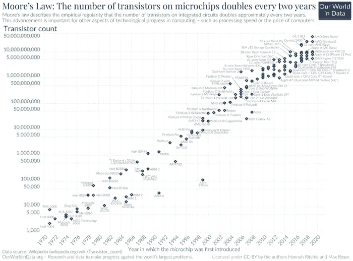

# Python 中的并发

> 原文：[`towardsdatascience.com/concurrency-in-python-fe8b39edfba5?source=collection_archive---------16-----------------------#2023-05-24`](https://towardsdatascience.com/concurrency-in-python-fe8b39edfba5?source=collection_archive---------16-----------------------#2023-05-24)

## PYTHON | 编程 | 并发

## 一本关于如何利用并发执行的力量来提升 Python 程序性能的初学者指南。

 [David Farrugia](https://david-farrugia.medium.com/?source=post_page-----fe8b39edfba5--------------------------------)

·

[关注](https://medium.com/m/signin?actionUrl=https%3A%2F%2Fmedium.com%2F_%2Fsubscribe%2Fuser%2F3916826092a6&operation=register&redirect=https%3A%2F%2Ftowardsdatascience.com%2Fconcurrency-in-python-fe8b39edfba5&user=David+Farrugia&userId=3916826092a6&source=post_page-3916826092a6----fe8b39edfba5---------------------post_header-----------) 发表在 [Towards Data Science](https://towardsdatascience.com/?source=post_page-----fe8b39edfba5--------------------------------) ·9 分钟阅读·2023 年 5 月 24 日 

--

照片由 [fabio](https://unsplash.com/@fabioha?utm_source=medium&utm_medium=referral) 在 [Unsplash](https://unsplash.com/?utm_source=medium&utm_medium=referral) 提供

戈登·穆尔（Gordon Moore）在 1965 年做出了一个预测，这个预测后来被称为穆尔定律。他指出，微芯片上的晶体管数量每两年将翻一番。此外，穆尔定律还规定，在同一时期内，计算硬件的成本也将减半。

来源：[`commons.wikimedia.org/wiki/File:Moore%27s_Law_Transistor_Count_1970-2020.png`](https://commons.wikimedia.org/wiki/File:Moore%27s_Law_Transistor_Count_1970-2020.png)

在今天的技术环境中，计算机设备通常配备了多核心 CPU 或多个处理器。作为开发者，我们需要编写利用这些硬件能力的代码，以便为用户提供最优化和高效的解决方案。

# 什么是并发？

> ***并发是多个指令序列同时执行的过程。***

假设我们的系统有一个 2 核 CPU。运行非并发代码将导致我们的脚本仅使用一个核心来执行任务，另一个核心…
