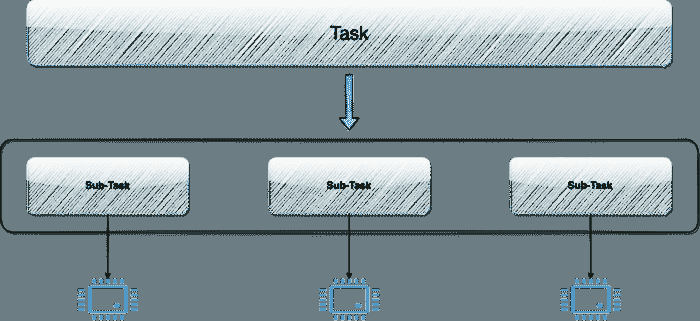
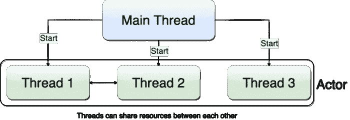
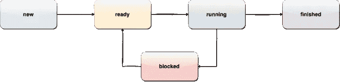

# Python 中的并发

> 原文：[`towardsdatascience.com/concurrency-in-python-fe8b39edfba5`](https://towardsdatascience.com/concurrency-in-python-fe8b39edfba5)

## PYTHON | PROGRAMMING | CONCURRENCY

## 这是一本关于利用并发执行的力量以及提高 Python 程序性能的初学者指南。

[](https://david-farrugia.medium.com/?source=post_page-----fe8b39edfba5--------------------------------)[](https://towardsdatascience.com/?source=post_page-----fe8b39edfba5--------------------------------) [David Farrugia](https://david-farrugia.medium.com/?source=post_page-----fe8b39edfba5--------------------------------)

·发表于 [Towards Data Science](https://towardsdatascience.com/?source=post_page-----fe8b39edfba5--------------------------------) ·9 分钟阅读·2023 年 5 月 24 日

--


照片由 [fabio](https://unsplash.com/@fabioha?utm_source=medium&utm_medium=referral) 提供，来源于 [Unsplash](https://unsplash.com/?utm_source=medium&utm_medium=referral)

戈登·摩尔在 1965 年做出了一个后来被称为摩尔定律的预测。他指出，微芯片上的晶体管数量每两年将翻一番。此外，摩尔定律还规定，在同一时期内，计算硬件的成本也将减半。


来源：[`commons.wikimedia.org/wiki/File:Moore%27s_Law_Transistor_Count_1970-2020.png`](https://commons.wikimedia.org/wiki/File:Moore%27s_Law_Transistor_Count_1970-2020.png)

在今天的技术环境中，计算机设备配备多核 CPU 或多个处理器已很常见。作为开发人员，我们需要编写能够利用这些硬件能力的代码，以提供对用户最优化和高效的解决方案。

# 什么是并发？

> ***并发是同时执行多个指令序列。***

假设我们的系统有一个 2 核心的 CPU。运行非并发代码将导致我们的脚本仅利用一个核心来执行任务，而另一个核心则处于空闲状态。

通过利用并发，我们可以在两个核心上同时执行任务，从而提高性能并减少等待时间。

然而，并发的一个缺点是我们无法保证任务执行的顺序。

因此，重要的是各种任务的执行顺序不应影响结果，并且任务应尽可能共享较少的资源。

为了缓解这一点，需要协调共享资源，这会增加复杂性。

> ***共享资源越多，复杂性越高。***

# 并发的类型

## 并行编程

并行编程是将主要任务分解为较小的子任务的实践。

这些子任务然后被分配到不同的线程或进程中，并在多个核心上同时执行。

相反，在单核编程中，只使用一个核心来执行任务，其他核心则处于空闲状态或可供其他程序或任务使用。

这可能导致资源利用效率降低。

通过利用并行编程，可以使用所有核心来提高整体性能。



并行编程的示例。来源：作者

由于并行编程利用了多个核心，因此它特别适用于 CPU 绑定的任务，也称为 CPU 密集型任务。这些任务只能通过增加更多的处理器来加速。此类任务的例子包括搜索算法和数学运算。

## 异步编程

在异步编程中，也称为多线程，主线程将子任务发送给一个演员，这可以是另一个线程或设备。

主线程随后继续执行其他工作，而不是等待响应。当子任务完成时，演员通知主线程并触发回调函数来处理结果。

在 Python 中，我们使用一个称为“future”的对象来代替回调函数，该对象表示尚未完成操作的结果。



异步编程的示例。来源：作者

根据程序的结构，主线程将等待子任务完成或在稍后时间检查。

异步编程特别适用于 I/O 绑定任务。I/O 绑定任务是 CPU 无法单独执行的操作，而是依赖于磁盘访问或网络等外部因素。I/O 绑定任务的例子包括从/向存储读/写和发出 API 请求。

# 并行与异步编程

在任何给定的时间点：

> *并行编程 — 更快地完成任务*
> 
> *异步编程 — 做更多的事情*

# Python 中的多线程

一个常用的例子来说明多线程的好处是同时下载多个网络上的图像。我们可以利用这个例子来理解多线程的有效性以及如何在 Python 中实现它。

```py
import os
import time
from urllib.parse import urlparse
from urllib.request import urlretrieve
from typing import List
from numpy import round

IMGS_URL_LIST = \
    ['https://dl.dropboxusercontent.com/s/2fu69d8lfesbhru/pexels-photo-48603.jpeg',
     'https://dl.dropboxusercontent.com/s/zch88m6sb8a7bm1/pexels-photo-134392.jpeg',
     'https://dl.dropboxusercontent.com/s/lsr6dxw5m2ep5qt/pexels-photo-135130.jpeg',
     'https://dl.dropboxusercontent.com/s/6xinfm0lcnbirb9/pexels-photo-167300.jpeg',
     'https://dl.dropboxusercontent.com/s/2dp2hli32h9p0y6/pexels-photo-167921.jpeg',
     'https://dl.dropboxusercontent.com/s/fjb1m3grcrceqo2/pexels-photo-173125.jpeg',
     'https://dl.dropboxusercontent.com/s/56u8p4oplagc4bp/pexels-photo-185934.jpeg',
     'https://dl.dropboxusercontent.com/s/2s1x7wz4sdvxssr/pexels-photo-192454.jpeg',
     'https://dl.dropboxusercontent.com/s/1gjphqnllzm10hh/pexels-photo-193038.jpeg',
     'https://dl.dropboxusercontent.com/s/pcjz40c8pxpy057/pexels-photo-193043.jpeg',
     'https://dl.dropboxusercontent.com/s/hokdfk7y8zmwe96/pexels-photo-207962.jpeg',
     'https://dl.dropboxusercontent.com/s/k2tk2co7r18juy7/pexels-photo-247917.jpeg',
     'https://dl.dropboxusercontent.com/s/m4xjekvqk4rksbx/pexels-photo-247932.jpeg',
     'https://dl.dropboxusercontent.com/s/znmswtwhcdbpc10/pexels-photo-265186.jpeg',
     'https://dl.dropboxusercontent.com/s/jgb6n4esquhh4gu/pexels-photo-302899.jpeg',
     'https://dl.dropboxusercontent.com/s/rjuggi2ubc1b3bk/pexels-photo-317156.jpeg',
     'https://dl.dropboxusercontent.com/s/cpaog2nwplilrz9/pexels-photo-317383.jpeg',
     'https://dl.dropboxusercontent.com/s/16x2b6ruk18gji5/pexels-photo-320007.jpeg',
     'https://dl.dropboxusercontent.com/s/xqzqzjkcwl52en0/pexels-photo-322207.jpeg',
     'https://dl.dropboxusercontent.com/s/frclthpd7t8exma/pexels-photo-323503.jpeg',
     'https://dl.dropboxusercontent.com/s/7ixez07vnc3jeyg/pexels-photo-324030.jpeg',
     'https://dl.dropboxusercontent.com/s/1xlgrfy861nyhox/pexels-photo-324655.jpeg',
     'https://dl.dropboxusercontent.com/s/v1b03d940lop05d/pexels-photo-324658.jpeg',
     'https://dl.dropboxusercontent.com/s/ehrm5clkucbhvi4/pexels-photo-325520.jpeg',
     'https://dl.dropboxusercontent.com/s/l7ga4ea98hfl49b/pexels-photo-333529.jpeg',
     'https://dl.dropboxusercontent.com/s/rleff9tx000k19j/pexels-photo-341520.jpeg'
    ]

def download_images(img_url_list: List[str]) -> None:
    # validate inputs
    if not img_url_list:
        return
    os.makedirs('images', exist_ok=True)

    # get time in seconds
    start = time.perf_counter()

    # for every url in our list, we parse the url and download its contents
    for img_num, url in enumerate(img_url_list):
        urlretrieve(url, f'images{os.path.sep}{img_num+1}')

    print(f"Retrieved {len(img_url_list)} images took {round(time.perf_counter() - start, 2)} seconds")

download_images(IMGS_URL_LIST)
```

在上述单线程脚本中，我们设置了一个函数（download_images），用于检索公开托管在 Dropbox 上的一些图像。

这个脚本下载 26 张图像花费了 22.06 秒。

为了改善这一点，我们可以转变编程思路，使用不同的方法来构建一个利用并发的脚本。

我们可以将逻辑分成两个主要函数：目标函数和运行函数，而不是编写一个循环遍历每个 URL 并检索其内容的函数。

目标函数的作用是封装处理单个 URL 所需的逻辑。

由于我们希望为每个 URL 拥有一个线程，因此我们需要为每个线程提供处理 URL 的知识。

然后，运行函数用于触发每个 URL 的新线程并存储它们的结果。

在运行函数中，我们需要指示主线程为每个 URL 创建并启动一个子线程。

我们可以通过遍历传递的 URL 并在 Python 中创建和启动一个新线程来做到这一点，如下所示：

```py
from threading import Thread

t = Thread(target=<TARGET_FUNCTION>, args=(<SOME_ARGS>))
t.start()
```

在我们的例子中，我们希望等待所有图像下载完成后再继续程序。为此，我们可以指示主线程等待所有子线程完成，然后再继续程序执行，通过调用 join()函数。此函数将子线程与主线程连接在一起，主线程在所有连接的线程执行完成之前不会继续。

```py
from threading import Thread

# store our threads
threads = []

t = Thread(target=<TARGET_FUNCTION>, args=(<SOME_ARGS>))
t.start()
threads.append(t)

# join all child threads to the main thread
for thread in threads:
  thread.join()
```

通过使用 join()函数，我们可以确保程序在继续执行脚本的下一步之前等待所有子线程完成。

将原始脚本调整为使用多线程大致如下：

```py
import threading
import os
import time
from urllib.parse import urlparse
from urllib.request import urlretrieve
from typing import List
from numpy import round

IMGS_URL_LIST = \
    ['https://dl.dropboxusercontent.com/s/2fu69d8lfesbhru/pexels-photo-48603.jpeg',
     'https://dl.dropboxusercontent.com/s/zch88m6sb8a7bm1/pexels-photo-134392.jpeg',
     'https://dl.dropboxusercontent.com/s/lsr6dxw5m2ep5qt/pexels-photo-135130.jpeg',
     'https://dl.dropboxusercontent.com/s/6xinfm0lcnbirb9/pexels-photo-167300.jpeg',
     'https://dl.dropboxusercontent.com/s/2dp2hli32h9p0y6/pexels-photo-167921.jpeg',
     'https://dl.dropboxusercontent.com/s/fjb1m3grcrceqo2/pexels-photo-173125.jpeg',
     'https://dl.dropboxusercontent.com/s/56u8p4oplagc4bp/pexels-photo-185934.jpeg',
     'https://dl.dropboxusercontent.com/s/2s1x7wz4sdvxssr/pexels-photo-192454.jpeg',
     'https://dl.dropboxusercontent.com/s/1gjphqnllzm10hh/pexels-photo-193038.jpeg',
     'https://dl.dropboxusercontent.com/s/pcjz40c8pxpy057/pexels-photo-193043.jpeg',
     'https://dl.dropboxusercontent.com/s/hokdfk7y8zmwe96/pexels-photo-207962.jpeg',
     'https://dl.dropboxusercontent.com/s/k2tk2co7r18juy7/pexels-photo-247917.jpeg',
     'https://dl.dropboxusercontent.com/s/m4xjekvqk4rksbx/pexels-photo-247932.jpeg',
     'https://dl.dropboxusercontent.com/s/znmswtwhcdbpc10/pexels-photo-265186.jpeg',
     'https://dl.dropboxusercontent.com/s/jgb6n4esquhh4gu/pexels-photo-302899.jpeg',
     'https://dl.dropboxusercontent.com/s/rjuggi2ubc1b3bk/pexels-photo-317156.jpeg',
     'https://dl.dropboxusercontent.com/s/cpaog2nwplilrz9/pexels-photo-317383.jpeg',
     'https://dl.dropboxusercontent.com/s/16x2b6ruk18gji5/pexels-photo-320007.jpeg',
     'https://dl.dropboxusercontent.com/s/xqzqzjkcwl52en0/pexels-photo-322207.jpeg',
     'https://dl.dropboxusercontent.com/s/frclthpd7t8exma/pexels-photo-323503.jpeg',
     'https://dl.dropboxusercontent.com/s/7ixez07vnc3jeyg/pexels-photo-324030.jpeg',
     'https://dl.dropboxusercontent.com/s/1xlgrfy861nyhox/pexels-photo-324655.jpeg',
     'https://dl.dropboxusercontent.com/s/v1b03d940lop05d/pexels-photo-324658.jpeg',
     'https://dl.dropboxusercontent.com/s/ehrm5clkucbhvi4/pexels-photo-325520.jpeg',
     'https://dl.dropboxusercontent.com/s/l7ga4ea98hfl49b/pexels-photo-333529.jpeg',
     'https://dl.dropboxusercontent.com/s/rleff9tx000k19j/pexels-photo-341520.jpeg'
    ]

# this is our target function
def download_image(url: str, img_num: int) -> None:
    urlretrieve(url, f'images{os.path.sep}{img_num+1}')

def download_images(img_url_list: List[str]) -> None:
    # validate inputs
    if not img_url_list:
        return
    os.makedirs('images', exist_ok=True)

    # get time in seconds
    start = time.perf_counter()

    # create a list to store all of our threads
    threads = []

    # for every url in our list, we parse the url and download its contents
    for img_num, url in enumerate(img_url_list):
        # create a new thread
        t = threading.Thread(target=download_image, args=(url, img_num))

        # start the new thread
        t.start()

        # add the new thread to our list of threads
        threads.append(t)

    # here we instruct the main thread to wait for all child threads to complete before proceeding
    for thread in threads:
        thread.join()

print(f"Retrieved {len(img_url_list)} images took {round(time.perf_counter() - start, 2)} seconds")

download_images(IMGS_URL_LIST)
```

这个脚本仅需 2.92 秒即可检索相同的 26 张图像！这只是使用单线程代码所需时间的 13.24%。

**令人印象深刻，不是吗？**

# 理解执行流程

在深入了解执行流程之前，我们必须首先了解不同的线程状态。



不同的线程状态。来源：作者

+   **新建** — 一个新创建的线程

+   **就绪** — 线程准备好执行

+   **运行中** — 线程正在执行

+   **阻塞** — 线程被阻塞执行（等待资源变得可用）

+   **完成** — 线程执行完毕

当我们开始执行时，只有一个线程可用：主线程。

主线程开始执行代码，直到它遇到生成新线程的指令。这时，我们现在有两个线程：主线程和一个子线程。

子线程从“*新建*”状态移动到“*就绪*”状态。当主线程执行 start()函数时，子线程移动到“运行中”状态并开始执行。

主线程变为“*阻塞*”状态，直到子线程处于“*完成*”状态（由于*join*()函数）。

在更复杂的任务中，尤其是当线程访问共享资源时，控制哪个线程在任何给定时间可以访问哪个资源是很重要的。

这个过程通过使用信号量、锁和其他变量来实现。但我们可以在其他时间深入探讨这个话题。

# Python 中的多处理

在 Python 中创建新进程很简单，类似于使用线程。

我们使用 multiprocessing 包中的 Process 函数创建一个新进程。

我们为 Process 对象指定目标函数并传递相应的参数。

start 函数开始运行进程，我们可以使用 join 函数来指示主进程在继续到下一个代码块之前等待所有子进程完成。

与线程不同，进程可以通过调用该进程的 terminate()函数来终止。

如果进程正在运行，is_alive()函数将返回 True，如果不在运行则返回 False。

然而，终止进程可能会导致任何共享资源处于不一致状态，使其对其他进程不可用。因此，在终止进程时要小心。

并行化程序的主要优势是能够利用所有可用的 CPU 来执行我们的任务。

进程池允许我们以几种方式将任务分配给一组称为工作者的进程。

初始化进程池时，我们需要指定池的大小（即工作线程的数量），并且可以选择指定一个初始化函数。

初始化函数将在每个新创建的进程中执行。

选择工作线程数量的一个好起点是默认使用系统可用的核心数量。

我们使用 map 函数在一个可迭代对象上执行目标函数。

```py
 import multiprocessing

# create an initialiser function which prints the name of the process created
def start_process() -> None:
    print(f'Process {multiprocessing.current_process().name} started!')

# create a sample target function which squares a passed integer
def target_function(num: int) -> int:
    return num**2

# get the number of CPUs available    
pool_size = multiprocessing.cpu_count()

# initialise our process pool
pool = multiprocessing.Pool(processes=pool_size, initializer=start_process)

# map target function to our iterable
result = pool.map(target_function, range(200))

# when finished, close the pool
pool.close()

# wait for child processes to complete
pool.join()

# access our results
print(result)
```

在这种情况下，任务如此简单，以至于多进程会导致比单处理器流程更慢的执行速度。

慢速主要是由于与进程间通信（IPC）相关的开销，包括创建和启动各个进程所花费的时间。

因此，使用 Pool 功能的一些指示包括高 CPU 要求和需要遍历的长可迭代对象。

# 结论

并发是一种编程范式，它允许我们的程序同时做更多的事情。

在这篇文章中，我们讨论了不同类型的并发，并提供了示例来帮助你开始使用 Python 进行并发。

建议在日常脚本中尝试这些示例，以实践并欣赏你的程序变得更加高效的方式。

当涉及到并发时，还有许多其他高级概念可以探索，但那是另一个话题！

**你喜欢这篇文章吗？只需$5/月，你就可以成为会员，解锁对 Medium 的无限访问。你将直接支持我和你所有其他喜欢的 Medium 作者。非常感谢！**

[## 加入 Medium，使用我的推荐链接 - David Farrugia](https://david-farrugia.medium.com/membership?source=post_page-----fe8b39edfba5--------------------------------)

### 获取对我所有⚡高级⚡内容的独占访问权限，并在 Medium 上无限制地访问所有内容。通过购买我…

[`david-farrugia.medium.com/membership?source=post_page-----fe8b39edfba5--------------------------------`](https://david-farrugia.medium.com/membership?source=post_page-----fe8b39edfba5--------------------------------)

# 想要联系我？

我很想听听你对这个话题的看法，或者任何关于 AI 和数据的想法。

如果你希望联系我，可以发邮件至***davidfarrugia53@gmail.com***。

[LinkedIn](https://www.linkedin.com/in/david-farrugia/)
