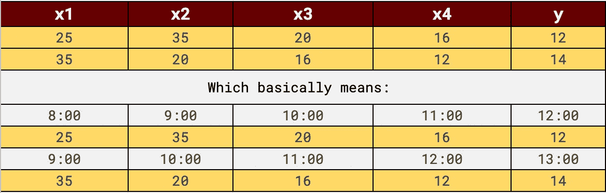

# 同时在 Spark 上训练多个时间序列模型，使用 XGBoost

> 原文：[`towardsdatascience.com/concurrently-train-multiple-time-series-models-over-spark-with-xgboost-c6d5ec4a6430?source=collection_archive---------5-----------------------#2023-03-17`](https://towardsdatascience.com/concurrently-train-multiple-time-series-models-over-spark-with-xgboost-c6d5ec4a6430?source=collection_archive---------5-----------------------#2023-03-17)

## 利用 Apache Spark 的分布式计算能力，同时在大数据上训练成千上万的自回归时间序列模型。

[](https://medium.com/@alon.agmon?source=post_page-----c6d5ec4a6430--------------------------------)[](https://towardsdatascience.com/?source=post_page-----c6d5ec4a6430--------------------------------) [Alon Agmon](https://medium.com/@alon.agmon?source=post_page-----c6d5ec4a6430--------------------------------)

·

[关注](https://medium.com/m/signin?actionUrl=https%3A%2F%2Fmedium.com%2F_%2Fsubscribe%2Fuser%2Fbcd1e3126cdc&operation=register&redirect=https%3A%2F%2Ftowardsdatascience.com%2Fconcurrently-train-multiple-time-series-models-over-spark-with-xgboost-c6d5ec4a6430&user=Alon+Agmon&userId=bcd1e3126cdc&source=post_page-bcd1e3126cdc----c6d5ec4a6430---------------------post_header-----------) 发表在[Towards Data Science](https://towardsdatascience.com/?source=post_page-----c6d5ec4a6430--------------------------------) ·12 分钟阅读·2023 年 3 月 17 日[](https://medium.com/m/signin?actionUrl=https%3A%2F%2Fmedium.com%2F_%2Fvote%2Ftowards-data-science%2Fc6d5ec4a6430&operation=register&redirect=https%3A%2F%2Ftowardsdatascience.com%2Fconcurrently-train-multiple-time-series-models-over-spark-with-xgboost-c6d5ec4a6430&user=Alon+Agmon&userId=bcd1e3126cdc&source=-----c6d5ec4a6430---------------------clap_footer-----------)

--

[](https://medium.com/m/signin?actionUrl=https%3A%2F%2Fmedium.com%2F_%2Fbookmark%2Fp%2Fc6d5ec4a6430&operation=register&redirect=https%3A%2F%2Ftowardsdatascience.com%2Fconcurrently-train-multiple-time-series-models-over-spark-with-xgboost-c6d5ec4a6430&source=-----c6d5ec4a6430---------------------bookmark_footer-----------)

照片由[Ricardo Gomez Angel](https://unsplash.com/@rgaleriacom?utm_source=medium&utm_medium=referral)拍摄，发布在[Unsplash](https://unsplash.com/?utm_source=medium&utm_medium=referral)上。

## 1\. 简介

假设你有一个包含客户每小时交易的大型数据集，并且你的任务是帮助公司预测和识别其交易模式中的异常。产品经理解释道：“如果某些客户的交易率突然下降，我们希望了解这一点，问题是我们必须自动化这一过程，因为我们有太多客户需要跟踪。”你有足够的数据来训练一个不错的时间序列模型，但由于客户之间的交易模式差异较大，你需要为*每个客户*训练一个*模型*，以准确预测和检测*他们*特定的使用模式中的异常。

我认为这对许多处理 SaaS 或零售客户数据的数据科学家和机器学习工程师来说是相当常见的任务。从机器学习的角度来看，这似乎不是一个复杂的任务，但它很快可能变成工程噩梦。如果我们有数千甚至数十万的客户怎么办？我们应该如何训练和管理数千个模型？如果我们需要相对频繁地创建这些预测，甚至是实时预测怎么办？当数据量不断增长时，即使是简单的需求也可能变得要求苛刻，我们需要确保拥有一个可以随着数据增长而可靠扩展的基础设施。

同时在巨大数据集上训练多个模型实际上是为分布式集群（如 Spark）训练提供合理性的一种少数情况之一。我知道这是一种有争议的说法，但对于结构化的表格数据，通常在分布式集群上训练（而不是在抽样数据上，例如）往往并不合理。然而，当我们需要处理的数据确实是“庞大的”，并且我们需要将其拆分成多个数据集并在每个数据集上训练一个 ML 模型时，那么 Spark 似乎是正确的方向。

使用 Spark 进行模型训练提供了很多功能，但也带来了相当多的挑战，主要集中在数据如何组织和格式化上。本文的目的是展示至少一种使用 Spark（和 Scala）从数据格式化到模型训练和预测的完整解决方案。

具体而言，在接下来的内容中，我们将使用 XGBoost 在每个客户的时间序列数据上训练一个自回归（“AR”）时间序列模型。简而言之，AR 模型将待预测值作为其先前值的线性函数。换句话说，它将给定客户在小时*h*的交易数量建模为他们在小时*h -1, h -2, h -3, h -n*的交易数量的函数。这类模型通常能为此类任务提供相当可靠的预测，也可以使用广泛可用且易于使用的提升树模型来实现。实际上，我们将简单地使用 XGBoost 回归来实现这一点。

时间序列训练和预测中最棘手的部分是正确“工程化”特征。第二部分简要说明了自回归在时间序列中的工作原理，并展示了如何使用纯 SQL 对时间序列数据进行 AR 任务建模。第三部分重点讲述了如何将数据集加载到 Spark 中，并展示了如何将其“拆分”成多个训练任务和数据集。最后，使用 Spark 的 MLlib 进行机器学习模型训练所涉及的一些复杂性被认为是繁琐且直观不易的。我将演示如何在不使用 MLlib API 的情况下完成这一任务。第四部分专注于预测或预报阶段。第五部分进行总结。

## 2\. AR 时间序列模型的基本特征工程

将时间序列数据建模为自回归问题中最棘手的部分是正确地组织和格式化数据。一个简化的实际示例可能会使这个想法（和挑战）更清晰。

假设我们有收集了 6 小时的每小时交易数据——从上午 8 点到下午 1 点，我们想要预测每个客户在下午 2 点的交易次数。


数据集 A — 我们开始使用的数据格式

我们决定在回归中使用 4 个参数，这意味着我们将使用客户在上午 10 点到下午 1 点之间的交易次数来预测他们在下午 2 点的交易次数。这反映了我们对数据的一个更普遍的直觉——4 小时的数据足以准确预测或解释第 5 小时（请注意，这是一个非常天真的简化示例，现实中显然并非如此）。这意味着，如果我们有足够的数据样本，那么一个训练良好的模型应该能够学习客户数据中的模式，从而准确预测给定前 4 小时的任何时刻的交易数量（我故意忽略了季节性这一概念，它在时间序列分析中是一个重要的概念）。

要训练这样的模型，我们需要创建一个具有 4 个特征的训练集。我们训练集中的每一行将包括一个目标变量，该变量表示给定小时的交易次数，以及 4 个捕捉前 4 小时交易次数的参数。通过“透视”上表，并创建一个滑动窗口（4 小时），我们可以创建一个类似于下面的数据集（按客户划分）：



数据集 B（前两行表示实际数据），下面的行解释了这些数据代表什么）

理想情况下，我们会有更多数据，但思想是相同的，我们的模型应该“看到”足够多的 4 小时样本，以便学会如何正确预测第 5 小时，即我们的 *y* 或目标变量。因为我们希望模型检测数据中的模式，所以需要确保它学习得足够 — 有时 6 小时就足以准确预测第 7 小时，有时我们需要至少一周的数据。

创建这样一个训练集的简单方法是使用 SQL 查询（可以使用 SparkSQL 或其他查询引擎运行），查询如下：

```py
WITH top_customers as (
    --- select the customter ids you want to track
),

transactions as (
    SELECT 
      cust_id, 
      dt, 
      date_trunc('hour', cast(event_time as timestamp)) as event_hour, 
      count(*) as transactions
    FROM ourTable
    WHERE
        dt between cast(date_add('day', -7, current_date) as varchar) 
        and cast(current_date as varchar)
    GROUP BY 1,2,3 Order By event_hour asc
)

SELECT transactions.cust_id,
       transactions.event_hour,
       day_of_week(transactions.event_hour) day_of_week,
        hour(transactions.event_hour) hour_of_day,
        transactions.transactions as transactions,
        LAG(transactions,1) OVER 
          (PARTITION BY transactions.cust_id ORDER BY event_hour) AS lag1,
        LAG(transactions,2) OVER 
          (PARTITION BY transactions.cust_id ORDER BY event_hour) AS lag2,
        LAG(transactions,3) OVER 
          (PARTITION BY transactions.cust_id ORDER BY event_hour) AS lag3,
        LAG(transactions,4) OVER 
          (PARTITION BY transactions.cust_id ORDER BY event_hour) AS lag4
FROM transactions 
    join top_customers 
      on transactions.cust_id = top_customers.cust_id
```

查询以 2 个 WITH 子句开始：第一个子句仅提取我们感兴趣的客户列表。在这里，您可以添加任何条件以过滤特定客户（也许您想过滤新客户或仅包括流量足够的客户）。第二个 WITH 子句简单地创建第一个数据集 — *数据集 A*，该数据集提取这些客户一周的数据，并选择客户 ID、日期、小时和交易次数。

最后，最重要的 SELECT 子句生成 *数据集 B*，通过对每一行使用 SQL *lag()* 函数，以捕获在该行时间之前的每小时的交易次数。我们的结果应该类似于：

```py
"cust_id", "event_hour", "day_of_week", "hour_of_day", "transactions", "lag1", "lag2", "lag3", "lag4"
"Customer-123","2023-01-14 00:00:00.000","6","0","4093",,,,,,
"Customer-123","2023-01-14 01:00:00.000","6","1","4628","4093",,,,,
"Customer-123","2023-01-14 02:00:00.000","6","2","5138","4628","4093",,,,
"Customer-123","2023-01-14 03:00:00.000","6","3","5412","5138","4628","4093",,,
"Customer-123","2023-01-14 04:00:00.000","6","4","5645","5412","5138","4628","4093",
"Customer-123","2023-01-14 05:00:00.000","6","5","5676","5645","5412","5138","4628",
"Customer-123","2023-01-14 06:00:00.000","6","6","6045","5676","5645","5412","5138",
"Customer-123","2023-01-14 07:00:00.000","6","7","6558","6045","5676","5645","5412",
```

如您所见，每一行（包含所有滞后值），都有一个客户 ID、小时（作为截断日期）、小时（表示为整数）、客户在该小时的交易次数（这将是我们训练集中的目标变量），以及 4 个字段，捕获目标变量之前 4 小时的滞后交易次数（这些将是特征或参数，我们的自回归模型将学习识别模式）。

现在我们已经准备好了数据集，可以开始使用 Spark 进行训练。

## 3. 数据加载和模型训练使用 Spark

***3.1 数据加载*** 此时，我们的数据集几乎已准备好进行模型训练和预测。大部分涉及数据在滑动窗口中组织的繁重工作已通过 SQL 完成。下一阶段是使用 Spark 读取结果并创建一个准备好进行模型训练的类型化 Spark 数据集。这个过程或转换将通过下面的函数实现（解释紧随其后）。

类型化数据集将基于名为 *FeaturesRecord* 的案例类（第 1 行–2 行），它将表示一个数据样本。每个特征记录有 4 个属性：*key* 是客户 ID，*ts* 是该记录捕获的时间，*label* 是目标变量 — 特定时间或 *ts* 的交易次数，*features* 是一个值序列，代表客户在前几小时的交易次数。

上述函数中所有变量的提取相当直接。功能性技巧（Scala 实现的）是我们构建特征向量的方式（第 11-12 行）。此外，如你所见，其他特征也可以添加到特征向量中，例如 *day_of_week*，这将使我们的模型能够学习数据中的一些季节性。

***3.2 模型训练***

模型的训练将分为三个阶段。事先回顾一下，复杂化我们任务的一个要求是我们需要为每个客户训练一个模型，以捕捉每个客户的模式和季节性。然而，我们目前拥有的是一个包含*所有*客户数据的数据集。所以我们需要做的第一件事是“拆分”成更小的数据集，然后在每个数据集上训练我们的模型。

幸运的是，这可以通过使用 Spark 的（非常有用的）*flatMapGroups()* 函数相对容易地完成，它正是做这件事的。

```py
def predict(customerID:String, records:Iterator[FeaturesRecord]) = ???

featuresDS.groupByKey(_.key).flatMapGroups(predict)
```

记住，我们的数据集是类型化的，并基于类 FeaturesRecord，该类具有代表客户 ID 的 *key* 属性。使用 Spark 的 *groupByKey()* 后跟 *flatMapGroups()*，我们能够“拆分”我们的庞大数据集，并在每个客户的数据上调用 *predict()* 函数（该函数实际上同时执行训练和预测）。根据 Spark 的配置，Spark 也能并行化此调用，这意味着我们也能以允许扩展和快速处理的方式并发执行。

让我们逐行查看 predict() 函数（尽管下一节将重点关注预测和预测阶段）：

主要流程

predict 函数展开为三个阶段，最终返回一个类型为*PredictionResult*的案例类（我将在下一节中讨论这个）。在第一阶段，函数 *getForcastDatasets()* 仅仅将记录分为两个序列——一个基于所有记录*但*最后两小时（这是我们的模型将要学习的数据集），另一个仅包含最后两小时（这是我们的模型将要预测的序列）。

在我们的案例中，我必须忽略最后一个数据点，因为它可能不完整，因此训练数据将包括所有记录，但不包括最后三个，而预测数据将基于记录 N-1 和 N-2（排除 N——最后一个）。

在第二阶段，我们在训练集上训练我们的模型。训练函数相当简单。我们基本上调用 XGBoost 的训练函数，使用我们的训练数据集和一个包含回归参数的映射。该函数返回一个 Booster 对象或一个训练好的模型。接下来，Booster 对象将用于在预测序列上运行预测。（需要注意的是，模型选择需要小心，因为并非所有时间序列问题都适合树模型的捕捉。）

然而，有一个技巧值得提及。如您所见，在我们将 FeatureRecords 序列传递给训练方法之前，我们调用了一个名为 *toDMatrix()* 的函数。XGBoost 的训练方法需要一个 DMatrix 对象来表示其样本数据。为此，我们需要将每个 FeatureRecords 序列转换为 DMatrix。为此，我创建了 *toDMatrix()* 函数，使用隐式 Scala 类，该类接受一个 *Seq* 作为参数，并提供一个 toDMatrix 函数，将每个 FeatureRecord 转换为 XBoost 的 LabeledPoint，然后输入到 DMatrix 中，并由函数返回。

现在我们已经拥有将数据集转换为 XGBoost 训练数据集所需的函数，我们可以进行训练并使用训练好的模型预测接下来的几个小时。

## 4 预测和预报

理想情况下，在训练过程中，我们的模型已经“看到”了许多 4 小时的样本，并学会了如何预测第 5 小时。这对于两种任务非常有用：简单预测和异常检测。后者在此背景下是一个有趣且有用的任务。常见的技术非常简单：如果我们利用最后几个小时的时间序列数据，并用我们的模型预测最后一个小时，那么一个训练良好的模型应该会给我们一个与实际数字非常接近的预测。然而，如果预测的数字过高或过低，则可能意味着两种情况：要么模型不准确，要么最后一个小时的真实数据是意外的或异常的。例如，假设我们学会了识别特定交汇点 24 小时内的交通压力，一天由于事故出现了异常交通拥堵。如果我们预测这一小时并与实际数据进行比较，我们会发现预测的压力明显低于实际压力。这可能意味着模型完全错误，或者它准确地捕捉到当前存在异常的事实。

我们将遵循这个逻辑，通过将预测值与实际值进行除法运算来衡量它们之间的差异。这样，假设我们的模型是准确的，值为 1 将表明实际数据确实被预测并期望，而值小于 1 将意味着实际数据似乎低于预期，我们可能需要对此客户发出警报。

为了进行预测，我们将使用一个名为 *PredictionResult* 的 case 类，该类将包含一个 *key*（客户）、*ts*（时间戳）、*label*（实际数据）、*prediction*（预测值）和 *ratio*（两者之间的差异）。

我们通过在特征向量上调用 Booster 的 *predict()* 方法来生成预测。接下来，我们将特征记录与相关的预测结果 *zip()* 在一起，以构建每个预测的 *PredictionResult* 对象（第 11 行），该对象还将计算实际值与预测值之间的比率。最后，我们使用 PredictionResult 的列表构建一个类型化的数据集，其样例如下：


正如你所见，比例列可以帮助我们识别有趣的异常。对于大多数记录，你可以看到值非常接近 1，这意味着实际值几乎与预测值相同，但我们确实可以找到一些异常，主要是实际值比预测值高出 20%–40%。

## 5\. 结论

大规模多模型训练是一项工程挑战，特别是当数据不断增长时，我们希望从更多数据中获益。对于一个、五个或十个模型表现良好的机器学习管道，当同时训练的模型数量增加到数百甚至上千时，可能会开始出现瓶颈。

Apache Spark 是一个很棒的大规模训练工具，但用于机器学习任务时，它与常见的基于 Python 的框架有所不同，并且并不适合所有项目。在这篇文章中，我演示了如何创建一个能够扩展的训练管道。我选择了时间序列预测作为示例，因为从工程角度来看，它被认为是相对复杂的任务，尽管可以很容易地使用相同的技术栈适应回归和分类问题。

我们看到，创建训练集中的大量工作可以（也应该）通过 SQL 在支持 SQL 的查询引擎上完成，例如 Spark，以获得更好的可读性和速度。接下来，我们使用 Spark 的 Dataset APIs 将一个巨大的数据集拆分成多个小的训练任务。最后，我们使用 XGBoost 的 booster API 来训练一个自回归时间序列模型，并用它来检测客户数据中的异常。如前所述，多模型训练是一项很快变得非常复杂的任务。在这篇文章中，我试图展示 Spark 的 API 为我们提供了足够的工具，使其相对简单，并尽可能保持简洁。

祝工程愉快！希望这对你有帮助。

** 你可以在[这里](https://github.com/a-agmon/spark-ml/blob/main/spark-ts-xb.scala)找到完整示例代码的链接

*** 关于时间序列分析和自回归有很多资源。我认为我从中学到最多的资源是：*Forecasting: Principles and Practice (2nd ed)*，作者 Rob J Hyndman 和 George Athanasopoulos（在线获取地址：[这里](https://otexts.com/fpp2/advanced.html)）
