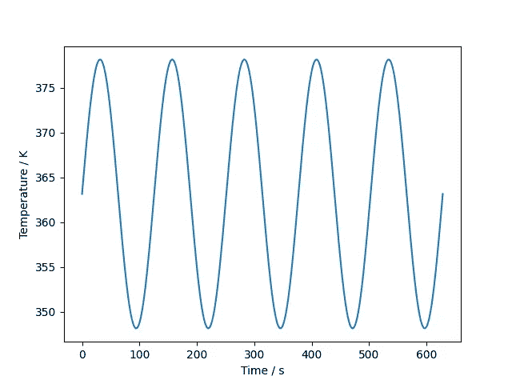
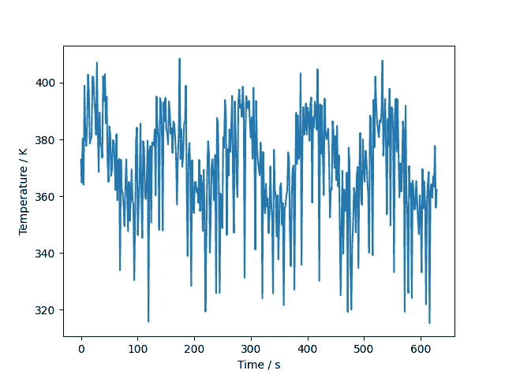
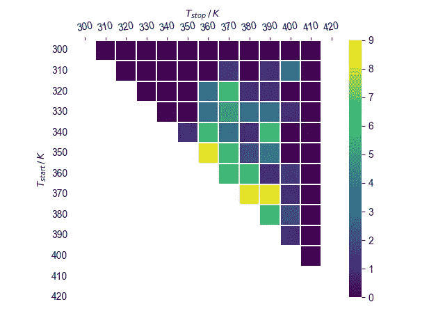
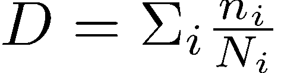

# 基于状态的维护：雨流计数

> 原文：[`towardsdatascience.com/condition-based-maintenance-rainflow-counting-f35abaefdc92?source=collection_archive---------7-----------------------#2023-10-02`](https://towardsdatascience.com/condition-based-maintenance-rainflow-counting-f35abaefdc92?source=collection_archive---------7-----------------------#2023-10-02)

## 剩余使用寿命预测的热循环分析

 [Aman Steinberg](https://medium.com/@aman.steinberg?source=post_page-----f35abaefdc92--------------------------------)

·

[关注](https://medium.com/m/signin?actionUrl=https%3A%2F%2Fmedium.com%2F_%2Fsubscribe%2Fuser%2F8596694b6819&operation=register&redirect=https%3A%2F%2Ftowardsdatascience.com%2Fcondition-based-maintenance-rainflow-counting-f35abaefdc92&user=Aman+Steinberg&userId=8596694b6819&source=post_page-8596694b6819----f35abaefdc92---------------------post_header-----------) 发表在 [Towards Data Science](https://towardsdatascience.com/?source=post_page-----f35abaefdc92--------------------------------) ·8 min read·2023 年 10 月 2 日

--

图像由 [作者](https://www.linkedin.com/in/amansteinberg/) 使用 [此工具](https://huggingface.co/spaces/runwayml/stable-diffusion-v1-5) 按照 [CreativeML Open RAIL-M 许可](https://huggingface.co/spaces/CompVis/stable-diffusion-license) 制作。

## 介绍

在当今数据驱动的世界中，企业越来越多地依赖技术来优化操作并减少停机时间。无论是电源、风力涡轮机、晶体管还是发动机——传感器在产品生命周期的各个阶段收集来自不同组件的数据：从开发到制造再到操作，企业通过数字化方式监控其产品。

因此，预测性维护、基于状态的维护和状态监测是近年来获得广泛欢迎的技术。通过分析传感器数据，例如温度、振动或压力，企业旨在预测设备和机器可能的故障，以便相应地安排维护。

状态监测对于跟踪系统组件的磨损至关重要，从而使你能够减少计划外的停机时间，最大化可用性和运行时间，降低维护成本，制定更好的维护计划，有效管理备件，保持客户满意和快乐——这仅仅是基于状态和预测性维护的一些优点。

可以区分三种一般类型的维护：

+   反应性维护：仅在发生故障后才进行维护，这意味着涉及到计划外的停机时间和修理成本；

+   预防性维护：在固定的间隔时间进行维护，这有可能导致尽管设备完全正常，但却进行过多的维护操作；

+   预测性维护：解决了这些问题，因为它依赖于数据和状态监测来可靠地预测给定组件的故障发生时间。通过这种方式，可以有效地安排检查或维护的停机时间，并以智能的方式准备资源。

在这篇文章中，我想探讨监测半导体场景的技术，灵感来自于参考文献 1¹。由于雨流计数法可以扩展到半导体应用之外，这里呈现的结果可以适应各种商业案例。

因此，无论你是一个希望改善组织维护计划的维护经理，还是一个希望减少停机时间并提高效率的企业主，这篇博客文章都适合你。

## *半导体在工作中——应力剖面*

半导体运行着我们的现代世界——你可以在风力涡轮机的功率模块、光伏系统、电动汽车等许多地方找到它们。因此，对组件的磨损和整体状态进行实时监测是至关重要的。在半导体中，热机械疲劳是功率模块中晶体管故障的根本原因之一。

由于半导体中的不同材料具有不同的热膨胀系数，温度波动会导致机械应力。当晶体管经历循环负荷时，相关的热机械应力会导致晶体管内部材料的疲劳，进而导致降解，最终发生故障。这可能最终导致你希望操作的整个系统崩溃。显然，可靠估计组件的剩余使用寿命非常重要，考虑到系统和部件在运行中承受的应力负荷。

假设理想的循环加载，半导体温度的时间序列将是正弦波的，参见图 1。

图 1：正弦波温度时间序列。图表由 [Pia Baronetzky](https://www.linkedin.com/in/pia-baronetzky/) 和 [作者](https://www.linkedin.com/in/amansteinberg/) 生成。

在这种情况下，所有应力周期将具有相同的温度幅度和相同的周期持续时间。计数应力周期并量化它们对材料造成的损害将会很简单。

实际上，一个可信的温度时间序列如下所示，参见图 2：

图 2：更现实的温度时间序列。图表由 [Pia Baronetzky](https://www.linkedin.com/in/pia-baronetzky/) 和 [作者](https://www.linkedin.com/in/amansteinberg/) 生成。

用户行为很难完全模拟，并且可能会与实验室设置有所偏差。此外，环境因素也很难建模或预测。因此，个别周期在持续时间和幅度上会有所不同，某个大幅度的单一周期可能会持续几分钟、几小时甚至几天，而几个小幅度的加载周期在大幅度周期结束前开始和停止。

为了在现实情境中正确计数所有周期并量化它们造成的损害，必须使用雨流计数。

## 雨流计数

雨流计数是疲劳分析中的标准程序，自 1968 年由 T. Endo 和 M. Matsuishi 开发后，被纳入*疲劳分析中的循环计数标准实践²*等其他循环计数方法中。

在进行雨流分析时，你不仅在评估系统的当前状态，还考虑了给定观测值的整个时间序列历史。这使得雨流计数在状态监测中既强大又可靠。

在我们的场景中，我们分析一个温度时间序列。

首先，提取时间序列的极值。两个连续的极值（最小值跟随最大值或反之）构成一个半周期，两极值之间的温差称为周期幅度或应力范围。

考虑一个以最小值开始并以最大值结束的上升半周期（相反情况可以类比处理）。半周期的最小值称为起始值，最大值称为终止值。

当下一个下降半周期降到或低于初始上升周期的起始值时，上升半周期被闭合为一个完整周期。类比地，当下一个上升半周期升到或高于初始下降周期的起始值时，下降半周期被闭合为一个完整周期。

一旦一个周期结束，它会从时间序列中移除，并贡献 1 个雨流周期计数及其对应的周期幅度。在对时间序列进行完整的雨流计数后，可能会有悬挂的半周期无法关闭，这将贡献 0.5 个雨流周期计数及其对应的周期幅度。

这样，可以得到一个雨流周期分布 (a_i, n_i)，其中 a_i 是周期幅度，n_i 是雨流周期计数。

通常的做法是对周期幅度进行分箱，以减少复杂性并使不同机器的雨流分析结果能够进行比较，但观察量（在我们的例子中是温度）是相同的。

为了简化，我们将得到的雨流周期分布表示为 (a_i, n_i)，其中 a_i 是分箱后的周期幅度，n_i 是对应的雨流周期计数。

可视化雨流分析的一种方便方法是绘制底层时间序列的雨流矩阵，参见图 3：

图 3：图 2 所示温度时间序列的雨流矩阵。对角线上的雨流周期被省略，请参见下面的文字。图由 [Pia Baronetzky](https://www.linkedin.com/in/pia-baronetzky/) 和 [作者](https://www.linkedin.com/in/amansteinberg/) 生成。

垂直轴显示了雨流周期的起始值，而可以在水平轴上看到停止值。

如果一个雨流周期在同一温度箱或相邻的温度箱内开始和停止，它将最终出现在雨流矩阵的对角线上或第一条子对角线上。

由于对角线上的雨流周期对热机械疲劳的贡献几乎可以忽略，因此在图 3 中将其省略。

从低温开始并在高温处停止的全负荷周期会在雨流矩阵中远离对角线的地方出现，如雨流矩阵的右上角所示。

这些全负荷周期对材料的劣化和剩余使用寿命的减少贡献最大，而来自雨流矩阵对角线（接近对角线）的周期对材料造成的伤害很小甚至没有伤害。

颜色编码告诉我们，大多数周期位于雨流矩阵的第一条子对角线，而只有少数对应于全负荷周期的周期出现在远离对角线的角落，这是一种常见情况，并且反映了图 2 中所示的温度时间序列。

## 剩余使用寿命

现在我们可以正确地量化和监测系统组件所承受的应力负荷，我们希望将这些信息转换为材料损伤和/或疲劳的度量。

对于任何给定的温度或应力区间，即循环幅度`a_i`，存在一个最大疲劳寿命`N_i`，表示材料在给定应力水平下能够承受的最大 Rainflow 循环次数，直到发生失效。这些信息被编码在 Wöhler 曲线中，该曲线需要通过实验或仿真来确定。在资源有限的情况下，生成 Wöhler 曲线是困难的。因此，我们借助于机器学习方法，如下面将要展示的*scikit-learn*的[SGDRegressor](https://scikit-learn.org/stable/modules/generated/sklearn.linear_model.SGDRegressor.html)。

Palmgren-Miner 规则³告诉我们，一个组件所承受的总损伤是各应力水平相对损伤的总和，其中相对损伤由`n_i`（某一应力水平的 Rainflow 循环次数）与`N_i`（相应疲劳寿命）给出。

方程 1：由 Palmgren-Miner 规则描述的总损伤 D。

当 D=1 时，组件已经积累了总损伤并发生断裂。因此，总损伤的倒数作为剩余有效寿命的度量。

基于条件的维护已经可以通过可靠的实时监控来实现，该监控能够积累应力并衡量何时需要安排下一次维护计划。

对于基于实时监控数据的机器学习模型预测，我们需要更进一步。

## *预测性维护 — 研究合作*

由于 Palmgren-Miner 规则假设损伤是线性积累的，因此存在一些不足之处：模型忽略了所有发生的应力载荷循环的时间顺序和交叉相关性。它还假设不同应力水平的循环对总损伤的贡献具有相同的权重。

在[慕尼黑数据科学研究所](https://www.mdsi.tum.de/en/mdsi/home/)与[慕尼黑工业大学](https://www.tum.de/en/)和[PROCON IT GmbH](https://www.procon-it.de/)之间的[研究合作](https://www.mdsi.tum.de/en/di-lab/vergangene-projekte/ss2023-procon-it-remaining-lifetime-estimation-in-semiconductor-scenarios)⁴中，我们通过利用*scikit-learn*的[SGDRegressor](https://scikit-learn.org/stable/modules/generated/sklearn.linear_model.SGDRegressor.html)等机器学习技术来解决这些不足之处。

我们让模型学习相对损伤对总损伤 D 的权重，而不是假设所有应力水平的权重相等，以准确预测失效概率。结果是有希望的，并且这一过程可以扩展到众多不同的用例、系统和输入观察变量。

欲了解更多信息，请查看[报告](https://www.mdsi.tum.de/fileadmin/w00cet/di-lab/pdf/Final_Report_ProconIT___TUM-DI-LAB_SS2023-1.pdf)⁵。

通过这种方式，我们将基于条件的维护计划扩展到预测性维护计划。

## 结论

企业旨在利用其数据，将维护策略从反应性或预防性维护推进到基于条件甚至预测性维护。

传感器数据提供了有关系统组件磨损的洞察。为了可靠地量化组件已积累的损伤并进行状态监测，可以使用雨流计数。

根据矿工规则给出的总损伤的逆数可以作为剩余有效寿命的估算。

为了从基于条件的维护转向预测性维护，可以利用机器学习技术，这在[慕尼黑数据科学研究所](https://www.mdsi.tum.de/en/mdsi/home/)与[慕尼黑工业大学](https://www.tum.de/en/)和[PROCON IT GmbH](https://www.procon-it.de/)之间的研究合作中得到了展示。

> 作者对所有参与本工作的人员表示衷心的感谢。

## 参考文献

[1] M. Andresen, G. Buticchi, M. Liserre, [功率电子系统主动热控的可靠性-效率权衡研究](https://doi.org/10.1016/j.microrel.2015.12.017), Microelectronics Reliability Volume 58 March 2016 Pages 119–125

[2] [疲劳分析中的周期计数标准实践](https://www.astm.org/e1049-85r17.html), ASTM1049–85

[3] M. A. Miner, [疲劳中的累计损伤](https://doi.org/10.1115/1.4009458), J. Appl. Mech. Sep 1945 12(3) A159-A164

[4] [*半导体场景中的剩余寿命估算*](https://www.mdsi.tum.de/en/di-lab/vergangene-projekte/ss2023-procon-it-remaining-lifetime-estimation-in-semiconductor-scenarios/), TUM-DI-LAB 2023

[5] S. Bayer, O. Neumann, D. Raj, Y. Savva, [半导体场景中的剩余寿命估算](https://www.mdsi.tum.de/fileadmin/w00cet/di-lab/pdf/Final_Report_ProconIT___TUM-DI-LAB_SS2023-1.pdf), TUM-DI-LAB 2023
