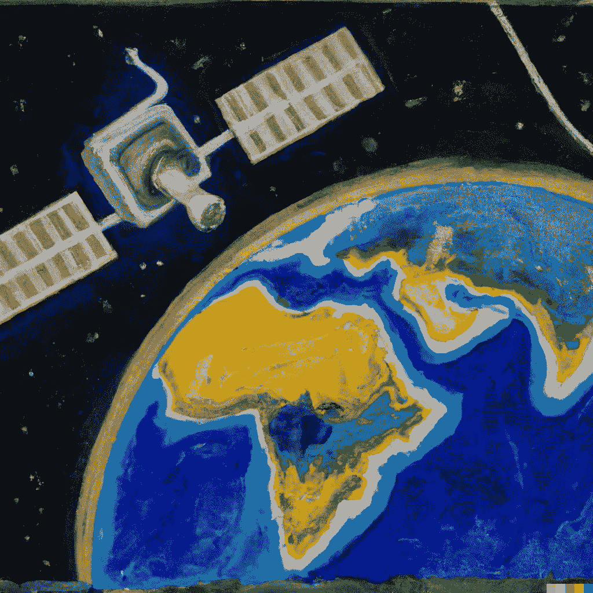

# 配置用于空间分析的最小 Docker 镜像，使用 Python

> 原文：[`towardsdatascience.com/configuring-a-minimal-docker-image-for-spatial-analysis-with-python-dc9970ca8a8a?source=collection_archive---------4-----------------------#2023-02-10`](https://towardsdatascience.com/configuring-a-minimal-docker-image-for-spatial-analysis-with-python-dc9970ca8a8a?source=collection_archive---------4-----------------------#2023-02-10)

## 学习如何安装基本的地理空间依赖项，例如 GDAL 和 XArray，并将它们部署为容器

 [Maurício Cordeiro](https://cordmaur.medium.com/?source=post_page-----dc9970ca8a8a--------------------------------)

·

[关注](https://medium.com/m/signin?actionUrl=https%3A%2F%2Fmedium.com%2F_%2Fsubscribe%2Fuser%2F8878c77fe1a3&operation=register&redirect=https%3A%2F%2Ftowardsdatascience.com%2Fconfiguring-a-minimal-docker-image-for-spatial-analysis-with-python-dc9970ca8a8a&user=Maur%C3%ADcio+Cordeiro&userId=8878c77fe1a3&source=post_page-8878c77fe1a3----dc9970ca8a8a---------------------post_header-----------) 发表在 [Towards Data Science](https://towardsdatascience.com/?source=post_page-----dc9970ca8a8a--------------------------------) ·6 分钟阅读·2023 年 2 月 10 日

--

使用 Dall-E 2 创建的图像。标题：“地球的油画，旁边有一颗卫星”。

> 由于 Medium.com 政策变动，非会员阅读的规定已于 2023 年 9 月实施，本文现在可以在**geocorner.net**上自由访问：[`www.geocorner.net/post/configuring-a-minimal-docker-image-for-spatial-analysis-with-python`](https://www.geocorner.net/post/configuring-a-minimal-docker-image-for-spatial-analysis-with-python)

# 介绍

初学者很快就会明白使用虚拟环境和包管理工具的重要性。可用的包数量庞大，维护依赖关系之间的兼容性是一个挑战，这使得虚拟环境和包管理成为组织良好的 Python 环境中的关键组成部分。

管理依赖关系的复杂性在进行地理空间分析时会加剧。除了数据科学中使用的众多包外，还需要引入诸如 GDAL、Rasterio 和 STAC 等专门的库来支持这种类型的分析。此外，众所周知，无论操作系统架构是 Windows、Linux 还是 Mac，GDAL 的安装都可能特别困难。
