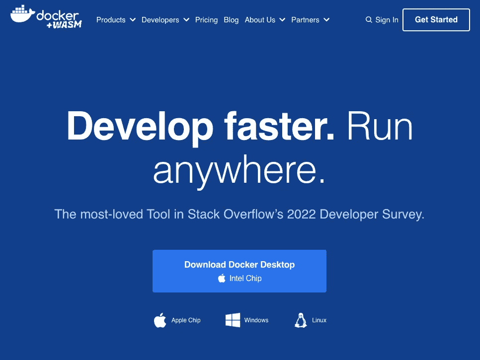
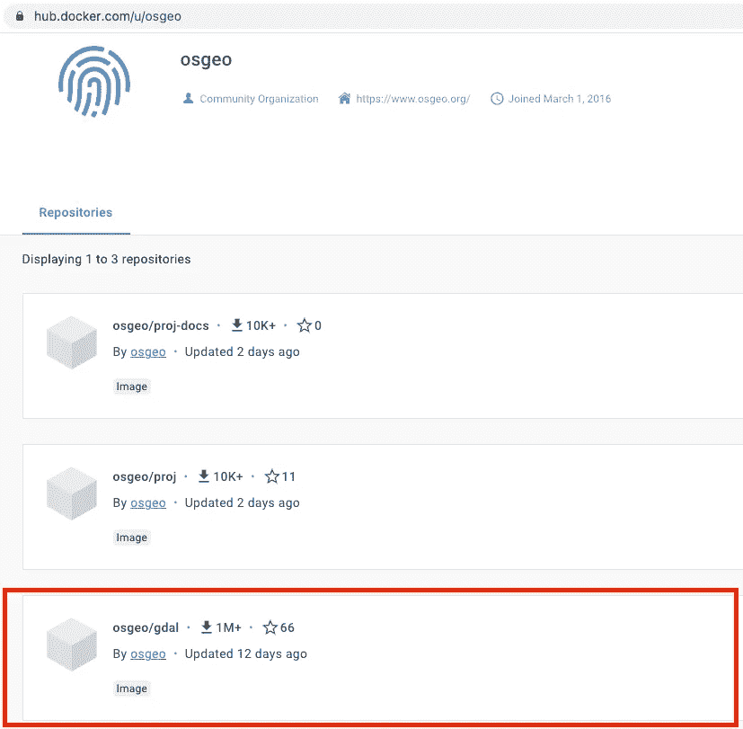
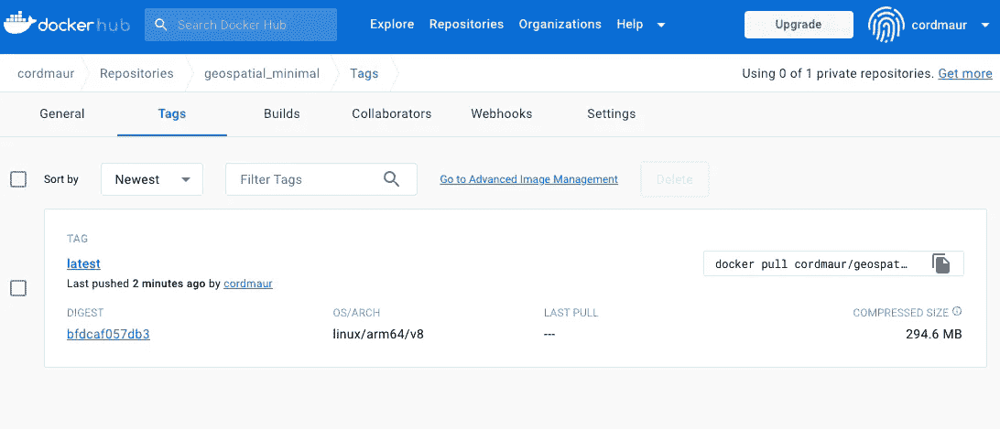

# 配置用于空间分析的最小 Docker 镜像与 Python

> 原文：[`towardsdatascience.com/configuring-a-minimal-docker-image-for-spatial-analysis-with-python-dc9970ca8a8a`](https://towardsdatascience.com/configuring-a-minimal-docker-image-for-spatial-analysis-with-python-dc9970ca8a8a)

## 学习如何安装基本的地理空间依赖项，如 GDAL 和 XArray，并将其作为容器部署

[](https://cordmaur.medium.com/?source=post_page-----dc9970ca8a8a--------------------------------)[](https://towardsdatascience.com/?source=post_page-----dc9970ca8a8a--------------------------------) [Maurício Cordeiro](https://cordmaur.medium.com/?source=post_page-----dc9970ca8a8a--------------------------------)

·发表于 [Towards Data Science](https://towardsdatascience.com/?source=post_page-----dc9970ca8a8a--------------------------------) ·6 分钟阅读·2023 年 2 月 10 日

--


使用 Dall-E 2 创建的图像。说明：'地球的油画，旁边有一颗卫星'。

> 由于 Medium.com 政策在 2023 年 9 月的变化，非会员阅读限制已实施，该帖子现在可以在 **geocorner.net** 上免费阅读：[`www.geocorner.net/post/configuring-a-minimal-docker-image-for-spatial-analysis-with-python`](https://www.geocorner.net/post/configuring-a-minimal-docker-image-for-spatial-analysis-with-python)

# 介绍

Python 编程语言的新手很快就会理解利用虚拟环境和包管理工具的重要性。可用的包数量庞大，这使得维护依赖项之间的兼容性成为挑战，因此虚拟环境和包管理是一个井然有序的 Python 环境的关键组成部分。

在进行地理空间分析时，依赖项管理的复杂性会加剧。除了数据科学中使用的众多包，还需要整合诸如 GDAL、Rasterio 和 STAC 等专业库来支持这类分析。此外，众所周知，无论操作系统架构是 Windows、Linux 还是 Mac，安装 GDAL 都特别困难。

如果你想将你的地理空间环境部署到云服务器上，仅依靠基本的 conda 技能是不够的。容器化你的环境是确保目标部署环境中兼容性和稳定性的最佳方式。

所以，这篇文章来拯救你的日子！这是一个快速而直接的指南，帮助你设置一个极简的 Docker 镜像，加载了所有使用 Python 进行地理空间分析的基本工具。不再头疼，不再麻烦！

# 安装 Docker

首先，我们需要安装 Docker。在**Mac**或**Windows**上，可以通过从`docker.com`直接安装**Docker Desktop**来完成（图 1）。



图 1：Docker Desktop 安装。图像由作者提供。

如果你使用的是**linux**，可以使用`apt`包管理器进行安装：

```py
> sudo apt-get update
> sudo apt-get install docker.io
> sudo systemctl start docker
> docker run hello-world
```

# 基础镜像

下一步是找到一个基础镜像在 Docker Hub 上进行构建。有些镜像预装了所有的地理空间依赖项，例如 Pangeo 社区提供的镜像。然而，这些镜像的压缩大小较大，达到 1.42 GB。

通常，官方的 Python 镜像是运行 Python 的一个良好起点，但在这些镜像上安装 GDAL 可能很麻烦。在探索了各种选项后，我发现最简单的方法是从一个预装了 GDAL 的镜像开始。这个镜像由 OSGeo 社区提供，地址是`hub.docker.com/u/osgeo`（图 2）。



图 2：Docker HUB 提供的 OSGeo 镜像。图像由作者提供。

进入`osgeo/gdal`仓库后，我们可以转到`Tags`标签。除了**latest**镜像版本外，我们可以注意到还有几个其他版本可供不同用途和大小。最新版本的压缩大小超过 1GB。在尝试了不同版本后，我发现他们的‘ubuntu-small’版本在大小（142 MB 压缩）和与所需软件包的兼容性之间取得了良好的平衡。所以我们选择这个版本。

> **注意：** 以下步骤仅用于教育目的，并检查是否可以成功安装必要的软件包。我们可以直接跳到从此镜像创建 Dockerfile 的步骤。

在终端或命令行中，我们可以运行以下命令来拉取镜像、创建容器并进入其中：

```py
> docker pull osgeo/gdal:ubuntu-small-latest
> docker run -it osgeo/gdal:ubuntu-small-latest
```

注意提示符会更改为`root@<container_id>:/#`。

一旦“进入”容器，我们可以检查已安装的基本软件包版本。所以，输入命令`python`以进入 Python 解释器。

```py
Python 3.10.6 (main, Nov 14 2022, 16:10:14) [GCC 11.3.0] on linux
Type "help", "copyright", "credits" or "license" for more information.
>>> from osgeo import gdal
>>> gdal.__version__
'3.7.0dev-f26e795279c48852b44bc9659d728421544528b9'
>>> 
```

# 安装额外的软件包

好的，现在我们已经有了 Python 3.10.6 和地球上最难安装的软件包（是的，GDAL），我们可以使用 PIP 或 CONDA 安装额外的软件包，对吧？非常简单！

实际上并不是。如果你回到容器并尝试运行这些命令，默认情况下并未安装。因此，让我们安装 PIP：

```py
apt-get update 
apt-get -y install python3-pip --fix-missing
```

现在，安装了 pip 后，我们可以直接使用`pip install package1 package2 …`来安装所有额外的软件包。由于容器已经被隔离，我们将跳过在容器内部使用虚拟环境，并以 root 身份安装软件包。

# 创建 Dockerfile

现在，为了在其他架构（`aarch64`，`X86_64`等）中使其可重现，我们来创建一个 Dockerfile，将所有内容打包。首先创建一个名为 `Dockerfile` 的空文本文件，没有任何扩展名（这将使构建镜像时无需指定文件名变得更容易）。

Dockerfile 中的第一件事是指定基础镜像及其对应的标签。因此我们写：

```py
# Use an official GDAL image as the base image
FROM osgeo/gdal:ubuntu-small-latest
```

然后我们需要安装 PIP。为此，我们将编写一个 RUN 命令。

```py
# install pip
RUN apt-get update && apt-get -y install python3-pip --fix-missing
```

现在，我们有两个选择。

1- 连接几行 `pip install` 命令：

```py
# install necessary packages
RUN pip install geopandas rioxarray \
    pystac-client, etc...
```

2- 或者，为了使其更“优雅”，我们可以将依赖项写入 `requirements.txt` 文件中，使事情更有条理，我们可以创建一个包含所有要安装的包的 `requirements.txt` 文件，如下所示：

```py
geopandas
rasterio
xarray
rioxarray
pystac-client
...
```

然后，在 Dockerfile 中，我们将把 `requirements.txt` 复制到镜像中，使用 `pip install --no-cache-dir` 安装包以清除残留物，然后我们就完成了。完整的 Dockerfile 将如下所示：

```py
# Use an official GDAL image as the base image
FROM osgeo/gdal:ubuntu-small-latest

# install pip
RUN apt-get update && apt-get -y install python3-pip --fix-missing

# Set the working directory in the container
WORKDIR /app

# Copy the requirements.txt file to the container
COPY requirements.txt /app/

# Install the necessary dependencies
RUN pip install --no-cache-dir -r requirements.txt 
```

# 构建镜像

现在我们在文件系统中保存了 `requirements.txt` 和 `Dockerfile` 文件，我们可以使用以下命令构建最终镜像：

```py
docker build -t geospatial_minimal .
```

要将其推送到 DockerHub，需要将其指向一个仓库，如下所示：

```py
docker tag geospatial_minimal:latest <hub_user>/<hub_repository>:tag
docker push <hub_user>/<hub_repository>:tag
```

看！这个镜像可以公开访问，地址是 [`hub.docker.com/repository/docker/cordmaur/geospatial_minimal/`](https://hub.docker.com/repository/docker/cordmaur/geospatial_minimal/)，最重要的是，镜像大小小于 300Mb（图 3）。尽情享用吧！



图 3：DockerHub 仓库中的镜像。图像由作者提供。

# 结论

通过遵循本文中列出的步骤，我们成功创建了一个小于 300Mb 且高效的 Docker 镜像，配备了 Python 3.10 中的所有必需依赖项，用于地理空间分析。该镜像现在可以在云服务器上使用，以服务于地理空间应用，确保部署的兼容性和稳定性。

# 保持联系

*如果你喜欢这篇文章并且希望支持我作为作者，请考虑成为一个* [*Medium 会员*](https://cordmaur.medium.com/membership)*。每月只需$5，我将获得你会员费的一小部分佣金，对你没有额外费用。或者你也可以随时* [*请我喝杯咖啡*](https://www.buymeacoffee.com/cordmaurl) *。*

[](http://cordmaur.medium.com/membership?source=post_page-----dc9970ca8a8a--------------------------------) [## 使用我的推荐链接加入 Medium - Maurício Cordeiro

### 阅读来自 Maurício Cordeiro 的每个故事（以及 Medium 上的成千上万的其他作者）。你的会员费直接……

cordmaur.medium.com](http://cordmaur.medium.com/membership?source=post_page-----dc9970ca8a8a--------------------------------)
