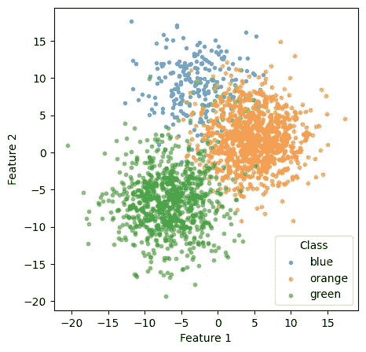
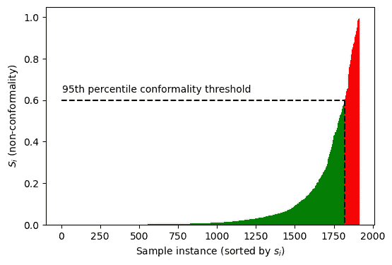
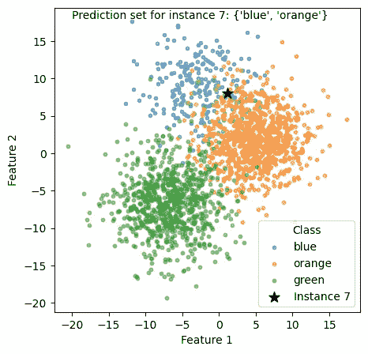

# 机器学习分类中的符合预测——从基础开始

> 原文：[`towardsdatascience.com/conformal-prediction-for-machine-learning-classification-from-the-ground-up-a12fcf6860d0?source=collection_archive---------1-----------------------#2023-11-24`](https://towardsdatascience.com/conformal-prediction-for-machine-learning-classification-from-the-ground-up-a12fcf6860d0?source=collection_archive---------1-----------------------#2023-11-24)

## 实现分类的符合预测，无需定制软件包，以及如何在各类别之间平衡覆盖率（召回率）

[](https://medium.com/@michael.allen1966?source=post_page-----a12fcf6860d0--------------------------------)[](https://towardsdatascience.com/?source=post_page-----a12fcf6860d0--------------------------------) [迈克尔·艾伦](https://medium.com/@michael.allen1966?source=post_page-----a12fcf6860d0--------------------------------)

·

[关注](https://medium.com/m/signin?actionUrl=https%3A%2F%2Fmedium.com%2F_%2Fsubscribe%2Fuser%2F82abbb73efe6&operation=register&redirect=https%3A%2F%2Ftowardsdatascience.com%2Fconformal-prediction-for-machine-learning-classification-from-the-ground-up-a12fcf6860d0&user=Michael+Allen&userId=82abbb73efe6&source=post_page-82abbb73efe6----a12fcf6860d0---------------------post_header-----------) 发表在 [Towards Data Science](https://towardsdatascience.com/?source=post_page-----a12fcf6860d0--------------------------------) ·11 min read·2023 年 11 月 24 日[](https://medium.com/m/signin?actionUrl=https%3A%2F%2Fmedium.com%2F_%2Fvote%2Ftowards-data-science%2Fa12fcf6860d0&operation=register&redirect=https%3A%2F%2Ftowardsdatascience.com%2Fconformal-prediction-for-machine-learning-classification-from-the-ground-up-a12fcf6860d0&user=Michael+Allen&userId=82abbb73efe6&source=-----a12fcf6860d0---------------------clap_footer-----------)

--

[](https://medium.com/m/signin?actionUrl=https%3A%2F%2Fmedium.com%2F_%2Fbookmark%2Fp%2Fa12fcf6860d0&operation=register&redirect=https%3A%2F%2Ftowardsdatascience.com%2Fconformal-prediction-for-machine-learning-classification-from-the-ground-up-a12fcf6860d0&source=-----a12fcf6860d0---------------------bookmark_footer-----------)

这篇博客文章的灵感来自克里斯·莫尔纳（Chris Molner）的书——[《符合预测简介》（Introduction to Conformal Prediction）](https://christophmolnar.com/books/conformal-prediction/)与 Python。克里斯擅长将新的机器学习技术呈现给他人。我特别推荐他关于可解释机器学习的书籍。

可以在这里找到带有完整代码（以及在线运行代码的链接）的 GitHub 仓库：[符合预测](https://github.com/MichaelAllen1966/conformal_prediction)。

# **什么是符合预测？**

符合预测既是不确定性量化的一种方法，也是分类实例的一种方法（可以为类别或子组进行微调）。不确定性通过将分类表示为潜在类别的集合而不是单个预测来传达。

符合预测指定了*覆盖率*，该覆盖率指定了真实结果被预测区域覆盖的概率。在符合预测中，预测区域的解释取决于任务。对于分类，我们得到预测集，而对于回归，我们得到预测区间。

下面是传统分类（最可能类别的平衡）和符合预测（集合）之间差异的示例。


基于最可能类别的“正常”分类和创建可能类别集的符合预测之间的区别。

此方法的优点包括：

+   **保证覆盖率**：符合预测生成的预测集具有真实结果的覆盖保证 — 即它们将检测到你设置为最小目标覆盖率的任何真实值百分比。符合预测不依赖于良好校准的模型 — 唯一重要的是，像所有机器学习一样，被分类的新样本必须来自于与训练和校准数据类似的数据分布。覆盖率还可以在类别或子组之间保证，尽管这需要方法中的额外步骤，我们将介绍。

+   **易于使用**：符合预测方法可以从头开始实现，只需几行代码，我们将在这里做。

+   **模型无关**：符合预测适用于任何机器学习模型。它使用你偏好的模型的正常输出。

+   **无分布假设**：符合预测对数据的潜在分布不做任何假设；它是一种非参数方法。

+   **无需重新训练**：符合预测可以在不重新训练模型的情况下使用。这是查看和使用模型输出的另一种方式。

+   **广泛应用**：符合预测适用于表格数据分类、图像或时间序列分类、回归等多种任务，尽管我们在这里只展示分类。

# **为什么我们要关心不确定性量化？**

不确定性量化在许多情况下至关重要：

+   当我们使用模型预测做出决策时，我们对这些预测有多确定？仅仅使用“最可能的类别”对我们的任务是否足够好？

+   当我们希望向利益相关者传达与我们的预测相关的不确定性时，而不谈论概率、赔率甚至对数赔率！

# **符合预测中的 Alpha — 描述** *覆盖范围*

*覆盖范围*是符合预测的关键。在分类中，它是特定类别所占据的数据的正常区域。覆盖范围等同于*敏感性*或*召回率*；它是分类集中被识别的观察值的比例。我们可以通过调整𝛼（*覆盖范围 = 1 —* 𝛼）来收紧或放宽覆盖区域。

# 让我们开始编程吧！

## 导入包

```py
import matplotlib.pyplot as plt
import numpy as np
import pandas as pd
from sklearn.datasets import make_blobs
from sklearn.linear_model import LogisticRegression
from sklearn.model_selection import train_test_split
```

## **为分类创建合成数据**

示例数据将使用 SK-Learn 的`make_blobs`方法生成。

```py
n_classes = 3
# Make train and test data
X, y = make_blobs(n_samples=10000, n_features=2, centers=n_classes, cluster_std=3.75, random_state=42)

# Reduce the size of the first class to create an imbalanced dataset

# Set numpy random seed
np.random.seed(42)
# Get index of when y is class 0
class_0_idx = np.where(y == 0)[0]
# Get 30% of the class 0 indices
class_0_idx = np.random.choice(class_0_idx, int(len(class_0_idx) * 0.3), replace=False)
# Get the index for all other classes
rest_idx = np.where(y != 0)[0]
# Combine the indices
idx = np.concatenate([class_0_idx, rest_idx])
# Shuffle the indices
np.random.shuffle(idx)
# Split the data
X = X[idx]
y = y[idx]

# Split off model training set
X_train, X_rest, y_train, y_rest = train_test_split(X, y, test_size=0.5, random_state=42)
# Split rest into calibration and test
X_Cal, X_test, y_cal, y_test = train_test_split(X_rest, y_rest, test_size=0.5, random_state=42)

# Set class labels
class_labels = ['blue', 'orange', 'green']
```

```py
# Plot the data
fig = plt.subplots(figsize=(5, 5))
ax = plt.subplot(111)
for i in range(n_classes):
    ax.scatter(X_test[y_test == i, 0], X_test[y_test == i, 1], label=class_labels[i], alpha=0.5, s=10)
legend = ax.legend()
legend.set_title("Class")
ax.set_xlabel("Feature 1")
ax.set_ylabel("Feature 2")
plt.show()
```



生成的数据（这些数据被创建为不平衡——蓝色类别的数据点仅占绿色或橙色类别的约 30%）。

## **构建分类器**

我们将在这里使用一个简单的逻辑回归模型，但该方法可以适用于任何模型，从基于表格数据的简单逻辑回归模型到用于图像分类的 3D 卷积神经网络。

```py
# Build and train the classifier
classifier = LogisticRegression(random_state=42)
classifier.fit(X_train, y_train)

# Test the classifier
y_pred = classifier.predict(X_test)
accuracy = np.mean(y_pred == y_test)
print(f"Accuracy: {accuracy:0.3f}")

# Test recall for each class
for i in range(n_classes):
    recall = np.mean(y_pred[y_test == i] == y_test[y_test == i])
    print(f"Recall for class {class_labels[i]}: {recall:0.3f}")
```

```py
Accuracy: 0.930
Recall for class blue: 0.772
Recall for class orange: 0.938
Recall for class green: 0.969
```

注意少数类的召回率低于其他类别。召回率，也称为敏感性，是分类器正确识别的某一类别中的数量。

## S_i**，或** *非一致性得分* **得分**

在符合预测中，非一致性得分，通常表示为*s_i*，是衡量新实例与训练集中现有实例偏差的一个度量。它用于确定新实例是否属于特定类别。

在分类的背景下，最常见的非一致性度量是*1 — 预测类别概率*。因此，如果新实例属于某一类别的预测概率很高，那么非一致性得分将很低，反之亦然。

对于符合预测，我们获得所有类别的*s_i*得分（注意：在这里我们仅查看实例的真实类别的模型输出，即使预测概率更高的是其他类别）。然后，我们找到一个得分阈值，该阈值包含（或*覆盖*）95%的数据。分类将识别 95%的新实例（只要我们的新数据与训练数据类似）。

## **计算符合预测阈值**

我们现在将预测校准集的分类概率。这将用于为新数据设置分类阈值。

```py
# Get predictions for calibration set
y_pred = classifier.predict(X_Cal)
y_pred_proba = classifier.predict_proba(X_Cal)

# Show first 5 instances
y_pred_proba[0:5]
```

```py
array([[4.65677826e-04, 1.29602253e-03, 9.98238300e-01],
       [1.73428257e-03, 1.20718182e-02, 9.86193899e-01],
       [2.51649788e-01, 7.48331668e-01, 1.85434981e-05],
       [5.97545130e-04, 3.51642214e-04, 9.99050813e-01],
       [4.54193815e-06, 9.99983628e-01, 1.18300819e-05]])
```

## **计算非一致性得分**

我们将仅基于观察到的类别相关概率计算*s_i*得分。对于每个实例，我们将获取该实例类别的预测概率。*s_i*得分（非一致性）是*1-概率*。*s_i*得分越高，该示例相对于其他类别的符合度越低。还有其他计算非一致性得分的方法！

```py
si_scores = []
# Loop through all calibration instances
for i, true_class in enumerate(y_cal):
    # Get predicted probability for observed/true class
    predicted_prob = y_pred_proba[i][true_class]
    si_scores.append(1 - predicted_prob)    

# Convert to NumPy array
si_scores = np.array(si_scores)

# Show first 5 instances
si_scores[0:5]
```

```py
array([1.76170035e-03, 1.38061008e-02, 2.51668332e-01, 9.49187344e-04,
       1.63720201e-05])
```

## **获取 95 百分位阈值**

阈值决定了我们分类的*覆盖范围*。覆盖范围指的是实际包含真实结果的预测比例。

阈值是对应于*1 —* 𝛼的百分位数。为了获得 95%的覆盖率，我们将𝛼设置为 0.05。

在实际应用中，基于𝛼的分位数水平需要有限样本校正以计算相应的分位数𝑞。我们将 0.95 乘以*(n+1)/n*，这意味着对于 n = 1000，𝑞𝑙𝑒𝑣𝑒𝑙将是 0.951。

```py
number_of_samples = len(X_Cal)
alpha = 0.05
qlevel = (1 - alpha) * ((number_of_samples + 1) / number_of_samples)
threshold = np.percentile(si_scores, qlevel*100)
print(f'Threshold: {threshold:0.3f}')
```

```py
Threshold: 0.598
```

显示 s_i 值的图表，带有截止阈值。

```py
x = np.arange(len(si_scores)) + 1
sorted_si_scores = np.sort(si_scores)
index_of_95th_percentile = int(len(si_scores) * 0.95)

# Color by cut-off
conform = 'g' * index_of_95th_percentile
nonconform = 'r' * (len(si_scores) - index_of_95th_percentile)
color = list(conform + nonconform)

fig = plt.figure(figsize=((6,4)))
ax = fig.add_subplot()

# Add bars
ax.bar(x, sorted_si_scores, width=1.0, color = color)

# Add lines for 95th percentile
ax.plot([0, index_of_95th_percentile],[threshold, threshold], 
        c='k', linestyle='--')
ax.plot([index_of_95th_percentile, index_of_95th_percentile], [threshold, 0],
        c='k', linestyle='--')

# Add text
txt = '95th percentile conformality threshold'
ax.text(5, threshold + 0.04, txt)

# Add axis labels
ax.set_xlabel('Sample instance (sorted by $s_i$)')
ax.set_ylabel('$S_i$ (non-conformality)')

plt.show()
```



对所有数据计算 s_i 得分。阈值是包含 95%所有数据的 s_i 水平（如果𝛼设置为 0.05）。

## 从测试集中获取被分类为正类的样本/类别。

我们现在可以找到所有低于阈值的模型输出。

个别示例可能没有预测值（空集合），也可能有多个低于阈值的值。

让我们获取低于非符合性阈值的分类，并查看前 10 个示例。每个集合是每个可能类别的真/假列表。

```py
prediction_sets = (1 - classifier.predict_proba(X_test) <= threshold)
# Show first ten instances
prediction_sets[0:10]
```

```py
array([[ True, False, False],
       [False, False,  True],
       [ True, False, False],
       [False, False,  True],
       [False,  True, False],
       [False,  True, False],
       [False,  True, False],
       [ True,  True, False],
       [False,  True, False],
       [False,  True, False]])
```

**获取预测集合标签，并与标准分类进行比较。**

```py
# Get standard predictions
y_pred = classifier.predict(X_test)

# Function to get set labels
def get_prediction_set_labels(prediction_set, class_labels):
    # Get set of class labels for each instance in prediction sets
    prediction_set_labels = [
        set([class_labels[i] for i, x in enumerate(prediction_set) if x]) for prediction_set in 
        prediction_sets]
    return prediction_set_labels

# Collate predictions
results_sets = pd.DataFrame()
results_sets['observed'] = [class_labels[i] for i in y_test]
results_sets['labels'] = get_prediction_set_labels(prediction_sets, class_labels)
results_sets['classifications'] = [class_labels[i] for i in y_pred]
results_sets.head(10)
```

```py
 observed  labels           classifications
0  blue      {blue}           blue
1  green     {green}          green
2  blue      {blue}           blue
3  green     {green}          green
4  orange    {orange}         orange
5  orange    {orange}         orange
6  orange    {orange}         orange
7  orange    {blue, orange}   blue
8  orange    {orange}         orange
9  orange    {orange}         orange
```

注意实例 7 实际上是橙色类别，但被简单分类器分类为蓝色。符合预测将其分类为橙色和蓝色的集合。

**绘制数据，显示实例 7 可能属于 2 个类别：**

```py
# Plot the data
fig = plt.subplots(figsize=(5, 5))
ax = plt.subplot(111)
for i in range(n_classes):
    ax.scatter(X_test[y_test == i, 0], X_test[y_test == i, 1],
               label=class_labels[i], alpha=0.5, s=10)
# Add instance 7
set_label = results_sets['labels'].iloc[7]
ax.scatter(X_test[7, 0], X_test[7, 1], color='k', s=100, marker='*', label=f'Instance 7')
legend = ax.legend()
legend.set_title("Class")
ax.set_xlabel("Feature 1")
ax.set_ylabel("Feature 2")
txt = f"Prediction set for instance 7: {set_label}"
ax.text(-20, 18, txt)
plt.show()
```



散点图显示测试实例 7 被分类为两个可能集合：{‘蓝色’，‘橙色’}。

**显示覆盖率和平均集合大小。**

*覆盖率*是实际包含真实结果的预测集合的比例。

*平均集合大小*是每个实例的预测类别的平均数。

我们将定义一些函数来计算结果。

```py
# Get class counts
def get_class_counts(y_test):
    class_counts = []
    for i in range(n_classes):
        class_counts.append(np.sum(y_test == i))
    return class_counts

# Get coverage for each class
def get_coverage_by_class(prediction_sets, y_test):
    coverage = []
    for i in range(n_classes):
        coverage.append(np.mean(prediction_sets[y_test == i, i]))
    return coverage

# Get average set size for each class
def get_average_set_size(prediction_sets, y_test):
    average_set_size = []
    for i in range(n_classes):
        average_set_size.append(
            np.mean(np.sum(prediction_sets[y_test == i], axis=1)))
    return average_set_size     

# Get weighted coverage (weighted by class size)
def get_weighted_coverage(coverage, class_counts):
    total_counts = np.sum(class_counts)
    weighted_coverage = np.sum((coverage * class_counts) / total_counts)
    weighted_coverage = round(weighted_coverage, 3)
    return weighted_coverage

# Get weighted set_size (weighted by class size)
def get_weighted_set_size(set_size, class_counts):
    total_counts = np.sum(class_counts)
    weighted_set_size = np.sum((set_size * class_counts) / total_counts)
    weighted_set_size = round(weighted_set_size, 3)
    return weighted_set_size
```

显示每个类别的结果。平均集合大小是每个类别每个实例的预测类别的平均数。较高的数字表示不同类别的分类区域之间的重叠更多。

```py
results = pd.DataFrame(index=class_labels)
results['Class counts'] = get_class_counts(y_test)
results['Coverage'] = get_coverage_by_class(prediction_sets, y_test)
results['Average set size'] = get_average_set_size(prediction_sets, y_test)
results
```

```py
 Class counts  Coverage   Average set size
blue    241           0.817427   1.087137
orange  848           0.954009   1.037736
green   828           0.977053   1.016908
```

**显示整体结果。**

```py
weighted_coverage = get_weighted_coverage(
    results['Coverage'], results['Class counts'])

weighted_set_size = get_weighted_set_size(
    results['Average set size'], results['Class counts'])

print (f'Overall coverage: {weighted_coverage}')
print (f'Average set size: {weighted_set_size}')
```

```py
Overall coverage: 0.947
Average set size: 1.035
```

注意：尽管我们的总体覆盖率接近 95%，不同类别的覆盖率有所不同，并且对于我们最小的类别是最低的（83%）。如果个别类别的覆盖率很重要，我们可以为每个类别独立设置阈值，这也是我们接下来要做的。

# 在各类别之间进行等覆盖率的符合分类。

当我们希望确保所有类别的覆盖率时，我们可以独立为每个类别设置阈值。

注意：我们还可以对数据的子组进行此操作，例如确保在不同种族群体中对诊断的覆盖率相等，如果我们发现使用共享阈值的覆盖率导致了问题。

## 为每个类别独立获取阈值。

对于每个类别，我们将找到覆盖该类别中 95%实例的阈值 s_i 得分。

```py
# Set alpha (1 - coverage)
alpha = 0.05
thresholds = []
# Get predicted probabilities for calibration set
y_cal_prob = classifier.predict_proba(X_Cal)
# Get 95th percentile score for each class's s-scores
for class_label in range(n_classes):
    mask = y_cal == class_label
    y_cal_prob_class = y_cal_prob[mask][:, class_label]
    s_scores = 1 - y_cal_prob_class
    q = (1 - alpha) * 100
    class_size = mask.sum()
    correction = (class_size + 1) / class_size
    q *= correction
    threshold = np.percentile(s_scores, q)
    thresholds.append(threshold)

print(thresholds)
```

```py
[0.9030202125697161, 0.6317149025299887, 0.26033562285411]
```

## **将类别特定的阈值应用于每个类别的分类。**

我们将测试实例是否低于每个类别的阈值。

```py
# Get Si scores for test set
predicted_proba = classifier.predict_proba(X_test)
si_scores = 1 - predicted_proba

# For each class, check whether each instance is below the threshold
prediction_sets = []
for i in range(n_classes):
    prediction_sets.append(si_scores[:, i] <= thresholds[i])
prediction_sets = np.array(prediction_sets).T

# Get prediction set labels and show first 10
prediction_set_labels = get_prediction_set_labels(prediction_sets, class_labels)

# Get standard predictions
y_pred = classifier.predict(X_test)

# Collate predictions
results_sets = pd.DataFrame()
results_sets['observed'] = [class_labels[i] for i in y_test]
results_sets['labels'] = get_prediction_set_labels(prediction_sets, class_labels)
results_sets['classifications'] = [class_labels[i] for i in y_pred]

# Show first 10 results
results_sets.head(10)
```

```py
 observed  labels           classifications
0 blue     {blue}            blue
1 green    {green}           green
2 blue     {blue}            blue
3 green    {green}           green
4 orange   {orange}          orange
5 orange   {orange}          orange
6 orange   {orange}          orange
7 orange   {blue, orange}    blue
8 orange   {orange}          orange
9 orange   {orange}          orange
```

## **检查各类别之间的覆盖率和集合大小。**

现在我们在所有类别中大约有 95%的覆盖率。预测适应方法比分类的标准方法给我们更好的少数类覆盖率。

```py
results = pd.DataFrame(index=class_labels)
results['Class counts'] = get_class_counts(y_test)
results['Coverage'] = get_coverage_by_class(prediction_sets, y_test)
results['Average set size'] = get_average_set_size(prediction_sets, y_test)
results
```

```py
 Class counts  Coverage   Average set size
blue    241           0.954357   1.228216
orange  848           0.956368   1.139151
green   828           0.942029   1.006039
```

```py
weighted_coverage = get_weighted_coverage(
    results['Coverage'], results['Class counts'])

weighted_set_size = get_weighted_set_size(
    results['Average set size'], results['Class counts'])

print (f'Overall coverage: {weighted_coverage}')
print (f'Average set size: {weighted_set_size}')
```

```py
Overall coverage: 0.95
Average set size: 1.093
```

# 总结

预测适应被用来对集合中的实例进行分类，而不是单个预测。处于两个类之间边界的实例被标记为两个类，而不是选择概率最高的类。

当重要的是所有类别都以相同的覆盖率被检测到时，可以单独设置分类实例的阈值（例如，这种方法也可以用于数据的子组，例如确保跨不同族群的相同覆盖率）。

预测适应并不改变模型的预测。它只是以与传统分类不同的方式使用它们。它可以与更传统的方法并用。

（所有图片均为作者提供）
