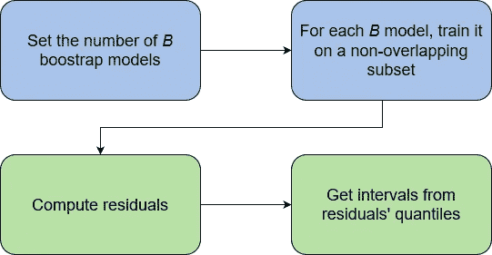
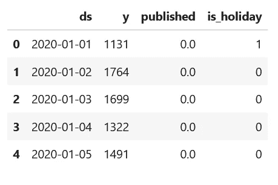
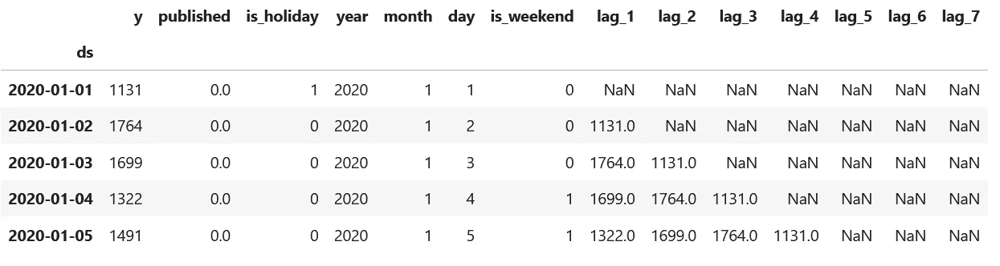
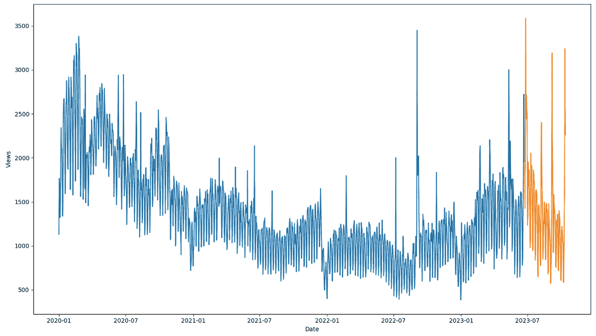
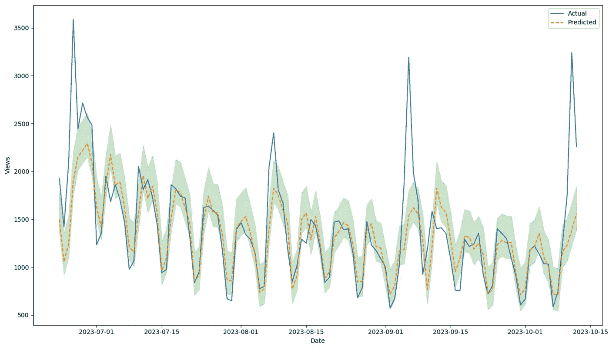
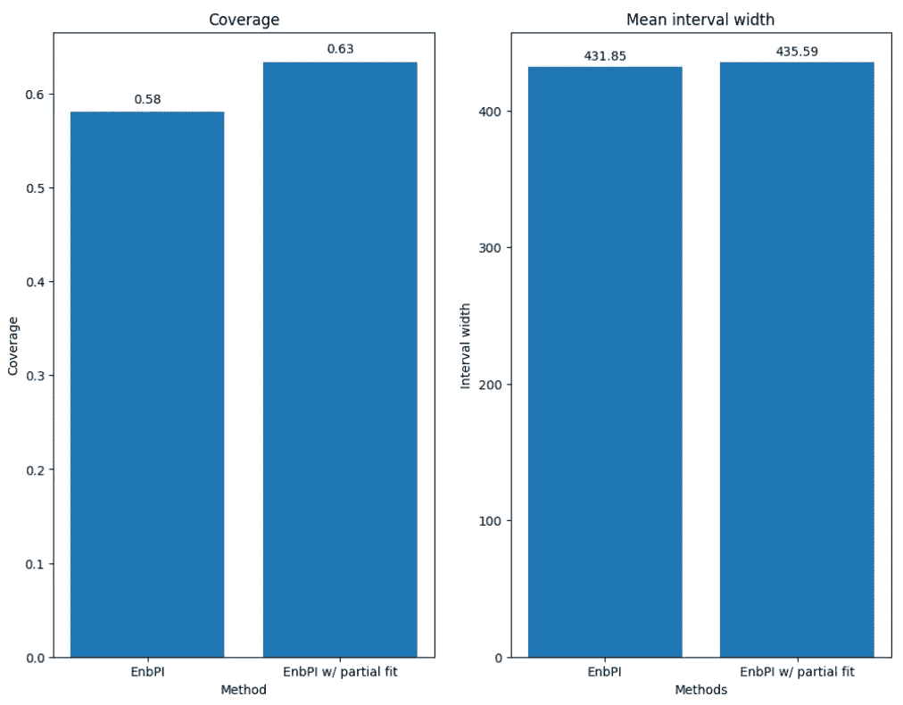

# 时间序列预测中的保形预测

> 原文：[`towardsdatascience.com/conformal-predictions-in-time-series-forecasting-32d3243d7479`](https://towardsdatascience.com/conformal-predictions-in-time-series-forecasting-32d3243d7479)

## 探讨应用于时间序列预测领域的**保形预测**概念，并在 Python 中实现它

[](https://medium.com/@marcopeixeiro?source=post_page-----32d3243d7479--------------------------------)[](https://towardsdatascience.com/?source=post_page-----32d3243d7479--------------------------------) [Marco Peixeiro](https://medium.com/@marcopeixeiro?source=post_page-----32d3243d7479--------------------------------)

·发表于 [Towards Data Science](https://towardsdatascience.com/?source=post_page-----32d3243d7479--------------------------------) ·10 min 阅读·2023 年 12 月 12 日

--


由 [Keith Markilie](https://unsplash.com/@rhino007?utm_source=medium&utm_medium=referral) 在 [Unsplash](https://unsplash.com/?utm_source=medium&utm_medium=referral) 提供的照片

考虑预测呼叫中心的呼叫量这一任务。这些预测在预算分配和员工规划中扮演着至关重要的角色（如果预计会有更多的呼叫，就需要更多的代理来接听）。

所以我们建立了一个预测模型，并报告下周中心将接到 2451 个电话。

当然，任何未来的预测都会带来一些误差和不确定性。但我们如何量化这些呢？

合理的答案是使用**预测区间**。这样，我们可以以一定的置信水平报告一系列可能的未来值。

虽然有很多计算预测区间的方法，但它们并不适用于所有模型，并且通常依赖于特定的分布。

这带来了两个主要问题。首先，某些情况下分布假设可能不成立。其次，我们在建模技术的选择上可能受到限制。

例如，目前没有简单的方法来测量神经网络的预测区间，但这些模型可能生成更好的预测。

这就是**保形预测**派上用场的地方。它们代表了一种量化预测不确定性的方法，该方法既不依赖于模型，也不依赖于分布。

在这篇文章中，我们首先探讨了保形预测背后的基本概念，并发现了用于时间序列预测的**EnbPI**方法。最后，我们在一个小的预测练习中应用它。

> ***通过我的*** [***免费时间序列备忘单***](https://www.datasciencewithmarco.com/pl/2147608294) ***在 Python 中学习最新的时间序列分析技术！获取统计和深度学习技术的实现，全部使用 Python 和 TensorFlow！***

让我们开始吧！

# 一致性预测的快速概述

一致性预测代表了一个研究领域，用于量化预测的不确定性。

它们应用于回归、二元分类、多标签分类和时间序列预测等各种任务。

一致性预测的基本思想是在给定的置信水平下生成一个校准的预测区间，保证一个点将位于其中。

换句话说，使用一致性预测，你可以创建一个 80% 的置信区间，保证未来的真实值有 80% 的概率落在这个区间内。

与其他预测区间估计方法不同，一致性预测可以与任何建模技术一起使用。而且，它们不假设正态分布，这通常是统计方法的情况。

## 时间序列预测的一致性预测

现在，大多数一致性预测方法用于回归任务依赖于 *交换性假设*。

这意味着数据到达的顺序不会影响推断。

尽管这一点在许多回归场景中是正确的，但显然在时间序列预测的背景下并不适用。

我们知道时间序列是按时间排序的点，这一顺序必须保持不变。换句话说，星期一必须总是出现在星期天之后，星期二之前。

因此，需要一种专门的方法来生成时间序列的一致性预测。

在 2020 年，研究人员陈旭和肖耀在他们的文章 [时间序列的一致性预测](https://arxiv.org/pdf/2010.09107.pdf) 中介绍了 **En**semble **b**atch **P**rediction **I**ntervals (**EnbPI**) 方法。

该方法取消了数据可交换性的要求，因此可以应用于时间序列预测。

# 探索 EnbPI 方法

EnbPI 算法是一个用于时间序列的通用一致性预测框架。

从高层次来看，EnbPI 方法由训练阶段和预测阶段组成。训练阶段在下面的图中用蓝色表示，而预测阶段用绿色表示。



EnbPI 方法的高级概述。图像由作者提供。

在训练阶段，我们在数据的非重叠子集上拟合固定数量的*B*自助模型。通常，*B* 设置在 20 到 50 之间。

当然，我们可以拟合的模型数量取决于可用的数据量，尤其是因为子集不能重叠。

然后，每个 *B* 模型的预测以留一法 (LOO) 聚合， resulting in both LOO residuals and LOO models for predictions.

在预测阶段，EnbPI 使用每个预测器对每一个测试数据点进行预测。这些预测被汇总以计算预测区间的中心。然后，使用残差构建预测区间，并使用残差的分位数进行构建。在此过程中，宽度也会被优化，以便在特定置信水平下获得尽可能最窄的宽度。

请注意，在预测阶段，随着新值的观察，区间会被更新以确保其适应性。

现在我们了解了 EnbPI 方法如何为任何预测模型生成预测区间，让我们在一个小的预测项目中使用 Python 应用它。

# 应用 EnbPI 进行预测

我们现在准备使用 EnbPI 方法为我们的预测模型生成预测区间。

幸运的是，EnbPI 算法已经通过[MAPIE 库](https://mapie.readthedocs.io/en/latest/)实现并准备使用，该库代表**M**odel **A**gnostic **P**rediction **I**nterval **E**stimator。

在这里，我们使用一个记录网站博客每日访问量的数据集，该数据集可以在[这里](https://github.com/marcopeix/time-series-analysis/blob/master/data/medium_views_published_holidays.csv)公开获取。

一如既往，整个项目的源代码可以在[GitHub](https://github.com/marcopeix/time-series-analysis/blob/master/data/medium_views_published_holidays.csv)上找到。

自然的第一步是进行必要的导入和读取我们的数据。

```py
import numpy as np
import pandas as pd
import matplotlib.pyplot as plt

from sklearn.ensemble import HistGradientBoostingRegressor

df = pd.read_csv('data/medium_views_published_holidays.csv')
df = df.drop(['unique_id'], axis=1)

df.head()
```



数据集的前五行。图片由作者提供。

从上图中，我们可以看到我们的数据集包含时间戳、唯一访问者数量、一个标志来指示是否发布了新文章，以及一个标志来指示是否为国家假日。

由于我们将应用机器学习模型，我们需要构建一些特征。具体来说，我们从日期中提取年份、月份和日期。我们还添加一个标志来指示是否为周末，并添加过去七个滞后值。

```py
df['ds'] = pd.to_datetime(df['ds'])

# Extract year, month and day
df['year'] = df['ds'].dt.year
df['month'] = df['ds'].dt.month
df['day'] = df['ds'].dt.day

# Add a flag for weekend days
df['is_weekend'] = (df['ds'].dt.dayofweek >= 5).astype(int)

# Add lagged values for the past 7 days
for day in range(1, 8):
    df[f'lag_{day}'] = df['y'].shift(day)

# Assign the date to the index
df.index = df['ds']
df = df.drop(['ds'], axis=1)

df.head()
```



包含工程特征的数据集。图片由作者提供。

在上图中，我们注意到存在缺失值。这是正常的，因为数据集的前七个条目没有完整的七个过去值列表。

我们可以选择丢弃前七行数据，或者使用一个可以原生处理缺失数据的模型。在这种情况下，我决定使用一个[基于直方图的梯度提升回归器](https://scikit-learn.org/stable/modules/generated/sklearn.ensemble.HistGradientBoostingRegressor.html)，它原生支持缺失值的数据。

最后，我们将数据拆分为训练集和测试集。在这里，我决定为测试集保留 112 个时间步。

```py
test_size = 4 * 28

X_cols = df.columns.drop(['y'])

split_date = df.index[-test_size]

X_train = df[df.index < split_date][X_cols]
y_train = df[df.index < split_date]['y']

X_test = df[df.index >= split_date][X_cols]
y_test = df[df.index >= split_date]['y']

print(X_train.shape, y_train.shape, X_test.shape, y_test.shape)
```

可选地，我们可以可视化数据的分割，如下图所示。

```py
fig, ax = plt.subplots(figsize=(14, 8))

ax.plot(y_train)
ax.plot(y_test)
ax.set_xlabel('Date')
ax.set_ylabel('Views')

plt.tight_layout()
```



可视化训练/测试拆分。最后 112 个时间步被保留为测试集。图片由作者提供。

## 训练模型

一旦数据经过预处理和分割，我们可以专注于训练预测模型。

如前所述，我们在这里实现了基于直方图的梯度提升回归器。我们还通过随机搜索进行超参数调优，以获得最佳模型。

```py
from sklearn.model_selection import RandomizedSearchCV, TimeSeriesSplit

hgbr = HistGradientBoostingRegressor(random_state=42)

params = {
    "learning_rate":  ["squared_error", "absolute_error", "gamma"],
    "learning_rate": [0.1, 0.05, 0.001],
    "max_iter": [100, 150, 200],
    "min_samples_leaf": [1, 2, 3],
}

rand_search_cv = RandomizedSearchCV(
    hgbr,
    param_distributions=params,
    cv=TimeSeriesSplit(n_splits=5),
    scoring="neg_root_mean_squared_error",
    random_state=42,
    n_jobs=-1
)

rand_search_cv.fit(X_train, y_train)

model = rand_search_cv.best_estimator_
```

请注意，最佳模型会使用`best_estimator_`属性进行保存。

一旦我们有了优化后的模型，我们现在可以使用 EnbPI 方法构建预测区间。

## 估计预测区间

首先，我们进行这一步所需的必要导入。

```py
from mapie.metrics import regression_coverage_score, regression_mean_width_score
from mapie.subsample import BlockBootstrap
from mapie.regression import MapieTimeSeriesRegressor
```

要应用 EnbPI 算法，我们必须使用`MapieTimeSeriesRegressor`对象与`BlockBootstrap`。请记住，EnbPI 在不重叠的块上拟合固定数量的模型，而`BlockBootstrap`会为我们处理这一点。

然后，为了评估我们预测区间的质量，我们使用覆盖率和平均宽度评分。覆盖率报告实际值在区间内的百分比。平均宽度评分则报告置信区间的平均宽度。

在理想情况下，我们可以获得尽可能狭窄的区间，从而实现最高的覆盖率。

考虑到这些，让我们完成设置以生成区间。在这里，我们希望有 95%的置信区间，并且我们的模型将对下一个时间步进行预测。

```py
# For a 95% confidence interval, use alpha=0.05
alpha = 0.05

# Set the horizon to 1
h = 1

cv_mapie_ts = BlockBootstrap(
    n_resamplings=9,
    n_blocks=9,
    overlapping=False,
    random_state=42
)

mapie_enbpi = MapieTimeSeriesRegressor(
    model,
    method='enbpi',
    cv=cv_mapie_ts,
    agg_function='mean',
    n_jobs=-1
)
```

在上面的代码块中，请注意我们使用了`n_blocks=9`，因为训练集可以被 9 整除。另外，请确保设置`overlapping=False`，因为 EnbPI 方法要求块不能重叠。

然后，将回归模型简单地封装在`MapieTimeSeriesRegressor`对象中，我们可以对其进行拟合并用来进行预测。

```py
mapie_enbpi = mapie_enbpi.fit(X_train, y_train)

y_pred, y_pred_int = mapie_enbpi.predict(
    X_test,
    alpha=alpha,
    ensemble=True,
    optimize_beta=True
)
```

现在，我们可以访问模型的预测结果和置信区间。我们可以使用下面的代码块进行可视化。

```py
fig, ax = plt.subplots(figsize=(14, 8))

ax.plot(y_test, label='Actual')
ax.plot(y_test.index, y_pred, label='Predicted', ls='--')
ax.fill_between(
    y_test.index,
    y_pred_int[:, 0, 0],
    y_pred_int[:, 1, 0],
    color='green',
    alpha=0.2
)
ax.set_xlabel('Date')
ax.set_ylabel('Views')
ax.legend(loc='best')

plt.tight_layout()
```


使用 EnbPI 方法进行 95%置信区间的预测。图片由作者提供。

从上图中，我们可以看到模型未能预测出访客的峰值。然而，预测区间似乎包含了大多数实际值。

为了验证这一点，我们可以计算覆盖率和平均区间宽度。

```py
coverage = regression_coverage_score(
    y_test, y_pred_int[:, 0, 0], y_pred_int[:, 1, 0]
)
width_interval = regression_mean_width_score(
    y_pred_int[:, 0, 0], y_pred_int[:, 1, 0]
)
```

在这里，我们得到 58%的覆盖率和 432 的平均区间宽度。

再次强调，在理想情况下，覆盖率应该接近 95%的值，因为这是我们之前设定的概率。然而，由于模型无法预测这些峰值，覆盖率显然受到了影响。

为了潜在提高覆盖率，让我们使用部分拟合实现 EnbPI 方法，以便随着新值的观察，区间可以自适应。

## 应用 EnbPI 与部分拟合

正如我们之前所学，EnbPI 方法可以从新的观察值中受益，并相应地调整置信区间。

这可以通过在数据的部分上拟合模型并在每一步计算预测区间来模拟。

```py
y_pred_pfit = np.zeros(y_pred.shape)
y_pred_int_pfit = np.zeros(y_pred_int.shape)

y_pred_pfit[:h], y_pred_int_pfit[:h, :, :] = mapie_enbpi.predict(X_test.iloc[:h, :],
                                                                 alpha=alpha,
                                                                 ensemble=True,
                                                                 optimize_beta=True)

for step in range(h, len(X_test), h):
    mapie_enbpi.partial_fit(X_test.iloc[(step-h): step, :],
                             y_test.iloc[(step-h):step])

    y_pred_pfit[step:step + h], y_pred_int_pfit[step:step + h, :, :] = mapie_enbpi.predict(X_test.iloc[step:(step+h), :],
                                                                                           alpha=alpha,
                                                                                           ensemble=True,
                                                                                           optimize_beta=True)
```

在上面的代码块中，逻辑保持不变。这一次，我们只是做一个 for 循环，逐渐将模型拟合到更多数据上，模拟新数据的观测，并生成新的预测。

同样，我们可以可视化预测及其置信区间。

```py
fig, ax = plt.subplots(figsize=(14, 8))

ax.plot(y_test, label='Actual')
ax.plot(y_test.index, y_pred_pfit, label='Predicted', ls='--')
ax.fill_between(
    y_test.index,
    y_pred_int_pfit[:, 0, 0],
    y_pred_int_pfit[:, 1, 0],
    color='green',
    alpha=0.2
)
ax.set_xlabel('Date')
ax.set_ylabel('Views')
ax.legend(loc='best')

plt.tight_layout()
```



使用部分拟合的符合性预测区间。图片由作者提供。

从上面的图中可以直观地看出，使用部分拟合并没有显著的差异。

因此，让我们计算部分拟合协议的覆盖率和平均区间宽度。

```py
coverage_pfit = regression_coverage_score(
    y_test, y_pred_int_pfit[:, 0, 0], y_pred_int_pfit[:, 1, 0]
)
width_interval_pfit = regression_mean_width_score(
    y_pred_int_pfit[:, 0, 0], y_pred_int_pfit[:, 1, 0]
)
```

这给我们带来了 63%的覆盖率和 436 的平均区间宽度。



比较每个协议的覆盖率和平均区间宽度。图片由作者提供。

从上图可以看出，使用部分拟合允许我们在保持平均区间宽度相对恒定的同时增加覆盖率。因此，在这种情况下使用部分拟合是有优势的。

# 结论

在本文中，我们了解到，符合性预测方法用于估计预测的不确定性。这些方法可以应用于分类和回归算法。

在时间序列的情况下，集成预测区间方法通过在不重叠的数据块上拟合固定数量的模型来获得残差，并从其分布中估计置信界限。

为了评估我们区间的质量，我们使用覆盖率和平均区间宽度。覆盖率表示真实值落在区间内的百分比。理想情况下，这个值应该接近用户设定的置信度，同时最小化区间宽度。

正如我们所见，这种情况并非总是如此，因为它还取决于模型预测的质量。

尽管如此，感谢 MAPIE，我们可以为几乎任何模型生成符合性预测区间。

感谢阅读！希望你喜欢这篇文章，并且学到了新东西！

想要掌握时间序列预测吗？那么请查看我的课程 [Python 中的应用时间序列预测](https://www.datasciencewithmarco.com/offers/zTAs2hi6/checkout?coupon_code=ATSFP10)。这是唯一一门使用 Python 在 16 个指导性实践项目中实现统计、深度学习和最先进模型的课程。

干杯 🍻

# 支持我

喜欢我的工作吗？通过 [买我一杯咖啡](http://buymeacoffee.com/dswm) 支持我，这是你鼓励我的简单方式，同时我可以享受一杯咖啡！如果你愿意，只需点击下面的按钮 👇


# 参考文献

陈旭，肖姚 — [时间序列的符合性预测](https://arxiv.org/pdf/2010.09107.pdf)

MAPIE: [官方文档](https://mapie.readthedocs.io/en/latest/)
