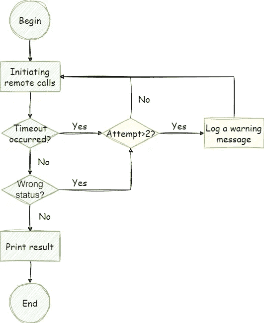
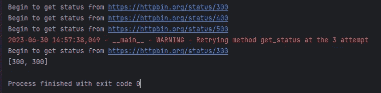

# 使用 Tenacity 在 Python 中征服重试：完整教程

> 原文：[`towardsdatascience.com/conquer-retries-in-python-using-tenacity-an-in-depth-tutorial-3c98b216d798`](https://towardsdatascience.com/conquer-retries-in-python-using-tenacity-an-in-depth-tutorial-3c98b216d798)

## [PYTHON TOOLBOX](https://medium.com/@qtalen/list/python-toolbox-4289824c6407)

## 通过强健的重试机制和错误处理技术来增强你的 Python 项目

[](https://qtalen.medium.com/?source=post_page-----3c98b216d798--------------------------------)[](https://towardsdatascience.com/?source=post_page-----3c98b216d798--------------------------------) [Peng Qian](https://qtalen.medium.com/?source=post_page-----3c98b216d798--------------------------------)

·发表于 [Towards Data Science](https://towardsdatascience.com/?source=post_page-----3c98b216d798--------------------------------) ·5 分钟阅读·2023 年 7 月 1 日

--


经常情况下，再试一次会带来成功。图片来源：作者创作，[Canva](https://www.canva.com/)

本文将讨论 Tenacity 的基本用法和定制能力。

这个实用的 Python 库提供了重试机制。我们还将通过一个实际的例子来探讨 Tenacity 的重试和异常处理功能。

# 介绍

想象一下，你管理着数百个网络服务，其中一些位于海外（延迟高），另一些则相当老旧（不太稳定）。你会有怎样的感受？

我的同事 Wang 遇到了这样的困境。他告诉我，他非常沮丧：

每天，他需要检查这些远程服务的调用状态，并且经常遇到超时问题或其他异常。故障排除特别具有挑战性。

此外，许多客户端代码是由他的前任编写的，这使得进行大规模重构变得困难。因此，这些服务必须继续按原样运行。

如果有一种方法可以在异常发生后自动重新连接这些远程调用，那就太好了。Wang 眼含泪水地看着我。

我向他保证没问题，并向他介绍了我的工具箱中的新工具：`Tenacity`。只需一个装饰器，现有的代码就能获得重试能力。让我们看看如何使用它。

# 安装和基本用法

由于 Tenacity 的官方网站仅提供了简单的 API 文档，让我们从库的安装和一些基本用法开始。

## 安装

如果你使用的是 pip，只需运行以下命令：

```py
python -m pip install tenacity
```

如果你使用的是 Anaconda，Tenacity 不在默认频道中，因此你需要从 `conda-forge` 安装它：

```py
conda install -c conda-forge tenacity
```

## 基本用法

安装 Tenacity 后，让我们看一下这个库的一些基本用法。

只需添加 `@retry` 装饰器，你的代码就会具备重试功能：

```py
@retry()
async def coro_func():
    pass
```

如果你希望代码在尝试一定次数后停止重试，可以这样编写：

```py
@retry(stop=stop_after_attempt(5))
async def coro_func():
    pass
```

当然，为了避免频繁重试可能耗尽连接池，我建议在每次重试之前添加等待时间。例如，如果你希望在每次连接之前等待 2 秒：

```py
@retry(wait=wait_fixed(2))
async def coro_func():
    pass
```

尽管文档中没有提到，但我倾向于在每次重试之前多等一秒，以减少资源浪费：

```py
@retry(wait=wait_incrementing(start=1, increment=1, max=5))
async def coro_func():
    pass
```

最后，如果重试是由于方法中抛出的 `exception`，最好将 `exception` 抛回。这使得在调用方法时可以更灵活地处理异常：

```py
@retry(reraise=True, stop=stop_after_attempt(3))
async def coro_func():
    pass
```

# 高级功能：自定义回调

除了一些常见的用例外，你还可以添加自己的重试判断逻辑，例如根据方法执行结果来决定，或在执行前打印方法调用参数。

在这种情况下，我们可以使用 `Custom Callbacks` 进行定制。

`Custom Callbacks` 有两种扩展方式：

一种是文档中推荐的方法：编写一个扩展方法。

执行时，这个方法会接收一个 `RetryCallState` 实例作为参数。

通过这个参数，我们可以获取包装的方法、方法调用的参数、返回的结果以及任何抛出的异常。

例如，我们可以使用这种方法来判断一个方法的返回值，并在值为偶数时重试：

```py
from tenacity import *

def check_is_even(retry_state: RetryCallState):
    if retry_state.outcome.exception():
        return True

    return retry_state.outcome.result() % 2 == 0
```

当然，在做出这种判断之前，如果抛出 `exception`，直接重试。

如果你需要在扩展方法中传递额外的参数，可以在扩展方法外部添加一个包装器。

例如，这个包装器会传递一个 `logger` 参数。当重试次数超过两个时，它会将重试时间、方法名称和方法参数打印到日志中：

```py
def my_before_log(logger: Logger):
    def my_log(retry_state: RetryCallState):
        fn = retry_state.fn
        args = retry_state.args
        attempt = retry_state.attempt_number

        if attempt > 2:
            logger.warning(f"Start retry method {fn.__name__} with args: {args}")
    return my_log
```

# 实际网络示例

最后，为了给你一个关于在项目中使用 `Tenacity` 的深刻印象，我将使用一个远程客户端项目作为示例，展示如何集成 Tenacity 的强大功能。

本项目将模拟访问 HTTP 服务，并根据返回的 `status code` 决定是否重试：

当然，为了避免由于长时间连接等待而浪费服务器资源，我还将为每个请求添加一个 2 秒的超时。如果发生超时，将重试连接。



项目流程图。图片由作者提供

在开始代码之前，我会实现几个扩展方法。其中一个方法是判断一个方法的重试次数是否超过两个，并在日志中打印警告信息：

另一个扩展方法是判断返回的 `status code`。如果状态码大于 300，则重试。当然，超时也会触发重试。

接下来，我们要实现远程调用方法。编写完该方法后，记得添加 Tenacity 的重试装饰器。我在这里使用的策略是最多重试 20 次，每次重试前等待比上次重试多 1 秒。

当然，别忘了添加我们刚刚实现的两个扩展方法：



经过几次重试，我终于得到了正确的结果。截图由作者提供

任务完成！是不是超级简单？

# 结论

我很高兴我帮助王解决了另一个问题。

通过使用`Tenacity`，我们可以轻松地为现有代码添加各种重试机制，从而增强程序的健壮性和自我恢复能力。

如果这个库能帮助你解决问题，我会更高兴。随时留下评论和讨论。

除了提高代码执行速度和性能外，使用各种工具来提高工作效率也是一种性能提升：


[Peng Qian](https://qtalen.medium.com/?source=post_page-----3c98b216d798--------------------------------)

## Python 工具箱

[查看列表](https://qtalen.medium.com/list/python-toolbox-4289824c6407?source=post_page-----3c98b216d798--------------------------------)6 stories[](https://medium.com/@qtalen/membership?source=post_page-----3c98b216d798--------------------------------) [## 通过我的推荐链接加入 Medium - Peng Qian

### 作为 Medium 会员，你的一部分会员费用将给你阅读的作者，你可以完全访问每个故事…

[medium.com](https://medium.com/@qtalen/membership?source=post_page-----3c98b216d798--------------------------------)

本文最初发布在: [`www.dataleadsfuture.com/conquer-retries-in-python-using-tenacity-an-end-to-end-tutorial/`](https://www.dataleadsfuture.com/conquer-retries-in-python-using-tenacity-an-end-to-end-tutorial/)
