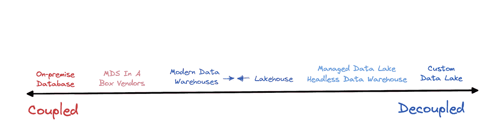

# 意识解耦：存储、计算和现代数据架构的“远”有多远？

> 原文：[`towardsdatascience.com/conscious-decoupling-how-far-is-too-far-for-storage-compute-and-the-modern-data-stack-ce2d9c61ccd3?source=collection_archive---------13-----------------------#2023-07-24`](https://towardsdatascience.com/conscious-decoupling-how-far-is-too-far-for-storage-compute-and-the-modern-data-stack-ce2d9c61ccd3?source=collection_archive---------13-----------------------#2023-07-24)

## 虽然没有绝对正确的答案，但大多数组织的数据平台可能会有一个最佳的“甜蜜点”。继续阅读，看看这个“甜蜜点”可能在哪里。

 [shane murray](https://medium.com/@shane.murray5?source=post_page-----ce2d9c61ccd3--------------------------------)

·

[关注](https://medium.com/m/signin?actionUrl=https%3A%2F%2Fmedium.com%2F_%2Fsubscribe%2Fuser%2F8aa0d9ae3ebd&operation=register&redirect=https%3A%2F%2Ftowardsdatascience.com%2Fconscious-decoupling-how-far-is-too-far-for-storage-compute-and-the-modern-data-stack-ce2d9c61ccd3&user=shane+murray&userId=8aa0d9ae3ebd&source=post_page-8aa0d9ae3ebd----ce2d9c61ccd3---------------------post_header-----------) 发表在 [Towards Data Science](https://towardsdatascience.com/?source=post_page-----ce2d9c61ccd3--------------------------------) ·9 分钟阅读·2023 年 7 月 24 日

--

图片由 [Kelly Sikkema](https://unsplash.com/@kellysikkema?utm_source=unsplash&utm_medium=referral&utm_content=creditCopyText) 提供，来源于 [Unsplash](https://unsplash.com/s/photos/breakup?utm_source=unsplash&utm_medium=referral&utm_content=creditCopyText)

数据工程师在 2014 年发现了[有意识解耦](https://goop.com/wellness/relationships/conscious-uncoupling-2/)的好处，正好与格温妮斯·帕特洛和克里斯·马丁的情况一致。

当然，与生活伴侣不同，工程师们开始高兴地通过新兴技术如 Snowflake（2012）、Databricks（2013）和 BigQuery（2010）来解耦存储和计算。

与本地数据库相比，这在成本和规模方面具有惊人的优势。一个财富 500 强公司的数据工程经理向我表达了对本地限制的痛苦，他说：

> “我们的分析师无法在他们想要的时候运行他们想运行的查询。我们的数据仓库每天会停机 12 小时，因为我们通常需要将其离线以进行数据转换和加载……我能用来形容这个过程的唯一词汇就是痛苦。”

十年后，数据管理行业中相当多的创新围绕着不同的数据平台如何解耦或耦合存储和计算（别担心，我会在下一部分中提供示例）。与此密切相关的是，这些平台如何将相关的数据服务从数据摄取和转换到数据治理和监控进行捆绑或拆分。

## **这些事物为什么相关，更重要的是，为什么数据领导者应该关心？**

好吧，驱动和集成这些服务的连接组织通常存在于表格格式（存储）和查询/作业日志（计算）的元数据中。你如何管理这些方面将在性能、成本、易用性、合作伙伴生态系统和未来的可行性中发挥过大的作用。

询问哪种类型的数据平台和哪种解耦级别是正确的，就像问如何正确格式化你的 SQL 代码一样：这在很大程度上取决于个人偏好和专业需求，但有一个小范围的可能性能够满足大多数人。

我相信——在当前时刻——数据平台的范围遵循了[亚里士多德的中庸之道](https://en.wikipedia.org/wiki/Golden_mean_(philosophy))。大多数人将最适合光谱中间的选项，而在任一极端操作将是非常专门用途的少数人。

在更深入地了解为什么会这样之前，我们先来看看当前的格局和最近的发展。

# 存储与计算数据平台光谱

图片由作者提供。

一些[大肆宣传](https://world.hey.com/dhh/why-we-re-leaving-the-cloud-654b47e0)的例子已经成为[头条新闻](https://www.theregister.com/2022/10/20/basecamp_decamps_from_cloud/)，他们提出了“云计算很贵，我们回到服务器机架”的运动。虽然这对于某些人来说可能是一个合法的策略，但这正迅速成为一个逐渐减少的少数。

就在上周，[Pragmatic Engineer 在 Twitter 上聚焦于 Twitter 的速率限制](https://open.substack.com/pub/pragmaticengineer/p/twitter-vs-instagram-threads-two?r=18lad5&utm_campaign=post&utm_medium=email) 和显著的用户体验问题，这些问题可能是由于他们将机器学习模型从 GCP 移除并完全依赖他们的三个数据中心造成的。

独立扩展和消费存储及计算的能力要更加具备成本效益和性能，但在同一数据平台内具有这些分离功能也有其优势。

平均而言，作为即席分析请求的一部分执行的未优化 SQL 查询通常在这些已经调整好以便开箱即用的平台上运行速度会快得多。一种更为分离的架构，在平台层面上分离计算和存储，*可能* 在处理重型工作负载时非常具备成本效益，但这需要一个高度训练的团队花时间来优化这些工作负载。

具有组合但分离的存储和计算的数据平台还提供了跨多个关键数据操作任务的更强大、集成的用户体验。以数据治理为例。这些平台提供了一个集中机制来进行访问控制，而分离的架构则需要在多个查询引擎之间进行角色联邦化——这是一项非平凡的任务。

分离但组合的方式是让 Snowflake 的常见评价之一变成了“所有东西都运作良好”的魔法。难怪 Snowflake 最近进一步推动了 [Unistore](https://www.snowflake.com/en/data-cloud/workloads/unistore/) 用于事务性工作负载，并开放了 Snowpark 以支持 Python 和更多的数据科学（计算）工作负载。

Databricks 在专注于其 Spark 处理框架时取得了惊人的增长，但它也并非偶然，在 Delta 表中添加元数据和类似 ACID 的事务以及在 Unity Catalog 中的治理功能之后，它解锁了一个新的增长水平。他们最近还进一步推动了，使得当你写入 Delta 表（存储）时，[该表中的元数据以 Delta、Apache 和 Hudi 可读的格式写入](https://www.databricks.com/company/newsroom/press-releases/announcing-delta-lake-30-new-universal-format-offers-automatic)。

# 挑战者平台

这就是为什么看到许多最新的前沿数据工程技术开始在供应商层面上分离存储和计算会很有趣。例如，Tabular 将自己描述为一个 “[无头数据仓库](https://www.theregister.com/2023/03/08/tabular_launches_data_warehouse/)” 或者 “你在数据仓库中需要的一切，除了计算”。

更进一步，一些组织正在迁移到数据湖中的 Apache Iceberg 表，进行“自我管理”后台基础设施，并使用像 Trino 这样的独立查询引擎。这通常是由于客户面对的用例需要高性能且具有成本效益的互动查询。

DuckDB 结合了存储和计算，但牺牲了现代数据堆栈几乎无限的计算能力，以追求开发人员的简单性和降低成本。

所以问题仍然存在，这些创新是否有可能取代现有的云原生数据平台？

再次强调，这个答案将取决于你是谁。DuckDB 是一个非常受欢迎的工具，许多数据分析师喜欢它，但它可能不会成为你构建数据平台的基石。最终，我们正在看到，并且我相信将继续看到这样的分布：

图片由作者提供。

我将通过查看现代数据堆栈和数据平台类型的几个关键维度来解释原因。

# 整合的程度和目的

B2B 供应商恭敬地提到“单一视图”这个概念。将多个服务纳入一个统一的框架是否有价值？这取决于每项服务的质量及其如何符合你的需求。

单一视图的*真正*价值在于将本来会被孤立的信息统一成一个完整的故事，或者将分开的动作整合成一个单一的工作流程。让我们以 Microsoft 365 为这个概念的例子。

将视频和电子邮件整合到他们的 Teams 协作应用中非常有价值，因为这些是会议安排和视频会议过程中的核心方面。将 Sway 纳入他们的应用套件是否同样重要？这要回到你对互动报告的需求上。

回到数据宇宙，计算和存储对于这个单一的故事（数据操作的谁、什么、何时、哪里、为什么、如何）以及诸如成本、质量和访问管理等关键工作流程至关重要。因此，这些平台将拥有最强大的合作伙伴生态系统和更无缝的集成。这可能是你的一个关键标准，除非你是那种使用 Windows 和 Fire 手机而不是 iPhone 和 Android 的人。

Choozle 的首席执行官 Adam Woods，[去年向我们的团队介绍了](https://www.montecarlodata.com/blog-delivering-on-data-quality-how-choozle-reduced-data-downtime-by-88-with-monte-carlo/)他对拥有一个强大而紧密集成的合作伙伴生态系统的重视。

“我喜欢这一点……我的数据堆栈始终保持最新，我不需要应用补丁。我们能够将开发人员和数据库分析师本来会花在更新和基础设施上的时间重新投入到构建卓越的客户体验中，”他说。

当然，总有例外情况。如果你有大规模的边缘案例，那么真正的数据湖、无头仓库或其他更复杂的平台可能是理想的选择。

你的语义层、数据质量、访问控制、目录、BI、转换、数据摄取等工具是否都应该打包在同一个平台内？我认为这一领域存在有效的观点，但像其他部门一样，大多数数据团队会拥有一套最适合他们需求的工具。

## 要点：

+   大多数数据负责人会优先选择一个既具备计算服务又具备存储服务的数据平台，以便实现“单一故事”，并支持多样化的合作伙伴生态系统。

# 性能 vs 易用性

一般而言，平台越可定制，能够适应各种使用场景的性能就越好，但使用起来也越复杂。这是一种几乎不可避免的权衡，尤其是在你将存储和计算服务分开到不同供应商时。

在考虑数据平台的“易用性”时，除了考虑平台的日常使用情况，还需要考虑其管理和自定义的简便性。

根据我的经验，许多团队过于关注平台性能。我们的技术背景会立即开始将平台与汽车进行比较：“这个工作负载的马力是多少？那个工作负载呢？”

别误会，优化的数据平台可以转化为每年数百万的节省。这是重要的。但是，如果你要聘请额外的工程师来管理 S3 配置，或者每季度都需要启动一个为期数月的项目来将业务的新方面整合到你的数据平台上，那也是一个高昂的成本。

你会看到同样的决策范式在开源解决方案中发挥作用。前期成本微乎其微，但维护基础设施的时间成本可能很高。

解决方案成本和工程师薪资成本是不一样的，这种错误的等同关系可能会在未来造成问题。原因有两个：

+   假设你的使用情况保持不变（这是一个重要的前提），你的解决方案成本通常保持不变，而效率会提高。这是因为 SaaS 供应商不断推出新功能。另一方面，手动实施的效率会随着时间的推移而下降，因为关键成员离开，新团队成员需要培训。

+   当你花费大部分时间来维护基础设施时，你的数据团队开始失去方向。目标会从最大化商业价值逐渐转向在峰值性能下维护基础设施。更多的会议变成了讨论基础设施。专业的基础设施技能变得极其重要，这些专家在组织中变得更加突出。组织文化也很重要，它通常由团队解决的主要任务和问题所塑造。

这一点是 Michael Sheldon，Swimply 的数据负责人，特别强调的。

> “因为作为一个数据团队，我们有这个任务来支持整个公司，我们需要一个可以解决两个核心问题的数据堆栈，”Michael 说。 “一是将公司各个不同部分的数据集中在一个稳定的地方，大家都可以使用并作为可信来源。**二是让我们有足够的时间真正专注于洞察，而不仅仅是数据基础设施本身**。”

他们是在谈论基础设施还是业务价值？照片来自[Desola Lanre-Ologun](https://unsplash.com/@disruptxn?utm_source=unsplash&utm_medium=referral&utm_content=creditCopyText)于[Unsplash](https://unsplash.com/s/photos/team-collaborating?utm_source=unsplash&utm_medium=referral&utm_content=creditCopyText)

当然，也会有一些时候你的业务用例需要高性能。

高延迟的信用卡欺诈数据产品只是浪费时间。一个面对客户的应用程序如果不断出现加载失败的情况将是不可接受的，可能需要你部署一个高性能的查询引擎。然而，在大多数情况下，你的数据仓库或托管数据湖会很好地扩展。请仔细检查任何要求，确保没有遗漏。

## 要点：

+   尽管易用性和性能是必须平衡的相关变量，但大多数数据领导者会倾向于易用性，因为维护和文化成本相对隐藏。你的竞争优势更常见于丰富和应用第一方数据，而不是维护复杂的基础设施。

# 为 MDS 辩护

我知道抨击现代数据堆栈很流行（[你可能不需要它来完成任务](https://hightouch.com/blog/you-dont-need-the-mds)），但尽管有缺陷，它仍然是大多数数据团队的最佳选择。它是快速生成价值和为长期投资提供未来保障的理想结合。

许多新兴技术虽然使用场景较窄，但依然具有显著价值。看到它们如何发展并塑造数据工程实践将会令人兴奋。

然而，虽然计算和存储需要分别操作和扩展，但将这些服务及其相应的元数据集中在同一平台内是过于强大且具有无法忽视的优势。

关注我 在 Medium 上获取更多关于数据领导力、数据科学应用和相关主题的故事。订阅以将我的故事直接送到你的邮箱。
