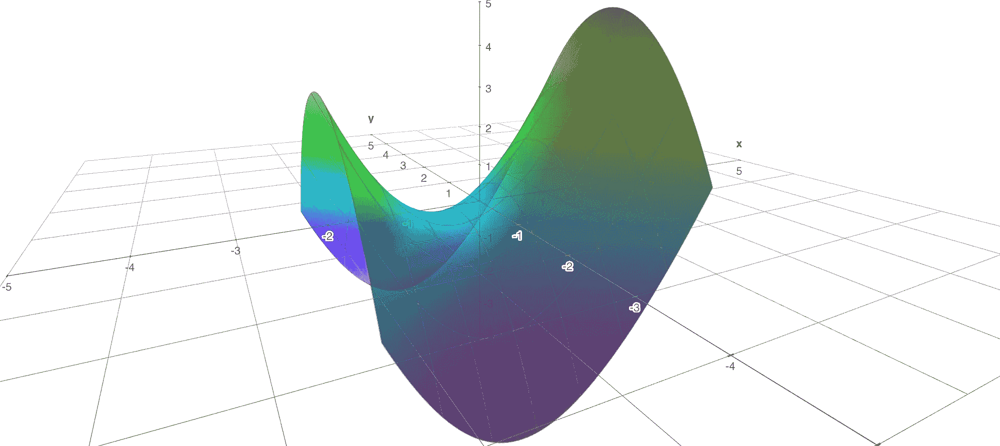
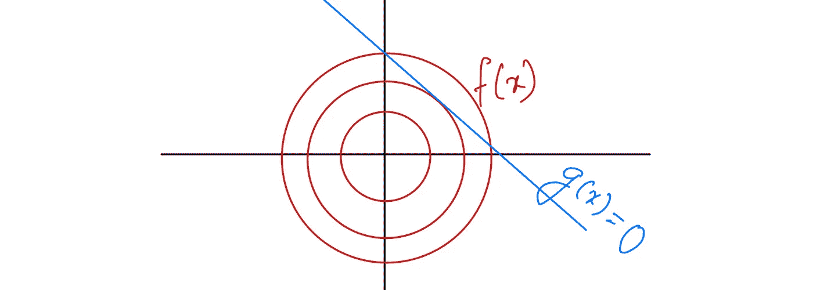
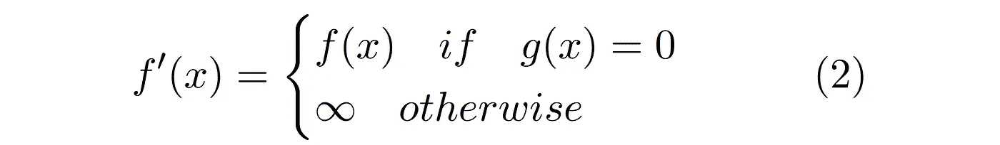
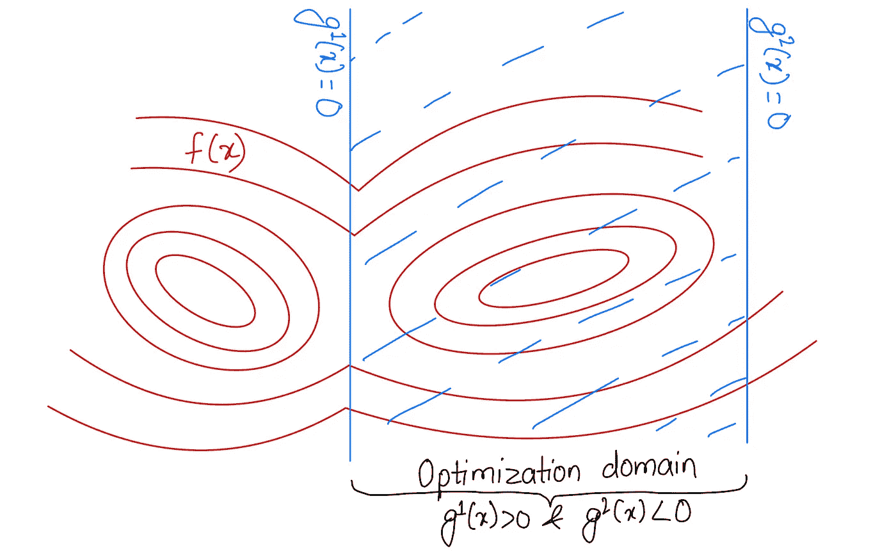
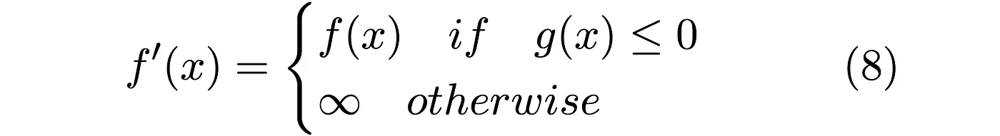
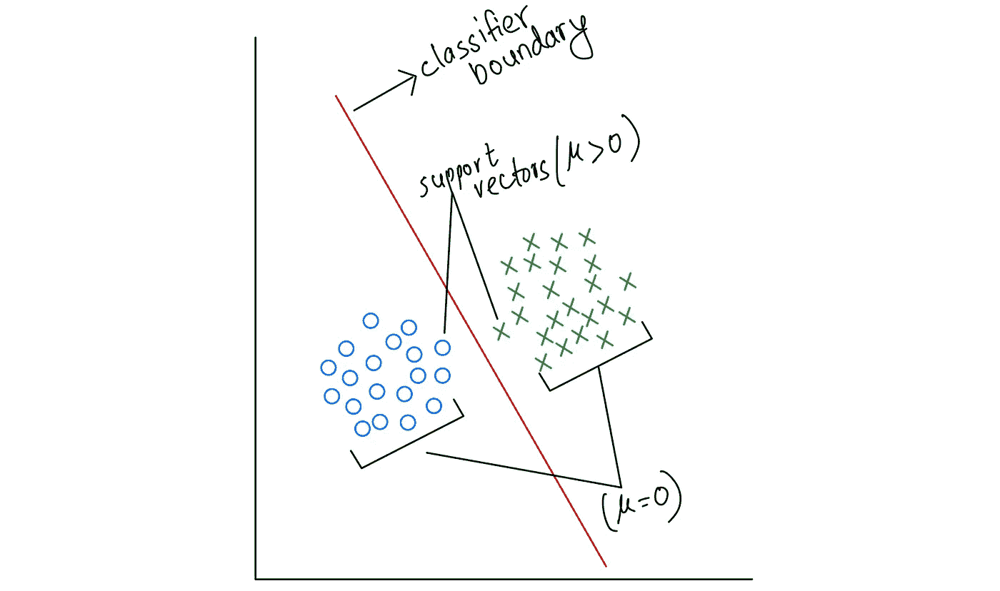

# 约束优化与 KKT 条件

> 原文：[`towardsdatascience.com/constrained-optimization-and-the-kkt-conditions-a3541d57a994?source=collection_archive---------2-----------------------#2023-10-28`](https://towardsdatascience.com/constrained-optimization-and-the-kkt-conditions-a3541d57a994?source=collection_archive---------2-----------------------#2023-10-28)

## 对拉格朗日函数的见解

 [Paribesh Regmi](https://paribeshregmi.medium.com/?source=post_page-----a3541d57a994--------------------------------)

·

[关注](https://medium.com/m/signin?actionUrl=https%3A%2F%2Fmedium.com%2F_%2Fsubscribe%2Fuser%2Fe15368282264&operation=register&redirect=https%3A%2F%2Ftowardsdatascience.com%2Fconstrained-optimization-and-the-kkt-conditions-a3541d57a994&user=Paribesh+Regmi&userId=e15368282264&source=post_page-e15368282264----a3541d57a994---------------------post_header-----------) 发表在 [Towards Data Science](https://towardsdatascience.com/?source=post_page-----a3541d57a994--------------------------------) · 8 分钟阅读 · 2023 年 10 月 28 日 

--

（作者提供的图片，使用 math3d.org）

优化在计算机科学、物理学、数学和经济学领域中无处不在。它是人工智能和机器学习（ML）专业人员的基本工具，适用于决策、路线规划以及 ML 模型中的学习参数，如支持向量机（SVM）和神经网络。优化的最一般形式是求函数关于其独立变量的最小值/最大值，这可以通过应用微积分的基本概念来实现。从数学上讲，在这些极值点上，函数的斜率（第一导数）为零，称为**驻点**。通过评估曲率（第二导数）来确定这些点是最大值还是最小值。

更进一步，我们可以为优化问题添加约束，以定义一个在空间中需要优化的特定域。因此，优化不再是确定整个实数（或复数）空间中函数的最大值和最小值，而是限定在这个特定的域中。传统的计算驻点的方法不再适用，因为这些点可能落在约束设定的边界之外。在接下来的章节中，我们将分析约束优化问题的复杂性，并探索解决这些问题的策略。

# 等式约束

带有等式约束的优化问题的形式为

（图片由作者提供）

其中***f(x)***是我们要最小化的函数，约束条件***g(x) = 0***定义了最小化应进行的域。在这些情况下，最小化的重点本质上限于由约束定义的特定域。然而，如前所述，传统的微积分应用于确定驻点的方法没有考虑约束，因此需要一种替代方法。

## 拉格朗日函数

鉴于这是一个最小化问题，一种适应传统方法的方法是将函数在指定域外的值设为无穷大。为此，我们引入一个新的函数***f’(x)***，其特征如下：

这种修改消除了在域外出现最小值的可能性，从而确保最优点发生在域内。因此，我们现在可以将约束优化问题重新表述为无约束优化问题。

然而，这种方法存在挑战。由于***f’(x)***在领域边界的突然间断，使用微分计算来优化上述问题是不可能的。在这里，拉格朗日方法发挥了作用。我们不是像（2）中那样定义函数***f’(x)***，而是将其表述为一个最大化问题。

RHS 上的表达式称为**拉格朗日函数**，新变量𝞴是**拉格朗日乘子**。从（4）可以明显看出，在**{*g(x)<0, g(x)>0*}**区域，𝞴可以取**{-∞, ∞}**的值，以最大化该表达式至**∞**。

因此，方程（3）中的优化问题呈现如下形式。

值得注意的是，非可微性问题仍然存在，因为内部最大化会导致相同的间断函数。然而，通过拉格朗日表示法，我们可以利用极大极小不等式将极大极小问题转换为极小极大问题，从而解决这个问题。

在这里，我们首先相对于独立变量**x**进行优化，然后相对于拉格朗日乘子𝞴进行优化。

# 不等式约束

（作者提供的图片）

我们现在将分析约束不是方程而是不等式时的情形。这类优化问题的形式为：

我们可以使用类似的方法来解决：我们将***f’(x)***定义为在由约束定义的领域内与***f(x)***相同，而在其他地方为无限：

相应地，拉格朗日函数定义为：

与不等式约束对应的拉格朗日乘子用*𝝻*表示。方程（9）与（4）不同，因为它还对拉格朗日乘子有约束。现在，方程（7）中的优化问题呈现如下形式

应用极小极大不等式，

## 拉格朗日乘子***𝝻***的解释

当计算（11）的驻点时，相对于***x***，我们得到如下结果：

拉格朗日乘子 *𝝻* 是 ***f(x)*** 的斜率与约束 ***g(x)*** 之间的比率。这本质上表示了 ***f(x)*** 最优值对约束 ***g(x)*** 的敏感性。换句话说，拉格朗日乘子的值量化了约束对 ***f(x)*** 最优性的影响；如果 *𝝻 = 0*，则表示约束对最优性没有影响。对此概念的进一步阐述将在后续对 KKT 条件的讨论中进行。

## KKT（Karush-Kuhn-Tucker）条件

（10）中的优化问题称为原始版本，而（11）是其对偶版本。根据极小极大不等式，对偶版本对原始版本进行下界估计，表明这两个版本不一定相等。然而，在某些条件下，原始版本和对偶版本是相等的，这被称为**正则性条件**。在假设正则性的情况下，为了使（***x*,*** *𝝻********）成为解点，它必须满足以下 **KKT 条件**：

1.  **原始可行性**

这从问题定义中得出。

**2\. 对偶可行性**

对偶可行性从（9）中得出。

**3\. 平稳性**

这是一个有趣的性质。由于 *𝝻* 是零或正数，平稳性条件意味着在最优点上，***f(x)*** 和 ***g(x)*** 的梯度必须朝相反方向排列。其原理如下：如果在点 ***x = x**** 上，***f(x)*** 和 ***g(x)*** 的梯度方向相同，那么 ***f(x)*** 和 ***g(x)*** 会在与其梯度方向相反的方向上同时减少。这种情况会允许 ***f(x)*** 继续减小超出值 ***f(x*)*** 而不违反约束，此时 ***x**** 不再符合最优点。因此，为了使一个点成为最优点，必须满足平稳性属性。

**4\. 互补松弛性**

这是另一个直接来自方程（9）的有趣性质。当约束***g(x*) < 0***时，拉格朗日乘子𝝻*必须等于零。由于拉格朗日乘子还表示我们的解决方案对相关约束的敏感度，𝝻* = 0 表示相关约束对确定解决方案没有影响。换句话说，无论我们是否考虑约束，结果保持不变。一个简单的例子是当***f(x)***在***g(x) ≤ 0***的范围内有全局最小值。另一个例子是考虑在两个约束下最小化函数***f(x)***：***g¹(x) < 5***和***g²(x) < -1***。在这种情况下，拉格朗日乘子𝝻¹*****对应于约束***g¹***是零，因为***g²***已经隐含了***g¹***的条件，使得***g¹***作为约束不重要。

## 应用：支持向量机（SVM）

机器学习中带有不等式约束的优化问题的一个例子是支持向量机（SVM）。给定数据点**{(*x¹, y¹*), (*x², y²*), …}**的一个数据集，其中***y ∈* {*-1, 1*}**表示两个类别，目标是识别一个最大化类别之间间隔的分类器。具体来说，我们将 SVM 形式化为以下最小化问题：

（作者提供的图片）

方程中的***||w||***表示间隔的倒数。显然，有大量的不等式约束：实际上，我们对每个数据点都有一个约束。然而，实际上，解决方案只受到少数接近分类边界的数据点的指导；这些点称为**支持向量**。正如我们在互补松弛条件中讨论的，只有与支持向量相关的约束的拉格朗日乘子具有非零值。对于所有其他数据点，其相关约束的拉格朗日乘子值为零，使得它们在确定分类边界时无关紧要。

## 结论

总结一下文章中的内容，我们从对无约束优化问题的简要介绍开始，逐渐扩展到包含等式和不等式约束。此外，我们讨论了拉格朗日函数如何解决约束引入的挑战。深入探讨拉格朗日函数的最优性，我们获得了对 KKT 条件的见解。最后，我们简要概述了如何将 SVM 形式化为一个约束优化问题，并简要讨论了其解决方案。
