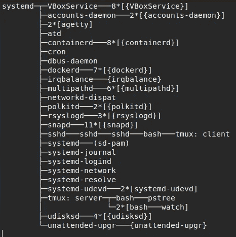
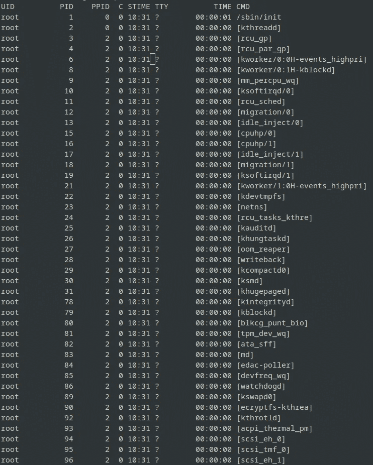
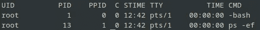

# 容器：它们如何在幕后工作以及为何它们正在主宰数据科学世界

> 原文：[`towardsdatascience.com/containers-how-they-work-under-the-hood-and-why-theyre-taking-over-the-data-science-world-6b94702609aa`](https://towardsdatascience.com/containers-how-they-work-under-the-hood-and-why-theyre-taking-over-the-data-science-world-6b94702609aa)

## 初学者指南：理解 Docker 的魔力

[](https://dpoulopoulos.medium.com/?source=post_page-----6b94702609aa--------------------------------)[](https://towardsdatascience.com/?source=post_page-----6b94702609aa--------------------------------) [Dimitris Poulopoulos](https://dpoulopoulos.medium.com/?source=post_page-----6b94702609aa--------------------------------)

·发布于 [Towards Data Science](https://towardsdatascience.com/?source=post_page-----6b94702609aa--------------------------------) ·阅读时间 7 分钟·2023 年 1 月 5 日

--


Containerized city — 由 Stable Diffusion 生成的图像

Docker 风靡全球，这是有充分理由的。轻量级、可移植的容器使得打包和部署应用程序变得轻而易举，确保它们在任何平台上都能稳定可靠地运行。

那么 Docker 容器到底是什么，它们在幕后是如何工作的呢？谷歌搜索会给你数百篇关于容器与虚拟机（VMs）比较的文章，但这并没有回答问题。Docker 是做什么的？它是他们发明的吗？我们能否在没有 Docker、Podman 或其他任何你可能使用的平台的情况下创建容器？

本系列文章将分解容器的概念，并解释 Docker 如何利用这些概念来革新我们构建和部署软件的方式。我们将了解 Linux 名称空间是什么，如何使用 `cgroups` 限制容器可以使用的资源，以及为何 overlay 文件系统在创建类似容器的环境中扮演着关键角色。

你准备好理解 Docker 容器的魔力了吗？在本系列结束时，你将能够创建自己的类似容器的环境，而无需 Docker。

> [学习速率](https://www.dimpo.me/newsletter?utm_source=medium&utm_medium=article&utm_campaign=namespaces)是一个针对对 MLOps 世界感兴趣的人的新闻通讯。MLOps 是一个广泛的领域，致力于以高效和可重复的方式将 ML 模型投入生产。容器在这个流程中扮演着关键角色。如果你想了解更多类似的话题，请订阅 [这里](https://www.dimpo.me/newsletter?utm_source=medium&utm_medium=article&utm_campaign=namespaces)。你将在每个月的第一个星期六收到我的更新和对最新 MLOps 新闻和文章的见解！

# 关键组件

让我们稍微远离 Docker，开始讨论构成 Linux 容器的关键组件。Linux 容器是一种强大的技术，允许你在单一主机上运行多个沙箱化进程。

这些进程共享主机的内核，但有自己的用户空间，这意味着它们有自己的一套库、依赖和运行环境。构成 Linux 容器的三个关键组件是：命名空间、控制组（`cgroups`）和覆盖文件系统。

命名空间是一个内核特性，它允许你在单一的 Linux 系统中创建隔离的环境。每个命名空间都有自己对系统的视图，这意味着在一个命名空间中的进程无法感知其他命名空间中运行的进程。

控制组（`cgroups`）是内核特性，它允许你管理和分配资源，如 CPU、内存和 I/O 带宽，给进程组。

覆盖文件系统允许你将一个文件系统堆叠在另一个文件系统之上，创建一个单一的逻辑文件系统。我们将在后续文章中看到这为什么很重要。

这是对构成容器的每个组件的高层次概述。在本文中，我们将深入讨论命名空间。在后续文章中，我们将探讨 `cgroups` 和覆盖文件系统如何完成这个整体。

# 命名空间

命名空间是内核特性，它允许你在单一的 Linux 系统中创建隔离的环境。每个命名空间都有自己对系统的视图，这意味着在一个命名空间中的进程无法感知其他命名空间中运行的进程。命名空间用于创建容器运行的隔离环境。

让我们尝试一个简单的类比：Linux 中的命名空间就像房子中的一个房间。每个房间里都有自己的物品，你只能看到和使用你所在房间里的东西。但房子里可能还有其他房间，里面有不同的东西，除非你进入那些房间，否则你不能看到或使用这些东西。

在 Linux 中，每个进程（类似于计算机上正在运行的程序）可以处于不同的命名空间。因此，如果你有两个进程在不同的命名空间中，它们可以拥有各自独立的资源（比如各自的文件列表或网络连接），而且它们无法看到或使用对方的资源。这对于将不同的进程彼此隔离以及确保一个进程不能干扰另一个进程是非常有用的。

## 命名空间的类型

在 Linux 中有几种不同类型的命名空间，包括以下几种：

+   `PID` 命名空间：隔离进程 ID 空间，使得不同 `PID` 命名空间中的进程可以具有相同的 `PID` 而不会互相冲突。

+   `net` 命名空间：隔离网络栈，包括网络接口、IP 地址和路由表。

+   `mount` 命名空间：隔离挂载点，使得不同挂载命名空间中的进程可以拥有各自独立的文件系统，这些文件系统彼此独立，并与主机文件系统隔离。

+   `IPC` 命名空间：隔离进程间通信资源，如 System V `IPC` 对象和 POSIX 消息队列。

+   `uts` 命名空间：隔离主机名。

接下来，让我们创建自己的 `PID` 命名空间。

## 创建你自己的命名空间

因此，让我们创建一个新的 `PID` 命名空间并在其中运行 `bash` 命令。首先，让我们使用 `pstree` 命令探索当前系统的状态。我在一个运行 Ubuntu 的 VirtualBox 虚拟机中工作，因此命令返回了以下输出：



`pstree` — 作者提供的图片

在这里我们可以看到 Linux 中进程的结构。每个进程都有一个父进程，除了第一个进程。通常，`init` 进程（通常是 `systemd`）将是 `PID` 1，并且没有父进程。要了解更多关于 `systemd` 的信息，请阅读以下故事：

[](https://medium.com/geekculture/the-rise-of-linux-systemd-a-beginners-guide-8ca1e226103a?source=post_page-----6b94702609aa--------------------------------) [## Linux Systemd 的崛起：初学者指南

### 了解 Linux Systemd 的强大和灵活性。

medium.com](https://medium.com/geekculture/the-rise-of-linux-systemd-a-beginners-guide-8ca1e226103a?source=post_page-----6b94702609aa--------------------------------)

如果我们创建一个新的 `PID` 命名空间，我们期望看到一个新的树结构，其中包含属于此命名空间的进程。此外，我们将在此命名空间中首先运行的命令将获得 `PID` 1，这将映射到主机上的更高 `PID` 号。让我们看看实际效果：

```py
unshare -ipf
```

`unshare` 命令是你用来创建新命名空间的命令。在这种情况下，使用这些标志，它将创建一个新的 `PID` 命名空间（`p` 标志）和一个新的 `IPC` 命名空间（`i` 标志）。

现在，如果你尝试获取在此命名空间中运行的进程，你应该能看到 `bash` 作为 `PID` 1，对吗？让我们来检查一下：

```py
ps -ef
```

这是我在系统中得到的结果：



ps — 图片由作者提供

那么，发生了什么？为什么我仍然看到`init`进程作为`PID` 1？Linux 内核使用`/proc`文件系统来获取有关正在运行的进程的数据。因此，我们缺少一个组件。我们还需要创建一个新的`mount`命名空间并挂载一个新的`/proc`文件系统，因为现在我们从默认的`mount`命名空间获取这些信息。

为了解决此错误，我们将使用`--mount-proc`标志，它创建一个新的`mount`命名空间并挂载一个新的`/proc`文件系统。输入`exit`以退出你创建的`PID`命名空间，并运行以下命令：

```py
unshare -ipf --mount-proc
```

现在，如果你再次运行`ps -ef`，你将得到你所寻找的结果：



pc-proc — 图片由作者提供

恭喜你，你创建了一个新的`PID`命名空间。这是理解容器在后台如何工作的第一步。当然，如果你尝试运行比 bash 更有意义的东西会更有帮助，但要记住，你已经创建了你系统的一个隔离视图。要退出此视图，只需在终端中输入`exit`。

# 结论

Docker 容器是一项颠覆性的技术，它迅速席卷了全球。这些轻量级、可移植的容器使得打包和部署应用程序变得简单，确保它们在任何平台上都能一致且可靠地运行。但是，Docker 容器究竟是什么，它们是如何在后台工作的呢？

在这篇文章中，我们讨论了组成 Linux 容器的关键组件，并详细查看了命名空间。接下来，我们将深入探讨`cgroups`。我们的目标是创建一个类似容器的环境，而不使用 Docker！

# 关于作者

我的名字是[Dimitris Poulopoulos](https://www.dimpo.me/?utm_source=medium&utm_medium=article&utm_campaign=namespaces)，我是一名为[Arrikto](https://www.arrikto.com/)工作的机器学习工程师。我为欧洲委员会、欧洲统计局、国际货币基金组织、欧洲中央银行、经济合作与发展组织和宜家等主要客户设计并实施了 AI 和软件解决方案。

如果你有兴趣阅读更多关于机器学习、深度学习、数据科学和数据操作的文章，请在[Medium](https://towardsdatascience.com/medium.com/@dpoulopoulos/follow)、[LinkedIn](https://www.linkedin.com/in/dpoulopoulos/)或 Twitter 上的[@james2pl](https://twitter.com/james2pl)关注我。

所表达的观点仅代表我个人观点，不代表我雇主的观点或意见。
