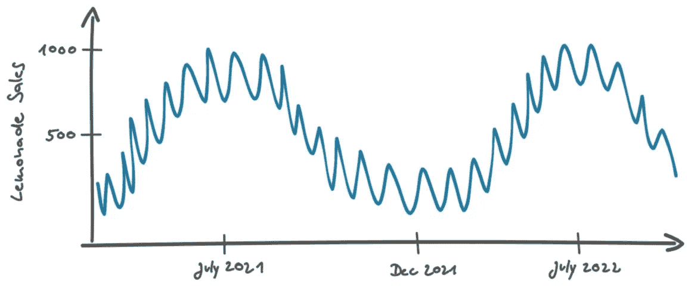
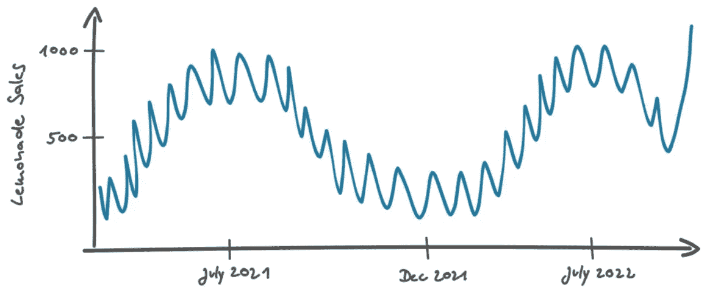
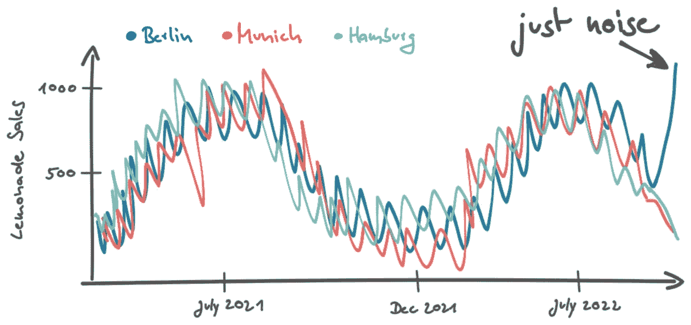
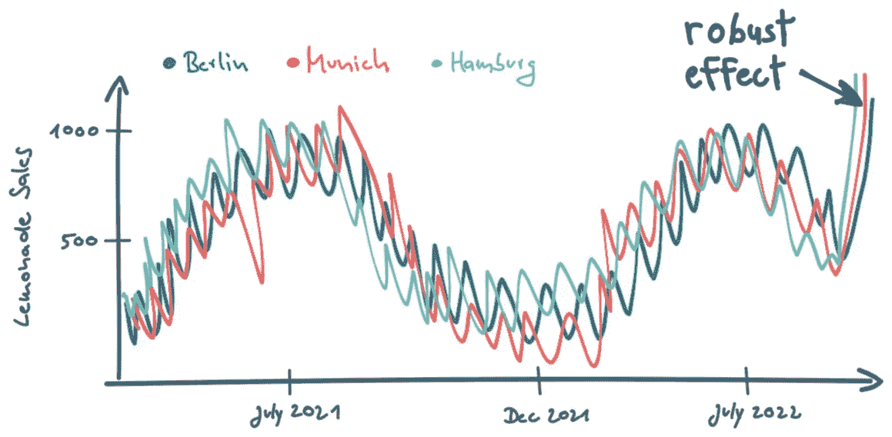
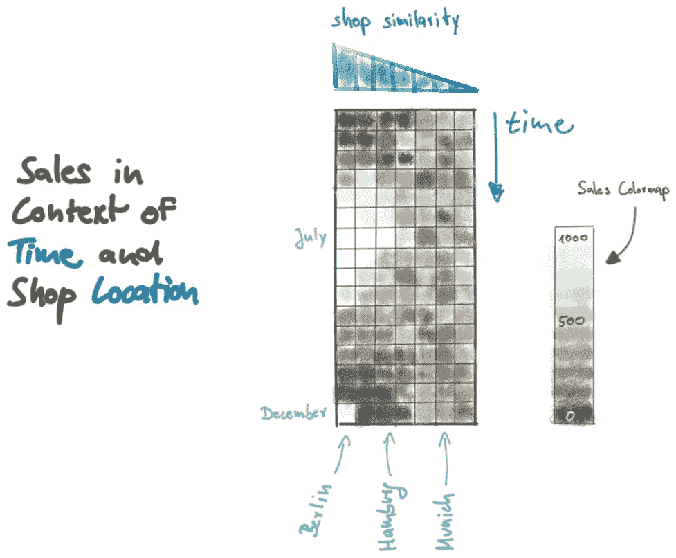
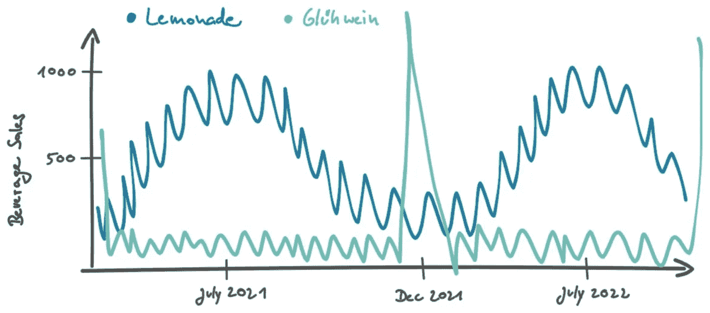
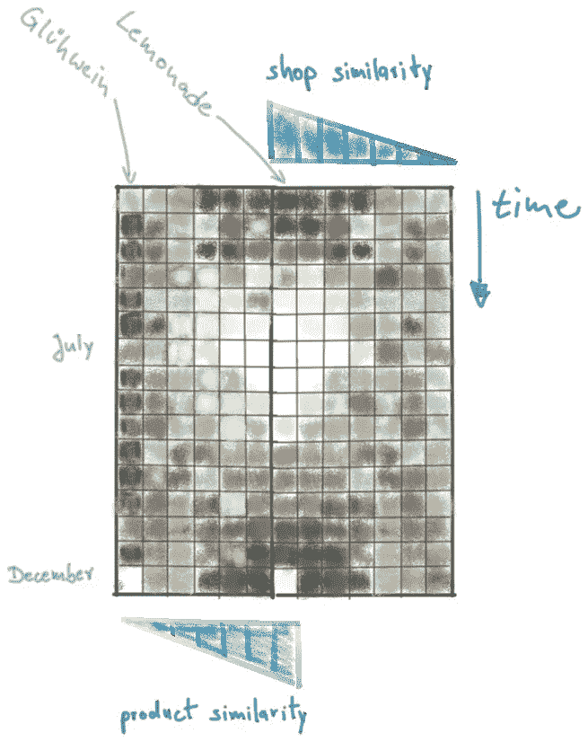
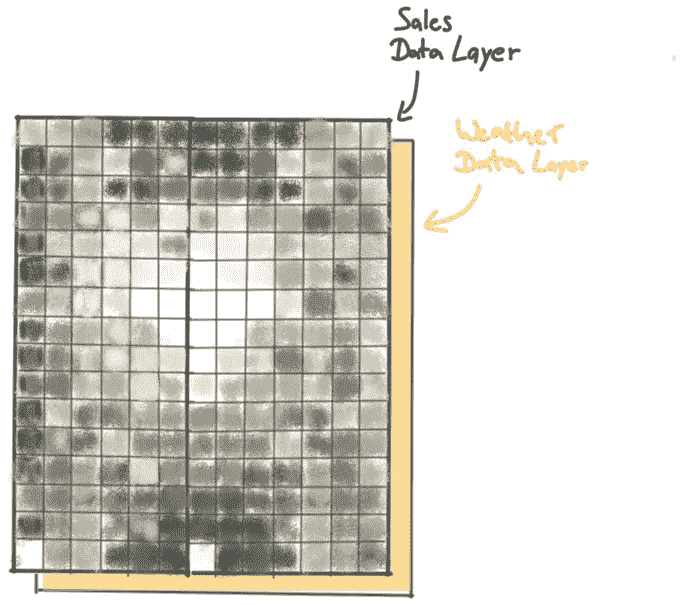

# 上下文丰富数据：深度学习模型的秘密超能力

> 原文：[`towardsdatascience.com/context-enriched-data-the-secret-superpower-for-your-deep-learning-model-549826a5fb3d?source=collection_archive---------8-----------------------#2023-01-13`](https://towardsdatascience.com/context-enriched-data-the-secret-superpower-for-your-deep-learning-model-549826a5fb3d?source=collection_archive---------8-----------------------#2023-01-13)

## 利用上下文感知数据工程设计更好的预测模型

 [Christoph Möhl](https://medium.com/@christoph.oliver.moehl?source=post_page-----549826a5fb3d--------------------------------)

·

[关注](https://medium.com/m/signin?actionUrl=https%3A%2F%2Fmedium.com%2F_%2Fsubscribe%2Fuser%2F5bd469d8e345&operation=register&redirect=https%3A%2F%2Ftowardsdatascience.com%2Fcontext-enriched-data-the-secret-superpower-for-your-deep-learning-model-549826a5fb3d&user=Christoph+M%C3%B6hl&userId=5bd469d8e345&source=post_page-5bd469d8e345----549826a5fb3d---------------------post_header-----------) 发表在 [Towards Data Science](https://towardsdatascience.com/?source=post_page-----549826a5fb3d--------------------------------) · 11 分钟阅读 · 2023 年 1 月 13 日

--

图片由 Mateo Krössler 提供，来源于 Unsplash

在这篇文章中，我想与大家分享我优化深度学习模型输入数据的方法。我已经成功地在我的数据科学家和数据工程师工作中应用了这一方法。通过实际例子，你将学到如何利用上下文信息丰富模型的输入数据。这将使你能够设计出更为稳健和精准的深度学习模型。

> 深度学习模型之所以如此强大，是因为它们非常擅长整合上下文信息。我们可以通过将多个上下文维度添加到原始数据中来提升神经网络的性能。我们可以通过一些巧妙的数据工程来实现这一点。

当你开发新的预测深度学习算法时，你可能会选择一种完全适合你特定用例的模型架构。根据输入数据和实际预测任务，有很多可能的方案你可能已经心中有数：你要进行图像分类吗？那么你可能会选择卷积神经网络。是关于时间序列预测还是文本分析？那么 LSTM 网络可能是一个有希望的选择。通常，关于正确模型架构的决策主要由输入到模型中的数据类型驱动。

以这种方式，找到正确的输入数据结构（即定义模型的输入层）是模型设计中最关键的步骤之一。我通常会在工程化输入数据的形状上投入比其他任何方面更多的开发时间。明确一点：我们不应该将原始数据的结构视为既定事实，然后仅仅寻找适合它的模型。神经网络在内部进行特征工程和特征选择的能力（“端到端建模”）并不能免除我们优化输入数据结构的任务。我们应该以一种方式提供数据，使得模型能够从中获得最佳的理解并做出最有信息量的决策（即最精确的预测）。这里的秘密成分是上下文信息。我们应该尽可能多地为原始数据提供上下文。

# 什么是上下文？

那么我具体说的上下文是什么呢？举个例子。玛丽是一名数据科学家，刚刚开始一份新工作，开发一个饮料零售公司的销售预测系统。她的任务简而言之是：给定一个特定的商店和一个特定的产品（柠檬水、橙汁、啤酒……），她的模型应该预测该产品在特定商店的未来销售数量。预测将应用于数千种不同的产品，涉及到数百个不同的商店。到目前为止一切顺利。在玛丽的第一天，她去到销售部门，那里的预测工作已经由非常有经验的销售会计彼得手动完成了。她的目标是了解这个领域专家基于什么来决定某个产品在未来是否会有更高或更低的需求。作为一名优秀的数据科学家，玛丽预期彼得多年的经验将对确定哪些数据对模型有价值非常有帮助。为了找出答案，玛丽问了他两个问题：

*“你查看哪些数据来确定我们下个月在柏林店铺中会销售多少瓶某品牌的柠檬水？你如何解读这些数据？”*

彼得回复道：*“我们首先观察柏林店铺中柠檬水销售的时间变化情况。”* 他绘制了如下图表以说明他的策略：

作者提供的图

我们看到一个连续的曲线，在七月/八月（柏林的夏季）有重复的峰值。直观上，夏季气温高，人们更倾向于购买清凉饮品，因此产品销量增加。在较小的时间尺度（约一个月）上，我们看到销售的波动范围在约 10 件内，这很可能是由于不可预测的事件（随机噪声）。

*彼得：“当我看到一个重复的模式，在夏季销售增加，在冬季销售减少。我假设这种情况也会发生在未来，并相应地估计销售额。”* 这听起来非常合理。

彼得在时间的背景下解释销售数据，其中两个数据点之间的距离由它们的时间差定义。如果数据没有按时间顺序排列，则解释起来会更困难。例如，如果我们仅仅查看直方图中的销售分布，时间上下文就会丧失，我们对未来销售的最佳估计可能只是所有值的中位数等汇总数据。

> 上下文在数据以某种方式排序时出现。

不言而喻，你应该按照正确的时间顺序输入历史销售数据，以保留来自数据库的“免费”上下文。深度学习模型之所以强大，是因为它们在整合上下文信息方面非常出色，类似于我们的脑袋（在这种情况下是彼得的脑袋）。

你是否曾经想过为什么深度学习在图像分类和图像目标检测方面表现如此出色？因为普通图像本身已经带有很多“自然”上下文：图像基本上是按两个上下文维度排序的光强数据点：即* x*的空间距离和* y*的空间距离。电影（图像时间序列）则补充了*时间*作为第三个上下文维度。

因为上下文对预测非常有益，我们可以通过添加更多上下文维度来提升模型的表现，尽管这些维度并不在原始数据中。我们通过一些巧妙的数据工程来实现这一点，如下一部分所述。

> 我们应该以模型能够充分理解的数据方式来服务数据，从而做出最有信息的决策。*我*通常会在输入数据的形状工程上投入比其他方面更多的开发时间。

# 设计上下文丰富的数据

回到与玛丽和彼得的会议。了解到实际数据大多数情况下不像上述图示那样整洁，玛丽稍微修改了图表：

作者提供的图

玛丽：*“如果最后一个销售数据点高于通常的噪声水平怎么办？这可能是一个真实的效应。也许正在进行一个成功的营销活动。也许配方已经改变，现在味道好得多。在这些情况下，效果是持久的，未来的销售将保持在同一高水平。或者也可能只是由于随机事件的异常值。例如，一个学校班级访问柏林，恰好进入了商店，所有孩子都买了一瓶这种柠檬水品牌。在这种情况下，增长是不稳定的，只是噪声。你会如何决定这是否是一个真实的效应？”*

你可以看到彼得在回答之前挠头：*“在这种情况下，我会查看与柏林的商店相似的商店的销售情况。例如，我们在汉堡和慕尼黑的商店。这些商店是可比的，因为它们也位于德国主要城市。我不会考虑乡村的商店，因为我期望那里的客户有不同的口味和偏好。”*

他添加了来自其他商店的销售曲线，并提出了两种可能的情景。*“如果我只看到柏林的销售增长，我会把它视为噪声。然而，如果我看到汉堡和慕尼黑的柠檬水销售也在上涨，我期望这是一种稳定的效应。”*

作者图

因此，在困难情况下，彼得会考虑更多的数据以做出更好的决策。他在不同商店的背景下添加了一个新的数据维度。正如我们上面所学的，当数据以某种方式排序时，会产生背景。为了创建商店背景，我们首先必须定义一个距离度量，以便相应地排序来自不同商店的数据。比如，彼得根据商店所在城市的规模来区分商店。

通过一些*SQL*和*Numpy*黑客技术，我们可以为我们的模型提供类似的背景。我们首先需要获取我们公司商店所在所有城市的总人口规模。然后我们测量所有商店之间在人口差异方面的距离。最后，我们将所有销售数据汇总到一个二维矩阵中，其中第一个维度是*时间*，第二个维度是我们的*商店距离*度量。

作者图

销售矩阵提供了对近期柠檬水销售的良好概述，结果模式可以直观地解释。看看销售矩阵的左下数据点：这是柏林的最新销售数字。这个亮点可能是一个异常值，因为在类似的商店（例如汉堡）中没有再现急剧的销售增长。相反，七月份的销售峰值在类似商店中得到了再现。

> 我们总是需要一个距离度量来创建背景。

将 Peters 的声明转换为数学术语，柠檬水的销售可以建模为产品提供城市的城市人口规模的函数。每当添加新的上下文维度时，我们总是要非常仔细地考虑正确的距离度量。这取决于我们想预测的实体受到哪些因素的影响。这些影响因素完全依赖于产品，距离度量也必须相应地调整。例如，如果你查看德国的啤酒销售，你会发现消费者更可能购买本地酿酒厂的产品（全国大约有 1300 家不同的[酿酒厂](https://en.wikipedia.org/wiki/Beer_in_Germany)）。来自科隆的人通常喝“Kölsch”啤酒，但当你向北开车半小时到达杜塞尔多夫地区时，人们会避免“Kölsch”，转而选择更深色、更麦芽味的“Alt”啤酒。因此，在德国啤酒销售的情况下，根据地理距离建模商店距离可能是一个合理的选择。然而，对于其他产品类别（柠檬水、橙汁、运动饮料等），情况可能会有所不同。

因为我们添加了一个额外的上下文维度，我们创建了一个上下文丰富的数据集，在这个数据集中，潜在的预测模型可以获得柠檬水在不同时间和不同商店的销售概况。这使得模型可以通过查看近期的销售历史，并在其他位置的类似商店进行横向比较，从而对柏林商店的未来销售做出明智的决策。

从这里，我们可以进一步添加*产品类型*作为额外的上下文维度。因此，我们用其他产品的数据来丰富销售矩阵，这些产品按与柠檬水（我们的预测目标）的相似度排名。我们需要找到一个好的相似度度量标准。可乐与柠檬水相比更相似吗？我们可以根据什么数据定义相似度排名？在*商店上下文*的情况下，我们有一个连续的度量标准，即城市人口。现在我们处理的是类别。我们真正想找到的是与柠檬水有类似销售行为的产品。我们可以对所有产品的时间分辨销售数据与柠檬水进行交叉相关分析。这样，我们可以为每个产品获得一个皮尔逊相关系数，告诉我们销售模式的相似程度。像可乐这样的软饮料可能与柠檬水有类似的销售模式，在夏季销售增加。其他产品则会有完全不同的表现。例如，Gühwein 是一种在圣诞市场上供应的温热甜酒，可能在 12 月有强烈的销售高峰，而在其他时间几乎没有销售。

图由作者提供

交叉相关分析将揭示 Glühwein 的皮尔逊系数较低（实际上是负值），而可乐的系数较高。

尽管我们向销售矩阵中添加了第三维度，但我们可以通过在相反方向上连接第二维度来包含*产品*上下文。这将最重要的销售数据（柏林的柠檬水销售）放在中心：

作者图

# 添加更多功能

尽管我们现在拥有一个信息丰富的数据结构，但迄今为止我们只有一个特征：在特定商店的特定时间销售的特定产品的数量。这可能已经足够进行稳健而精确的预测，但我们可以自由地从其他数据源中添加有用的附加信息。

饮料购买行为很可能与天气有关。例如，在非常炎热的夏天，柠檬水的需求可能会增加。我们可以将天气数据（例如空气温度）作为矩阵的第二层。天气数据将与销售数据在相同的上下文中排列：*时间*、*商店位置*和*产品*。对于不同的产品，我们将拥有相同的空气温度数据，但对于不同的时间和商店位置，我们会看到可能有用的信息差异。

作者图

结果是，我们有一个包含销售和温度数据的 3-D 矩阵。重要的是要注意，我们没有通过包含温度数据来添加额外的上下文维度。正如我之前指出的，上下文是当数据以某种方式排列时产生的。对于我们建立的数据上下文，我们按照*时间*、*产品相似性*和*商店相似性*来排列数据。然而，特征的顺序（在我们的案例中沿矩阵的第三维度）是无关紧要的。我们的数据结构类似于 RGB 彩色图像。在 RGB 图像中，我们有两个上下文维度（空间维度*x*和*y*）和三个颜色层（*红色*、*绿色*、*蓝色*）。为了正确解读图像，颜色通道的顺序是任意的。只要你定义了顺序，就必须保持顺序。但对于按某种上下文组织的数据，没有像我们有的距离度量。

> 输入数据的结构没有预定。你应该发挥所有创造潜力和直觉来扩展它。

# 总结

通过向时间分辨的销售数据和附加特征层添加两个额外的上下文，我们得到一个具有两个“通道”（销售和温度）的 2-D“图像”。这种数据结构提供了关于特定商店近期柠檬水销售的全面视图，同时还包含类似商店和类似产品的销售和天气信息。这种数据结构现在非常适合由深度神经网络解读，例如，包含多个卷积层和 LSTM 单元。我将不讨论如何从这里继续进行并设计合适的神经网络。这可能是后续文章的一个主题。

我希望你已经明白，你的输入数据的结构并不是预定的，你可以（应该）用你所有的创造力和直觉来扩展它。

上下文丰富的数据结构不是免费的。为了预测公司所有门店的各种产品，我们需要生成数千个上下文丰富的销售档案（每个门店-产品组合一个矩阵）。你必须投入大量额外的工作，设计高效的处理和缓存步骤，将数据整理成形，并提供给快速的训练和预测周期。但你会得到一个可以做出准确预测并在数据高度嘈杂时也表现非常稳健的模型，因为它可以“跳出框框”做出非常明智的决策。

你有问题吗？需要一个[**人工智能、数据科学、数据工程或 Python 开发方面的自由专家**](https://www.moehl-data-services.de/en)吗？访问[我的网站](https://moehl-data-services.de/en)并给我发消息。
