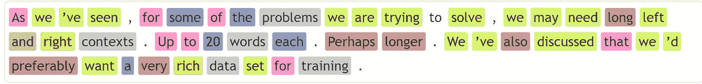

# 使用 NLP 进行上下文文本校正

> 原文：[`towardsdatascience.com/contextual-text-correction-using-nlp-81a1363c5fc3`](https://towardsdatascience.com/contextual-text-correction-using-nlp-81a1363c5fc3)

## **检测和校正涉及建模上下文的错误**

[](https://jagota-arun.medium.com/?source=post_page-----81a1363c5fc3--------------------------------)[](https://towardsdatascience.com/?source=post_page-----81a1363c5fc3--------------------------------) [Arun Jagota](https://jagota-arun.medium.com/?source=post_page-----81a1363c5fc3--------------------------------)

·发表于[Towards Data Science](https://towardsdatascience.com/?source=post_page-----81a1363c5fc3--------------------------------) ·阅读时间 23 分钟·2023 年 1 月 18 日

--


图片由[Lorenzo Cafaro](https://pixabay.com/users/3844328-3844328/?utm_source=link-attribution&utm_medium=referral&utm_campaign=image&utm_content=1870721)提供，来自[Pixabay](https://pixabay.com/)

在上一篇文章中，我们讨论了使用统计 NLP 方法检测和校正文本中常见错误的问题：

[](/text-correction-using-nlp-b68c7233b86?source=post_page-----81a1363c5fc3--------------------------------) ## 使用 NLP 进行文本校正

### 检测和校正常见错误：问题和方法

towardsdatascience.com

在那里我们盘点了几个问题，并附有实际示例和讨论。以下是我们在那篇文章中未完全解决的问题（最后两个甚至没有涉及）。这些是需要处理上下文的。

+   漏掉逗号。

+   漏掉或错误使用冠词。

+   使用单数而非复数，或反之亦然。

+   使用错误的介词或其他连接词。

在这篇文章中，我们从涉及冠词的问题开始。我们查看这些场景的详细示例，并深入探讨每个“问题”的含义。

然后我们描述了一个解决这些问题的方法。它使用了自我监督的关键思想。

然后我们转到各种其他场景，并讨论相同的方法如何解决这些问题。尽管结果的自我监督规格略有不同，预处理也略有不同。

**涉及冠词的问题**

考虑这些示例。

```py
… within matter of minutes …
… capitalize first letter in word …
```

在第一句话中，*within*和*matter*之间应该有一个*a*。在第二句话中，*capitalize*后面应该有一个*the*，在*in*后面也应该有一个。

考虑这个规则。

```py
If the string is 'within matter of'
  Insert 'a' immediately after 'within'.
```

你同意这个规则是有意义的吗？不要介意它的适用范围狭窄。稍后会变得清楚，这几乎无关紧要。

如果你同意，那么*within*和*matter of*分别是左侧和右侧上下文，确定*a*应该插入的位置。

我们可以简洁地将这样的规则表示为 L**a**R，应该这样解读。如果左侧上下文是 L，右侧上下文是 R，那么它们之间应该有一个***a***。在我们的设置中，L 和 R 都是令牌序列，可能有长度限制。

如接下来的段落将清楚地说明，实际上，将这个规则以稍微泛化的形式表示为 L**M**R 会更好。

这里**M**表示一个固定的可能性集合，准确地定义了我们要解决的问题。在我们的例子中，我们可以选择**M**为集合{ **a***,* **an***,* **the***, _***none***_* }*。

我们会将这个规则理解为“如果左侧上下文是 L，右侧上下文是 R，那么我们要建模四种可能性。_**None***_，表示 L 和 R 之间没有文章，其余三种是三种特定的文章。

我们真正做的是将我们希望解决的问题形式化为一个具有特定结果的监督学习问题，在我们的例子中是**M**。这不需要任何人工标记数据。只需定义**M**。

我们真正做的是*自我监督*。我们可以为不同的**M**选择定义尽可能多的问题。（实际上，在这篇文章中我们会再讨论几个。）然后我们可以利用监督学习的力量，而不需要承担标记数据的成本。这非常强大。

看一个例子。考虑**M** = {_**none**_, _**a_**, _**the_**, _**an_** }。假设我们的训练集中恰好有一个句子。下划线只是为了可读性——区分**M**中的结果和文本中的其他词。

```py
John is a man.
```

我们还假设我们的规则不会跨越句子边界。这是一个合理的假设。建模中的任何内容都不依赖于这个假设，因此它可以根据需要放宽。

从这个单句语料库中，我们将得出以下标记数据：

```py
John _none_ is a man
John is _none_ a man
John is a _none_ male
…
John is _a_ man
```

每一行中，被下划线标记的词是**M**中的一个结果，左侧的词是左侧上下文，右侧的词是右侧上下文。

例如，

```py
John is _a_ man
```

说如果左侧上下文是[*John*, *is*]，右侧上下文是[*man*]，那么在左侧和右侧上下文之间有一个*a*。因此，这个标记实例捕捉了文章应该出现的位置和它的身份。

剩下的实例捕捉负例，即文章不应该出现的地方。

一旦我们拥有这样的标记数据集，我们原则上可以使用任何合适的监督学习方法来学习从输入（L，R）预测标签。

在本文中，我们将专注于一种我们认为非常适合我们特定监督学习问题的监督学习方法。这是一种为特定目的建模 L 和 R 为标记序列的方法。

读者可能会问，为什么不使用最新最好的 NLP 技术来处理这个问题呢？它们可以处理非常复杂的场景？例如递归神经网络、变换器以及最近的大型语言模型如 ChatGPT。甚至可能是隐马尔可夫模型或条件随机场。（有关复杂语言模型的更多信息，请参见[6]和[7]。）这些方法中的一些如果不是全部都应该效果很好。

有权衡。如果有人试图从长远解决这些问题，或许是为了围绕它构建一个产品，例如 Grammarly [3]，那么最新最好的方法当然应该被考虑。

另一方面，如果有人希望从头开始构建或至少理解更简单但有效的方法，则本文中的方法应该被考虑。

前述方法也容易逐步实现。对于那些想尝试的人，请查看**迷你项目**部分。那里描述的项目可以在几小时内完成，最多一天，由一个精通 Python 或其他脚本语言的程序员完成。

**方法**

首先，让我们描述这种方法如何解决缺失或不正确的冠词问题。接着，我们将把它应用于本文前面提到的其他几个问题。

以 L**M**R 为例。我们将使用附加到这个规则上的概率分布 P(**M**|L, R)。P(**M**|L, R)会告诉我们在**M**中的哪一个结果在（L, R）的上下文中比其他结果更可能。

例如，如果*P*(**a**|L=*John is*, R=*man*) 接近 1（如果不是 1 的话），我们就会期待这种情况。

*P*(**M**|L, R) 可以从我们的训练数据中以明显的方式学习。

*P*(**m**|L, R) = #(L,**m**,R)/sum_**m’** #(L,**m’**,R)

这里 #(L, **m’**, R) 是我们训练集中输入（L, R）上标签为**m’**的实例数量。请注意，如果**m’** 是 _**none**_，则 R 在 L 结束后紧接着开始。

假设我们的训练语料库现在恰好有两个句子。

```py
John is a man.
John is the man.
```

*P*(**a**|L=*John is*, R=*man*) 将是½，因为这个（L, R）有两个实例，其中一个标记为**a**，另一个标记为**the**。

**在机器学习意义上的泛化**

考虑标记实例

```py
John is _a_ man.
Jack is _a_ man.
Jeff is _a_ man.
```

如果我们的语料库中有足够多的这些数据，我们希望我们的机器学习能学会这个规则。

```py
is _a_ man
```

即，*P*(**a**|L=*is*, R=*man*) 也接近 1。这种规则会更好地泛化，因为它适用于左侧上下文是*is*而右侧上下文是*man*的任何场景。

在我们的方法中，我们将按如下方式解决这个问题。

设 L**m**R 是训练集中的一个实例。下面我们将假设 L 和 R 是标记序列。在我们的设置中，标记化可能基于空格。例如，我们的方法将适用于任何标记化方式。

从 L**m**R 我们将派生新的训练实例 L’**m**R’，其中 L’是 L 的一个后缀，R’是 R 的一个前缀。L’或 R’或两者可能都没有标记。

从中派生的实例将覆盖所有 L’和 R’的组合。

当然，如果将其应用于大型语料库且 L 和 R 的长度没有限制，训练集的大小可能会爆炸。好吧，限制它们。

**回顾**

好的，让我们看看现在的情况。考虑本文前面的例子。

```py
… within matter of minutes …
… capitalize first letter in word …
```

假设我们的训练语料库足够丰富，例如，维基百科的所有内容都已预先分段成句子，我们应该完全没有困难来检测这些句子中缺失的文章位置，并推荐具体的修复方案。应用这些修复方案后得到的句子是

```py
… within a matter of minutes …
… capitalize the first letter in the word …
```

现在考虑

```py
… within the matter of minutes …
```

使用我们训练好的模型，我们可以检测到**the**这里可能应该是**a**。

**预测算法**

到目前为止，我们只非正式地讨论了如何使用学习到的规则来识别问题，而没有详细讨论。我们现在填补这个空白。

考虑一个窗口 L**m**R，我们要在此窗口中将 m 与应用于这种情况的规则的预测进行比较。例如，L**m**R 如果是

```py
… within the matter of minutes …
```

我们想基于规则 L’ _the_ R’进行预测，其中 L’是[*within*]或[]，R’是[*matter*, of, *minutes*]，[*matter*, of]，[*matter*]或[]，并从这些预测中以某种方式得出最终预测。

我们将采取以下方法。我们假设给定一个截止值，称之为*c*，这是*P*(**m’**|L, R)在我们的方法预测**m’**的上下文（L, R）中需要达到的最小值。

我们将按照非递增的|L’|+|R’|的顺序检查我们的规则。这里|T|表示列表 T 中的标记数。我们将停止，直到我们找到某个 L’、R’使得*P*(**m’**|L’, R’)至少为*c*。

用简单的英语来说，我们在做这个。在适用于特定情况的所有规则中，我们找到一个对**M**的某些结果具有足够预测性且在这些规则中最通用的规则。

**尝试这些**

考虑这些例子，来自[`en.wikipedia.org/wiki/Shannon_Lucid`](https://en.wikipedia.org/wiki/Shannon_Lucid)

我已经移除了文章。我希望读者猜测文章应该放在哪里以及它应该是什么：*the*、*a*或*an*。

```py
… included trip to …
… had different payload …
… on wide variety of …
… was teaching assistant …
… and bought preowned Piper PA-16 Clipper …
… as graduate assistant in Department of Biochemistry and 
  Molecular Biology …
… transferred to University of Oklahoma …
```

只有在你完成所有预测后才查看下面的内容。

这些实例派生的来源是

```py
… included a trip to …
… had a different payload …
… on a wide variety of …
… was a teaching assistant …
… and bought a preowned Piper PA-16 Clipper …
… as a graduate assistant in the Department of Biochemistry and 
  Molecular Biology …
… transferred to the University of Oklahoma …
```

你的预测效果如何？如果你做得很好，那么本文中描述的方法也会有效。

**小项目**

如果你对一个可以在几个小时内实现的小项目感兴趣，考虑这个。编写一个脚本，可能只有几行代码，输入一个文本文件并输出一个标记的训练集。然后检查标记的训练集，以了解它是否包含对预测文章位置和身份有用的实例。

如果你的评估显示出潜力并且你有时间，你可以考虑进一步推进。也许使用现有的机器学习实现，例如来自 scikit-learn 的实现，来处理训练集。或者从头实现该方法。

现在一些更多的细节将有助于你的脚本。考虑将上下文限制为 L 和 R 各自恰好一个单词。在文档中按顺序扫描单词，并即时构建负实例和正实例。忽略句子边界，除非你有 NLP 工具（如 NLTK），并可以使用其分词器将文本分割成句子。

将构造出的实例逐步存入一个包含三列 L、R、**M** 的 pandas 数据框。**M** 是我们在本节中选择的集合。将此数据框输出到 CSV 文件中。

如何为你的脚本获取一个合理的训练集？通过复制和粘贴下载一两篇维基百科页面。

**涉及逗号的问题**

接下来，让我们把注意力转向涉及逗号的问题。在 [1] 中我们覆盖了一些简单的场景。下面的那些更为微妙。

参考 [`en.wikipedia.org/wiki/Zork`](https://en.wikipedia.org/wiki/Zork)

```py
In Zork, the player explores …
```

首先，我们观察到，为了应用我们的方法，我们应该将逗号保留为一个单独的标记。然后，这个问题看起来就像我们之前讨论的那个关于冠词的问题。选择**M** = {_**comma**_, _**none**_} 是有意义的。也就是说，监督学习的问题是预测在上下文 (L, R) 中是否存在逗号。

从我们目前看到的情况来看，尽管我们学习的规则可能有效，但它们可能无法充分推广。这是因为左侧上下文的最后一个标记将是 *Zork*。我们并没有真正学习到一般模式。

```py
In <token of a certain type> _comma_ the
```

有没有简单的方法来推广我们的方法，使其能够学习更一般的规则？

答案是肯定的。这里是方法。

我们将介绍抽象标记的概念。我们将从一个与我们示例相关的单一抽象开始。在这篇文章后面，我们将根据需要介绍其他抽象。

我们将假设应用此抽象的单词仅包含从 *a* 到 *z* 的字符。也就是说，没有数字；没有特殊字符。

这种抽象将生成三种字符串之一：/**capitalized/** 表示单词以大写字母开头，后跟零个或多个小写字母，/**all_lower/** 表示单词中的所有字母都是小写字母，以及 /**all_caps/** 表示单词中的所有字母都是大写字母。

接下来，我们将通过选择性地应用这个抽象操作符，从现有标记中推导出新的标记序列。

让我们详细说明“选择性”。如果对序列中的每个标记，我们考虑两种可能性，即原始标记或抽象标记，我们将会得到生成序列的组合爆炸。

为了缓解这个问题，我们将仅抽象出在我们的训练集中出现频率足够低的标记，或者仅抽象出那些产生/**首字母大写**/或/**全大写**/的标记。

以下是我们可能从*In Zork*中派生出的序列，*the* …

```py
In /capitalized/, the
```

我们只抽象出*Zork*，因为它既是首字母大写又是一个不常见的词。

现在假设我们将从抽象序列派生的新的标记实例添加到训练集中。标签是与原始序列相关的标签。

在我们的例子中，得到的标记实例是

```py
In /capitalized/ _comma_ the
```

现在我们按照之前的方式训练我们的算法。它也会学习到一般化的规则。

注意，当我们说“将新的标记实例添加到训练集中”时，我们并不是暗示这需要离线完成。我们可以简单地动态添加这些标记实例。这类似于在机器学习实践中常做的事情。

```py
Extract features from the input on-the-fly
```

此外，请注意，我们将我们的方法描述为“添加新的标记实例”，仅仅是因为我们觉得这样解释更有用。我们也可以将其视作没有添加新的标记实例，而只是提取了额外的特征。

这是因为所有新添加的实例都具有相同的标签——原始标签。因此，我们可以将它们全部合并到原始实例中，只是提取了额外的特征。

**更细致的例子**

现在考虑这些来自 [`en.wikipedia.org/wiki/Shannon_Lucid`](https://en.wikipedia.org/wiki/Shannon_Lucid) 的示例

```py
Due to America’s ongoing war with Japan, when she was six weeks old, 
the family was detained by the Japanese.

They moved to Lubbock, Texas, and then settled in Bethany, Oklahoma, the 
family's original hometown, where Wells graduated from Bethany High School 
in 1960.

She concluded that she had been born too late for this, but discovered 
the works of Robert Goddard, the American rocket scientist, and decided 
that she could become a space explorer.
```

这些是更复杂的。

尽管如此，我们将继续使用我们的方法，理由是我们在帖子中提到的那些。一个理由是，一个基本但有意义的版本可以在几天甚至几小时内从零开始实现。（不需要机器学习库。）

对这些，我们还要增加一点。这种方法的预测是可以解释的。具体来说，如果它检测到一个问题并提出建议，那么涉及的具体规则可以作为解释附加上。正如我们所见，规则通常是透明的。

好的，回到例子。

让我们逐一检查上述示例中涉及逗号的场景。我们不会检查所有的。

对于我们检查的那些规则，我们还会评估我们当前的方法是否有很好的机会按现状运行。这些检查也会产生进一步改进的想法。

考虑

```py
Due to America’s ongoing war with Japan, when she was six weeks old
```

我们从中派生出的序列是

```py
Due to /capitalized/’s ongoing war with /capitalized/, when she was six 
weeks old
```

从这两个序列中派生的标记实例还包括左侧上下文的所有后缀组合与右侧上下文的前缀配对。用机器学习的术语来说，这意味着我们在假设空间中枚举了大量假设（在我们的设置中，假设就是规则）。

我们在上一段中试图说明的要点是，通过生成大量假设，我们增加了找到一些足够具有预测性的规则的可能性。

当然，没有免费的午餐。这也影响训练时间和模型复杂度。

这也假设我们能够丢弃在这个过程中发现的那些结果是嘈杂或无效的规则。具体来说，就是那些*预测能力不足*或可以被同样具有预测能力的更通用规则覆盖的规则。

在本文的后续部分，我们将解决所有这些问题。也就是说，只有通过对广泛场景的实证评估，才能最终揭示我们的方法的有效性。

回到这个具体的例子。首先，再次查看它。

```py
Due to /capitalized/’s ongoing war with /capitalized/, when she was six 
weeks old
```

我们的方法有很大机会在现状下有效。如果在这个具体例子中无效，那至少在类似例子中有效。此外，关于改进的具体内容没有什么特别的想法。所以让我们继续看看其他例子。

接下来，考虑

```py
when she was six weeks old, the family was detained by the Japanese.
```

我们认为，当前的方法在这种情况下可能有效。为什么？考虑

```py
… when she was six weeks old the family was detained by …
```

基于这些信息，你不会考虑在*old*和*the*之间插入一个逗号吗？（我确实是说“考虑”。）

如果你愿意，这个算法也可能效果很好。它看到相同的信息。

接下来，考虑

```py
They moved to Lubbock, Texas
then settled in Bethany, Oklahoma
```

我们之前提出的抽象，将某些词抽象为/**capitalized**/、/**all_lower**/或/**all_caps**/应该在这里有所帮助。

如果没有足够的帮助，我们可以加上第二个、更精细的抽象。具体来说，涉及检测命名实体*city*和*state*。这些可以让我们得出两个新的序列。

```py
They moved to /city/, /state/
then settled in /city/, /state/
```

**更加细致的案例**

以下是涉及逗号问题的更细致的例子。这些也来自[`en.wikipedia.org/wiki/Shannon_Lucid`](https://en.wikipedia.org/wiki/Shannon_Lucid)

```py
Originally scheduled as one mission, the number of Spacelab Life Sciences 
objectives and experiments had grown until it was split into two 
missions,[57] the first of which, STS-40/SLS-1, was flown in June 1991.

To study this, on the second day of the mission Lucid and Fettman wore 
headsets, known as accelerometer recording units, which recorded their 
head movements during the day. Along with Seddon, Wolf and Fettman, Lucid 
collected blood and urine samples from the crew for metabolic experiments.
```

这些表明我们可能需要允许相当长的左侧和右侧上下文，可能每侧最多 20 个单词。也许还要增加更多抽象。

抛开抽象，如何影响我们的模型训练？首先，由于我们在学习一个复杂的模型，我们需要我们的训练集足够大、丰富且多样。幸运的是，这样的数据集可以轻松组建。下载并使用整个维基百科。见[9]。

好了，现在谈谈训练时间。由于我们有一个庞大的训练集和一个复杂的模型，训练时间可能很长，这个模型涉及许多规则。当然，学习到的模型本身也可能很庞大，学习到的大多数规则可能会变得嘈杂。

在本文后续部分，我们将详细讨论这些挑战及其缓解方法。特别是，我们将提出具体的方式来剔除那些*预测能力不足*的规则或那些可以通过更通用且*足够*预测的规则来覆盖的规则。

现在，让我们继续下一个用例，即

**涉及介词或其他连接词的问题**

现在考虑这些示例，这些示例也来自[`en.wikipedia.org/wiki/Shannon_Lucid`](https://en.wikipedia.org/wiki/Shannon_Lucid)，我对其做了一些小的修改。具体而言，我将某些连接词替换成了其他稍微合理但不如原本的词。

```py
… participated on biomedical experiments …
… satellites were launched in successive days …
… initiated its deployment with pressing a button …
```

你能发现错误并修复它们吗？

以下是原始的，即正确的版本。

```py
… participated /in/ biomedical experiments …
… satellites were launched /on/ successive days …
… initiated its deployment /by/ pressing a button …
```

如果你做得很好，那么方法也会很好。

现在进行建模。我们将让**M**表示我们希望建模的连接词集合。**M**可以由某个词性标注器标记为介词的单词定义。例如，或者其他方式。

无论如何，我们需要确保可以准确且合理高效地确定特定标记是否在**M**中。

这是因为在训练过程中，在扫描特定文本时，我们需要知道每个单词是否属于**M**。

为了简化起见，我们将 _**none**_ 排除在**M**之外。这意味着我们只能模拟替换错误，即使用错误的连接词。虽然很容易将 _**none**_ 添加进来，但这会稍微增加描述的复杂性。

**单数与复数**

考虑这些示例，其中我们想要检查所谓的语法数的单词已用粗体标出。

```py
As we’ve seen, for some of the /problems/ we are trying to solve, we may 
need long left and right /contexts/. Up to 20 /words/ each. Perhaps longer.

We've also discussed that we'd preferably want a very rich data /set/ for 
training.
```

首先，我们需要问一下如何以自动化的方式检测/…/中的单词。这是一个起点。我们可以运行一个词性标注器，只提取名词。

让我们在我们的示例上试一下。使用[`parts-of-speech.info/`](https://parts-of-speech.info/)上的词性标注器，我们得到



各种词性标记的颜色代码如下。


尽管如此，这种方法虽然不是最佳，但足以作为起点。它正确地标出了*problems*、*contexts*和*words*。它有一个假阳性，*and*，和一个假阴性，*set*。它还标出了*training*，这可能我们并不在意。

正如我们稍后将详细讨论的那样，尽管假阳性可能会产生额外的无关规则，但这些规则通常不会有害，只是无用。此外，我们将在修剪阶段捕捉到它们。

也就是说，如果我们对准确性有较高要求，我们可能会考虑使用更先进的词性标注器，或其他方式来改进我们的检测方法。我们在这篇文章中不会追究这两个方向。

接下来，我们将进行一种在之前讨论的使用案例中尚未遇到的预处理。假设我们在前一段描述的过程中检测到了一个特定的单词，这是我们研究的对象。这里的“研究对象”是指它应为单数还是复数。

一旦我们检测到这样的词，我们将运行一个语法数分类器，可能使用一个非常简单的启发式方法，例如，如果单词以*s*或*ies*结尾，则视为复数，否则视为单数。接下来，我们将根据该分类器的预测，将 _singular_ 或 _plural_ 添加到文本的副本中。重要的是，我们还将对紧接着标签之前的单词进行单数化处理。

在我们的示例中，完成所有这些操作后，使用我们之前使用的词性标注器，我们会得到

```py
As we’ve seen, for some of the *problem* _plural_ we are trying to solve, 
we may need long left and _singular_ right *context* _plural_. Up to 20 
*word* _plural_ each. Perhaps longer.
```

所以我们的**M**将是集合{ _**singular**_, _**plural**_ }。

请注意，左侧上下文包括我们试图预测语法数的词。这是有意为之的。这就是为什么我们在文本中明确添加了标签的原因。

此外，请注意，被星号包围的单词是我们进行单数化处理的单词。我们这样做是因为这些词在待预测标签的左侧上下文中。我们希望去除单词本身中任何可以用来预测其标签的信息。除了单数化版本本身固有的信息。

如果我们没有对这些词进行单数化处理，就会发生标签泄漏。这将产生不良后果。我们可能会学习到看似有效但在预测时表现不佳的规则。

接下来，让我们快速回顾一下文本，以作为合理性检查。评估上下文是否似乎有足够的信号来至少比随机预测得更好。我们能够多准确地预测标签，将有待于经验评估。

似乎*对于某些问题*，预测 _**plural**_。*左侧和右侧上下文* 也似乎比随机预测 _**plural**_ 更好。没有看到更多示例，很难说效果有多好。类似地，*最多 20 个单词* 似乎也能预测 _**plural**_。如果我们使用将 20 视作 _**integer_greater_than_1**_ 的抽象，预测可能会有所改善，并且确实会更好地泛化。

**模型复杂性、训练时间和查找时间**

正如我们所见，对于我们试图解决的某些问题，我们可能需要较长的左侧和右侧上下文。每侧最多 20 个单词。也许更长。

我们还讨论过，我们最好能拥有一个非常丰富的训练数据集。例如，整个维基百科。我们的机制也依赖于抽象，这可能会将训练集的规模放大到另一个数量级。

这会是我们方法的致命问题吗？其实不会。我们可以显著减少模型的大小，并大幅加快训练速度。我们将在下文中逐一讨论这些问题。我们还会讨论如何提高我们称之为查找时间的效率，因为这会影响训练时间和预测时间。

**减少模型大小**

让我们从模型大小开始。首先，请记住，在现代，大规模的实际模型确实使用数十亿个参数。因此，即使没有任何剪枝，我们也可能没问题。话虽如此，我们还是会对其进行讨论。

当考虑是否删除特定规则时，我们将区分两种情况。

+   规则是否预测不足？

+   与这个规则相比，更通用的规则是否足够预测？

我们区分这两种情况的主要原因是我们不会对第一种情况进行显式剪枝。相反，我们将依赖于第二种情况也能处理第一种情况，或者预测算法能够足够好地进行动态剪枝。关于后者，还要注意预测算法将截止点*c*作为参数，这允许我们在预测时变得更保守或更敏感。

好了，既然这些解决了，我们来处理第二种情况。

为了解释这个方法，让我们从一个足够通用的学习规则 L**M**R 开始。这是一个例子。

```py
from M learned
```

我们认为它通用，因为左右上下文都是一个单词。

想象一下，在训练语料库中，表达式*from a learned model* 至少出现一次。所以我们也会学习到这个规则。

```py
from M learned model
```

这个规则更具体。因此我们将其视为规则的子规则。

```py
from M learned
```

现在我们已经定义了子父关系，我们可以将规则排列成树状结构。

现在我们准备描述剪枝标准。对于树中的特定节点*v*，如果它的所有后代预测的结果与*v*相同，我们将修剪掉*v*子树下的所有节点。

让我们将其应用于我们的例子。在设置**M** = {_**a**_, _**an**_, _**the**_, _**none**_}中，规则

```py
from M learned model
```

预测相同结果的*_**a**_*，如

```py
from M learned
```

此外，假设后一个规则在其子树中仅有一个规则，即前一个规则。那么我们将剪除前一个规则。

好的，我们已经定义了剪枝标准。接下来，我们讨论如何实际进行剪枝，即如何高效地应用标准。*简短的答案是自下而上*。

我们从树的叶子开始，找到它们的父节点。然后，我们逐一考虑这些父节点。如果父节点的所有子节点预测的结果与父节点相同，我们就剪除这些子节点。

我们现在有了一棵新树。我们在它上面重复相同的过程。

当我们不能再剪枝或剪枝足够时，我们停止。

**加速训练**

一方面，我们只需对训练集中的句子进行一次遍历。此外，我们只需停留在那些**M**的实例上，以暂停并更新之前描述的各种计数器。这很好。

另一方面，在特定的停止点**m**，我们可能需要枚举所有可接受的窗口 L**m**R，以便我们可以增加涉及**m**的计数器。对于这些窗口中的每一个，我们还需要根据我们建模的抽象来推导额外的窗口。

我们已经讨论了如何约束抽象，所以在这里我们不会重复讨论。

我们希望指出的关键点是，以我们之前描述的方式修剪模型不仅减少了模型的大小，还加快了后续的训练。这是因为，在任何特定的停止点**m**，在修剪模型中触发的规则通常会比未修剪的模型少得多。

**查找时间**

这里的查找是指我们希望在特定情况下高效地查找适用的规则。我们从一个例子开始。假设我们已经学会了规则

```py
is M man
```

对于涉及冠词的问题。回忆一下我们选择了**M** 为 { **a**、**an**、**the**、_**none**_ }。

现在考虑文本*Jeremy is a man.* 我们要扫描它以查找问题。我们将关注*a*，因为*a* 在**M**中。我们要按顺序检查以下内容。对于这个**M**，是否有规则 L = [*is*] 和 R = []？是否有规则 L = [] 和 R = [*man*]？是否有规则 L = [*is*] 和 R = [*man*]？等等。我们称“是否有规则”为查找。查找输入**M**、L 和 R。

我们显然希望查找能够快速进行。我们可以通过在哈希表中索引规则集来实现这一点，称之为 H。H 的键是三元组（**M**、L、R）。可以将 H 视为一个 3 维哈希表，表示为 H[**M**][L][R]。

**总结**

在这篇文章中，我们涵盖了涉及检测和纠正文本错误的详细场景。我们所说的“详细”是指那些上下文显得重要的情况。我们讨论了缺少或不正确的冠词、缺少逗号、在应使用复数时使用单数或反之亦然、以及使用错误的连词如错误的介词等问题。

我们将每个问题建模为自监督学习问题。我们描述了一种适用于所有这些问题的方法。它基于对结果空间的概率分布，该分布在左上下文和右上下文上共同条件化。结果的定义和一些预处理确实依赖于特定问题。

我们讨论了枚举左右上下文对及其逐渐增加的长度，以及用于学习更一般规则的抽象机制。

我们描述的方法在其基本形式上容易实现。

我们还描述了如何修剪学习到的规则集，如何加速训练，以及如何高效地查找适用于特定情况的规则。

**参考文献**

1.  使用 NLP 的文本修正。检测和纠正常见错误…… | 作者：阿伦·贾戈塔 | 2023 年 1 月 | 数据科学之路

1.  [关联规则学习 — 维基百科](https://en.wikipedia.org/wiki/Association_rule_learning)

1.  [Grammarly](https://app.grammarly.com/) *我广泛使用它，非常有用。*

1.  [ChatGPT: 优化对话的语言模型](https://openai.com/blog/chatgpt/)

1.  [维基百科：数据库下载](https://en.wikipedia.org/wiki/Wikipedia:Database_download)

1.  [统计语言模型 | 阿伦·贾戈塔 | 数据科学前沿 | Medium](https://medium.com/towards-data-science/statistical-language-models-4e539d57bcaa)

1.  [神经语言模型，阿伦·贾戈塔，数据科学前沿，Medium](https://medium.com/towards-data-science/neural-language-models-32bec14d01dc)
