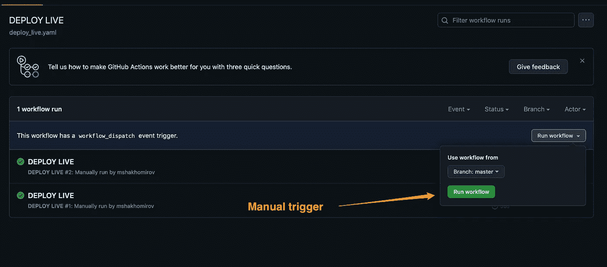

# 数据平台的持续集成和部署

> 原文：[`towardsdatascience.com/continuous-integration-and-deployment-for-data-platforms-817bf1b6bed1`](https://towardsdatascience.com/continuous-integration-and-deployment-for-data-platforms-817bf1b6bed1)

## 数据工程师和机器学习操作的 CI/CD

[](https://mshakhomirov.medium.com/?source=post_page-----817bf1b6bed1--------------------------------)[](https://towardsdatascience.com/?source=post_page-----817bf1b6bed1--------------------------------) [💡Mike Shakhomirov](https://mshakhomirov.medium.com/?source=post_page-----817bf1b6bed1--------------------------------)

·发表于 [Towards Data Science](https://towardsdatascience.com/?source=post_page-----817bf1b6bed1--------------------------------) ·阅读时间 9 分钟·2023 年 4 月 14 日

--


图片由 [Emmy Sobieski](https://unsplash.com/@emmy_s?utm_source=medium&utm_medium=referral) 提供，来源于 [Unsplash](https://unsplash.com/?utm_source=medium&utm_medium=referral)

什么是数据环境？数据工程师将基础设施资源分为实时和暂存，以创建隔离的区域（环境），在这些区域中，他们可以测试 ETL 服务和数据管道，然后再将其推广到生产环境中。

**数据环境** 指的是一组应用程序和相关的物理基础设施资源，这些资源支持数据存储、传输、处理和数据转换，以支持公司的目标和计划。

**这个故事** 提供了 **适用于数据的 CI/CD 技术概述** 和一个简单的 **ETL** 服务的 **工作示例**，该服务使用 **Python** 构建，并通过 **Github Actions** 以 **基础设施即代码**（IaC）进行部署。

## 持续集成和持续交付（CI/CD）

持续集成和持续交付（CI/CD）是一种软件开发策略，所有开发人员在一个共同的代码仓库上协作，当做出更改时，会使用自动化构建过程来发现任何潜在的代码问题。


作者提供的图像

## CI/CD 的好处

CI/CD 的主要技术优势之一是它提高了整体代码质量并节省了时间。

> 使用基础设施即代码的自动化 CI/CD 管道解决了许多问题。

[](https://levelup.gitconnected.com/infrastructure-as-code-for-beginners-a4e36c805316?source=post_page-----817bf1b6bed1--------------------------------) [## 初学者的基础设施即代码

### 使用这些模板像专业人士一样部署数据管道

[levelup.gitconnected.com](https://levelup.gitconnected.com/infrastructure-as-code-for-beginners-a4e36c805316?source=post_page-----817bf1b6bed1--------------------------------)

**更快交付**

每天多次添加新功能并不是一件容易的任务。然而，如果我们拥有简化的 CI/CD 工作流，这绝对是可以实现的。

使用 CI/CD 工具，如 GoCD、Code Pipeline、Docker、Kubernetes、Circle CI、Travis CI 等，开发团队现在可以独立且自动地构建、测试和部署。

**减少错误**

在开发过程中晚些时候发现和解决代码问题是费时且昂贵的。当功能出现错误并发布到生产环境时，这变得尤为重要。

通过使用 CI/CD 管道更频繁地测试和部署代码，测试人员将能够及时发现问题并立即进行修复。这有助于实时降低风险。

**减少人工干预和提高透明度**

测试应自动运行，以确保新代码或新功能不会损坏任何已有功能。在整个过程中，我们希望获得有关开发、测试和部署周期的定期更新和信息。

**轻松回滚**

为了防止生产环境的停机，如果新发布或功能出现问题，通常会立即部署最近一次成功的构建。这是另一个出色的 CI/CD 功能，便于轻松回滚。

**详尽的日志**

了解部署过程至关重要。了解代码为何失败则更为重要。DevOps 和 CI/CD 集成中最重要的部分之一是可观察性。能够阅读我们构建的详尽日志绝对是必备功能。

## 我们什么时候使用 CI/CD 来处理数据平台？

**管理数据资源和基础设施**：通过 CI/CD 技术和工具，我们可以配置、部署和管理我们可能需要的数据管道基础设施资源，例如云存储桶、无服务器微服务以执行 ETL 任务、事件流和队列。像 AWS Cloudformation 和 Terraform 这样的工具可以轻松管理基础设施，为测试、预发布和生产环境提供资源。

**SQL 单元测试**：CI/CD 有助于数据转换。如果我们有一个以 ELT 模式转换数据的数据管道，我们可以自动化 SQL 单元测试以测试其背后的逻辑。一个好的例子是 GitHub Actions 工作流，它编译我们的 SQL 脚本并运行单元测试。

[](/unit-tests-for-sql-scripts-with-dependencies-in-dataform-847133b803b7?source=post_page-----817bf1b6bed1--------------------------------) ## SQL 脚本的单元测试及其依赖项

### 以及数据仓库 Gitflow 管道来自动运行

[towardsdatascience.com

**验证 ETL 过程**：许多数据管道严重依赖 ETL（提取、转换、加载）操作。我们希望确保任何提交到 GitHub 代码库的更改都能正确处理数据。这可以通过实施自动化**集成测试**来实现。以下是一个简单的实现示例：

[](https://mydataschool.com/blog/data-platform-unit-and-integration-tests-explained/?source=post_page-----817bf1b6bed1--------------------------------) [## 数据平台单元和集成测试解释

### 如何进行这个练习以及如何将其应用到我们的数据管道中？这是我自己提出的一个好问题。

mydataschool.com](https://mydataschool.com/blog/data-platform-unit-and-integration-tests-explained/?source=post_page-----817bf1b6bed1--------------------------------)

**监控数据管道**。一个很好的例子是使用 CI/CD 和基础设施即代码来配置通知主题和警报，用于 ETL 资源，例如 Lambda 等。如果我们的 ETL 处理服务出现问题，例如错误数量达到阈值，我们可以通过选定的渠道接收通知。以下是一个 AWS Cloudformation 示例：

## 如何为数据平台设置 CI/CD 管道？


示例 CI/CD 管道。作者提供的图像。

**步骤 1\. 创建一个代码库**

这是一个基础步骤。需要一个版本控制系统。我们希望确保我们代码中的每个更改都进行版本控制，保存到云端，并且在需要时可以恢复。

**步骤 2\. 添加构建步骤**

现在，当我们有了代码库后，我们可以配置 CI/CD 管道来实际构建项目。假设我们有一个 ETL 微服务，它从 AWS S3 加载数据到数据仓库。此步骤将涉及在隔离的本地环境中构建 Lambda 包，即在 Github 中。在此步骤中，CI/CD 服务必须能够收集所有所需的代码包来编译我们的服务。例如，如果我们有一个简单的 AWS Lambda 来执行 ETL 任务，我们将需要构建这个包：

```py
# This bash script can be added to CI/CD pipeline definition:
PROFILE=Named_AWS_profile 
# Get date and time for our build package:
date
TIME=`date +"%Y%m%d%H%M%S"`
# Get current directory to name our packge file:
base=${PWD##*/}
zp=$base".zip"
echo $zp
# Tidy up if any old files exist:
rm -f $zp

# Install required packages:
pip install --target ./package pyyaml==6.0 
# Go inside the package folder and add all dependencies to zip archive:
cd package
zip -r ../${base}.zip .
# Go to the previous folder and package the Lambda code:
cd $OLDPWD
zip -r $zp ./pipeline_manager
# upload Lambda package to S3 artifact buacket (we can deploy our Lambda from there):
aws --profile $PROFILE s3 cp ./${base}.zip s3://datalake-lambdas.aws/pipeline_manager/${base}${TIME}.zip
```

**步骤 3\. 运行测试**

我们希望确保我们部署的数据管道的更改按预期工作。这可以通过编写良好的单元测试和集成测试来实现。然后，我们将配置我们的 CI/CD 管道来运行这些测试，例如，每次我们提交更改或合并到主分支时。举例来说，我们可以配置 Gitflow Actions 来运行`**pytest test.py**`或`**npm run test**`来测试我们的**AWS Lambda**。如果测试成功，我们可以进行下一步。

**步骤 4\. 部署到预发布环境**

在此步骤中，我们继续实现持续集成。我们的项目已经成功构建，所有测试都通过了，现在我们希望在暂存环境中部署。这里的环境指的是资源。CI/CD 管道可以配置为使用与此特定环境相关的设置，通过基础设施即代码进行最终部署。

**Lambda 示例**。此 bash 脚本可以添加到 CI/CD 管道的相关步骤中：

```py
STACK_NAME=PipelinaManagerStaging
aws --profile $PROFILE \
cloudformation deploy \
--template-file stack_simple_service_and_role.yaml \
--stack-name $STACK_NAME \
--capabilities CAPABILITY_IAM \
--parameter-overrides "StackPackageS3Key"="pipeline_manager/${base}${TIME}.zip"
# Additionally we night want to provide any infrastructure resources relevant only for staging. They must be mentioned in our Cloudformation stack file stack_simple_service_and_role.yaml
```

**步骤 5\. 部署到生产环境**

> 这是最后一步，通常在我们 100%确认一切正常时**手动触发**。


图片由作者提供

CI/CD 将使用用于生产环境的 IaC 设置。例如，我们可能希望提供仅与生产相关的任何基础设施资源，即我们的 Lambda 函数名称应为`pipeline-manager-live`。这些资源参数和配置设置必须在我们的 Cloudformation 堆栈文件中提及。例如，我们可能希望我们的**ETL Lambda 由 S3 桶中的 Cloudwatch 事件触发，每当创建新 S3 对象时**。在这种情况下，我们需要在参数中提供此 S3 桶的名称。另一个例子是我们的 Lambda 设置**如内存和超时**。对于暂存服务，不需要过度配置内存，但在生产环境中，我们希望它能够处理更大的数据量。

CI/CD 生产环境步骤示例：

```py
 STACK_NAME=SimpleCICDWithLambdaAndRoleLive
aws \
cloudformation deploy \
--template-file stack_cicd_service_and_role.yaml \
--stack-name $STACK_NAME \
--capabilities CAPABILITY_IAM \
--parameter-overrides \
"StackPackageS3Key"="pipeline_manager/${base}${TIME}.zip" \
"Environment"="live" \
"Testing"="false"
```



图片由作者提供

> 回滚、版本控制和安全性可以通过 CI/CD 服务设置和 IaC 来处理。

## 带有基础设施即代码和 AWS Lambda 的 CI/CD 管道示例

假设我们有一个典型的代码库，其中一些 ETL 服务（AWS Lambda）通过 AWS Cloudformation 进行部署。

这可以是一个数据管道管理应用程序或其他执行 ETL 任务的工具。

我们的代码库文件夹结构如下：

```py
.
├── LICENSE
├── README.md
└── stack
    ├──.github
    |   └──workflows
    |       ├──deploy_staging.yaml
    |       └──deploy_live.yaml
    ├── deploy.sh
    ├── event.json
    ├── package
    ├── pipeline_manager
    │   ├── app.py
    │   ├── config
    │   └── env.json
    └── stack_cicd_service_and_role.yaml
```

我们将在.github/workflows 文件夹中使用**deploy_staging.yaml**和**deploy_live.yaml**来定义我们的 CI/CD 管道。

> 在任何**Pull Request**上，我们希望运行测试并在暂存环境中部署。

然后，如果一切正常，我们将把代码推广到生产环境，并将堆栈部署到生产环境。


图片由作者提供

该管道将使用 Github 仓库的机密，我们将在其中复制粘贴 AWS 凭证。


图片由作者提供

在 STAGING AND TESTS 成功执行且所有测试通过后，我们可以手动将代码推广到生产环境。我们可以使用`workflow_dispatch:`来完成此操作：


图片由作者提供

## 市场上可用的 CI/CD 工具

有各种 CI/CD 解决方案可以用于自动化数据管道测试、部署和监控。Github Actions 是一个很好的工具，但有时我们可能需要更多和/或不同的工具。

**这不是一个详尽的列表，但以下是一些值得尝试的热门技术：**

**AWS CodePipeline:** 每个管道每月$1.5 的可靠工具。包括通过基础设施即代码进行的自动构建和部署等许多功能。

**Circle CI:** Circle CI 是一个基于云的 CI/CD 系统，用于自动化数据管道的测试和部署。它有多个连接器和插件，使其设置和操作变得简单。

**Jenkins:** Jenkins 是一个免费的开源自动化服务器，用于持续集成和部署。它提供了多种插件和连接器，使其成为一个强大的数据管道管理解决方案。

**GitLab CI/CD:** GitLab CI/CD 是一个基于云的系统，允许团队在一个位置管理代码和数据管道的变更。它具有易于使用的界面，用于创建、测试和部署数据管道。

**Travis CI:** Travis CI 是一个基于云的 CI/CD 系统，用于自动化数据管道的测试和部署。它易于设置和使用，使其成为缺乏自动化经验的团队的热门选择。

**GoCD:** GoCD 是一个免费的开源构建和发布工具。它是免费的，并且大量依赖 bash 脚本。

## **结论**

CI/CD 的主要好处之一是提高代码质量。持续集成和部署为数据平台工程师和 ML Ops 带来了许多好处。我们数据管道部署的每一步都可以轻松监控和管理，以确保更快的交付且生产中没有错误。这节省了时间，并帮助工程师提高生产力。

我希望这个故事中给出的简单示例对你有所帮助。利用它作为模板，我能够为容器化应用程序创建强大且灵活的 CI/CD 管道。自动化部署和测试如今几乎已成标准。我们还可以做更多的事情，包括 ML Ops 和为数据科学提供资源。

市场上有很多 CI/CD 工具。一些是免费的，一些不是，但提供了更多灵活的设置，可能更适合你的数据堆栈。我对初学者的建议是从免费的工具开始，并尝试实现这个故事中的示例。它描述了一个可以为任何数据服务复制的过程。

## 推荐阅读

1\. [`docs.github.com/en/actions`](https://docs.github.com/en/actions)

2\. [`stackoverflow.com/questions/58877569/how-to-trigger-a-step-manually-with-github-actions`](https://stackoverflow.com/questions/58877569/how-to-trigger-a-step-manually-with-github-actions)

3\. [`docs.aws.amazon.com/lambda/latest/dg/configuration-envvars.html`](https://docs.aws.amazon.com/lambda/latest/dg/configuration-envvars.html)

4\. [`medium.com/gitconnected/infrastructure-as-code-for-beginners-a4e36c805316`](https://medium.com/gitconnected/infrastructure-as-code-for-beginners-a4e36c805316)

5\. [`betterprogramming.pub/great-data-platforms-use-conventional-commits-51fc22a7417c`](https://betterprogramming.pub/great-data-platforms-use-conventional-commits-51fc22a7417c)
