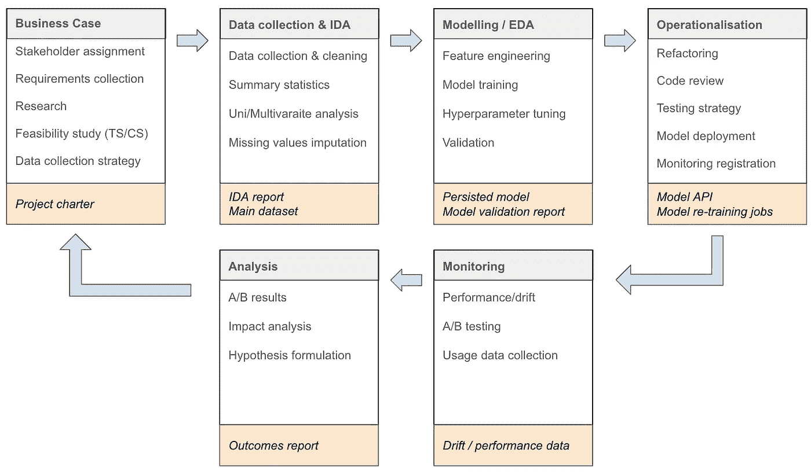

# 通过敏捷数据科学项目管理控制人工智能成本

> 原文：[`towardsdatascience.com/control-ai-costs-through-agile-data-science-project-management-9396516f888b?source=collection_archive---------8-----------------------#2023-12-08`](https://towardsdatascience.com/control-ai-costs-through-agile-data-science-project-management-9396516f888b?source=collection_archive---------8-----------------------#2023-12-08)

## 运行敏捷数据科学组织的蓝图

 [Nikolay Manchev](https://medium.com/@nikolay_manchev?source=post_page-----9396516f888b--------------------------------)

·

[关注](https://medium.com/m/signin?actionUrl=https%3A%2F%2Fmedium.com%2F_%2Fsubscribe%2Fuser%2F5148509dfd9&operation=register&redirect=https%3A%2F%2Ftowardsdatascience.com%2Fcontrol-ai-costs-through-agile-data-science-project-management-9396516f888b&user=Nikolay+Manchev&userId=5148509dfd9&source=post_page-5148509dfd9----9396516f888b---------------------post_header-----------) 发表在 [Towards Data Science](https://towardsdatascience.com/?source=post_page-----9396516f888b--------------------------------) ·11 min read·2023 年 12 月 8 日

--

# 引言

数据科学的世界复杂而隐蔽，隐藏的成本超出了预算限制。数据科学家对任何组织来说都是一项重要的投资。不幸的是，闲置的基础设施等低效问题会浪费大量的数据基础设施投资。敏捷方法提供了一个解决方案，改善工作流程并减少浪费的时间。通过敏捷，传统的数据科学过程变得更加优化和适应，从而更高效地提供价值。本文探讨了这些隐藏的成本，并演示了敏捷实践如何使您的数据科学项目更具成本效益。

# **第一部分：数据科学的隐藏成本**

数据科学家凭借他们对数据处理的复杂知识和专业技能，是宝贵的资源，他们的生产力至关重要。数据科学家在创新上花费的时间越少，而在繁琐任务上的时间越多，成本就会越高，而收益却没有增加。此外，数据科学家倾向于使用自己的机器以避免受到中央 IT 的限制或建立平行的“影子 IT”能力，这使得知识发现变得繁重，并且常常导致重复造轮子的问题。

浪费可以以多种形式出现。波士顿咨询集团发现，只有 44% 的模型能够投入生产，数据科学家每天的时间中有相当一部分可能浪费在如 IT 设置等琐碎任务上。此外，当数据科学家辛勤工作时，基础设施成本会迅速增加。当他们忙于工作而分心于创新时，数据基础设施投资实际上可能变得闲置、始终在线且过度配置。最后，在 AI 数据规模下，将数据进出云端的成本也会很高。因此，跨多个堆栈、孤岛和环境管理云成本变得困难。

机器学习——尤其是生成式 AI——需要大量的云计算资源和昂贵的 GPU。2023 年，像 ChatGPT 这样的知名模型使像 OpenAI 这样的组织每天的计算成本约为 70 万美元（《华盛顿邮报》的 SemiAnalysis [1]）。根据一个 [估计](https://www.youtube.com/watch?v=bZQun8Y4L2A&t=109s)，ChatGPT 在部署之前需要数千个 GPU 和几个月的训练 [2]。

持续存在的挑战。约 56% 的数据科学领导者在正确扩展数据科学项目方面需要帮助（BCG）。例如，跨多个云平台的数据不仅增加了存储成本，还使得在团队之间访问和共享数据变得困难。这种支离破碎的方法可能会进一步挤压预算，并削弱数据科学生命周期中至关重要的协作和效率。我们如何将这些绊脚石转变为垫脚石？答案可能在于采纳敏捷方法和结构化的流程设计。

# 第二部分：数据科学中的流程设计和敏捷方法

今天，当效率和适应性成为关键时，敏捷方法论在数据科学项目中变得越来越重要。敏捷流程接受适应性、协作和迭代开发，这些都可以显著影响整个数据科学生命周期中项目的成本效率。典型的数据科学项目非常适合采用敏捷实践，因为它天生具有敏捷管理方法的关键特征：

+   **增量和迭代开发**——数据科学产品是逐步构建的。大多数常用的数据科学项目管理框架都有严格定义的阶段。例如，CRISP-DM 使用业务理解、数据理解、数据准备、建模和评估。

+   **关注价值**——预测模型以及数据科学一般来说，都是本质上以价值为导向的，因为模型推荐和洞察直接驱动业务决策。

+   **赋权团队**——当数据科学团队可以在团队内部优先安排和组织工作时，能够达到最佳生产力。这包括选择特定的模型、工具、框架、计算资源、编程语言等。

+   **持续学习**——这是敏捷的另一个重要原则。当我们开始构建模型时，我们有一个特定的愿景，并根据这个愿景开始构建产品（模型、报告等）。经过第一次迭代，或在项目的一个阶段（如探索性数据分析）之后，我们对问题有了更多了解，这使我们能够相应地调整愿景。

数据科学项目通常要求各阶段之间的互动。例如，模型结果不佳可能会促使重新审视数据收集，以积累具有更好预测能力的数据。敏捷方法论接受这种循环性质，使团队能够适应和优化流程。

图片由作者提供

以下是敏捷过程在典型数据科学项目中的简要概述：

+   **业务案例**：定义问题和潜在影响。

+   **数据收集和初步分析**：收集、分析和验证数据。

+   **建模 / 探索性数据分析**：开发和测试模型。

+   **运营化**：将模型部署到生产环境中。

+   **监控与分析**：持续监控、分析和优化模型。

像 Jira 这样的项目管理工具使敏捷方法论可以呈现不同的形式。如果你的数据科学平台使用项目来组织工作单元，而你的工作流程使用带有任务、故事和缺陷等子问题的史诗，则将史诗问题与项目链接可以简化开发过程和进度/工作负荷的跟踪。

对于处理不同阶段的不同团队的复杂项目，创建链接到任务票据的项目可能更为高效。每个票据代表一个单独的阶段或一组阶段，确保与复杂的工作流程更好地对齐。

# 第三部分：基础设施成本与控制

基础设施管理至关重要，但在数据科学中常常被忽视。设置和管理数据科学环境的复杂性可能导致大量隐藏成本，尤其是当资源未被充分利用时。当投资闲置、持续开启且过度配置时，这些费用迅速累积，减少了将宝贵资源投入更具生产力领域的机会。

机器学习模型，尤其是深度学习，需要大量的计算资源——高端 GPU 和云计算实例——且成本可能非常高。此外，商业平台可能会有加价，使价格更高。战略性地规划和投资基础设施，平衡对前沿技术的需求与成本控制的必要性。

这个问题不仅消耗了财务资源，还导致了潜在生产力的损失，并且由于资源分配不当给多个团队使用，形成了效率瓶颈。遗憾的是，这种形式的浪费并不总是显而易见的，通常需要细致的跟踪和管理才能发现和减轻。利用敏捷策略可以从数据科学投资中解锁更多的价值，将潜在的浪费转化为生产力和创新。这也为监控成本、资源利用提供了文档记录，并最终有助于计算单个数据科学项目的投资回报率（ROI）。

# 第四部分：扩展、数据管理和敏捷工作流程

扩展数据科学项目是一项庞大且常被低估的任务。根据行业报告，只有 56%的数据科学项目能够超越实验阶段并创造业务价值。一个重要因素是与数据存储和管理相关的成本不断膨胀，但也包括各种硬件和软件解决方案的成本。然而，采用敏捷实践可以在这股不断上升的费用潮中提供救生船。

具有迭代开发和反馈循环特征的敏捷工作流程，使数据科学团队能够准确发现存储效率低下的问题。例如，通过专注于数据整合的迭代冲刺，可以避免冗余的数据集。通过在先前工作基础上逐步构建并重用数据和代码，敏捷工作流程减少了对额外存储资源的需求。

此外，像版本控制和特性分支这样的敏捷实践可以实现高效的数据管理。适当的版本管理使得回滚到项目的先前状态变得更容易，避免了多个冗余副本的需求，从而节省了存储空间。

敏捷还意味着更好的资源分配。通过 Scrum 会议和看板，团队能够透明地了解谁在做什么，从而更有信息地分配资源，优化人力和机器资源的使用，减少空闲时间，从而降低闲置成本。

敏捷思维也延伸到自动化。通过数据提取、转换和加载（ETL）的自动化管道的迭代开发，可以逐步消除手动瓶颈——加速扩展过程，并显著降低与人工操作和错误修正相关的成本。

然而，重要的是要注意，敏捷并不是一种放之四海而皆准的解决方案。团队必须适应变化，愿意采纳反馈并做出必要的调整。数据科学项目是多方面且复杂的，因此，僵化地遵循任何一种方法可能会带来操作盲点和意外成本。

采用敏捷方法进行规模扩展不仅仅是为了提高速度，而是为了更智能地完成任务。通过专注于迭代改进、透明性和自动化，你将大大提高成功扩展项目的机会，同时控制成本。

# 第五节：效率、自动化和 IT 的角色

效率是支撑数据科学复杂机制的关键。如果没有效率，不仅成本会飙升，而且价值实现的时间也会增加，从而削弱了采用数据科学的竞争优势。一个经常被忽视但对提高效率至关重要的因素是 IT 的角色。

尽管 IT 部门传统上专注于维护系统完整性和基础设施，但数据科学的兴起扩展了它们的角色。它们现在在建立自动化工作流程和推动敏捷实践的采用方面发挥着关键作用，这直接影响了成本效率。

推动效率的一个可行方法是将 Epics（大型工作块）映射到较小的 Projects（或由数据科学平台支持的等效工作单元），将 Tasks/Stories 映射到 Projects，这一做法通常得到敏捷方法论的支持。这种整合充当了灯塔，引导团队穿越数据科学项目的复杂性。每个 Epic 可以分解成多个较小的任务或故事，帮助进行项目范围界定和角色分配。这不仅促进了透明度，也增强了问责制，从而推动了效率。

自动化管道和 CI/CD（持续集成/持续部署）机制，通常由 IT 部门监督，进一步提升了这种效率。自动化加快了常规任务的处理，释放了数据科学家们的时间，使他们能专注于更复杂的任务和创新。这就是 IT 角色不可或缺的地方。IT 可以设置和维护这些管道，确保数据科学团队拥有高效工作的所有必要条件。

另一个方面是管理云资源和计算能力。机器学习模型需要大量计算，这既耗时又昂贵。在这里，IT 可以根据敏捷计划和当前的冲刺任务，合理分配资源。这避免了计算能力的浪费，确保只使用所需的资源，从而降低成本。

总而言之，IT 的角色正在演变为实施数据科学中的敏捷实践的推动者，这对于控制成本和提升效率至关重要。通过在数据科学团队中启用敏捷实践和自动化，IT 作为支持数据科学敏捷框架的支柱。

# 第六部分：对业务战略和竞争优势的更广泛影响

随着数据科学的不断成熟，它成为业务战略中更有价值的核心组成部分，为显著的竞争优势提供了途径。通过敏捷方法论，数据科学团队可以放大这一影响，将数据科学从操作工具提升为战略资产。

在商业战略的背景下，敏捷等同于对市场变化的适应性和响应能力。将敏捷过程融入数据科学项目的组织更容易进行调整或扩展，确保他们始终领先于竞争对手。例如，将复杂的项目分解为可管理的“Epic”或“任务票”，有助于高层决策者更容易把握复杂数据科学项目的轨迹，并更明智地分配资源。

此外，敏捷实践促进了持续改进和创新的文化。每个冲刺结束时，团队都会回顾进展并相应调整未来的冲刺。这种迭代过程培养了一种将失败视为学习机会的环境。在一个如数据科学这样经常充满不确定性和复杂性的领域，这种文化是一种强大的竞争优势。

此外，敏捷过程有助于管理风险——这是希望通过数据科学主导市场空间的组织的关键优先事项。敏捷的迭代性质，加上对持续反馈的重视，确保在过程中早期识别任何风险。这允许及时的缓解策略，确保项目不仅按时完成，而且达到预期的质量标准。

通过关注这些原则，企业可以开启价值的新维度，对其财务结果产生重大影响，并将自己定位为各自领域的领导者。

# 第七部分：关于使用敏捷过程构建模型开发流程的简要教程

在应对数据科学项目的复杂性时，尤其是涉及到构建机器学习模型时，可能会感到棘手。请遵循这个逐步指南，利用敏捷方法论建立模型开发流程，类似于之前讨论的 Jira 集成。目标是揭开流程的神秘面纱，使数据科学团队能够更高效、更有效地运作。

**第 1 步：定义项目范围和目标**

在开始任何项目之前，请回答以下问题，以形成敏捷项目的基准：

1.  你试图解决的问题是什么？

1.  成功指标是什么？

**第 2 步：分解为迭代周期或冲刺**

将项目分解为更小、更易管理的部分，这些部分也称为冲刺。这些冲刺的时间长度可以从两周到四周不等，具体取决于项目的复杂性和团队对相关任务的熟悉程度。

**第 3 步：与更广泛的业务目标对齐（使用史诗任务或任务票）**

确保你的数据科学项目在分解成冲刺后，与更广泛的业务目标有明确的联系。利用史诗任务或任务票来保持这种对齐，使所有相关人员，特别是决策者，能够看到更大的图景。

**第 4 步：分配角色并创建跨职能团队**

在敏捷方法论中，由数据科学家、数据工程师和业务分析师组成的跨职能团队至关重要。尽早分配角色和责任，以促进顺畅的协作。

**第 5 步：利用敏捷项目管理工具**

类似 Jira 的工具在跟踪进展方面非常有用。这些平台允许高效分配任务并监控冲刺的进展。

**第 6 步：促进协作和持续反馈**

开放沟通和持续反馈的文化至关重要。鼓励团队成员表达他们的意见和关切，使项目能够根据需要进行调整。

**第 7 步：监控进展，必要时调整**

敏捷项目管理工具帮助你轻松监控项目的进展。利用这些工具，如果事情没有按照计划进行，敏捷方法论允许你快速调整。无论是在当前冲刺中进行必要的调整，还是在下一个冲刺中进行规划，都可以。

**第 8 步：总结回顾和经验教训**

在每个冲刺结束后——以及项目结束时——举行回顾会议，团队讨论哪些做得好，哪些做得不好，以及如何在未来的冲刺或项目中改进。

# 结论

在数据科学和机器学习日益重要的时代，推动业务战略和实现竞争优势的过程中，管理成本和提高效率不容小觑。采用敏捷方法论提供了一个强大的框架，可以直接应对这些挑战。

在你寻求提升数据科学能力时，考虑一个实施良好的敏捷方法可以为你的组织带来的显著成本效益。

我们鼓励你*深入了解*敏捷方法论，甚至进行一些进一步的阅读或实际培训，继续你在数据科学领域的旅程。通过正确的实践，你的数据科学项目不仅不会成为成本中心，而且会成为一个有价值的资产，为你更广泛的商业目标做出贡献。

# 参考文献

[1] Will Oremus，《AI 聊天机器人每次使用都会亏钱。这是一个问题。》，《华盛顿邮报》，2023 年 6 月，最后访问日期 2023 年 8 月 30 日，[`www.washingtonpost.com/technology/2023/06/05/chatgpt-hidden-cost-gpu-compute/`](https://www.washingtonpost.com/technology/2023/06/05/chatgpt-hidden-cost-gpu-compute/)

[2] Andrej Karpathy，《GPT 现状》，微软 BUILD，2023 年 5 月 23 日，[`www.youtube.com/watch?v=bZQun8Y4L2A`](https://www.youtube.com/watch?v=bZQun8Y4L2A)
