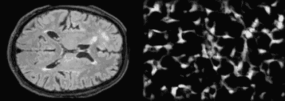
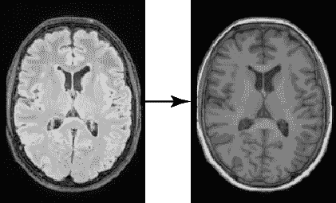
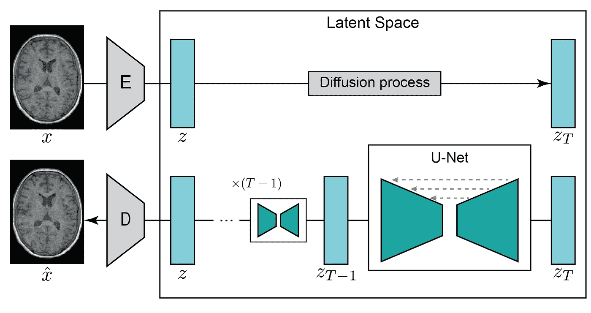
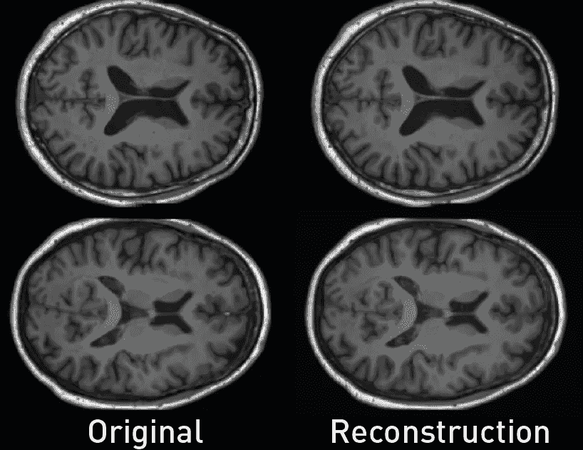
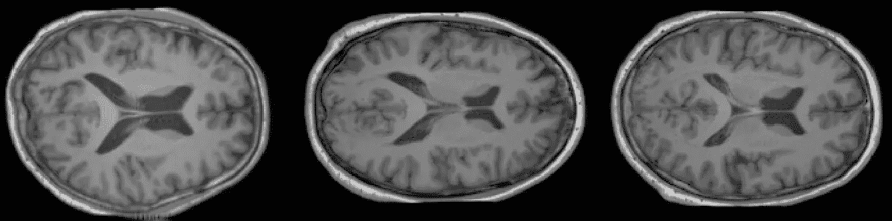
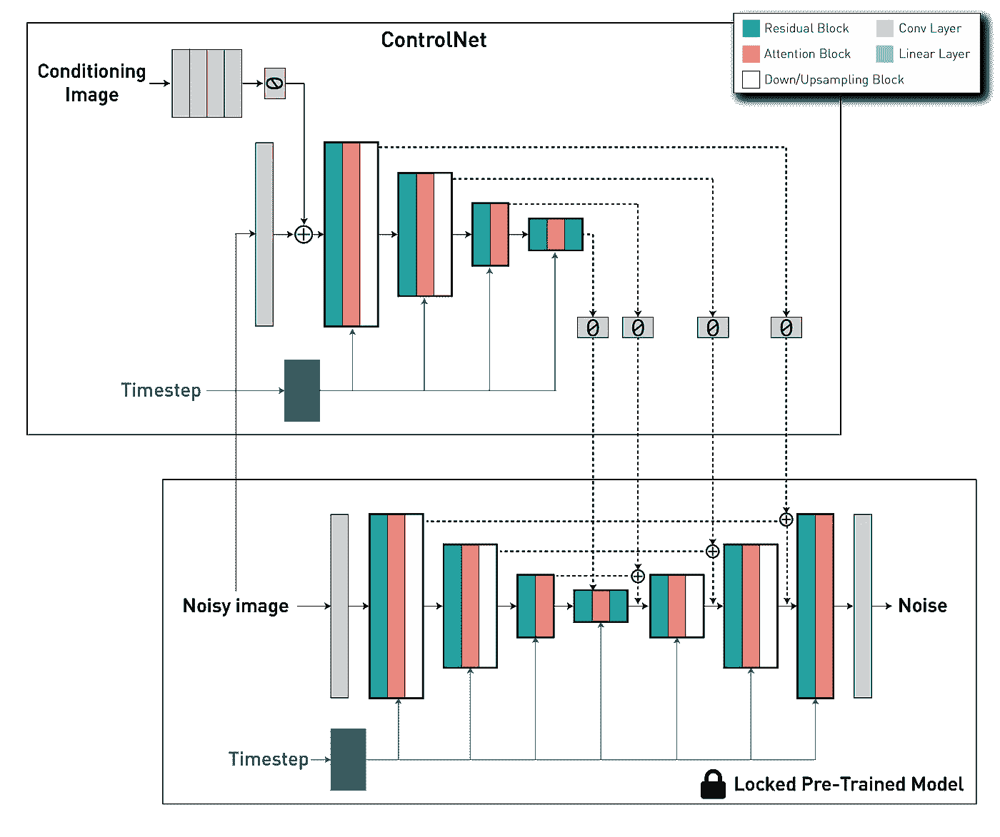
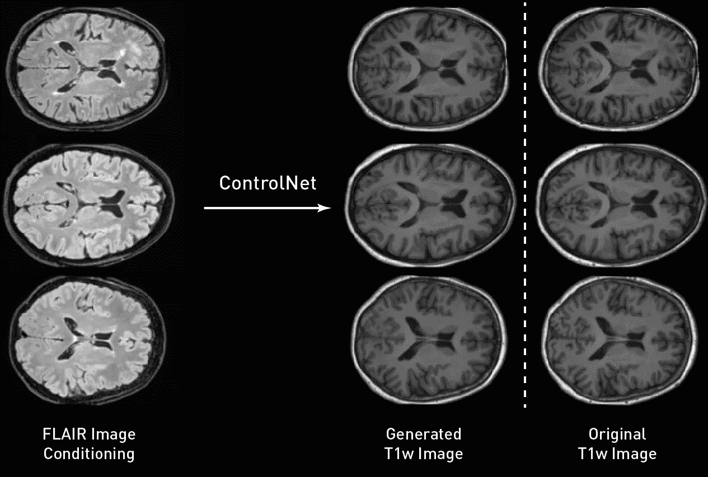

# 可控医学图像生成与 ControlNets

> 原文：[`towardsdatascience.com/controllable-medical-image-generation-with-controlnets-48ef33dde652`](https://towardsdatascience.com/controllable-medical-image-generation-with-controlnets-48ef33dde652)

## 使用 ControlNets 控制潜在扩散模型生成过程的指南

[](https://medium.com/@walhugolp?source=post_page-----48ef33dde652--------------------------------)[](https://towardsdatascience.com/?source=post_page-----48ef33dde652--------------------------------) [Walter Hugo Lopez Pinaya](https://medium.com/@walhugolp?source=post_page-----48ef33dde652--------------------------------)

·发表于 [Towards Data Science](https://towardsdatascience.com/?source=post_page-----48ef33dde652--------------------------------) ·阅读时间 9 分钟·2023 年 6 月 13 日

--

在这篇文章中，我们将展示如何训练一个**ControlNet**，以使用户能够精准控制**潜在扩散模型**的生成过程（**如 Stable Diffusion!**）。我们的目标是展示这些模型在不同对比度下转换脑部图像的卓越能力。为实现这一目标，我们将利用最近推出的**MONAI 开源扩展**，[**MONAI Generative Models**](https://github.com/Project-MONAI/GenerativeModels)**!**



使用 ControlNet 从 FLAIR 图像（左）生成 T1 加权脑部图像（右）

***我们的项目代码可以在这个公开的代码库中找到*** [***https://github.com/Warvito/generative_brain_controlnet***](https://github.com/Warvito/generative_brain_controlnet)

# 介绍

近年来，文本到图像扩散模型取得了显著进展，使得基于开放领域的文本描述生成高度真实的图像成为可能。这些生成的图像具有丰富的细节、清晰的轮廓、一致的结构和有意义的上下文表示。然而，尽管扩散模型取得了重要成就，但在生成过程中实现精确控制仍然是一个挑战。**即使有冗长而复杂的文本描述，准确捕捉用户想要的想法仍然可能是一项困难的任务。**

**ControlNets**的引入，如 Lvmin Zhang 和 Maneesh Agrawala 在其开创性论文“[*将条件控制添加到文本到图像扩散模型*](https://arxiv.org/abs/2302.05543)”（2023）中提出的，显著增强了扩散模型的可控性和定制性。这些神经网络作为轻量级适配器，能够实现精确的控制和定制，同时保留扩散模型的原始生成能力。通过微调这些适配器，同时保持原始扩散模型的冻结，文本到图像模型可以高效地扩展到各种图像到图像应用中。

ControlNet 的独特之处在于其解决了空间一致性的问题。与之前的方法不同，ControlNet 允许对生成结构的空间、结构和几何方面进行显式控制，同时保留了来自文本说明的语义控制。原始研究介绍了各种模型，这些模型基于边缘、姿势、语义掩码和深度图实现条件生成，为计算机视觉领域的激动人心的进展铺平了道路。

在医学影像领域，许多图像到图像应用具有重要意义。在这些应用中，一个显著的任务是跨领域翻译图像，例如将计算机断层扫描（CT）转换为磁共振成像（MRI），或在不同对比度之间转换图像，例如从 T1 加权图像到 T2 加权图像。在这篇文章中，我们将重点关注一个特定案例：使用从 FLAIR 图像获得的**2D 脑图像切片生成对应的 T1 加权图像**。我们的目标是展示如何有效地利用我们的 MONAI 扩展（[MONAI Generative Models](https://github.com/Project-MONAI/GenerativeModels)）和 ControlNets 来训练和评估医学数据上的生成模型。通过深入探讨这个例子，我们旨在提供这些技术在医学影像领域实际应用的见解。



FLAIR 到 T1w 翻译

# 潜在扩散模型训练



潜在扩散模型架构

要从 FLAIR 图像生成 T1 加权（T1w）图像，**第一步涉及训练一个能够生成 T1w 图像的扩散模型**。在我们的示例中，我们使用从[UK Biobank 数据集](https://www.ukbiobank.ac.uk/)（根据此[数据协议](https://www.ukbiobank.ac.uk/media/p3zffurf/biobank-mta.pdf)提供）提取的脑部 MRI 图像的 2D 切片。我们将原始的 3D 脑部图像通过你喜欢的方法（例如，[ANTs](http://stnava.github.io/ANTs/)或[UniRes](https://github.com/brudfors/UniRes)）注册到 MNI 空间。然后，我们从大脑的中心部分提取五个 2D 切片。我们选择这个区域是因为它展示了多种组织，使我们更容易评估所进行的图像转换。使用此[脚本](https://github.com/Warvito/generative_brain_controlnet/blob/main/src/python/preprocessing/create_png_dataset.py)，我们最终获得了大约**190,000 个切片**，空间维度为**224 × 160 像素**。接下来，我们使用该脚本将图像划分为训练集（约 180,000 个切片）、验证集（约 5,000 个切片）和测试集（约 5,000 个切片）。数据集准备好后，我们可以开始训练我们的潜在扩散模型！

为了优化计算资源，潜在扩散模型使用**编码器**将输入图像 x 转换为低维潜在空间 z，然后通过**解码器**重建。这种方法使得即使在计算能力有限的情况下也能训练扩散模型，同时保留其原始质量和灵活性。类似于我们在上一篇文章**（[***使用 MONAI 生成医学图像***](https://medium.com/towards-data-science/generating-medical-images-with-monai-e03310aa35e6)）**中做的，我们使用来自 MONAI Generative 模型的[**带有 KL 正则化的自编码器模型**](https://github.com/Project-MONAI/GenerativeModels/blob/main/generative/networks/nets/autoencoderkl.py#L579)来创建我们的压缩模型。通过使用[这个配置](https://github.com/Warvito/generative_brain_controlnet/blob/main/configs/stage1/aekl_v0.yaml)和 L1 损失以及 KL 正则化，[感知损失](https://github.com/Project-MONAI/GenerativeModels/blob/c1ec4ed4381de90ef18061c98624fa931c42e9b6/generative/losses/perceptual.py#L21)和[对抗性损失](https://github.com/Project-MONAI/GenerativeModels/blob/c1ec4ed4381de90ef18061c98624fa931c42e9b6/generative/losses/adversarial_loss.py#L29)，**我们创建了一个能够高保真编码和解码脑部图像的自编码器** [（使用这个脚本）](https://github.com/Warvito/generative_brain_controlnet/blob/main/src/python/training/train_aekl.py)。自编码器的重建质量对于潜在扩散模型的性能至关重要，因为它定义了我们生成图像的质量上限。如果自编码器的解码器生成模糊或低质量的图像，我们的生成模型将无法生成更高质量的图像。



使用这个[脚本](https://github.com/Warvito/generative_brain_controlnet/blob/main/src/python/testing/compute_msssim_reconstruction.py)，我们可以通过使用原始图像与其重建之间的**多尺度结构相似性指数测量（MS-SSIM）**来量化自编码器的保真度。在这个例子中，我们获得了一个 MS-SSIM 指标为 0.9876 的高性能。

训练完自编码器后，我们将训练[**扩散模型**](https://github.com/Project-MONAI/GenerativeModels/blob/c1ec4ed4381de90ef18061c98624fa931c42e9b6/generative/networks/nets/diffusion_model_unet.py#L1632) **在潜在空间 z 上**。扩散模型是一种能够通过在一系列时间步上逐步去噪，从纯噪声图像中生成图像的模型。它通常使用**U-Net 架构**（具有编码器-解码器格式），其中编码器的层通过长**跳跃连接**与解码器部分的层相连，从而实现特征重用，稳定训练和收敛。


扩散模型的 U-Net 架构，具有编码器和解码器之间的跳跃连接。

在训练过程中，潜在扩散模型根据这些提示学习条件噪声预测。我们再次使用 MONAI 来创建和训练这个网络。在这个[脚本](https://github.com/Warvito/generative_brain_controlnet/blob/main/src/python/training/train_ldm.py)中，我们使用这个[配置](https://github.com/Warvito/generative_brain_controlnet/blob/main/configs/ldm/ldm_v0.yaml)来实例化模型，其中训练和评估在[代码的这一部分](https://github.com/Warvito/generative_brain_controlnet/blob/bb47f9c359e2d280b23bda84b5c14b65dd5b7af3/src/python/training/training_functions.py#L408)进行。由于在本教程中我们对文本提示不太感兴趣，我们对所有图像使用相同的提示（句子为[“*脑部 T1 加权图像*”](https://github.com/Warvito/generative_brain_controlnet/blob/bb47f9c359e2d280b23bda84b5c14b65dd5b7af3/src/python/training/util.py#L38)）。



使用我们的潜在扩散模型生成的合成脑部图像

我们可以量化我们训练过的生成模型的性能，这次我们评估了样本的质量（使用**Fréchet inception distance (FID)**）和模型的多样性（计算 1000 个样本组中所有样本对的 MS-SSIM）。使用这两个脚本（[1](https://github.com/Warvito/generative_brain_controlnet/blob/main/src/python/testing/compute_fid.py) 和 [2](https://github.com/Warvito/generative_brain_controlnet/blob/main/src/python/testing/compute_msssim_sample.py)），我们得到了 FID = 2.1986 和 MS-SSIM 多样性 = 0.5368。

正如你在之前的图像和结果中看到的，我们现在拥有一个可以生成高分辨率、高质量图像的模型。然而，我们对图像的外观没有任何空间控制。为此，我们将使用 ControlNet 来指导我们潜在扩散模型的生成。

# ControlNet 训练



ControlNet 架构

[ControlNet 架构](https://github.com/Project-MONAI/GenerativeModels/blob/c1ec4ed4381de90ef18061c98624fa931c42e9b6/generative/networks/nets/controlnet.py#L125)包括两个主要组件：一个**可训练的**来自 U-Net 模型的编码器版本，包括中间块，以及一个**预训练的“锁定”版本**的扩散模型。这里，锁定副本保留了生成能力，而可训练副本则在特定的图像对图像数据集上进行训练，以学习条件控制。这两个组件通过**“零卷积”层**互联——一个 1×1 的卷积层，其初始化权重和偏置被设置为零。卷积权重逐渐从零过渡到优化参数，确保在初始训练步骤中，可训练和锁定副本的输出与 ControlNet 不存在时的输出保持一致。换句话说，当 ControlNet 应用于某些神经网络块之前，没有引入任何额外的影响或噪声到深层神经特征中。

通过整合这两个组件，ControlNet 使我们能够控制 Diffusion Model 的 U-Net 中每个级别的行为。

在我们的示例中，我们在[这个脚本](https://github.com/Warvito/generative_brain_controlnet/blob/main/src/python/training/train_controlnet.py)中实例化 ControlNet，使用以下等效代码片段。

```py
import torch
from generative.networks.nets import ControlNet, DiffusionModelUNet

# Load pre-trained diffusion model
diffusion_model = DiffusionModelUNet(
    spatial_dims=2,
    in_channels=3,
    out_channels=3,
    num_res_blocks=2,
    num_channels=[256, 512, 768],
    attention_levels=[False, True, True],
    with_conditioning=True,
    cross_attention_dim=1024,
    num_head_channels=[0, 512, 768],
)
diffusion_model.load_state_dict(torch.load("diffusion_model.pt"))

# Create ControlNet
controlnet = ControlNet(
    spatial_dims=2,
    in_channels=3,
    num_res_blocks=2,
    num_channels=[256, 512, 768],
    attention_levels=[False, True, True],
    with_conditioning=True,
    cross_attention_dim=1024,
    num_head_channels=[0, 512, 768],
    conditioning_embedding_in_channels=1,
    conditioning_embedding_num_channels=[64, 128, 128, 256],
)

# Create trainable copy of the diffusion model
controlnet.load_state_dict(diffusion_model.state_dict(), strict=False)

# Lock the weighht of the diffusion model
for p in diffusion_model.parameters():
    p.requires_grad = False
```

由于我们使用的是潜在扩散模型，这要求 ControlNets 将基于图像的条件转换为相同的潜在空间以匹配卷积大小。为此，我们使用一个与完整模型共同训练的[卷积网络](https://github.com/Project-MONAI/GenerativeModels/blob/c1ec4ed4381de90ef18061c98624fa931c42e9b6/generative/networks/nets/controlnet.py#L45)。在我们的案例中，我们有三个下采样级别（类似于自动编码器 KL），在*“conditioning_embedding_num_channels=[64, 128, 128, 256]”*中定义。由于我们的条件图像是一个具有单通道的 FLAIR 图像，我们还需要在*“conditioning_embedding_in_channels=1”*中指定其输入通道数。

在初始化我们的网络后，我们像训练扩散模型一样训练它。在以下代码片段中（[以及代码的这一部分](https://github.com/Warvito/generative_brain_controlnet/blob/bb47f9c359e2d280b23bda84b5c14b65dd5b7af3/src/python/training/training_functions.py#L623)），我们可以看到，首先我们将条件 FLAIR 图像传递到可训练的网络中，并从其跳过连接中获得输出。然后，这些值在计算预测噪声时输入到扩散模型中。在内部，扩散模型将 ControlNets 的跳过连接与自身的跳过连接相加，然后将其输入到解码器部分中（[代码](https://github.com/Project-MONAI/GenerativeModels/blob/c1ec4ed4381de90ef18061c98624fa931c42e9b6/generative/networks/nets/diffusion_model_unet.py#L1901)）。

```py
 # Training Loop
...

images = batch["t1w"].to(device)
cond = batch["flair"].to(device)

...

noise = torch.randn_like(latent_representation).to(device)
noisy_z = scheduler.add_noise(
    original_samples=latent_representation, noise=noise, timesteps=timesteps
)

# Compute trainable part
down_block_res_samples, mid_block_res_sample = controlnet(
    x=noisy_z, timesteps=timesteps, context=prompt_embeds, controlnet_cond=cond
)

# Using controlnet outputs to control diffusion model behaviour
noise_pred = diffusion_model(
    x=noisy_z,
    timesteps=timesteps,
    context=prompt_embeds,
    down_block_additional_residuals=down_block_res_samples,
    mid_block_additional_residual=mid_block_res_sample,
)

# Then compute diffusion model loss as usual
...
```

# ControlNet 采样与评估

在训练模型后，我们可以对其进行采样和评估。[这里](https://github.com/Warvito/generative_brain_controlnet/blob/main/src/python/testing/sample_flair_to_t1w.py)，我们使用测试集中的 FLAIR 图像生成条件 T1w 图像。类似于我们的训练，采样过程与扩散模型使用的非常接近，唯一的区别是我们将条件图像传递给训练好的 ControlNet，并使用其输出在每个采样时间步中馈送给扩散模型。正如我们从下图中观察到的那样，**我们生成的图像在空间上高度忠实于原始条件**，大脑皮层回旋遵循类似的形状，并且图像保持了不同组织之间的边界。



测试集中用于输入到 ControlNet 的原始 FLAIR 图像（左）、生成的 T1 加权图像（中）和原始 T1 加权图像，即期望输出（右）的示例。

在我们对模型的图像进行采样后，我们可以量化我们 ControlNet 在不同对比度之间翻译图像的性能。由于我们拥有测试集中的期望 T1w 图像，我们还可以检查它们之间的差异，并使用**均方绝对误差 (MAE)**、**峰值** **信噪比 (PSNR)** 和**MS-SSIM**计算真实图像与合成图像之间的距离。在我们的测试集中，当执行这个 [脚本](https://github.com/Warvito/generative_brain_controlnet/blob/main/src/python/testing/compute_controlnet_performance.py) 时，我们得到了 PSNR=26.2458+-1.0092，MAE=0.02632+-0.0036 和 MSSIM=0.9526+-0.0111。

就这些！ControlNet 提供了对我们扩散模型的不可思议的控制，近期的方法已经扩展了其方法，以结合不同训练的 ControlNets ([Multi-ControlNet](https://github.com/Mikubill/sd-webui-controlnet#multi-controlnet))，在同一模型中处理不同类型的条件 ([T2I adapters](https://arxiv.org/abs/2302.08453))，甚至基于样式调整模型（使用像 ControlNet 1.1 这样的技术 — [仅供参考](https://github.com/Mikubill/sd-webui-controlnet/discussions/1236)）。如果这些方法听起来很有趣，不要忘记关注我，以获取更多类似的指南！😁

想了解更多 MONAI Generative Model 的教程以及我们的功能，请查看我们的 [教程页面](https://github.com/Project-MONAI/GenerativeModels/tree/main/tutorials)！

*注意：除非另有说明，所有图像均由作者提供*
