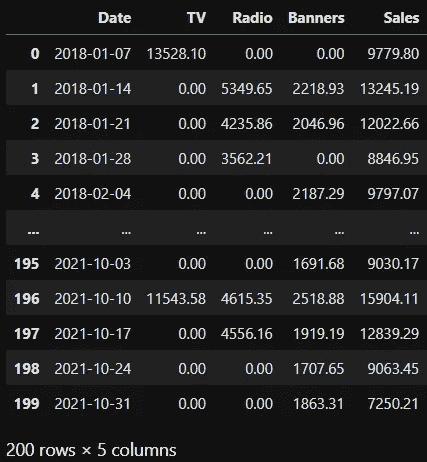
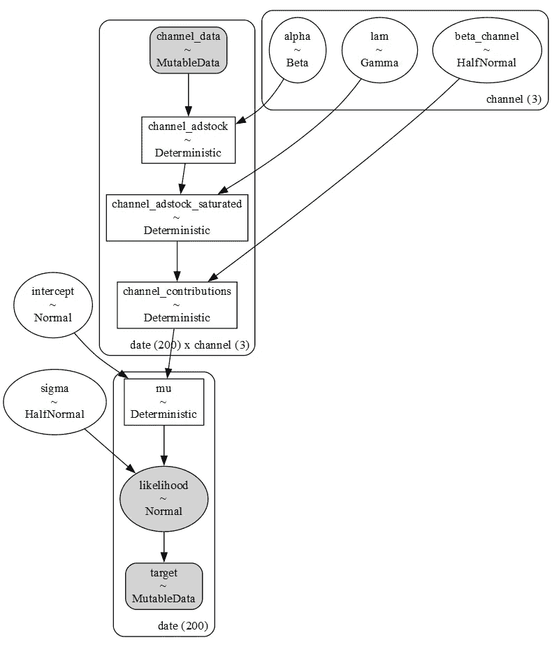
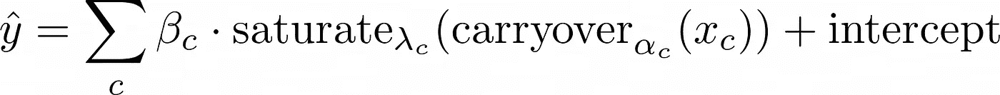
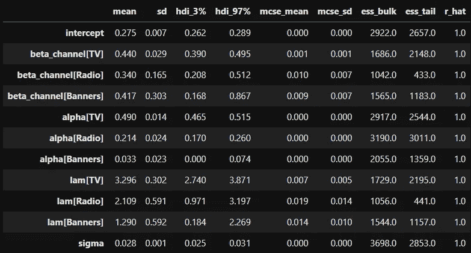
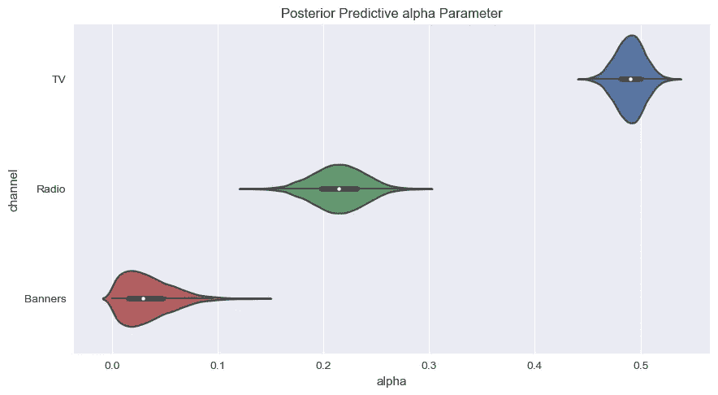
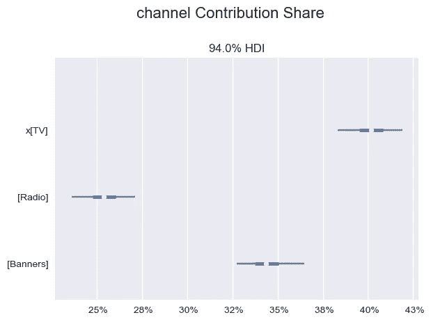
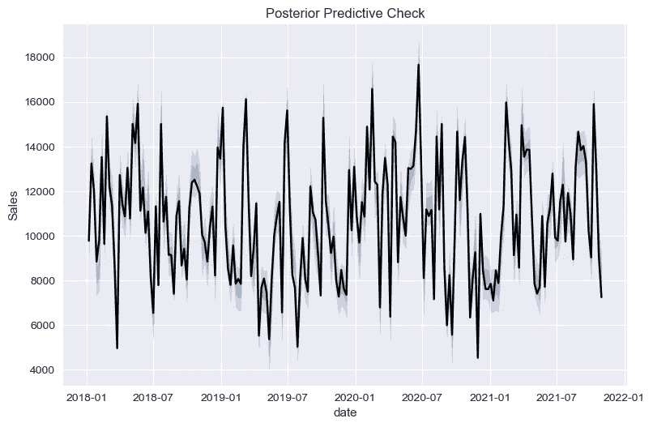
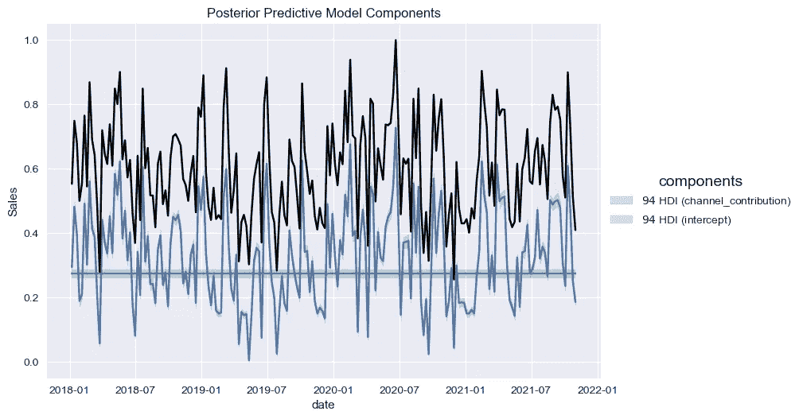
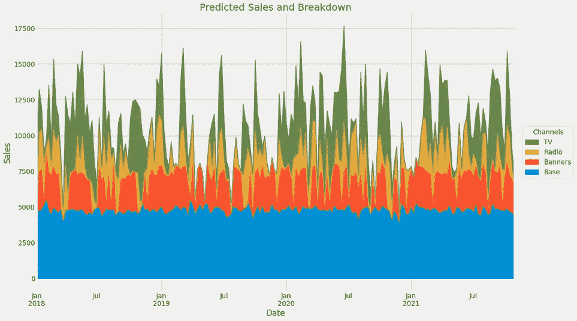

# 便捷的贝叶斯营销组合建模与 PyMC Marketing

> 原文：[`towardsdatascience.com/convenient-bayesian-marketing-mix-modeling-with-pymc-marketing-8b02a9a9c4aa`](https://towardsdatascience.com/convenient-bayesian-marketing-mix-modeling-with-pymc-marketing-8b02a9a9c4aa)

## [市场分析](https://medium.com/tag/marketing-analytics)

## PyMC 团队推出的一个新的亮闪闪的库，值得尝试

 [Dr. Robert Kübler](https://dr-robert-kuebler.medium.com/?source=post_page-----8b02a9a9c4aa--------------------------------)

·发布在 [Towards Data Science](https://towardsdatascience.com/?source=post_page-----8b02a9a9c4aa--------------------------------) ·6 分钟阅读·2023 年 4 月 13 日

--


图片来源：[Nathan Fertig](https://unsplash.com/@nathanfertig?utm_source=medium&utm_medium=referral) 在 [Unsplash](https://unsplash.com/?utm_source=medium&utm_medium=referral)

你可以通过有多少大公司发布相关软件包来判断一个话题的重要性。在营销组合建模领域，

+   Google 发布了 [LMMM](https://github.com/google/lightweight_mmm)

+   Meta 发布了 [Robyn](https://github.com/facebookexperimental/Robyn)

+   PyMC Labs 发布了 [PyMC Marketing](https://github.com/pymc-labs/pymc-marketing)

+   （我发布了 [mamimo](https://github.com/Garve/mamimo) 😇）

比营销组合建模更出色的是**贝叶斯营销组合建模**，这由 Google 和 PyMC Labs 的库提供。尽管 LMMM 也非常有趣，但今天我们将重点关注 PyMC Marketing。

在这篇文章中，你将了解如今构建最先进的贝叶斯营销组合模型有多么简单！

如果你需要回顾一下，请查看我以前的文章，了解贝叶斯营销组合建模的所有内容。

[## 贝叶斯营销组合建模在 Python 中通过 PyMC3](https://towardsdatascience.com/bayesian-marketing-mix-modeling-in-python-via-pymc3-7b2071f6001a?source=post_page-----8b02a9a9c4aa--------------------------------)

### 一次性估计饱和度、延续效应和其他参数，包括它们的不确定性

towardsdatascience.com](/bayesian-marketing-mix-modeling-in-python-via-pymc3-7b2071f6001a?source=post_page-----8b02a9a9c4aa--------------------------------)

# 手动过程

在我之前的文章中（见上文），我自己编写了一个贝叶斯营销组合模型。为此，我需要定义一个媒体支出载荷效应的函数，这很麻烦。尽管使用较旧的 PyMC3，它看起来是这样的：

```py
import theano.tensor as tt

def carryover(x, strength, length):
    w = tt.as_tensor_variable(
        [tt.power(strength, i) for i in range(length)]
    )

    x_lags = tt.stack(
        [tt.concatenate([
            tt.zeros(i),
            x[:x.shape[0]-i]
        ]) for i in range(length)]
    )

    return tt.dot(w, x_lags)
```

这个方法有效，但不容易解析，也可能需要更高效。此外，使用 Theano 的 PyMC 已过时，因为我现在需要使用 PyTensor，这是基于 Theano 的 Aesara 的一个分支。看来这有一个复杂的历史。

所以我现在很高兴地依赖更专业和通用的代码来实现我的目标。我通过查看[他们如何实现载荷效应](https://github.com/pymc-labs/pymc-marketing/blob/main/pymc_marketing/mmm/transformers.py)学到了很多东西。

在继续之前，请确保你已安装 pymc 和 pymc-marketing。我使用 mamba 安装了 PyMC，如[他们的 Github](https://github.com/pymc-labs/pymc-marketing/blob/main/README.md)中所述，然后通过

```py
pip install pymc-marketing
```

# PyMC 营销

让我们重新访问一下我们之前的例子从我的贝叶斯营销组合建模文章。我们开始导入一个我合成创建的数据集。

```py
import pandas as pd

data = pd.read_csv(
  'https://raw.githubusercontent.com/Garve/datasets/4576d323bf2b66c906d5130d686245ad205505cf/mmm.csv',
  parse_dates=['Date']
)
```

数据看起来是这样的：



图片由作者提供。

## 模型定义

现在，让我们将明星拉到台上并定义模型：

```py
from pymc_marketing.mmm import DelayedSaturatedMMM

mmm = DelayedSaturatedMMM(
    data=data,
    target_column="Sales",
    date_column="Date",
    channel_columns=["TV", "Radio", "Banners"],
)
```

这创建了一个包含每个通道饱和度和载荷效应的模型，类似于我之前手动完成的。因此，我不会详细讨论这个模型从数学角度如何工作的原因。

我们现在可以可视化我们创建的内容：

```py
import pymc as pm

pm.model_to_graphviz(model=mmm.model)
```



图片由作者提供。

在这里，我们可以看到，广告库存（载荷）首先被应用，然后是饱和度。每个通道有三个参数 `alpha`、`beta_channel` 和 `lam`，其中

+   `alpha` 是介于 0 和 1 之间的载荷率，

+   `lam` 是饱和度率，和

+   `beta_channel` 是实际的线性回归系数。

为了提供更多背景，简化的模型公式是



图片由作者提供。

*c* 在所有不同的通道上运行。

## 模型拟合

拟合模型就像在 scikit-learn 中一样简单：

```py
mmm.fit()
```

## 模型推断

在模型训练后，我们可以如下检查参数：

```py
import arviz as az

az.summary(
    data=mmm.fit_result,
    var_names=["intercept", "beta_channel", "alpha",  "lam", "sigma"]
)
```

我得到了这样的结果：



图片由作者提供。

从 **r_hat** 列的 1.0 可以判断，链似乎已经很好地收敛，即表中其余结果是可靠的。

我们还可以检查模型认为所有参数的正确值。例如，通道 TV 载荷 `alpha[TV]` 在 0.465 和 0.515 之间，概率为 94%，如 **hdi_3% 和 hdi_97%** 列所示。如果模型必须决定一个单一的数字，它将是 0.49，如 **mean** 列所示。

> ***注意：*** *在创建此数据集时，我对电视使用了 0.5 的饱和值，对广播使用了 0.2，对横幅使用了 0。我们的 PyMC 模型能够相当不错地捕捉到这一点！*

对于视觉型的朋友们：

```py
mmm.plot_channel_parameter(param_name="alpha", figsize=(9, 5))
```



作者提供的图片。

我们甚至可以使用便捷的方法查看频道贡献

```py
mmm.plot_channel_contribution_share_hdi()
```



作者提供的图片。

根据模型，电视约占**额外**销售（相对于基准）的 40%，广播约占 26%，横幅约占 34%。

## 后验预测检查

我们可以进行后验预测检查，即采样预测（蓝色），并查看它们如何跟随模型（黑色）。

```py
mmm.plot_posterior_predictive(original_scale=True)
```



作者提供的图片。

看起来很合适！我们甚至可以通过以下方式将信号分解为基线和频道贡献

```py
mmm.plot_components_contributions()
```



作者提供的图片。

富有洞察力，但除此之外，可能还需要将以下内容添加到库中：



作者提供的图片。

我提交了一个当前仍然开放的拉取请求。你可以在[这里](https://github.com/pymc-labs/pymc-marketing/pull/247)查看。

> ***更新：*** *它已合并！你可以使用* `[*plot_grouped_contribution_breakdown_over_time*](https://github.com/pymc-labs/pymc-marketing/blob/a59a89c41e7a1166c61ed2ca4293ff792d726622/pymc_marketing/mmm/base.py#L503)` *方法。很高兴能做出贡献！😄*

# **结论**

贝叶斯营销组合建模目前是**最**好的方式来找出哪些营销渠道表现良好，哪些表现不佳。建立这样的模型并不复杂，但仍然远没有像点击拼接 scikit-learn 模型那样简单。

幸运的是，新的 [PyMC Marketing](https://www.pymc-marketing.io/en/latest/) 使得贝叶斯营销组合建模变得轻而易举，相较于我们之前手动编码的过程。

不要误解我，我喜欢编码，而且**你**也必须知道如何编码。但仍然，拥有一个维护良好的包是很好的，它在未来可能会有更多常见的营销组合模型功能。

而且我只涵盖了**一些**功能。PyMC Marketing 甚至可以：

+   通过将列列表传递到`control_columns`中来有效处理控制变量，然后传递到`DelayedSaturatedMMM`类。

+   通过`mmm.plot_contribution_curves()`绘制饱和曲线

+   计算 ROAS，尽管这仍然是手动工作。

欲了解更多信息，请查看 [这个很棒的笔记本](https://www.pymc-marketing.io/en/stable/notebooks/mmm/mmm_example.html)。

我希望你今天学到了一些新的、有趣的和有价值的东西。感谢阅读！

> *如果你有任何问题，请在* [*LinkedIn*](https://www.linkedin.com/in/dr-robert-k%C3%BCbler-983859150/)*上给我写信！*

如果你想更深入地探索算法的世界，不妨试试我的新出版物**《所有关于算法》**！我还在寻找作者！

[](https://medium.com/all-about-algorithms?source=post_page-----8b02a9a9c4aa--------------------------------) [## 所有关于算法

### 从直观的解释到深入的分析，算法通过实例、代码和精彩的内容变得生动起来……

[medium.com](https://medium.com/all-about-algorithms?source=post_page-----8b02a9a9c4aa--------------------------------)
