# 使用 Stable-Baselines3 进行便捷的强化学习

> 原文：[`towardsdatascience.com/convenient-reinforcement-learning-with-stable-baselines3-dccf466b7585`](https://towardsdatascience.com/convenient-reinforcement-learning-with-stable-baselines3-dccf466b7585)

## [强化学习](https://medium.com/tag/reinforcement-learning)

## 无需冗余代码的强化学习

[](https://dr-robert-kuebler.medium.com/?source=post_page-----dccf466b7585--------------------------------)[](https://towardsdatascience.com/?source=post_page-----dccf466b7585--------------------------------) [Dr. Robert Kübler](https://dr-robert-kuebler.medium.com/?source=post_page-----dccf466b7585--------------------------------)

·发布于 [Towards Data Science](https://towardsdatascience.com/?source=post_page-----dccf466b7585--------------------------------) ·10 分钟阅读·2023 年 12 月 9 日

--


作者使用**Leonardo Ai**创作。

在我之前的强化学习文章中，我展示了如何仅使用少量的 numpy 和 TensorFlow 来实现（深度）Q 学习。虽然这是理解这些算法工作原理的一个重要步骤，但代码往往变得冗长——我甚至仅实现了深度 Q 学习的最基本版本之一。

[](/hands-on-deep-q-learning-9073040ce841?source=post_page-----dccf466b7585--------------------------------) ## 动手深度 Q 学习

### 提升你的智能体，赢得更具挑战性的游戏！

towardsdatascience.com

根据本文的解释，理解代码应该是相当直接的。然而，如果我们*真正*想要完成任务，我们应该依赖于文档齐全、维护良好且经过优化的库。正如我们不希望一遍遍地实现线性回归一样，我们也不希望对强化学习做同样的事。

在本文中，我将向你展示一个与 scikit-learn 一样易于使用的强化学习库[**Stable-Baselines3**](https://stable-baselines3.readthedocs.io/)。不过，我们得到的是经过训练的智能体，能够在环境中良好地导航，而不是训练模型来预测标签。

> 这里是代码和我训练的最佳模型，放在了[我的 Github](https://github.com/Garve/towards_data_science/tree/09b9a701d660776d557e1662e5703a7c5c4d4ab5/Convenient%20Reinforcement%20Learning%20With%20Stable-Baselines3)上。

# 简短回顾

如果你不确定 (深度) Q 学习是什么，我建议阅读我之前的文章。从高层次来看，我们希望训练一个代理，该代理与其环境互动，目标是最大化其总奖励。强化学习中最重要的部分是为代理找到一个良好的奖励函数。

我通常想象一个游戏中的角色寻找方法以获得最高分，例如，马里奥从开始跑到结束而不死 — 最好是尽可能快。

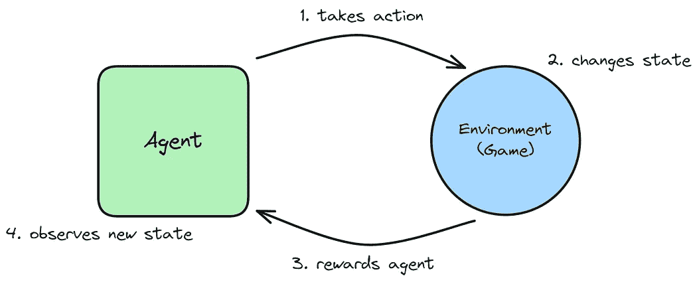

图像由作者提供。

为此，在 Q 学习中，我们为每对 (*s*, *a*) 学习 **质量值**，其中 *s* 是状态，*a* 是代理可以采取的动作。Q(*s*, *a*) 是在状态 *s* 下执行动作 *a* 时的 **期望折扣未来奖励**。举例来说，处于状态 *s* = “站在悬崖前面”并执行动作 *a* = “向前走一步”应该有一个非常低的 Q(*s*, *a*) 值。

我们可以将这个 Q 函数转化为 **策略**；想象一个神奇的指南针，告诉我们在任何给定状态下该做什么。方法很简单：如果我们处于状态 *s*，只需计算所有可能动作 *a* 的 Q(*s*, *a*) 并选择值最高的动作。完成！

在我其他的文章中，我们已经看到如何使用表格或神经网络来获取这些 Q 值。现在，我们只想放松一下，享受 Stable-Baselines3 的简便性。我们值得拥有。

# 进入 Stable-Baselines3

我们已经开发了能够玩各种游戏的代理，如 *冰冻湖*（在不掉入湖中的情况下获得礼物）、*出租车*（接客人并送到酒店）或 *摆杆*（平衡一根杆子）。

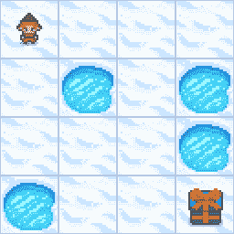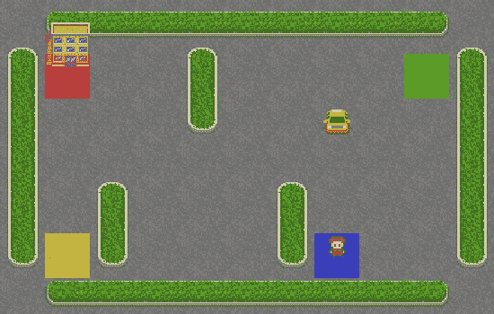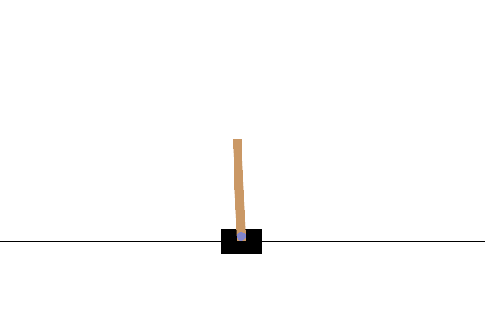

冰冻湖、出租车和*摆杆*。图像由作者提供。

我们可以重新创建掌握这些游戏的代理，但让我们从不同的事情开始：**山地车**！

## 山地车游戏

在这个游戏中，我们操控一辆车，车需要上山。我们可以采取的动作是向左走、向右走或什么都不做。我们的训练目标是从这里…

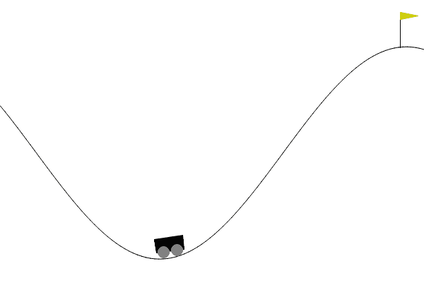

一个贪婪的代理，只想直接移动到山顶。图像由作者提供。

… 到这里：

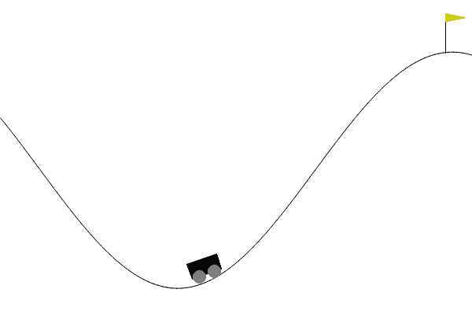

一个智能代理首先获得动力以达到目标。图像由作者提供。

使用 Stable-Baselines3 训练模型极其简单。请看：

```py
import gymnasium as gym
from stable_baselines3 import DQN

env_name = "MountainCar-v0"
env = gym.make(env_name)

config = {
    'batch_size': 128,
    'buffer_size': 10000,
    'exploration_final_eps': 0.07,
    'exploration_fraction': 0.2,
    'gamma': 0.98,
    'gradient_steps': 8, # don't do a single gradient update, but 8
    'learning_rate': 0.004,
    'learning_starts': 1000,
    'policy_kwargs': dict(net_arch=[256, 256]), # we train a neural network with two hidden layers of size 256 each
    'target_update_interval': 600, # see below, the target network gets overwritten with the main network every 600 steps
    'train_freq': 16, # don't train after every step in the environment, but after 16 steps
}

model = DQN("MlpPolicy", env, verbose=1, **config) # MlpPolicy = train a normal feed-forward neural network
model.learn(total_timesteps=2000, progress_bar=True)
```

魔法在于找到 `config` 的良好超参数，但这是我们作为机器学习从业者必须弄清楚的事情。或者让专门的超参数优化工具来处理它。

## 幕后的故事

我们已经知道 `.learn` 方法中大部分发生了什么。如果您查看源代码，您会看到我其他文章中的许多老朋友。例如，如果您 [查看这里](https://github.com/DLR-RM/stable-baselines3/blob/373166d6ac30561c378bdd46e8dba4ef0760f996/stable_baselines3/dqn/dqn.py#L184)，您会找到类似的代码

```py
for _ in range(gradient_steps):
  # Sample replay buffer
  replay_data = self.replay_buffer.sample(batch_size, env=self._vec_normalize_env)  # type: ignore[union-attr]

  with th.no_grad():
      # Compute the next Q-values using the target network
      next_q_values = self.q_net_target(replay_data.next_observations)
      # Follow greedy policy: use the one with the highest value
      next_q_values, _ = next_q_values.max(dim=1)
      # Avoid potential broadcast issue
      next_q_values = next_q_values.reshape(-1, 1)
      # 1-step TD target
      target_q_values = replay_data.rewards + (1 - replay_data.dones) * self.gamma * next_q_values

  # Get current Q-values estimates
  current_q_values = self.q_net(replay_data.observations)
```

我们有一个重放记忆，还有 Q 值更新步骤（1 步 TD 目标）。这应该不再显得过于可怕。值得注意的是，库使用了**双重 Q 学习**，这是我没有实现的。其思路很简单：我们不是使用一个 Q 值神经网络，而是使用两个。

在上面的源代码中，`self.q_net`（称为主网络）是通常被训练的网络。另一方面，`self.q_net_target`（称为目标网络）用于生成训练主网络的标签。每隔几个训练周期，目标网络会被设置为主网络，因此您可以将目标网络视为主网络的滞后版本。

如果两者相同，我们使用我们的网络（只有一个）来生成标签，然后更新网络的权重。但这反过来又改变了目标，因此本质上我们尝试学习移动目标——**训练可能不稳定**。双重 Q 学习通过其双网络方法解决了这个问题。

## 回调函数

训练耗时较长，如果您的程序崩溃，丢失进度总是令人沮丧。因此，Stable-Baselines3 提供了一些很好的回调函数来保存您的进度。我建议使用 `EvalCallback` 和 `CheckpointCallback`。

```py
from stable_baselines3.common.callbacks import EvalCallback, CheckpointCallback

env_name = "MountainCar-v0"

# callback to check the agent's performance every 1000 steps for 10 episodes
eval_callback = EvalCallback(
    eval_env=env,
    eval_freq=1000,
    n_eval_episodes=10,
    best_model_save_path=f"./logs/{env_name}", 
    log_path=f'./logs/{env_name}',
)

# callback to save the model every 10000 steps
save_callback = CheckpointCallback(save_freq=10000, save_path=f'./logs/{env_name}')
```

您可以将这些回调函数直接传递到这里：

```py
model.learn(total_timesteps=2000, progress_bar=True, callback=[eval_callback, save_callback])
```

`EvalCallback` 还保存了一些不错的性能数据，您可以绘制这些数据。

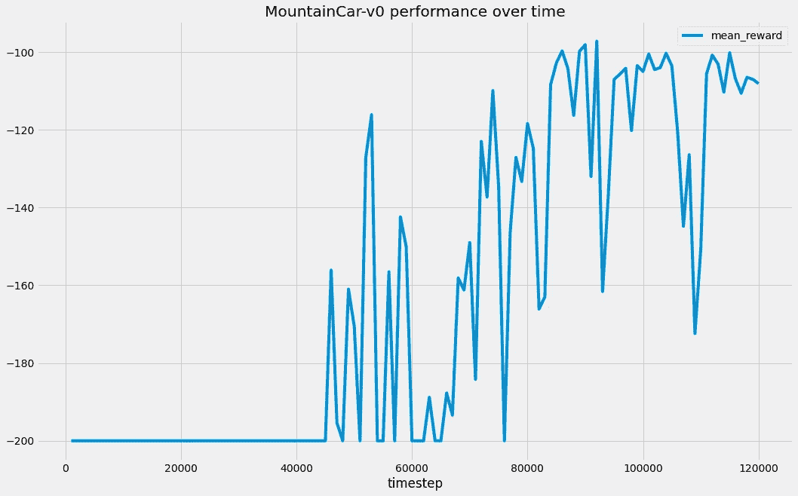

平均奖励（10 次运行的平均）随时间变化。图片由作者提供。

您可以看到，在大约 40,000 个时间步长内，模型学习得不多。-200 的奖励表示模型没有达到顶部——一个回合在 200 个时间步长后结束。然后，学习突然起飞，直到代理程序稳定地达到了山顶。您可以像这样绘制：

```py
import numpy as np
import pandas as pd

data = np.load(f"./logs/{env_name}/evaluations.npz")
pd.DataFrame({
    "mean_reward": data["results"].mean(axis=1),
    "timestep": data["timesteps"]
}).plot(
    x="timestep",
    y="mean_reward",
)
```

# 玩 Atari 游戏

好的，很酷，我们打败了一些幼儿园游戏。是时候挑战更具挑战性的内容了：**Atari 游戏**！对年轻人来说：Atari 是 80 年代视频游戏市场的领导者。他们还发明了游戏 [Pong](https://en.wikipedia.org/wiki/Pong)，我们的心爱游戏，由两个杆子打乒乓球组成。


一台我小时候常玩的 Atari 2600。公有领域图片由 [Evan Amos](https://commons.wikimedia.org/wiki/User:Evan-Amos) 提供。

他们的大多数游戏仍然很简单，但至少它们已经能挑战你了。为了增加趣味，我们将只使用**原始** **屏幕像素**来训练我们的智能体！不再使用内部游戏状态，比如坐标、速度或物体角度。机器必须像人类一样通过观察屏幕并找出该做什么来学习如何玩游戏。

## 《Breakout》

作为一个例子，让我们使用[Breakout](https://en.wikipedia.org/wiki/Breakout_(video_game))，这是一个需要用球破坏方块的游戏。球会跳动，从方块上反弹，也会反弹到我们控制的飞船上。我们可以左右控制“飞船”以保持球在游戏中。不过，让我们看看我们的智能体在主要角色中的游戏场景：

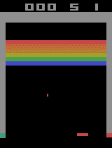

我们的深度 Q 学习智能体在玩《Breakout》。图片由作者提供。

这个智能体在大约 3,000,000 帧的训练中使用了 GPU，并在 GCP（8 vCPUs，30 GB RAM，NVIDIA T4 x 4）上同时训练了 4 个环境。训练大约花费了**3 小时**。除了使用大型机器外，我还利用了`AtariWrapper`来提升性能，该工具将图像缩放到 84 x 84 像素并转为灰度，因为在这个游戏中颜色并不重要。我们还使用了**卷积神经网络**，而不是简单的前馈神经网络，以便在更短的时间内获得更好的结果。以下是代码：

```py
import gymnasium as gym
from stable_baselines3 import DQN
from stable_baselines3.common.atari_wrappers import AtariWrapper
from stable_baselines3.common.callbacks import CheckpointCallback, EvalCallback
from stable_baselines3.common.vec_env import SubprocVecEnv, VecFrameStack, VecTransposeImage

if __name__ == "__main__":
    env_name = "BreakoutNoFrameskip-v4"
    env = SubprocVecEnv([lambda: AtariWrapper(gym.make(env_name)) for _ in range(4)]) # train 4 game environments in parallel, scale down images for faster training
    env = VecFrameStack(env, n_stack=4) # don't only use a still image for training, but the last 4 frames
    env = VecTransposeImage(env) # technical magic for putting the channels of the animation in the first coordinate, i.e., turning HxWxC into CxHxW since Stable-Baselines3 likes it that way

    config = {
        "batch_size": 32,
        "buffer_size": 10000,
        "exploration_final_eps": 0.02,
        "exploration_fraction": 0.1,
        "gamma": 0.99,
        "gradient_steps": 4,
        "learning_rate": 1e-4,
        "learning_starts": 10000,
        "target_update_interval": 1000,
        "train_freq": 4,
    }

    eval_callback = EvalCallback(
        eval_env=env,
        eval_freq=1000,
        n_eval_episodes=10,
        best_model_save_path=f"./logs/{env_name}",
        log_path=f"./logs/{env_name}",
    )
    save_callback = CheckpointCallback(save_freq=10000, save_path=f"./logs/{env_name}")

    model = DQN("CnnPolicy", env, verbose=0, **config) # CnnPolicy creates some default convolutional neural network for us for processing the screen pixels in a more efficient way
    model.learn(total_timesteps=10_000_000, progress_bar=True, callback=[eval_callback, save_callback])
```

**注意：** Jupyterlab 通常在多进程处理上存在问题，因此你可能需要将此代码粘贴到 .py 文件中并从命令行运行。还要注意，我将网络的输入不仅仅是单个游戏图像，而是**四张连续图像**，并且使用了以下代码：

```py
env = VecFrameStack(env, n_stack=4)
```

通过这种方式，智能体不仅可以学习球的**方向和速度**，还可以学习它的位置。否则，它怎么能知道发生了什么呢？

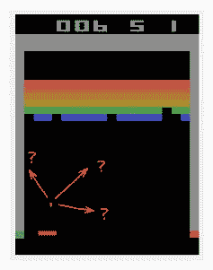

球会去哪里？图片由作者提供。

4 只是一个超参数，你可以尝试其他值。这个小技巧使得智能体能够在没有任何内部游戏信息的情况下学习如何玩这个游戏。

像往常一样，智能体的性能在各个回合中有些波动。不过，你可以清楚地看到趋势是逐渐上升的：

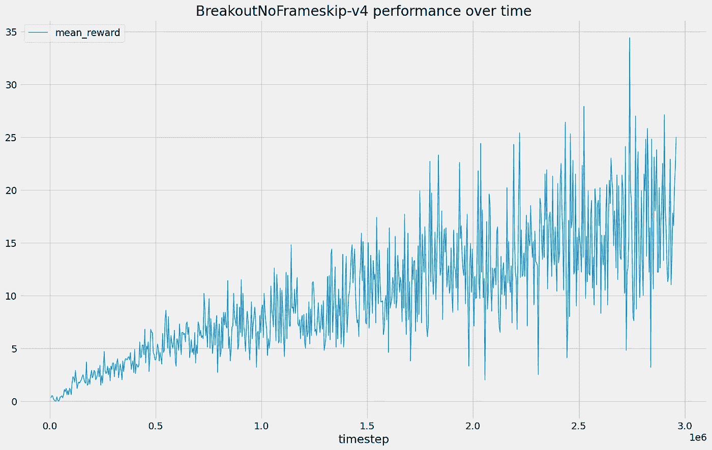

图片由作者提供。

## 《太空侵略者》

另一个经典游戏是《太空侵略者》，这是对《Breakout》的回应。如果你不知道：你需要射击外星人并尽量避免被击中。只需在代码中替换一行，我们就可以训练一个智能体，使其在 3,000,000 步训练之前击败一波敌人：

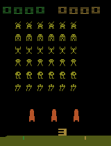

图片由作者提供。

然而，我挑选了这次运行的结果。通常情况下，我的智能体会死得更快，但仍然相当不错：

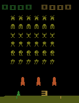

图片由作者提供。

你可以通过以下方式进行训练：

```py
...

if __name__ == "__main__":
    env_name = "SpaceInvadersNoFrameskip-v4"
    ...
```

当然，你现在可以重新训练代理来玩所有的 Atari 游戏。

# 结论

在本文中，我们看到了一种训练代理而不需要太多样板代码的方法。目前，我认为 Stable-Baselines3 就像是强化学习领域的 scikit-learn：你定义模型，稍微配置一下，然后 `.learn` 游戏。没有比这更简单的了。

尽管如此，我还是提倡**了解幕后发生了什么。** 否则，当事情不能按预期工作时，你可能会感到迷茫。经典的机器学习或任何其他算法也是如此。首先，至少要理解基础知识，然后再享受使用一个不错的库！

最后，如果你查看[库的文档](https://stable-baselines3.readthedocs.io/)，你会发现它支持更多的学习算法，例如

+   [异步优势演员评论](https://arxiv.org/abs/1602.01783)（A2C）

+   [近端策略优化](https://arxiv.org/abs/1707.06347)（PPO），或者

+   [深度确定性策略梯度](https://spinningup.openai.com/en/latest/algorithms/ddpg.html)（DDPG）。

如果你想要一个深度 Q 学习的不错替代方案，从我所看到的，PPO 似乎很受欢迎。尝试一下所有这些算法，看看是否能找到更适合你的学习问题的方案！但也要确保了解这些方法的工作原理——也许在我未来的文章中！

希望你今天学到了一些新、趣味和有价值的东西。谢谢阅读！

> *如果你有任何问题，可以在* [*LinkedIn*](https://www.linkedin.com/in/dr-robert-k%C3%BCbler-983859150/)*上联系我！*

如果你想深入了解算法的世界，不妨试试我的新出版物《All About Algorithms》！我还在寻找作者！

[## All About Algorithms](https://allaboutalgorithms.com/?source=post_page-----dccf466b7585--------------------------------)

### 从直观的解释到深入的分析，算法通过示例、代码和精彩的内容变得生动起来…

[allaboutalgorithms.com](https://allaboutalgorithms.com/?source=post_page-----dccf466b7585--------------------------------)
