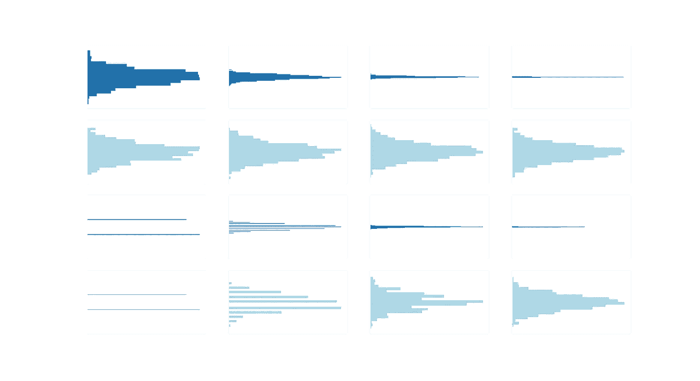
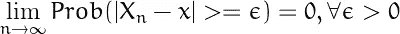
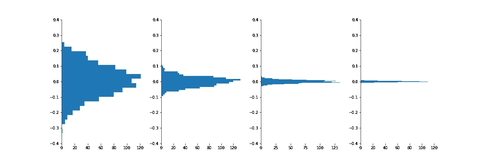
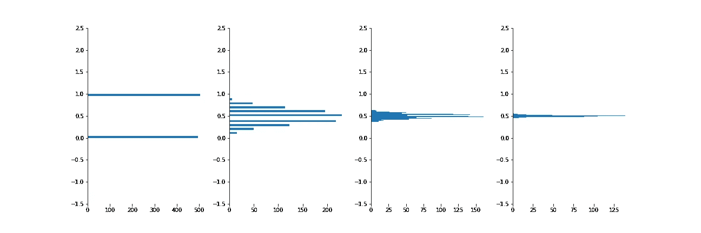
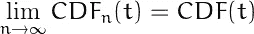
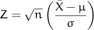
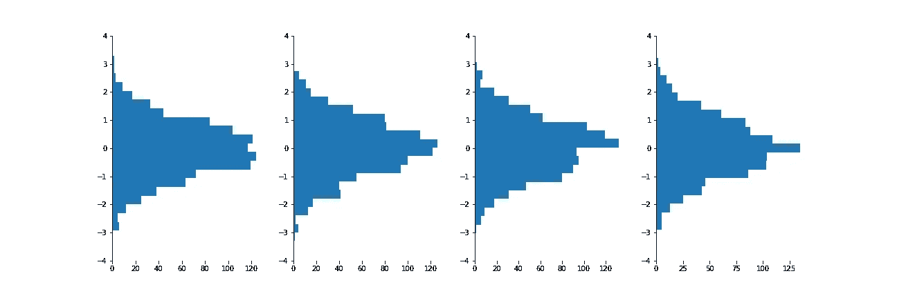
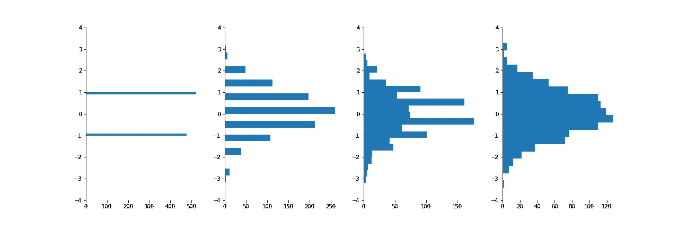

# 概率收敛或分布收敛

> 原文：[`towardsdatascience.com/convergence-in-probability-or-distribution-1766e08125cd`](https://towardsdatascience.com/convergence-in-probability-or-distribution-1766e08125cd)

## 这两者之间有什么区别？

 [Shuo Wang](https://r-shuo-wang.medium.com/?source=post_page-----1766e08125cd--------------------------------)

·发布于 [Towards Data Science](https://towardsdatascience.com/?source=post_page-----1766e08125cd--------------------------------) ·6 min read·2023 年 9 月 4 日

--

图片由作者提供。

在你学习统计学的过程中，你是否遇到过概率收敛和分布收敛的概念？你是否曾思考过这些概念最初是为何被引入的？如果有的话，这个故事旨在帮助你回答一些这些问题。

## **概率收敛**

让我们首先**深入**了解概率收敛的概念，因为它是更容易理解的概念。假设我们有一个随机变量序列：*X1*、*X2*、…、*Xn*，当 n 趋近于无穷大时，如果 *Xn* 很接近 x 的概率趋近于 1，那么我们可以得出结论，*Xn* 在概率上收敛于 x。

为什么这样定义？这种定义的合理性源于这样一个事实：无论 n 多大，*Xn* 永远不会精确等于 *x*（常量）。我们能做的最多是确定 *Xn* 必须在多大程度上接近 *x*，即 *Xn* 落在 *x* 周围某个区间的概率。

因此，我们的定义声称，当 n 趋近于无穷大时，*Xn* 与 *x* 之间的差异大于 ε 的可能性会降低到一个微小的水平，最终接近于零。此外，ε 可以任意小。

一个概率收敛的例子是样本均值的概念。考虑这样一个场景，我们从均值为 0、标准差为 0.1 的正态分布中反复抽取 n 个样本。如果我们计算这些 n 个样本的样本均值，那么得到的样本均值成为一个随机变量，记作 *Xn*，并且具有其自己的分布。

那么问题来了：这个分布的性质是什么？当 n=1 时，样本均值实际上等同于单个样本本身，其分布反映了总体分布，特别是均值为 0、标准差为 0.1 的正态分布。

但如果 *n=1000* 呢？直观上，在这种情况下，我们会期望计算出的样本均值非常接近总体均值，即 0。可以合理假设，当我们反复抽取 1000 个样本并计算样本均值时，数值可能会聚集在 0.001、0.002、-0.001 等附近，没有显著波动。

如果 n=1,000,000 呢？在这种情况下，样本均值非常可能接近 0，任何偏离这个值的情况都极其微小。

这正是概率收敛的本质。随着 n 的增加，随机变量 *Xn* 的分布变得越来越窄，最终收敛到一个单一的值。

样本均值的抽样分布通过一系列直方图进行了可视化，展示了从正态分布中抽取的样本，样本量分别为[1, 10, 100, 1000]。图片由作者提供。

这种现象不仅发生在从正态分布中抽取的样本中，也会在二项分布中出现。当我们从一个试验且成功概率为 0.5 的二项分布中抽取 n 个样本时，我们观察到的收敛模式与前面的例子非常相似：

样本均值的抽样分布通过一系列直方图进行了可视化，展示了从二项分布中抽取的样本，样本量分别为[1, 10, 100, 1000]。图片由作者提供。

无论我们如何努力将样本均值约束在一个特定的区间内，我们总能找到一个足够大的 n，使得样本均值落入该区间的概率接近 100%。

## 分布收敛

相反，需要注意的是，并不是每一个随机变量序列都在概率上收敛到一个单一的数字。在许多情况下，随机变量序列不会收敛到特定的数字，而是收敛到一个具有自己独特分布的随机变量。在这种情况下，我们将这种行为称为分布收敛。

CDFn(t) 表示给定序列中随机变量 Xn 的累积分布函数，而 CDF(t) 表示随机变量 X 的累积分布函数。

定义指出，当考虑一个随机变量序列 *Xn* 时，该序列中的随机变量的累积分布函数（CDF）会随着 *n* 的增加而收敛到随机变量 *X* 的累积分布函数。

这个概念的一个说明性例子是标准化样本均值。下面，你会找到标准化样本均值的定义：

Z 代表标准化样本均值，其中 n 是抽取的样本数量，X_bar 是样本均值，𝜇 是总体均值，𝜎 是总体标准差。

当你从总体中抽取 n 个样本时，可以通过以下步骤获得标准化样本均值：计算这 n 个样本的均值，从中减去总体均值，将结果乘以样本大小的平方根，然后除以总体标准差。

有趣的是，虽然样本均值本身在概率上收敛到总体均值，但标准化样本均值在分布上收敛到均值为零、标准差为一的正态分布随机变量。

直观上，我们可以将标准化样本均值概念化为样本均值的重新缩放版本。回到之前样本均值收敛的图示，我们观察到其分布随着样本大小的增加逐渐类似于正态分布，只是逐渐变得更加狭窄。通过将样本均值乘以样本大小的平方根，我们有效地扩展了分布，使其保持正态分布的形状。

下面的可视化图示展示了标准化样本均值在从正态分布和二项分布中抽取样本的收敛情况：

标准化样本均值的抽样分布通过一系列直方图进行可视化，展示了不同样本大小下从正态分布中抽取的样本，具体为 [1, 10, 100, 1000]。图片由作者提供。

标准化样本均值的抽样分布通过一系列直方图进行可视化，展示了不同样本大小下从二项分布中抽取的样本，具体为 [1, 10, 100, 1000]。图片由作者提供。

## 我们为什么要关注这个？

从某种意义上说，存在一种终极的收敛形式：按分布收敛。我们可以将按概率收敛视为按分布收敛的一种特例，其中最终的分布变得退化并收敛到一个单一值。但为什么这种区分很重要呢？

首先，样本均值收敛于真实总体均值的观察使我们能够估计该总体均值。这种估计过程在各种实际情况中都是常见的。例如，每当我们做出诸如“邻居很爱打听”的概括时，我们实际上是依赖于这样的观点：我们有限的样本来自我们自己的经验，最终会收敛到实际的总体均值。这个原理被称为大数法则。

更为关键的是标准化样本均值收敛于正态分布的观察。正是这个事实使我们能够进行假设检验，并对特定观察结果是由于偶然性还是潜在因果过程做出明智的评估。这一现象更正式地被称为中心极限定理。

## **链接**

[收敛性说明笔记本](https://github.com/swang225/meinyenura/blob/main/python/research/notebook/sample_mean_std_sample_mean_convergence.ipynb)
