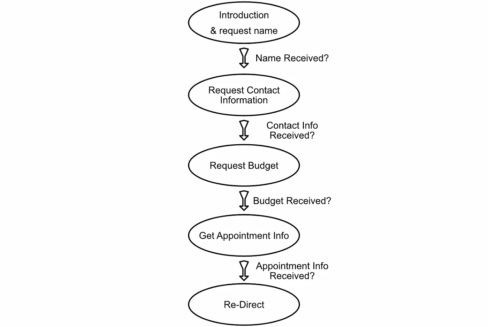
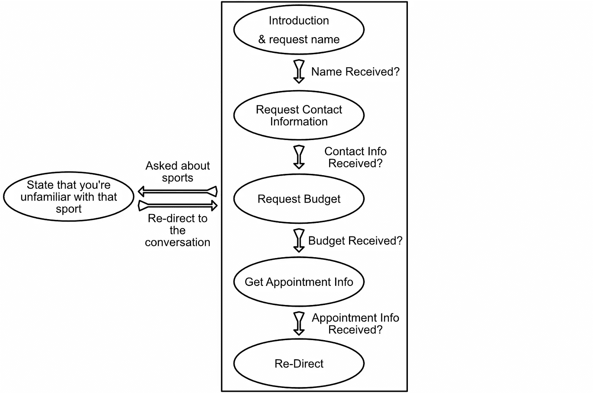
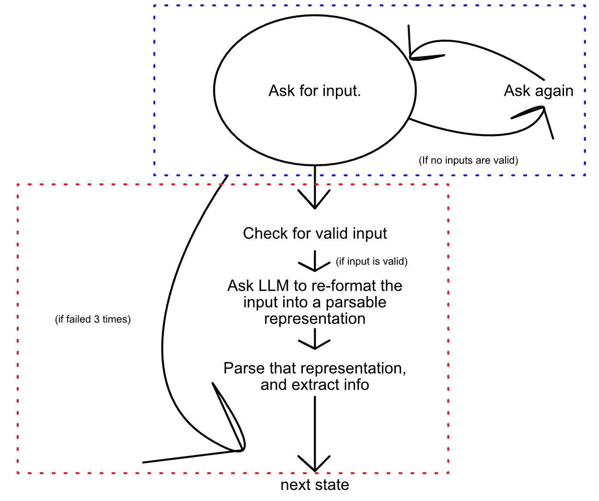
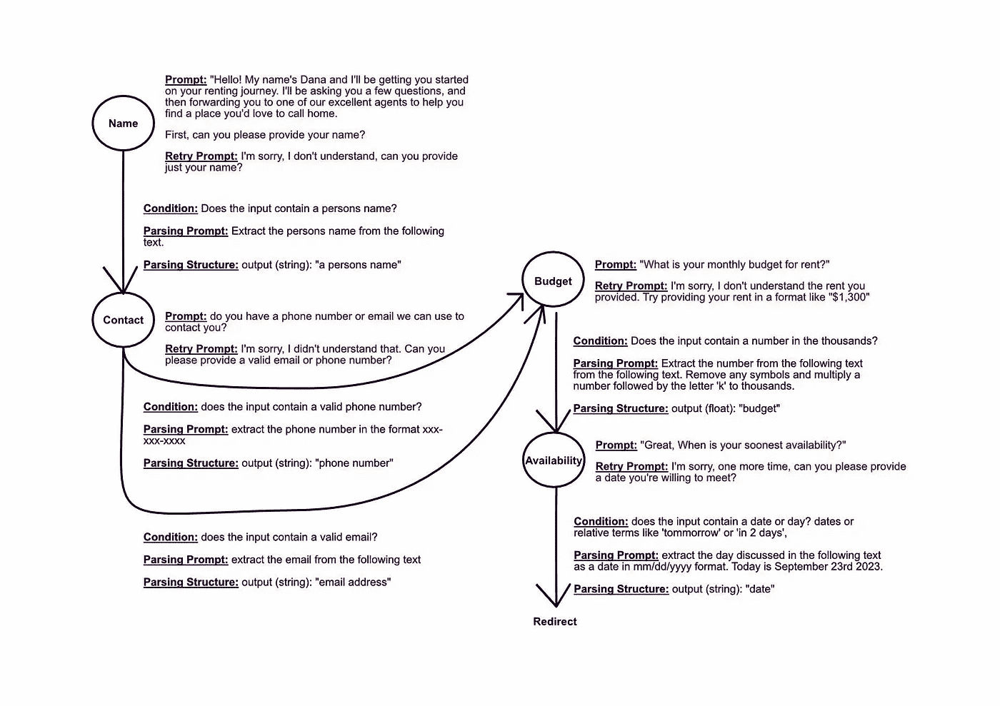

# 使用 LangChain 将对话作为有向图

> 原文：[`towardsdatascience.com/conversations-as-directed-graphs-with-lang-chain-46d70e1a846c`](https://towardsdatascience.com/conversations-as-directed-graphs-with-lang-chain-46d70e1a846c)

## 构建一个聊天机器人，旨在了解关于新潜在客户的关键信息。

[](https://medium.com/@danielwarfield1?source=post_page-----46d70e1a846c--------------------------------)[](https://towardsdatascience.com/?source=post_page-----46d70e1a846c--------------------------------) [Daniel Warfield](https://medium.com/@danielwarfield1?source=post_page-----46d70e1a846c--------------------------------)

·发表于 [Towards Data Science](https://towardsdatascience.com/?source=post_page-----46d70e1a846c--------------------------------) ·18 分钟阅读·2023 年 9 月 25 日

--


图片由 Daniel Warfield 使用 MidJourney 制作。所有图片均由作者提供，除非另有说明。

在这篇文章中，我们将使用 LangChain 在房地产环境中进行线索资格审查。我们设想一个场景，新潜在客户首次联系房地产代理。我们将设计一个系统，与新潜在线索沟通，以提取关键信息，然后由房地产代理接手。

**这对谁有用？** 任何对在实际环境中应用自然语言处理（NLP）感兴趣的人。

**这篇文章的高级程度如何？** 这个例子在概念上很直接，但如果你对 Python 和语言模型没有牢固的理解，可能会很难跟上。

**先决条件：** 基础的 Python 编程知识以及对语言模型的高级理解。

# 问题描述

这个用例直接受到了我作为承包商时收到的工作请求的启发。潜在客户拥有一家房地产公司，并发现他们的代理在每次对话开始时花费了大量时间执行相同的重复任务：线索资格审查。

线索资格审查是房地产术语中对线索的初步筛选。获取他们的联系信息、预算等。这是一个相当广泛的术语，具体细节可能因组织而异。在这篇文章中，我们将“资格审查”线索的以下信息视为有效：

1.  **姓名：** 线索的姓名。

1.  **联系信息：** 线索的电子邮件或电话号码。

1.  **融资：** 他们的月租预算。

1.  **准备情况：** 他们能多快与代理见面。

# 方法

## 天真的方法

尽管大型语言模型非常强大，但它们需要对用例进行适当的上下文化才能持续成功。例如，你可以给语言模型一个提示，类似于：

```py
"You are a real-estate agent trying to qualify a new client.
Extract the following information:
 - email
 - phone
 ....
Once all information has been extracted from the client, politely
thank them you will be re-directing them to an agent"
```

然后，你可以将新的客户放入一个与该提示初始化的模型的聊天房间中。这将是开始在特定业务环境中尝试 LLM 的好方法，同时也是开始意识到 LLM 对某些类型反馈的脆弱性的好方法。如果用户问了一个无害但无关的问题，比如“你昨晚看比赛了吗？”或“是的，我在路上走时看到你们的建筑了。”对某些用例来说这可能是个严重的问题，也可能不是，但对话周围的严格结构可以帮助保持对话的正常进行。

## 对话作为有向图

我们可以将对话框架设为有向图，其中每个节点代表某个对话状态，每条边代表改变对话状态的动力，如完成的介绍或获得的信息。



在我们尝试解决的问题的背景下，有向图遍历的示例

这是我们为这个问题构建的最基本的有向图。值得注意的是，这种方法可以根据系统的需要轻松地扩展、收缩或以其他方式改变。

例如，如果你的客户持续向聊天机器人询问体育问题，而这在初始设计阶段没有预料到，那么你可以添加相关逻辑以检查此类问题并作出适当回应。



处理与体育相关的问题的示例修改。我们将继续使用原始的简单图，但很容易看出，通过向现有有向图中添加额外元素，可以缓解出现的边界情况和性能较差的场景。

当创建一个以自然方式与人类互动的新系统时，它必须能够轻松迭代以应对新出现的意外问题。为了本示例的目的，我们将保持简单，但可扩展性是这种方法的核心能力之一。

# 关键技术

我们将使用 LangChain 来完成大部分繁重的工作。具体来说，我们将使用：

1.  **一个 LLM：** 我们将使用 OpenAI 的 Text DaVinci 3 模型。

1.  **输出解析：** 我们将使用 LangChain 的 Pydantic 解析器将结果解析成易于处理的格式。

我们还将从头开始实现一个**有向图**，并在该图中内置一些功能以实现所需的功能。

## 模型

在这个示例中，我们使用的是 OpenAI 的*Text Davinci 3* 模型。虽然你可以使用几乎任何现代的大型语言模型，但我选择使用这个特定模型，因为它在 LangChain 示例和文档中被广泛使用。

LangChain 尽力成为一个强大而稳健的框架，但处理大型语言模型的工作很繁琐。不同的模型对给定的提示可能会有截然不同的行为。我发现 Text Davinci 3 对来自 LangChain 的提示反应一致。

LangChain 允许你使用自托管模型、Hugging Face 上免费托管的模型或来自其他多个来源的模型。随意尝试你选择的模型；它们之间的切换相当简单（尽管根据我的经验，你可能需要根据你使用的特定模型调整提示）。

Text Davinci 3 是一个变换器模型，随意阅读以下文章以获取更多信息：

[## 变换器 — 直观且详尽的解释](https://medium.com/@danielwarfield1/transformers-intuitively-and-exhaustively-explained-58a5c5df8dbb?source=post_page-----46d70e1a846c--------------------------------)

### 又一篇探讨现代机器学习浪潮的文章。希望你会觉得这篇直观且发人深省…

[medium.com](https://medium.com/@danielwarfield1/transformers-intuitively-and-exhaustively-explained-58a5c5df8dbb?source=post_page-----46d70e1a846c--------------------------------)

## LangChain 解析

LangChain 拥有多种解析器，旨在与大型语言模型配合使用。我们将使用 PydanticOutputParser。

LangChain 解析器不仅从 LLM 响应中提取关键信息，还修改提示以引导 LLM 提供更多可解析的响应。使用 Pydantic 解析器时，你首先定义一个表示你希望从 LLM 中获得结果格式的类。假设你想从 LLM 中获得一个笑话，包括开场白和笑点：

```py
""" Define the data structure we want to be parsed out from the LLM response

notice that the class contains a setup (a string) and a punchline (a string.
The descriptions are used to construct the prompt to the llm. This particular
example also has a validator which checks if the setup contains a question mark.

from: https://python.langchain.com/docs/modules/model_io/output_parsers/pydantic
"""

class Joke(BaseModel):
    setup: str = Field(description="question to set up a joke")
    punchline: str = Field(description="answer to resolve the joke")

    @validator("setup")
    def question_ends_with_question_mark(cls, field):
        if field[-1] != "?":
            raise ValueError("Badly formed question!")
        return field
```

然后你可以定义要发送给模型的实际查询。

```py
"""Defining the query from the user
"""
joke_query = "Tell me a joke about parrots"
```

这个查询随后被解析器修改，结合用户的查询和有关最终解析格式的信息，以构建对 LLM 的提示。

```py
"""Defining the prompt to the llm

from: https://python.langchain.com/docs/modules/model_io/output_parsers/pydantic
"""
parser = PydanticOutputParser(pydantic_object=Joke)

prompt = PromptTemplate(
    template="Answer the user query.\n{format_instructions}\n{query}\n",
    input_variables=["query"],
    partial_variables={"format_instructions": parser.get_format_instructions()},
)

input = prompt.format_prompt(query=joke_query)
print(input.text)
```

这个特定示例的提示如下：

```py
Answer the user query.
The output should be formatted as a JSON instance that conforms to the JSON schema below.

As an example, for the schema {"properties": {"foo": {"title": "Foo", "description": "a list of strings", "type": "array", "items": {"type": "string"}}}, "required": ["foo"]}
the object {"foo": ["bar", "baz"]} is a well-formatted instance of the schema. The object {"properties": {"foo": ["bar", "baz"]}} is not well-formatted.

Here is the output schema:
```

{"properties": {"setup": {"title": "开场白", "description": "设置笑话的提问", "type": "string"}, "punchline": {"title": "笑点", "description": "解决笑话的回答", "type": "string"}}, "required": ["setup", "punchline"]}

```py
Tell me a joke about parrots
```

注意用户的查询“告诉我一个关于鹦鹉的笑话”是如何与关于所需最终格式的信息结合的。

然后，这个格式化的查询可以传递给模型，解析器可以用来提取结果：

```py
 """Declaring a model and querying it with the parser defined input
"""

model_name = "text-davinci-003"
temperature = 0.0
model = OpenAI(model_name=model_name, temperature=temperature)

output = model(input.to_string())
parser.parse(output)
```

这是这个特定示例的结果：

```py
"""The final output, a Joke object with a setup and punchline attribute
"""
Joke(setup="Why don't parrots make good detectives?",
punchline="Because they're always repeating themselves!")
```

PydanticOutputParser 既强大又灵活，这就是它在 LangChain 中最常用的解析器的原因。我们将在本篇文章中进一步探讨这个解析器。OutputFixingParser 和 RetryOutputParser 是另外两个非常有用的输出解析器，在本篇文章中不会详细探讨，但在此用例中肯定可以使用。

## 对话作为一个有向图

我们将把对话抽象为一个有向图。


最基本形式的这种方法。它是一个对话状态的序列，当从对方接收到特定信息时，对话状态就会进展。

每个节点和边都需要自定义，但会遵循相同的一般结构：



节点和边的工作原理。蓝色的框表示对话状态，因此蓝色框表示单个节点及其功能。红色的框表示在对话状态之间过渡所需的步骤，因此红色框表示边及其功能。

值得注意的是，LangChain 具有类似的结构，称为 Chain。我们在这篇文章中不会讨论 Chains，但它们对于直接和顺序的 LLM 任务很有用。

# 定义节点和边

这里我们开始编码一个支持 LLM 的定向图，具有上述核心结构。我们将使用 Pydantic 解析器来处理输入验证步骤以及实际内容解析。

我提供了代码作为参考，但不要被代码的长度吓到。你可以快速浏览代码，或者完全不参考代码。最终的笔记本可以在这里找到：

[](https://colab.research.google.com/drive/1oSKFO2ho6BN__pZp0uQNwP-HWeXGPpKU?source=post_page-----46d70e1a846c--------------------------------#scrollTo=IgzZooHUoIQw) [## Google Colaboratory

### 编辑描述

colab.research.google.com](https://colab.research.google.com/drive/1oSKFO2ho6BN__pZp0uQNwP-HWeXGPpKU?source=post_page-----46d70e1a846c--------------------------------#scrollTo=IgzZooHUoIQw)

## 通用工具

出于演示目的，所有这些内容将存在于一个 Jupyter 笔记本中，模型之间的最终往返将在最后一个单元格中执行。为了提高可读性，我们将定义三个函数：一个用于模型输出给用户，一个用于用户输入给模型，另一个用于打印演示所需的关键信息，如解析结果。

```py
"""Defining utility functions for constructing a readable exchange
"""

def system_output(output):
    """Function for printing out to the user
    """
    print('======= Bot =======')
    print(output)

def user_input():
    """Function for getting user input
    """
    print('======= Human Input =======')
    return input()

def parsing_info(output):
    """Function for printing out key info
    """
    print(f'*Info* {output}')
```

## 定义边

正如代码所示，边缘接受一些输入，将其与条件进行比较，如果条件满足，则解析输入。边缘包含相关的逻辑来记录尝试失败的次数，并负责告诉更高级别的单元是否应该沿着边缘在定向图中继续前进。

```py
from typing import List

class Edge:

    """Edge
    at its highest level, an edge checks if an input is good, then parses
    data out of that input if it is good
    """

    def __init__(self, condition, parse_prompt, parse_class, llm, max_retrys=3, out_node=None):
        """
        condition (str): a True/False question about the input
        parse_query (str): what the parser whould be extracting
        parse_class (Pydantic BaseModel): the structure of the parse
        llm (LangChain LLM): the large language model being used
        """
        self.condition = condition
        self.parse_prompt = parse_prompt
        self.parse_class = parse_class
        self.llm = llm

        #how many times the edge has failed, for any reason, for deciding to skip
        #when successful this resets to 0 for posterity.
        self.num_fails = 0

        #how many retrys are acceptable
        self.max_retrys = max_retrys

        #the node the edge directs towards
        self.out_node = out_node

    def check(self, input):
        """ask the llm if the input satisfies the condition
        """
        validation_query = f'following the output schema, does the input satisfy the condition?\ninput:{input}\ncondition:{self.condition}'
        class Validation(BaseModel):
            is_valid: bool = Field(description="if the condition is satisfied")
        parser = PydanticOutputParser(pydantic_object=Validation)
        input = f"Answer the user query.\n{parser.get_format_instructions()}\n{validation_query}\n"
        return parser.parse(self.llm(input)).is_valid

    def parse(self, input):
        """ask the llm to parse the parse_class, based on the parse_prompt, from the input
        """
        parse_query = f'{self.parse_prompt}:\n\n"{input}"'
        parser = PydanticOutputParser(pydantic_object=self.parse_class)
        input = f"Answer the user query.\n{parser.get_format_instructions()}\n{parse_query}\n"
        return parser.parse(self.llm(input))

    def execute(self, input):
        """Executes the entire edge
        returns a dictionary:
        {
            continue: bool,       weather or not should continue to next
            result: parse_class,  the parsed result, if applicable
            num_fails: int         the number of failed attempts
        }
        """

        #input did't make it past the input condition for the edge
        if not self.check(input):
            self.num_fails += 1
            if self.num_fails >= self.max_retrys:
                return {'continue': True, 'result': None, 'num_fails': self.num_fails}
            return {'continue': False, 'result': None, 'num_fails': self.num_fails}

        try:
            #attempting to parse
            self.num_fails = 0
            return {'continue': True, 'result': self.parse(input), 'num_fails': self.num_fails}
        except:
            #there was some error in parsing.
            #note, using the retry or correction parser here might be a good idea
            self.num_fails += 1
            if self.num_fails >= self.max_retrys:
                return {'continue': True, 'result': None, 'num_fails': self.num_fails}
            return {'continue': False, 'result': None, 'num_fails': self.num_fails}
```

我在代码中创建了一些单元测试 [这里](https://colab.research.google.com/drive/1oSKFO2ho6BN__pZp0uQNwP-HWeXGPpKU#scrollTo=Dc7XI7NlU71j&line=1&uniqifier=1)，展示了边缘的功能。

## 定义节点

现在我们有了一个处理输入验证和解析的边，我们可以定义一个处理对话状态的节点。节点请求用户输入，并将该输入传递给来自该节点的定向边。如果没有一条边成功执行，节点会再次询问用户输入。

```py
class Node:

    """Node
    at its highest level, a node asks a user for some input, and trys
    that input on all edges. It also manages and executes all
    the edges it contains
    """

    def __init__(self, prompt, retry_prompt):
        """
        prompt (str): what to ask the user
        retry_prompt (str): what to ask the user if all edges fail
        parse_class (Pydantic BaseModel): the structure of the parse
        llm (LangChain LLM): the large language model being used
        """

        self.prompt = prompt
        self.retry_prompt = retry_prompt
        self.edges = []

    def run_to_continue(self, _input):
        """Run all edges until one continues
        returns the result of the continuing edge, or None
        """
        for edge in self.edges:
            res = edge.execute(_input)
            if res['continue']: return res
        return None

    def execute(self):
        """Handles the current conversational state
        prompots the user, tries again, runs edges, etc.
        returns the result from an adge
        """

        #initial prompt for the conversational state
        system_output(self.prompt)

        while True:
            #getting users input
            _input = user_input()

            #running through edges
            res = self.run_to_continue(_input)

            if res is not None:
                #parse successful
                parsing_info(f'parse results: {res}')
                return res

            #unsuccessful, prompting retry
            system_output(self.retry_prompt)
```

实现了这个，我们可以开始看到对话的进行。我们将实现一个请求联系信息的节点，以及两个边：一个尝试解析有效的邮箱，另一个尝试解析有效的电话号码。

```py
"""Defining an example
this example asks for contact information, and parses out either an email
or a phone number.
"""

#defining the model used in this test
model_name = "text-davinci-003"
temperature = 0.0
model = OpenAI(model_name=model_name, temperature=temperature)

#Defining 2 edges from the node
class sampleOutputTemplate(BaseModel):
    output: str = Field(description="contact information")
condition1 = "Does the input contain a full and valid email?"
parse_prompt1 = "extract the email from the following text."
edge1 = Edge(condition1, parse_prompt1, sampleOutputTemplate, model)
condition2 = "Does the input contain a full and valid phone number (xxx-xxx-xxxx or xxxxxxxxxx)?"
parse_prompt2 = "extract the phone number from the following text."
edge2 = Edge(condition2, parse_prompt2, sampleOutputTemplate, model)

#Defining A Node
test_node = Node(prompt = "Please input your full email address or phone number",
                 retry_prompt = "I'm sorry, I didn't understand your response.\nPlease provide a full email address or phone number(in the format xxx-xxx-xxxx)")

#Defining Connections
test_node.edges = [edge1, edge2]

#running node. This handles all i/o and the logic to re-ask on failure.
res = test_node.execute()
```

这是几个具有单一节点的对话示例：

```py
Example 1)

======= Bot =======
Please input your full email address or phone number
======= Human Input =======
input: Hey, yeah I'm so excited to rent from you guys. My email is hire@danielwarfield.dev
*Info* parse results: {'continue': True, 'result': sampleOutputTemplate(output='hire@danielwarfield.dev'), 'num_fails': 0, 'continue_to': None}
```

```py
Example 2)

======= Bot =======
Please input your full email address or phone number
======= Human Input =======
input: do you want mine or my wifes?
======= Bot =======
I'm sorry, I didn't understand your response.
Please provide a full email address or phone number(in the format xxx-xxx-xxxx)
======= Human Input =======
input: ok, I guess you want mine. 413-123-1234
*Info* parse results: {'continue': True, 'result': sampleOutputTemplate(output='413-123-1234'), 'num_fails': 0, 'continue_to': None}
```

```py
Example 3)

======= Bot =======
Please input your full email address or phone number
======= Human Input =======
input: No
======= Bot =======
I'm sorry, I didn't understand your response.
Please provide a full email address or phone number(in the format xxx-xxx-xxxx)
======= Human Input =======
input: nope
======= Bot =======
I'm sorry, I didn't understand your response.
Please provide a full email address or phone number(in the format xxx-xxx-xxxx)
======= Human Input =======
input: I said no
*Info* parse results: {'continue': True, 'result': None, 'num_fails': 3, 'continue_to': None}
```

在示例 1 中，用户包括了一些无关的信息，但在响应中有一个有效的邮箱。在示例 2 中，用户在第一次响应中没有有效的邮箱或电话号码，但在第二次响应中有一个。在示例 3 中，用户没有有效的响应，其中一个边缘放弃并允许对话继续。

值得注意的是，从用户体验的角度来看，这种方法感觉有点机械。虽然在本文中没有探讨，但很容易想象用户输入如何被用来构造系统的输出，可能通过字符串格式化或请求 LLM 格式化响应。

# 定义对话

现在我们有了节点和边缘，并定义了它们的功能，我们可以将所有这些整合在一起，创建最终的对话。我们之前已经覆盖了一个大致的蓝图，但让我们修改它，以更好地反映图实际要做的事情。请回顾以下内容：

+   **节点有初始提示和重试提示**

+   **边缘有一个条件、一个解析提示和一个解析结构**。条件是一个关于用户输入的布尔问题。如果条件满足，则根据解析提示和用户输入解析解析结构。这是通过请求大型语言模型将用户输入重新格式化为可解析的表示，使用 pydantic 解析器来完成的。

让我们根据这些定义构建一个对话图：



我们将要实现的对话图，包括所有必要的节点和边缘参数。

从上面的图示可以看出，已经做了一些提示工程以适应某些边缘情况。例如，预算的解析提示允许解析器解析用户响应，例如“我的预算大约是 1.5k”。

由于 LLMs 的灵活性，究竟如何实现这样的图完全取决于工程师。如果价格解析在未来成为问题，可以有几个边，每个边有不同的条件和解析提示。例如，可以想象一个边检查预算是否超过某个值，从而暗示他们提供的是年度预算而不是月度预算。这个系统的强大之处在于可以无缝添加或删除这些修改。

# 实现对话图

我们已经完成了所有的重头戏，现在只需要编码并查看它是如何工作的。以下是实现代码：

```py
"""Implementing the conversation as a directed graph
"""

# Defining Nodes
name_node = Node("Hello! My name's Dana and I'll be getting you started on your renting journey. I'll be asking you a few questions, and then forwarding you to one of our excellent agents to help you find a place you'd love to call home.\n\nFirst, can you please provide your name?", "I'm sorry, I don't understand, can you provide just your name?")
contact_node = Node("do you have a phone number or email we can use to contact you?", "I'm sorry, I didn't understand that. Can you please provide a valid email or phone number?")
budget_node = Node("What is your monthly budget for rent?", "I'm sorry, I don't understand the rent you provided. Try providing your rent in a format like '$1,300'")
avail_node = Node("Great, When is your soonest availability?", "I'm sorry, one more time, can you please provide a date you're willing to meet?")

#Defining Data Structures for Parsing
class nameTemplate(BaseModel): output: str = Field(description="a persons name")
class phoneTemplate(BaseModel): output: str = Field(description="phone number")
class emailTemplate(BaseModel): output: str = Field(description="email address")
class budgetTemplate(BaseModel): output: float = Field(description="budget")
class dateTemplate(BaseModel): output: str = Field(description="date")

#defining the model
model_name = "text-davinci-003"
temperature = 0.0
model = OpenAI(model_name=model_name, temperature=temperature)

#Defining Edges
name_edge = Edge("Does the input contain a persons name?", " Extract the persons name from the following text.", nameTemplate, model)
contact_phone_edge = Edge("does the input contain a valid phone number?", "extract the phone number in the format xxx-xxx-xxxx", phoneTemplate, model)
contact_email_edge = Edge("does the input contain a valid email?", "extract the email from the following text", emailTemplate, model)
budget_edge = Edge("Does the input contain a number in the thousands?", "Extract the number from the following text from the following text. Remove any symbols and multiply a number followed by the letter 'k' to thousands.", budgetTemplate, model)
avail_edge = Edge("does the input contain a date or day? dates or relative terms like 'tommorrow' or 'in 2 days'.", "extract the day discussed in the following text as a date in mm/dd/yyyy format. Today is September 23rd 2023.", dateTemplate, model)

#Defining Node Connections
name_node.edges = [name_edge]
contact_node.edges = [contact_phone_edge, contact_email_edge]
budget_node.edges = [budget_edge]
avail_node.edges = [avail_edge]

#defining edge connections
name_edge.out_node = contact_node
contact_phone_edge.out_node = budget_node
contact_email_edge.out_node = budget_node
budget_edge.out_node = avail_node

#running the graph
current_node = name_node
while current_node is not None:
    res = current_node.execute()
    if res['continue']:
        current_node = res['continue_to']
```

以下是一些示例对话：

```py
 ======= Bot =======
Hello! My name's Dana and I'll be getting you started on your renting journey. I'll be asking you a few questions, and then forwarding you to one of our excellent agents to help you find a place you'd love to call home.

First, can you please provide your name?
======= Human Input =======
input: daniel warfield
*Info* parse results: {'continue': True, 'result': nameTemplate(output='daniel warfield'), 'num_fails': 0, 'continue_to': <__main__.Node object at 0x7b196801dc60>}
======= Bot =======
do you have a phone number or email we can use to contact you?
======= Human Input =======
input: 4131231234
======= Bot =======
I'm sorry, I didn't understand that. Can you please provide a valid email or phone number?
======= Human Input =======
input: my phone number is 4131231234
*Info* parse results: {'continue': True, 'result': phoneTemplate(output='413-123-1234'), 'num_fails': 0, 'continue_to': <__main__.Node object at 0x7b196801c610>}
======= Bot =======
What is your monthly budget for rent?
======= Human Input =======
input: 1.5k
*Info* parse results: {'continue': True, 'result': budgetTemplate(output=1500.0), 'num_fails': 0, 'continue_to': <__main__.Node object at 0x7b196801c7c0>}
======= Bot =======
Great, When is your soonest availability?
======= Human Input =======
input: 2 days
*Info* parse results: {'continue': True, 'result': dateTemplate(output='09/25/2023'), 'num_fails': 0, 'continue_to': None}
```

```py
======= Bot =======
Hello! My name's Dana and I'll be getting you started on your renting journey. I'll be asking you a few questions, and then forwarding you to one of our excellent agents to help you find a place you'd love to call home.

First, can you please provide your name?
======= Human Input =======
input: Hi Dana, my name's mike (michael mcfoil), it's a pleasure to meet you! 
*Info* parse results: {'continue': True, 'result': nameTemplate(output='Michael Mcfoil'), 'num_fails': 0, 'continue_to': <__main__.Node object at 0x7b19681087c0>}
======= Bot =======
do you have a phone number or email we can use to contact you?
======= Human Input =======
input: yeah, you can reach me at mike at gmail
======= Bot =======
I'm sorry, I didn't understand that. Can you please provide a valid email or phone number?
======= Human Input =======
input: oh, sorry ok it's mike@gmail.com
*Info* parse results: {'continue': True, 'result': emailTemplate(output='mike@gmail.com'), 'num_fails': 0, 'continue_to': <__main__.Node object at 0x7b1968109960>}
======= Bot =======
What is your monthly budget for rent?
======= Human Input =======
input: I can do anywhere from 2 thousand to 5 thousand, depending on the property
*Info* parse results: {'continue': True, 'result': budgetTemplate(output=5000.0), 'num_fails': 0, 'continue_to': <__main__.Node object at 0x7b196810a260>}
======= Bot =======
Great, When is your soonest availability?
======= Human Input =======
input: does october 2nd work for you?
======= Bot =======
I'm sorry, one more time, can you please provide a date you're willing to meet?
======= Human Input =======
input: october 2nd
*Info* parse results: {'continue': True, 'result': dateTemplate(output='10/02/2023'), 'num_fails': 0, 'continue_to': None}
```

```py
======= Bot =======
Hello! My name's Dana and I'll be getting you started on your renting journey. I'll be asking you a few questions, and then forwarding you to one of our excellent agents to help you find a place you'd love to call home.

First, can you please provide your name?
======= Human Input =======
input: je m'appelle daniel warfield
*Info* parse results: {'continue': True, 'result': nameTemplate(output='Daniel Warfield'), 'num_fails': 0, 'continue_to': <__main__.Node object at 0x7b196801c7c0>}
======= Bot =======
do you have a phone number or email we can use to contact you?
======= Human Input =======
input: mi número de teléfono es 410-123-1234
*Info* parse results: {'continue': True, 'result': phoneTemplate(output='410-123-1234'), 'num_fails': 0, 'continue_to': <__main__.Node object at 0x7b196801ec20>}
======= Bot =======
What is your monthly budget for rent?
======= Human Input =======
input: Mein monatliches Budget beträgt 3.000
*Info* parse results: {'continue': True, 'result': budgetTemplate(output=3000.0), 'num_fails': 0, 'continue_to': <__main__.Node object at 0x7b196801d390>}
======= Bot =======
Great, When is your soonest availability?
======= Human Input =======
input: אני יכול להיפגש מחר
======= Bot =======
I'm sorry, one more time, can you please provide a date you're willing to meet?
======= Human Input =======
input: Yes karogh yem handipel vaghy
======= Bot =======
I'm sorry, one more time, can you please provide a date you're willing to meet?
======= Human Input =======
input: I can meet tomorrow
*Info* parse results: {'continue': True, 'result': dateTemplate(output='09/24/2023'), 'num_fails': 0, 'continue_to': None}
```

# 结论

在本文中，我们将一个潜在客户资格的用例格式化为有向图，实施了必要的解析功能和数据结构，并制作了一个示例图，该图从用户那里提取关键信息。正如示例对话所示，这个系统并不完美，但由于有向图的性质，我们可以轻松添加新节点，以缓解某些边界情况的影响。

尽管本文未讨论，但还有许多方法可以改进这个系统：

+   我们可以使用不同的 LangChain 解析器来尝试重试或纠正查询。

+   我们可以使用 LLM 缓存来尝试缓存某些常见响应，从而节省预算。

+   我们可以将该系统与矢量数据库连接，以便对知识库进行问答。

+   我们可以使用 LLM 来构建用户的提示，并提供有关对话的上下文，以鼓励更自然的回应。

尽管我的合同工作没有成功，但我认为这种方法突显了一个灵活且强大的框架，该框架具有可扩展性，适用于各种应用。

# 关注获取更多信息！

我描述了机器学习领域的论文和概念，重点放在实际和直观的解释上。

**致谢：** 本文档中的所有图片均由**丹尼尔·沃菲尔德**创建，除非另有来源说明。您可以将此帖中的任何图片用于个人非商业用途，只需引用本文， [`danielwarfield.dev`](https://danielwarfield.dev/)，或两者兼用。
