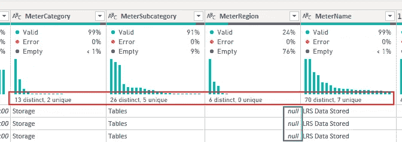

# 将平坦表格转换为 Power Query 中的良好数据模型

> 原文：[`towardsdatascience.com/converting-a-flat-table-to-a-good-data-model-in-power-query-46208215f17a`](https://towardsdatascience.com/converting-a-flat-table-to-a-good-data-model-in-power-query-46208215f17a)

## *当将一个宽 Excel 表格加载到 Power BI 中时，我们最终会得到一个次优的数据模型。我们可以做什么来创建一个好的数据模型？什么才算是“好的”数据模型？让我们深入了解一下。*

[](https://medium.com/@salvatorecagliari?source=post_page-----46208215f17a--------------------------------)[](https://towardsdatascience.com/?source=post_page-----46208215f17a--------------------------------) [Salvatore Cagliari](https://medium.com/@salvatorecagliari?source=post_page-----46208215f17a--------------------------------)

·发布在 [Towards Data Science](https://towardsdatascience.com/?source=post_page-----46208215f17a--------------------------------) ·12 分钟阅读·2023 年 12 月 22 日

--


图片由 [Kaleidico](https://unsplash.com/@kaleidico?utm_source=medium&utm_medium=referral) 提供，发布在 [Unsplash](https://unsplash.com/?utm_source=medium&utm_medium=referral)

# 引言

只是办公室里的另一天：一个客户打电话让我修复他 Power BI 报告中的某些内容。我查看了数据，发现有一个宽表，包含 30、40 或更多列。

我问了一个自然的问题：“这个表格的来源是什么？”

答案是“Excel，还能有什么？”

“当然，”我想。

我的下一个问题：“我们能从中建立一个好的数据模型吗？”

我的客户：“为什么？”

这就是我们现在的状况。

理想情况下，我会将源文件导入到关系数据库中，并将数据转换为一个不错的数据模型。

不幸的是，我的客户通常不愿意为那些初看上去对他们没有好处的东西付费。

但是为什么我想要一个好的数据模型？一个平坦的表格不是也很好吗？

再看一眼，确实如此。

几千行的数据没有问题。

但一旦数据量增加，问题可能会积累。

这是对“为什么？”问题的简短回答：

# 那么，为什么需要一个好的数据模型？

有很多原因让我想要一个“好的数据模型”。

两个简短的原因是效率和可用性。

当将数据类型分隔到不同的表中，并通过关系将它们连接起来时，Power BI 可以以更高效的方式工作。

此外，通过去除冗余，可以减少 Power BI 文件的大小。

我强烈推荐阅读 SQLBI 上的相关文章。你可以在下方的参考文献部分找到链接，以获取这个问题的详细答案。

其次，想要使用数据模型的人可以在单独的表中找到所有列（即属性），而不是在一个长的按字母排序的列表中搜索。

现在我们知道了为什么，接下来的问题是，什么是一个好的数据模型？

答案是：一个星型模式。

# 什么鬼是星型模式？

如果你已经知道什么是星型模式，可以跳到下一节。

我的原始数据模型如下：


图 1 — 原始数据模型，包含一个有 27 (!) 列的表（图由作者提供）

中心表是图中间的那个大表，名为“Azure_UsageDetails”。我们称之为“原始表”。

其他两个表是用于时间报告的日期表。

当你仔细查看原始表时，你可以找到一些有趣的列，例如：

+   BillingProfile

+   MeterName

+   SubscriptionName

这些列的共同点是，虽然表中有大约 55,000 行，这些列只有少量不同的值。

这意味着基数是低的。

此外，这些列描述了我的数据。它们不包含任何值，例如“Quantity”或“UnitPrice”。

目标是将这些列移动到单独的表中，称为维度表，以获得只包含这些列中的唯一值或值组合的较短表。

看一下下面的图示：


图 2 — 作为星型模式的目标数据模型（图由作者提供）

现在，你可以理解为什么它被称为星型模式。

我们可以称之为鱿鱼模式，但没有人会理解我们。

正如你所见，每个维度表都有一个 ID 列与中心表中的相应 ID 列相连。

ID 列应始终是整数数据类型。**绝不要**文本列。

星型模型中心的表称为“事实”表。它仅包含每个事件、交易或数据点的值。

# 让我们开始吧

好的，现在我们需要执行一些准备步骤：

1.  查找低基数的列。

1.  查找需要分组的列。

1.  为每个维度表定义名称。

1.  替换所有空单元格。

1.  复制包含数据的表。

首先，打开 Power Query。

其次，我们启用数据分析：


图 3 — 在 Power Query 中启用数据分析（图由作者提供）

Power Query 仅显示前 1000 行的分析结果。启用整个数据集的分析可能是个好主意。

在左下角，点击文本“基于前 1000 行的列分析”，然后切换到“基于整个数据集的列分析”选项：


图 4 — 在整个数据集上开启分析（图由作者提供）

根据数据量，加载整个数据集并计算分析可能需要一些时间。

当我查看我的数据时，我发现这里有前三个候选项：


图 5 — 维度的前三个候选（作者制作的图）

在这些中，我可以创建三个维度：

+   计费配置文件

+   订阅

+   计量器

如你所见，我为维度表赋予了复数名称，每个表包含一个或多个该实体的实例。

现在，查看以“Meter”开头的列：



图 6 — 所有四个计量器列（作者制作的图）

我注意到两个关键细节：

+   这四列的基数不同。

+   我有很多空行在 MeterRegion 列中（76%）。

根据基数（不同值的数量），我认为我可以为计量器构建一个层次结构。

+   一级：计量器区域

+   第二级：计量器类别

+   第三级：计量器子类别

+   叶级：计量器名称

来自 Fact 表的数据将与 Meter Name 列建立关系。更准确地说，ID 列将基于叶级别但从所有四列的不同组合中创建。

组合的原因是计量器名称可能会多次出现，并分配给不同的计量器子类别。

第二步，我们必须用有意义的内容替换 Meter Region 列中的空行，以避免在顶级层次上出现名为（Null）的层次节点。

为了实现这一点，我右键点击列名，然后点击“替换值”。

在此功能的对话框中，我输入*null*作为要查找的值，并输入“空”作为要替换的值：


图 7 — 使用文本“空”替换空行（作者制作的图）

结果如下，MeterName 列中没有空行：


图 8 — MeterRegion 没有空行。但其他列仍有空白行。（作者制作的图）

接下来，我必须检查所有打算作为维度列的列，并替换空值。

我通过检查 Profiling 区域中的“空”行找到了这些列（见红色标记的行）。

你可以使用另一个词代替“空”作为空行的替换文本。例如，“无”。

下一步是为了避免在构建维度表时出现重复的列名：

我将所有以“Id”结尾的列重命名为“GUID”（除了 InvoiceID，这列将保持不变）。

接下来，随着数据的清理，我可以复制我的表并开始构建维度表。

我右键点击 Azure_UsageDetail 表，点击“复制”：


图 9 — 复制表（作者制作的图）

现在，我将表重命名为 Azure_UsageDetail_Copy。

但我不需要在我们的数据模型中复制这些数据。

所以，我关闭了该表的加载：


图 10 — 禁用将表加载到 Power BI 数据模型中的功能（图由作者提供）

这个选项的效果是，我可以将此表作为所有后续操作的源，而无需在 Power BI 中存在此表。

现在，我可以使用原始表的副本来构建我的维度表。

# 一个简单的维度表

第一个维度将用于订阅。

我需要以下步骤：

1.  创建一个引用复制表的表。

1.  移除所有其他列。

1.  移除所有重复项。

1.  添加一个 ID 列。

完成这些步骤后，我必须将列添加到原始表中：

1.  合并两个表。

1.  展开 ID 列。

1.  从原始表中移除订阅列。

右键点击复制的表，点击“引用”（参见下文“重复”和“引用”表的区别）。

现在，我必须将表重命名为 Subscriptions（双击表）。

我可以使用“选择列”或“移除其他列”功能，去除除了两个订阅列之外的所有列。

我选择两个列（使用 Shift 点击）并右键点击：


图 11 — 在选择了两个“订阅”列后，删除所有其他列（图由作者提供）

下一步是移除所有重复项：


图 12 — 从表中移除重复项（图由作者提供）

现在，我有一个包含两列和两行的小表。

为了添加一个 ID 列，我使用索引功能：


图 13 — 添加一个索引列（图由作者提供）

然后，我将新创建的“索引”列重命名为“SubscriptionId”。

现在，订阅维度表已经完成。


图 14 — 完成的订阅维度表（图由作者提供）

在此之后，我必须用新的 ID 列替换原始表中的现有“订阅”列：

我使用“合并查询”功能将两个表连接在一起：


图 15 — 将新的维度表与原始表合并（图由作者提供）

选择两个列至关重要，以确保正确的行被分配。

你可以检查底部信息行中的正确分配：当两个数字相同时，一切正常。

为了获取 Id 列，我必须展开合并的表：


图 16 — 展开合并的表，只包括 Id 列，不带原始列名称作为前缀（图由作者提供）

结果，我得到一个附加的列，其匹配的 SubscriptionId。

我对所有“简单”维度表重复相同的步骤。

但有时，我需要在构建维度表时添加更多步骤。

# 更复杂的内容

在转换数据模型的过程中，我注意到一组列是相关的：

+   所有“账单”列

+   ChargeType

+   Frequency

+   PublisherType

+   PricingModel

+   InvoiceNo

所有这些列都与发票主题相关联。

因此，我决定将它们分组到一个维度表中。

第一步与上述相同：

1\. 创建一个引用表。

2\. 删除所有不需要的列。

3\. 为 ID 添加索引列。

4\. 将列重命名为更具用户友好的名称。

但后来我注意到，我可以使用 Billing Period 列来提取 Billing Month，然后删除这个列。这对我的报告将带来好处。

因此，我添加了一个自定义列，公式如下：

```py
Date.MonthName([Billing Period]) & "-" & Text.From(Date.Year([Billing Period]))
```

这是结果：


图 17 — Billing Month 的结果（图由作者提供）

为确保该列可以根据月份编号进行排序，我添加了一个额外的自定义列：

```py
(Date.Year([Billing Period])*100) + Date.Month([Billing Period])
```

我可以使用 Power BI 中的按列排序功能，根据这个新的 BillingMonthNum 列对 Billing Month 列进行排序。

下一步是设置正确的数据类型（Billing Month 列的文本类型和 BillingMonthNum 列的“整数”类型）。

另一种添加排序列的方法是通过排名。

例如，看看 Invoice No 列：


图 18 — 从“Invoice No”列提取（图由作者提供）

想象一下，我们想要为这个列添加一个排序机制。

索引列将不起作用，因为我们会得到一个连续的数字，而无论内容如何。

但是，正如你所见，我们有几行的 Invoice No 为 null。

因此，使用索引在 Power BI 中对该列进行排序是不可能的，因为我们会有相同的内容但数字不同。

我们可以通过使用以下表达式为新的自定义列解决此问题：

```py
Table.AddRankColumn(#"Changed Type","InvoiceNoRank", "Invoice No",[RankKind=RankKind.Dense])
```

1.  #“Changed Type” 是前一步骤（输入表）的名称。

1.  “InvoiceNoRank” 是新列的名称。

1.  “Invoice No” 是排名将被计算的列。

1.  最后一个参数 [RankKind=RankKind.Dense] 是最重要的。

使用 [RankKind=RankKind.Dense] 我告诉函数，相同发票编号的行必须获得相同的排名，并且数字范围必须连续。

你可以在这里获取更多关于这个功能的详细信息：

[](https://radacad.com/adding-pre-calculating-rank-in-power-bi-using-power-query?source=post_page-----46208215f17a--------------------------------) [## 使用 Power Query 在 Power BI 中添加预计算的排名

### 如何在 Power Query 和 Power BI 中添加排名，有多种方法可以将排名列添加到表格中，你…

[radacad.com](https://radacad.com/adding-pre-calculating-rank-in-power-bi-using-power-query?source=post_page-----46208215f17a--------------------------------)

结果列如下所示：


图 19 — 排名列的结果（图由作者提供）

你可以看到所有空的 Invoice No 行都得到排名 1。随后的发票编号为 2、3、4 等等。

合并此表到事实表时，我选择所有可以唯一标识每一行的列。

在这种情况下，使用列 BillingPeriods 和 Invoice No 就足够了。

# 最后步骤——完成数据模型

最后，我可以完成数据模型。

但在我跳到 Power BI 之前，我会在 Power Query 中移除原始表中的所有过时列，并将表重命名为“FactAzureUsageDetails”。

将数据加载到 Power BI 后，我必须检查自动创建的关系，以确保所有关系都在 ID 列之间。

有时，Power BI 会在名称列之间创建关系，这并不理想。

由于我已经基于旧的数据模型创建了一个报告，我必须修复所有使用了现在已移动到维度表中的列的可视化和度量值。

# 最终结果

这是最终的数据模型：


图 20——作为干净的星型模式的最终数据模型（图示由作者提供）

这正是我想要实现的目标。

有趣的是，新生成的 pbix 文件现在比原始文件大。

不过，我之前谈论的是 800 kB 对 750 kB。原始数据的大小约为 20 MB。

我已经进行了这样的更改，结果是 pbix 文件比之前小了很多。

我认为我的数据量如此之小，以至于额外的复杂性导致 pbix 文件变大。

# 结论

修改数据模型的工作量不小。但也不至于高得令人恐惧。无论如何，探索这种方法是值得的，以便在 Power BI 中获得更好的解决方案，而不是拥有一个列数众多、难以导航的表。

想象一下，你可以将一个主题的所有列分组到一个维度表中。即使这些列按字母顺序排序，你也可以很容易找到它们。与这些列都在原始表中的情况相比，这种方式更为高效。

在我看来，这个话题应该得到更多的关注。我甚至看到我的同事在 Power BI 中使用非常宽的表来构建解决方案。我的第一个评论是，“你为什么要使用这样一张表？为什么你的数据模型中没有星型模式？”。

回答总是：“因为数据以这种形式出现，我没有时间修改结构”。

但只要性能问题开始出现，我的第一步是分析和优化数据模型。

我推荐使用 DAX Studio 和 VertiPaq Analyzer ([SQLBI Tools Page](https://www.sqlbi.com/tools/)) 来获取数据模型的统计信息并发现潜在的问题。

你可以在这里获得关于如何使用这个组合的简要介绍：

[](https://www.fourmoo.com/2020/11/11/how-to-use-vertipaq-analyzer-with-dax-studio-for-power-bi-model-analysis/?source=post_page-----46208215f17a--------------------------------) [## 如何使用 Vertipaq Analyzer 和 DAX Studio 进行 Power BI 模型分析 - FourMoo | Power BI |…

### 我展示了如何将 Vertipaq Analyzer 与你的 Power BI 模型配合使用，以理解什么在消耗内存以及如何……

www.fourmoo.com](https://www.fourmoo.com/2020/11/11/how-to-use-vertipaq-analyzer-with-dax-studio-for-power-bi-model-analysis/?source=post_page-----46208215f17a--------------------------------)

或在您最喜欢的搜索引擎中搜索“如何使用 VertiPaq Analyzer”。

我正在考虑很快就这个主题写一篇文章。

如果您对这样的内容感兴趣，请在评论中告诉我。


图片由 [Denys Nevozhai](https://unsplash.com/@dnevozhai?utm_source=medium&utm_medium=referral) 提供，来源于 [Unsplash](https://unsplash.com/?utm_source=medium&utm_medium=referral)

# 参考文献

数据来自我的私人 Azure 订阅。我从 Azure 门户下载每月消耗量，并将数据导入到 Azure SQL 数据库中。

一篇关于为什么我们应该将星型架构作为数据模型的 SQLBI 文章：

[](https://www.sqlbi.com/articles/power-bi-star-schema-or-single-table/?source=post_page-----46208215f17a--------------------------------) [## Power BI - 星型架构还是单表 - SQLBI

### 本文分析了一个经典建模问题：构建模型时，使用常规的星型架构还是…

www.sqlbi.com](https://www.sqlbi.com/articles/power-bi-star-schema-or-single-table/?source=post_page-----46208215f17a--------------------------------)

请参见这里以了解 Power Query 中 Duplicate 和 Reference 功能的区别：

[](https://radacad.com/reference-vs-duplicate-in-power-bi-power-query-back-to-basics?source=post_page-----46208215f17a--------------------------------) [## Power BI 中的 Reference 与 Duplicate；Power Query 基础回顾

### 当您在 Power Query 和 Power BI 中处理表格和查询时，您可以通过这些选项将它们复制…

radacad.com](https://radacad.com/reference-vs-duplicate-in-power-bi-power-query-back-to-basics?source=post_page-----46208215f17a--------------------------------) [](https://medium.com/@salvatorecagliari/subscribe?source=post_page-----46208215f17a--------------------------------) [## 订阅 Salvatore Cagliari 的更新。

### 订阅后，Salvatore Cagliari 发布文章时会收到电子邮件。通过注册，您将创建一个 Medium 帐户，如果您还没有的话…

medium.com](https://medium.com/@salvatorecagliari/subscribe?source=post_page-----46208215f17a--------------------------------)
