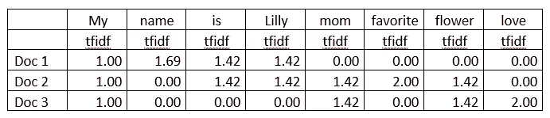
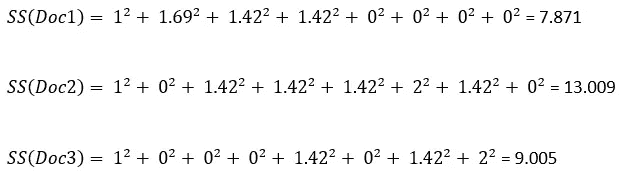
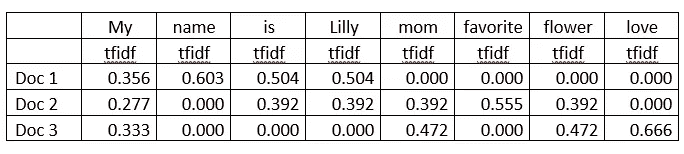
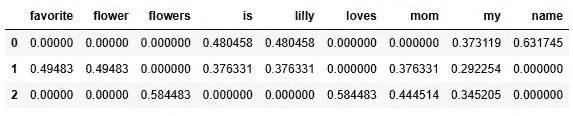

# 将文本转换为数值形式的 TFIDF 向量化器：逐步指南

> 原文：[`towardsdatascience.com/converting-texts-to-numeric-form-with-tfidfvectorizer-a-step-by-step-guide-bb9330562ae3`](https://towardsdatascience.com/converting-texts-to-numeric-form-with-tfidfvectorizer-a-step-by-step-guide-bb9330562ae3)


图片由 [Mohamed Nohassi](https://unsplash.com/@coopery?utm_source=medium&utm_medium=referral) 提供，来源于 [Unsplash](https://unsplash.com/?utm_source=medium&utm_medium=referral)

## 如何手动计算 Tfidf 值及使用 sklearn

[](https://rashida00.medium.com/?source=post_page-----bb9330562ae3--------------------------------)[](https://towardsdatascience.com/?source=post_page-----bb9330562ae3--------------------------------) [Rashida Nasrin Sucky](https://rashida00.medium.com/?source=post_page-----bb9330562ae3--------------------------------)

·发表于 [Towards Data Science](https://towardsdatascience.com/?source=post_page-----bb9330562ae3--------------------------------) ·阅读时间 6 分钟 ·2023 年 10 月 25 日

--

TFIDF 是一种将文本转换为数值形式以用于机器学习或人工智能模型的方法。换句话说，TFIDF 是一种从文本中提取特征的方法。这比我在上一篇文章中讨论的 CountVectorizer() 方法更为复杂。

TFIDF 方法为每个词提供一个分数，表示该词的有用性或相关性。它衡量了词语的使用情况，与文档中其他词汇相比。

本文将手动计算 TFIDF 分数，以便您清楚地了解 TFIDF 的概念。在最后，我们还将查看如何使用 sklearn 库中的 TFIDF 向量化器。

这包括两个部分：TF 和 IDF。让我们看看每个部分是如何工作的。

> **TF**

TF 解释为“词频”。TF 可以计算为：

TF = 单词在文档中的出现次数

或者

TF = （文档中出现的次数）/ （文档中的词数）

让我们做一个例子。我们将找到该文档中每个词的 TF：

> **我的名字是莉莉**

让我们分别看一下每个公式的例子。

> TF = 单词在文档中的出现次数

如果我们取第一个公式，即文档中单词出现的次数，则“MY”的 TF 是 1，因为它只出现了一次。

以相同的方式，词语的 TF

‘name’ = 1，‘is’ = 1，‘Lilly’ = 1

现在，让我们使用第二个公式。

> TF = （文档中出现的次数）/ （文档中的词数）

如果我们使用第二个公式，公式的第一部分（文档中的出现次数）是 1，第二部分（文档中的单词数量）是 4。

因此，单词‘MY’的 TF 为 1/4 或 0.25。

同样，单词的 TF 为

name = ¼ = 0.25，is = ¼ = 0.25，Lilly = ¼ = 0.25。

> **IDF**

IDF 的详细解释是逆文档频率。

这是公式，

idf = 1 + LN[n/df(t)]

或

idf = LN[n/df(t)]

其中，n = 可用的文档数量，以及

df = 术语出现的文档数量

> 根据 sklearn 库的文档

idf = LN[(1+n) / (1+df(t))] + 1（默认设置）

或

idf = LN[n / df(t)] + 1（当 smooth_idf = True 时）

我们不会处理所有四个公式。我们只讨论两个公式。你将会明白的。

为了演示 IDF，单个文档是不够的。我将使用这三个文档：

> 我的名字是 Lilly
> 
> Lilly 是我妈妈最喜欢的花
> 
> 我妈妈喜欢花

这次我们使用这个公式进行练习：

> IDF = LN[n/df(t)]

如果我们先考虑‘My’，n 是 3，因为这里有 3 个文档，而 df(t)也是 3，因为‘My’出现在所有三个文档中。

IDF(MY) = LN(3/3) = 0（因为 ln(1)是 0）

我们将再处理一个单词以便清楚理解。以‘name’为例。

对于单词‘name’，n 将和之前相同，因为文档数量是 3，但 df(t)将是 1。因为单词‘name’只出现在一个文档中。

IDF(name) = ln(3/1) = 1.1（我使用了 Excel 的 LN 函数）

> **sklearn 库如何计算 TFIDF？**

sklearn 库使用这两个公式来计算 TF 和 IDF：

TF = 单词在文档中的出现次数

idf = LN[(1+n) / (1+df(t))] + 1

如果我使用相同的三个文档，单词‘MY’的计算如下：

TF(My) = 1

IDF(My) = LN((1+3)/(1+3)) + 1 = 1

> TFIDF 的公式是：

TFIDF = TF * IDF

因此，‘My’的 TFIDF 为：

TFIDF(My) = 1 * 1 = 1

对于单词‘name’：

TF(name) = 1

IDF(name) = LN((1+3)/(1+1)) + 1 = 1.69

TFIDF(name) = 1 * 1.69 = 1.69

同样，所有单词的 TFIDF 如下：



作者图片

sklearn 的 tfidf 向量化器将值归一化到 0 到 1 的范围。为此，我们需要每个文档的 tfidf 的平方和：



归一化的 tfidf 是：

单词的 tfidf 值/文档的平方和

如果我们考虑单词 My。文档-1 中‘My’的归一化 tfidf 是：

tfidf_normalized(My) = 1.00 / 7.871 = 0.356

单词‘mom’在文档-3 中的 tfidf 是：

tfidf_normalized(name) = 1.42 / 9.005 = 0.472

再次，单词‘mom’在文档-2 中的 tfidf 是：

tfidf_normalized(name) = 1.42 / 13.009 = 0.392

> 看起来‘mom’这个词在文档 2 中的相关性比在文档 3 中高一些

所有单词的归一化 tfidf 如下：



作者图片

现在，我们应该检查[sklearn 库中的 tfidf 向量化器](https://scikit-learn.org/stable/modules/generated/sklearn.feature_extraction.text.TfidfVectorizer.html)的工作方式。

首先，从 sklearn 库中导入 Tfidf 向量化器，并定义用于特征提取的文本：

```py
from sklearn.feature_extraction.text import TfidfVectorizer 
text = ["My name is Lilly",
       "Lilly is my mom’s favorite flower",
       "My mom loves flowers"]
```

在下一个代码块中，

第一行调用 TfidfVectorizer 方法，并将其保存到名为 vectorizer 的变量中。

第二行将文本转换为向量化器

第三行将其转换为数组以进行显示

```py
vectorizer = TfidfVectorizer()
X = vectorizer.fit_transform(text)
X.toarray()
```

输出：

```py
array([[0\.        , 0\.        , 0\.        , 0.4804584 , 0.4804584 ,
        0\.        , 0\.        , 0.37311881, 0.63174505],
       [0.49482971, 0.49482971, 0\.        , 0.37633075, 0.37633075,
        0\.        , 0.37633075, 0.2922544 , 0\.        ],
       [0\.        , 0\.        , 0.5844829 , 0\.        , 0\.        ,
        0.5844829 , 0.44451431, 0.34520502, 0\.        ]])
```

将此数组转换为 DataFrame 并使用单词作为列名将会很有帮助。

```py
import pandas as pd 
pd.DataFrame(X.toarray(), columns = vectorizer.get_feature_names())
```



作者图片

你可以使用我在关于 CountVectorizer 的教程中解释的相同参数来细化或限制特征数量。请随时检查。

## 结论

本教程详细解释了 Tfidf Vectorizer 的工作原理。尽管使用 sklearn 库中的 Tfidf Vectorizer 非常简单，但理解其背后的概念也很重要。当你了解一个向量化器是如何工作的时，就更容易决定哪种向量化器是合适的。

随时在[Twitter](https://twitter.com/rashida048)上关注我，并点赞我的[Facebook](https://www.facebook.com/rashida.smith.161)页面。

**本教程的视频版本：**

## 更多阅读

[## Keras 和 Tensorflow 中的完整步骤教程](https://a-complete-step-by-step-tutorial-on-sentiment-analysis-in-keras-and-tensorflow-ea420cc8913f?source=post_page-----bb9330562ae3--------------------------------)

### 数据准备、深度学习模型开发和网络训练的完整工作代码

[## Python 中的完整探索性数据分析](https://pub.towardsai.net/a-complete-exploratory-data-analysis-in-python-a2148daac072?source=post_page-----bb9330562ae3--------------------------------)

### 数据清理、分析、可视化、特征选择、预测建模

[## 30 个非常有用的 Pandas 函数用于日常数据分析任务](https://pub.towardsai.net/a-complete-exploratory-data-analysis-in-python-a2148daac072?source=post_page-----bb9330562ae3--------------------------------)

### Pandas 备忘单

towardsdatascience.com](/30-very-useful-pandas-functions-for-everyday-data-analysis-tasks-f1eae16409af?source=post_page-----bb9330562ae3--------------------------------) [](/how-to-define-custom-layer-activation-function-and-loss-function-in-tensorflow-bdd7e78eb67?source=post_page-----bb9330562ae3--------------------------------) ## 如何在 TensorFlow 中定义自定义层、激活函数和损失函数

### 逐步解释和包含完整代码的示例

towardsdatascience.com [](/morphological-operations-for-image-preprocessing-in-opencv-in-detail-15fccd1e5745?source=post_page-----bb9330562ae3--------------------------------) ## OpenCV 中用于图像预处理的形态学操作详解

### 腐蚀、膨胀、开运算、闭运算、形态学梯度、顶帽/白帽和黑帽，配有示例进行解释

towardsdatascience.com [](/anomaly-detection-in-tensorflow-and-keras-using-the-autoencoder-method-5600aca29c50?source=post_page-----bb9330562ae3--------------------------------) ## 使用自编码器方法进行 TensorFlow 和 Keras 中的异常检测

### 一种前沿的无监督方法，用于噪声去除、降维、异常检测等

towardsdatascience.com
