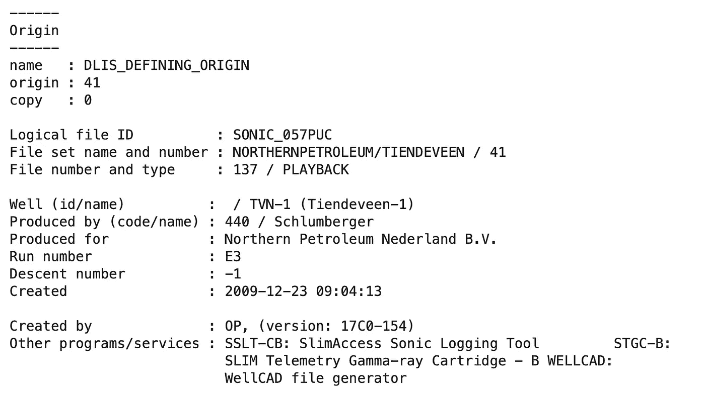
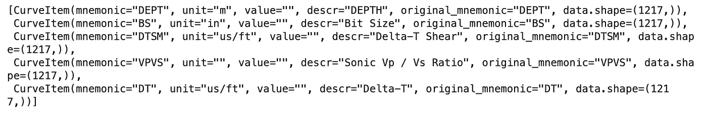
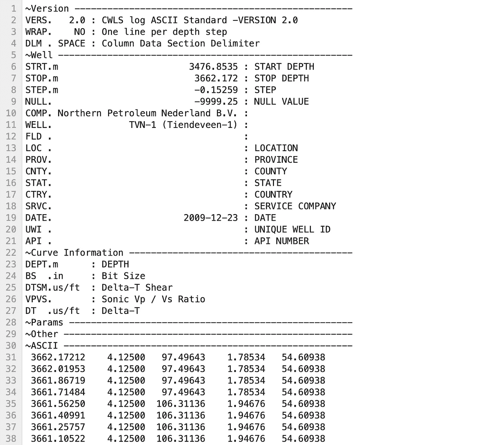
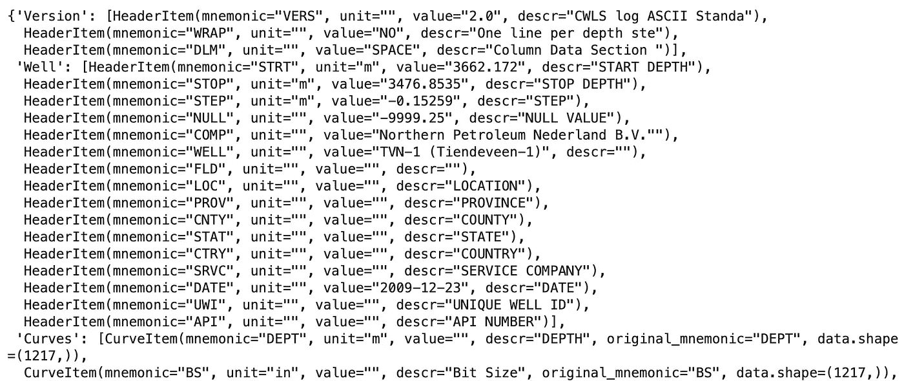

# 将井测数据从 DLIS 文件转换为 LAS 文件格式

> 原文：[`towardsdatascience.com/converting-well-logging-data-from-dlis-files-to-las-file-format-ccc1e7eee9b0`](https://towardsdatascience.com/converting-well-logging-data-from-dlis-files-to-las-file-format-ccc1e7eee9b0)

## 与地球科学和岩石物理数据文件格式的工作

[](https://andymcdonaldgeo.medium.com/?source=post_page-----ccc1e7eee9b0--------------------------------)[](https://towardsdatascience.com/?source=post_page-----ccc1e7eee9b0--------------------------------) [Andy McDonald](https://andymcdonaldgeo.medium.com/?source=post_page-----ccc1e7eee9b0--------------------------------)

·发布于[Towards Data Science](https://towardsdatascience.com/?source=post_page-----ccc1e7eee9b0--------------------------------) ·8 分钟阅读·2023 年 7 月 25 日

--


图片由[Mika Baumeister](https://unsplash.com/pt-br/@mbaumi?utm_source=medium&utm_medium=referral)提供，发布在[Unsplash](https://unsplash.com/?utm_source=medium&utm_medium=referral)上。

在石油和天然气行业的地球科学领域中，使用了多种格式来存储[井测数据](https://en.wikipedia.org/wiki/Well_logging)和[岩石物理](https://en.wikipedia.org/wiki/Petrophysics)数据。最常见的两种格式是 LAS 文件和 DLIS 文件。

[LAS](https://en.wikipedia.org/wiki/Log_ASCII_standard)文件是平面的 ASCII 文件，可以使用任何文本编辑器轻松读取，而 DLIS 文件是结构化的二进制文件，包含有关记录环境以及记录数据的表格。DLIS 文件更难处理，不能轻易在文本编辑器中打开，这可能会妨碍理解其中的内容。

幸运的是，已经开发出几个优秀的 Python 库，使得访问 LAS 和 DLIS 文件中的数据变得更加容易。

[lasio](https://github.com/kinverarity1/lasio)是一个旨在轻松读取和处理 LAS 文件的库，即使这些文件由于格式不正确或其他错误而存在问题。

[dlsio](https://github.com/equinor/dlisio)是由 Equinor ASA 开发的一个 Python 库，用于读取 DLIS 文件和日志信息标准 79（LIS79）文件。该库旨在减少探索这些文件的负担和努力，而无需详细了解 DLIS 结构。

使用这两个库，我们将探讨如何从 DLIS 文件中提取数据并导出到 LAS 文件。这将使我们能够创建一种更易于处理的文件格式，并且文件大小更小，因为它将包含我们需要的相关数据。

如果你想查看其他关于如何处理这些文件格式的文章，以下内容可能会引起你的兴趣：

+   使用 Python 加载多个井日志 LAS 文件

+   使用 Python 将 CSV 文件转换为 LAS 文件

+   [使用 Python 探索 DLIS 文件的内容](https://medium.com/towards-data-science/exploring-the-contents-of-dlis-files-with-python-38585157dbac)

+   使用 Python 从 DLIS 加载井日志数据

# 导入库并加载数据

对于本教程，我们需要两个主要的库。DLISIO，它允许我们读取和处理 DLIS 文件的内容，以及 LASIO，它允许我们处理 LAS 文件。

```py
from dlisio import dlis
import lasio
```

导入库后，我们接下来需要读取 DLIS 文件。这可以通过以下语法完成。

```py
f, *tail = dlis.load('Data/NLOG Data/NPN_TVN-1_23_Dec_2009_E3_Main_SONIC_057PUC.DLIS')
```

由于 DLIS 文件可能包含多个逻辑文件（代表不同的测井过程或不同的处理级别），我们需要将这些逻辑文件分隔到两个变量中： `f` 和 `*tail`。如果有多个逻辑文件，第一个将被放入 `f` 变量中，其余的将放入 `*tail` 变量中。

我们可以应用类似的逻辑从选定的逻辑文件中提取来源信息。由于该文件包含一个单一的来源，我们可以在 `origin` 变量上调用 `describe` 方法。

```py
origin, *origin_tail = f.origins
origin.describe()
```

当我们运行上述代码时，我们会得到以下总结，详细描述了该数据集的来源。我们将在构建 LAS 文件时使用这些信息。



DLIS 逻辑文件来源的总结。图片由作者提供。

# 创建 LAS 文件

在我们开始提取数据之前，我们首先需要创建一个空的 LAS 文件对象。可以这样完成：

```py
las_file = lasio.LASFile()
```

文件创建后，我们可以通过以下方式确认其为空。

```py
las_file.curves
```

这将返回一个空列表（ `[]` ），这是我们在此阶段所需的。

为了使事情变得更简单，我们可以将 DLIS 文件中的一些关键信息提取到变量中。在这个示例中，我们将提取井名、油田名和操作公司。

如果我们希望使这段代码可重复使用，这是一种方法，可以避免每次都手动提供这些信息。

```py
well_name = origin.well_name
field_name = origin.field_name
operator = origin.company
```

现在我们已经将关键信息以变量形式存储，我们可以开始填充我们的 LAS 文件头。通过从 LAS 文件中访问关键属性，并将 `HeaderItem` 设置为新值来完成这项工作。

你会注意到我们手动添加了一个日期，因为这个属性似乎没有被 DLISIO 曝露。

```py
las_file.well['WELL'] = lasio.HeaderItem('WELL', value=well_name)
las_file.well['FLD'] = lasio.HeaderItem('FLD', value=field_name)
las_file.well['COMP'] = lasio.HeaderItem('COMP', value=operator)
las_file.well['DATE'] = '2009-12-23'
```

# 从 DLIS 中提取数据并写入 LAS 格式

由于 DLIS 文件可能包含大量的日志曲线和数组，我们可能需要考虑提取一小部分数据。这可以防止我们在预期的用例中被过多无关的曲线所困扰。

在这个例子中，我们将提取以下曲线。

请注意，我们需要提取“TDEP”曲线，这是我们的主要参考深度曲线。

```py
columns_to_extract = ['TDEP', 'BS', 'DT', 'DTSM', 'VPVS']
```

现在我们已经准备好 LAS 文件并从 DLIS 文件中提取了头数据，我们现在可以遍历 DLIS 中一个框架内的通道。

在这个例子中，我们将访问第一个框架中的内容。如果你想了解如何检查 DLIS 文件（特别是这个文件）的内容，你可以在下面的文章中找到相关信息。

[## 探索 DLIS 文件的内容与 Python](https://towardsdatascience.com/exploring-the-contents-of-dlis-files-with-python-38585157dbac?source=post_page-----ccc1e7eee9b0--------------------------------)

### 与 Pandas 和 dlisio 一起探索井日志数据

towardsdatascience.com

此外，以下代码假设所有曲线都有一个维度，即没有钻孔图像数组数据或声波波形。再次建议查看我之前的文章以获取处理方法之一。

```py
frame = f.frames[0]

for channel in frame.channels:
    # If the channel name is in the list of channels to extract
    if channel.name in columns_to_extract:
        curves = channel.curves()

        # If the channel name is 'TDEP', convert to 'DEPT' 
        if channel.name == 'TDEP':
            channel_name = 'DEPT'
            description = 'DEPTH'
            # If the units are 0.1 in then convert to metres
            if channel.units == '0.1 in':
                curves = curves * 0.00254
                unit = 'm'
            else:
                unit = channel.units
        else:
            description = channel.long_name
            channel_name = channel.name
            unit = channel.units

        # Add the data to the LAS file
        las_file.append_curve(
            channel_name,
            curves,
            unit=unit,
            descr=description
        )
```

正如上面的代码所示，我们基本上遍历了所选框架内的所有可用通道（曲线），并检查它们的名称是否与我们尝试选择的名称匹配。

如果我们在列表中遇到一个曲线，我们首先检查它是否是 TDEP（深度）曲线；如果是，我们需要进行一些小调整。这包括将名称更改为 DEPT，并检查单位是否为 0.1 英寸。如果是，我们需要将深度单位转换为米。

一旦我们检查了是否有深度曲线，所有其他曲线将使用它们存储的信息提取出来。

在检查完曲线后，我们可以将其附加到 LAS 文件对象中，并传入相关信息。

一旦创建了 LAS 对象，我们可以使用以下调用来检查我们的曲线信息是否已被传递。

```py
las_file.curves
```

这将返回一个包含每个曲线信息的列表。我们可以看到名称、单位和描述都已成功添加，并且根据数据的形状，我们可以假设数据值也已被传递。



从 DLIS 文件中提取出来的 LASIO LAS 文件曲线信息。图片由作者提供。

现在我们已经设置好了头信息和曲线数据，我们可以开始使用以下命令写出我们的 LAS 文件。

```py
las_file.write('output.las')
```

如果写入时没有产生错误，我们可以在我们喜欢的文本编辑器中打开 LAS 文件。当我们这样做时，应该能看到以下文件。



使用 LASIO 写入文件后，在文本编辑器中查看的导出 LAS 文件。图片由作者提供。

你会注意到我们在头部部分仍然缺少信息。这可以直接在文本编辑器中编辑，或者你可以使用额外的代码来确保这些参数像我们处理日期时那样被写出。

你还会注意到深度范围被反转了，这在某些 LAS 文件中是正常的。你最喜欢的岩石物理软件包应该能轻松读取它。

如果我们想进一步确认文件是否已正确创建，我们可以使用`lasio.read()`函数将其加载回笔记本中。

```py
new_las = lasio.read('output.las')
new_las.header
```

当我们查看 LAS 文件的头部部分时，会得到以下输出，这确认了数据已被正确读取。



将 LAS 文件加载回 Jupyter 后，LASIO 的头部摘要。图片由作者提供。

# 摘要

本教程展示了如何轻松将存储在 DLIS 文件中的数据转换为更可读的 LAS 文件格式。这是使用两个非常流行的 Python 库：DLISIO 和 LASIO 实现的。

此处展示的过程主要适用于单维日志曲线。任何数组数据或高分辨率数据需要以不同的方式评估。

# 本教程中使用的数据

NLOG.nl 的数据可以免费下载和使用。数据许可的完整详情可以在[**这里**](https://www.nlog.nl/en/disclaimer)找到，但知识产权部分提供了使用的摘要：

> *NLOG.NL 不对通过本网站提供的信息（域名、商标权、专利及其他知识产权除外）声明任何权利。用户可以在未经 NLOG.NL 事先书面许可或有权方合法同意的情况下，以任何方式复制、下载、披露、分发或简化本网站提供的信息。用户还可以复制、重复、处理或编辑信息和/或布局，前提是注明 NLOG.NL 为来源。*

*感谢阅读。在你离开之前，你应该一定要订阅我的内容，并将我的文章发送到你的收件箱中。* [***你可以在这里完成订阅！***](https://andymcdonaldgeo.medium.com/subscribe)

*其次，你可以通过注册会员，获得完整的 Medium 体验，并支持其他数千名作者和我。只需每月$5，你就可以全面访问所有精彩的 Medium 文章，并有机会通过你的写作赚取收入。*

*如果你通过* [***我的链接***](https://andymcdonaldgeo.medium.com/membership)***注册，*** *你将直接支持我，并且不会额外增加你的费用。如果你这样做，非常感谢你的支持。*
