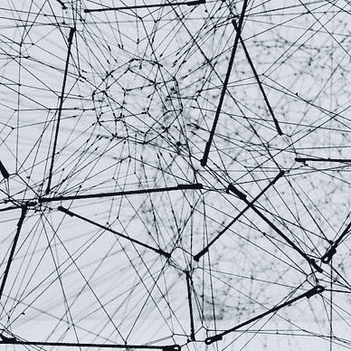
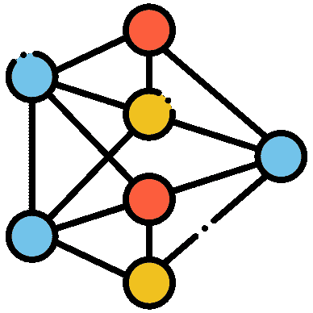

# 卷积解释 — 卷积神经网络简介

> 原文：[`towardsdatascience.com/convolution-explained-introduction-to-convolutional-neural-networks-5babc47fbcaa?source=collection_archive---------1-----------------------#2023-12-27`](https://towardsdatascience.com/convolution-explained-introduction-to-convolutional-neural-networks-5babc47fbcaa?source=collection_archive---------1-----------------------#2023-12-27)

## CNN 的基本构建块

 [Egor Howell](https://medium.com/@egorhowell?source=post_page-----5babc47fbcaa--------------------------------)

·

[关注](https://medium.com/m/signin?actionUrl=https%3A%2F%2Fmedium.com%2F_%2Fsubscribe%2Fuser%2F1cac491223b2&operation=register&redirect=https%3A%2F%2Ftowardsdatascience.com%2Fconvolution-explained-introduction-to-convolutional-neural-networks-5babc47fbcaa&user=Egor+Howell&userId=1cac491223b2&source=post_page-1cac491223b2----5babc47fbcaa---------------------post_header-----------) 发表在 [Towards Data Science](https://towardsdatascience.com/?source=post_page-----5babc47fbcaa--------------------------------) · 8 分钟阅读 · 2023 年 12 月 27 日 

--

”[`www.flaticon.com/free-icons/neural-network`](https://www.flaticon.com/free-icons/neural-network)" title=”神经网络图标。” 神经网络图标由 Freepik — Flaticon 创建。

我最近的文章是一系列关于神经网络的内容，从简单的[***感知机***](https://medium.com/gitconnected/intro-perceptron-architecture-neural-networks-101-2a487062810c)到复杂的架构以及如何处理[***深度学习中的常见问题***](https://medium.com/towards-data-science/vanishing-exploding-gradient-problem-neural-networks-101-c8f48ec6a80b)。如果你感兴趣，可以在这里查看该系列：

[Egor Howell](https://medium.com/@egorhowell?source=post_page-----5babc47fbcaa--------------------------------)

## 神经网络

[查看列表](https://medium.com/@egorhowell/list/neural-networks-616db722dbbb?source=post_page-----5babc47fbcaa--------------------------------)9 个故事！

神经网络在一个令人兴奋的领域取得了重大进展，即[***计算机视觉***](https://en.wikipedia.org/wiki/Computer_vision)。想象一下用于自动驾驶汽车和面部识别的人工智能！

然而，大多数人了解的常规全连接神经网络不适合许多实际图像识别任务。它在著名的[***MNIST***](https://en.wikipedia.org/wiki/MNIST_database#:~:text=Article%20Talk,the%20field%20of%20machine%20learning.)数据集上工作良好，但该数据集的图像小到***28×28***像素。

高清（HD）图像有***1280×720***像素。这大约是***1,000,000***像素，这意味着输入层有***1,000,000 个神经元***。更不用说隐藏层所需的数百万个权重，使得常规神经网络因维度复杂性而不适用。
