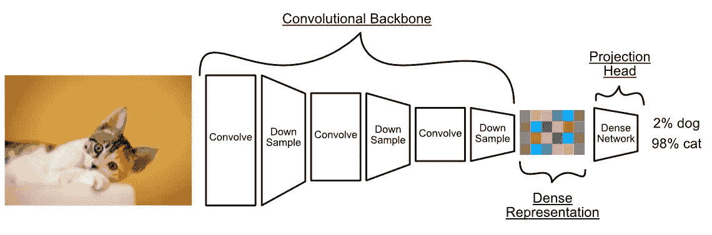
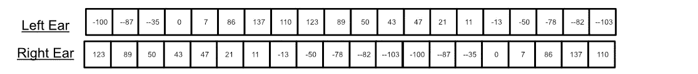

# 卷积网络 — 直观且详尽的解释

> 原文：[`towardsdatascience.com/convolutional-networks-intuitively-and-exhaustively-explained-ab08f6353f96`](https://towardsdatascience.com/convolutional-networks-intuitively-and-exhaustively-explained-ab08f6353f96)

## 解构一个基石建模策略

[](https://medium.com/@danielwarfield1?source=post_page-----ab08f6353f96--------------------------------)[](https://towardsdatascience.com/?source=post_page-----ab08f6353f96--------------------------------) [丹尼尔·沃菲尔德](https://medium.com/@danielwarfield1?source=post_page-----ab08f6353f96--------------------------------)

·发表于 [Towards Data Science](https://towardsdatascience.com/?source=post_page-----ab08f6353f96--------------------------------) ·阅读时间 11 分钟·2023 年 10 月 26 日

--


“卷积”由作者使用 MidJourney 完成。除非另有说明，所有图片均由作者提供。

卷积神经网络是计算机视觉、信号处理和大量其他机器学习任务中的主要方法。它们相对简单，因此许多人往往对它们视而不见，*真正*不了解它们。在本文中，我们将直观且详尽地讨论卷积网络的理论，并探讨它们在几个使用案例中的应用。

**这对谁有用？** 对计算机视觉、信号分析或机器学习感兴趣的任何人。

**这篇文章的难度如何？** 这是一个非常强大的但又非常简单的概念；非常适合初学者。对于经验丰富的数据科学家，这也可能是一个很好的复习，特别是在考虑不同维度的卷积时。

**前提条件：** 对反向传播和全连接神经网络有一定的了解可能会有所帮助，但不是必须的。我在这篇文章中涵盖了这两个内容：

[](/what-are-gradients-and-why-do-they-explode-add23264d24b?source=post_page-----ab08f6353f96--------------------------------) ## 什么是梯度，它们为何会爆炸？

### 通过阅读这篇文章，你将对深度学习中最重要的概念有一个扎实的理解

towardsdatascience.com

# 卷积网络存在的原因

许多初学的数据科学家首先探索的主题是全连接神经网络。这是一种经典的神经网络，由具有一定可学习参数的节点和边组成。这些参数使得模型能够学习关于其训练主题的微妙关系。


一个概念图，展示了一个密集网络如何接受一些输入并预测输出。它通过逐步学习已知示例（即之前超级碗团队的成功与失败）来学习必要的参数以在任务中表现良好。

随着网络中神经元数量的增加，层与层之间的连接变得越来越丰富。这可以实现复杂的推理，这很好，但密集网络的“密集性”在处理图像时会带来问题。

假设我们想训练一个密集神经网络来预测图像中是否包含狗。我们可能会创建一个密集网络来观察图像的每一个像素，然后将这些信息归纳为最终输出。


连接图像到密集网络的概念图。

我们已经遇到了一个大问题。略过一些数学细节，针对这个小网络，我们需要 1,544 个可学习参数。对于更大的图像，我们需要更大的网络。假设我们在第一层有 64 个神经元，我们想学习对 256x256 像素的图像进行分类。仅第一层就有 8,388,608 个参数。对于一个相对较小的图像，这确实有很多参数。

神经网络的另一个问题是对图像中微小变化的敏感性。假设我们制作了两种表示狗图像的方式；一种是狗在图像的顶部，另一种是狗在底部。


一个神经网络观察两个相似图像上相同的像素。

尽管这些图像对人眼来说非常相似，但从神经网络的角度来看，它们的值却大相径庭。神经网络不仅需要逻辑上定义什么是狗，还需要使这种对狗的逻辑定义对图像中的各种变化具有鲁棒性。这可能是可行的，但这意味着我们需要向网络输入大量的训练数据，并且由于密集网络具有如此多的参数，每一步训练都将花费很长时间来计算。

因此，密集网络不适合处理图像；它们太庞大且对微小变化过于敏感。在接下来的部分中，我们将深入探讨卷积网络如何解决这些问题，首先定义什么是卷积，然后描述神经网络中如何进行卷积操作。

# 卷积简明介绍

卷积网络的核心是“卷积”操作。 “卷积”是将一个“卷积核”作用于某个“目标”以进行“过滤”的过程。这些词可能你不太熟悉，我们来详细解释一下。我们将使用图像中的边缘检测作为示例。

从卷积的角度来看，卷积核是一个小的数字数组。


内核的示例。这个特定的内核用于边缘检测。

这个内核可以用于将输入图像转换成另一幅图像。使用标准操作将输入转换为输出的过程通常称为“过滤”（想想 Instagram 滤镜用于修改图像）。


内核被用于过滤输入图像，生成一幅突出原始图像边缘的图像。通常，输入图像有时被称为“目标”图像，而输出图像有时被称为“过滤”图像。 [来源](https://en.wikipedia.org/wiki/Kernel_(image_processing))

实际的过滤操作是通过“卷积”完成的。内核，比输入图像要小得多，被放置在图像中的每一个可能的位置。然后，在特定位置，内核的值与输入图像的值相乘，结果被加总在一起，以定义输出图像的值。


“卷积”内核到目标图像上。3x3 内核被应用到目标图像的每个 3x3 区域。内核的值与对应位置的像素值相乘，然后将所有值加在一起，以构建输出图像中的一个像素。

在机器学习中，卷积最常用于图像，但它们在其他领域也能很好地工作。你可以对一维信号进行小波卷积，也可以对三维空间进行三维张量卷积。卷积可以在任意维度上进行。


1D 卷积的示例（左），以及 3D 卷积的示例（右）。这两种情况的功能类似于 2D 卷积；内核（用蓝色表示）在所有可能的位置上滑动（红色示例），重叠的值被相乘，然后结果被加总，以构建单一的输出值。

在本文的大部分内容中，我们将保持在二维，但重要的是要记住卷积的一般方面；它们可以用于计算机视觉以外的许多问题类型。

现在我们知道了什么是卷积以及它是如何工作的。在下一节中，我们将探讨如何利用这一理念来构建模型。

# 卷积神经网络概述

卷积网络的整个理念是通过卷积和降采样的组合，逐步将图像分解成更小、更有意义的表示。通常，这种分解后的图像表示会传递给一个密集网络，以生成最终的推断结果。



典型卷积神经网络的高层架构。实际的卷积通常存在于“主干”部分的卷积和下采样中。一旦输入被浓缩为一个富有意义的表示（也称为瓶颈），下一步通常是一个密集网络，通常被称为“头”或“投影头”，它生成所需的最终响应。我在另一篇关于[自监督学习中投影头的重要性](https://medium.com/towards-data-science/self-supervised-learning-using-projection-heads-b77af3911d33)的文章中对这些概念进行了更深入的讨论。

类似于全连接神经网络通过学习连接之间的权重来提高任务性能，卷积神经网络在卷积层内学习卷积核的值，以提高任务性能。


回想一下卷积核如何在图像上滑动，将其转换为不同的表示。卷积网络逐步调整卷积核的值，以生成经过滤的图像，这样在最终建模任务中表现得更好。

在卷积网络中有许多下采样的方法，但最常见的方法是最大池化。最大池化类似于卷积，即一个窗口在整个输入上滑动。与卷积不同的是，最大池化只保留窗口中的最大值，而不是窗口的某种组合。


这是一个应用最大池化于图像的示例，它将图像从 6x9 下采样到 2x3。如果你想知道为什么这些方块没有重叠，而卷积却有，那是因为“步幅”，我们将在后面的部分中讨论这个问题。

因此，通过卷积和最大池化层，图像被逐步过滤和下采样。通过每一层，图像变得越来越抽象，尺寸也越来越小，直到它包含图像的抽象和浓缩表示。

很多人在理论层面上会停留在这里。然而，卷积神经网络还有一些更关键的概念，通常被忽视。特别是，特征维度以及卷积如何与之相关。

[⚠️](https://emojipedia.org/warning) **癫痫** **警告：以下部分包含快速移动的动画**[⚠️](https://emojipedia.org/warning)

# **特征维度**

你可能已经注意到，在之前的一些示例中，我们使用了灰度图像。实际上，图像通常有三个颜色通道：红色、绿色和蓝色。换句话说，图像有两个空间维度（宽度和高度）和一个特征维度（颜色）。

特征维度的这个概念对于深入理解卷积神经网络至关重要，因此我们来看看一些示例：

**示例 1) RGB 图像**

因为图像包含两个空间维度（高度和宽度）和一个特征维度（颜色），所以图像可以被概念化为三维。


左侧是图像，中间是构成图像的三个通道，右侧是我们将输入模型的数据形状。

通常，卷积网络沿所有空间维度移动其核，**但不沿特征维度**。对于像图像这样的二维输入，通常使用一个 3D 核，它具有与特征维度相同的深度，但宽度和高度较小。然后，这个核在所有空间维度上滑动。


图像卷积的概念动画。一个 3D 核应用于整个特征维度，并在两个空间维度上滑动。这是二维卷积，因为实际遍历发生在两个维度上。注意：特征维度也通常称为“通道”。

通常，与其进行一次卷积，进行多次卷积，每次使用不同的核，会更有优势。这使得卷积网络能够创建图像的多种表示。每个卷积都使用自己的可学习核，这些表示沿特征轴连接在一起。


应用于输入图像的三个核的概念图。这些核中的每一个都创建自己的特征层。每个核中的所有值都是可学习的参数。

正如你可能已经推测的，你可以有任意数量的核，从而创建任意深度的特征维度。许多卷积神经网络在模型的不同点使用不同数量的特征。


原始 YOLO 模型的架构，这是图像处理中的一个标志性卷积模型。注意图中的框是三维的，这些框代表了模型中各个点的高度、宽度和特征数量。不要过多担心这张图的文字，我们稍后会重新审视这个图。 [来源](https://arxiv.org/pdf/1506.02640.pdf)

最大池化通常只考虑单个特征层。本质上，我们只是对每个单独的特征层进行最大池化。


应用于三个特征的最大池化的概念图。注意，最大池化通常在卷积之后应用，而不是之前。

这些是二维 RGB 图像上的两个主要操作：卷积和最大池化。

**示例 2) 立体声音频**

虽然像音频这样的时间序列信号通常被认为是一维的，但实际上它们通常是二维的，一个维度表示时间，另一个维度表示该时间点的多个值。例如，立体声有两个独立的频道，一个用于左耳，一个用于右耳。


来自一段立体小号音乐的左右声波，在时间域中。X 轴对应于时间（以秒为单位），y 轴对应于信号的幅度，控制扬声器振膜的位置，从而产生声音。参考我关于[频域](https://medium.com/towards-data-science/use-frequency-more-frequently-14715714de38)的文章。

这可以被概念化为一个具有一个空间维度（时间）和一个特征维度（哪个耳朵）的信号。



我们的立体声音频数据可以被概念化为二维的；一个时间维度和一个特征维度。

对这些数据应用卷积和最大池化与图像非常相似，只是我们只对一个维度进行迭代。


一维卷积的概念图。在这个示例中，我们对输入应用了三个简单的卷积核。请记住，这些卷积核是可学习的，它们的值在模型训练过程中会发生变化。

最大池化也类似于之前讨论的图像方法。我们将特征维度的每一行分开处理，应用一个移动窗口，并保留该窗口中的最大值。


最大池化的示例。每个特征被划分为区域，并保留这些区域内的最大值。

**示例 3) MRI/CT 扫描**

根据应用的不同，扫描数据可以被概念化为三维或二维。


人头部的 MRI 逐切片动画。通常，这种类型的数据被视为三维问题。图像[来源](https://commons.wikimedia.org/wiki/File:Parasagittal_MRI_of_human_head_in_patient_with_benign_familial_macrocephaly_prior_to_brain_injury_(ANIMATED).gif)


[维苏威火山墨水检测挑战](https://www.kaggle.com/competitions/vesuvius-challenge-ink-detection)的 CT 扫描示例，这是一项涉及阅读庞贝城碳化卷轴的挑战，无需通过解卷的方式破坏这些卷轴。该数据是一个具有深度的二维对象。有时，这种类型的数据被称为“2.5D”，因为它有两个主要的空间维度和一个可以被概念化为特征维度的次要空间维度。[source](https://arxiv.org/pdf/2304.02084.pdf)

纸张上的示例可以视为一个具有特征维度表示深度的二维空间数据问题。它实际上是三维的，纸张有一定的厚度，这在 CT 扫描中被记录下来，但深度维度足够小，可以视为一个特征维度。这就像我们的图像示例，只不过每个物理数据层有一个层而不是每种颜色都有一个层。

对于完全三维的人头扫描来说，将其视为一个平面物体可能没有用处，更应当视为一个完整的三维物体，我们可以使用三维卷积和最大池化。这在概念上与之前的方法相同，但绘制起来要困难得多。我们将对所有三个空间维度进行卷积，具体的输出维度取决于我们使用的内核数量，最终得到一个四维输出。


在给定的三维数据集中使用两个卷积内核的示例，每个内核产生一个三维输出。最终输出将是四维的。

从技术上讲，卷积网络的维度没有限制。你可以在五维、六维甚至一千维中进行卷积。我认为三维已经足够复杂了，绝大多数卷积模型实际上工作在二维数据上，因此我们将在这里结束示例探索。

到这时你可能会有一些基本问题，比如“内核是否总是必须有特定大小”或者“内核是否总是必须重叠？”我们将在下一个问题中讨论这些问题。

# 内核大小、步幅和填充

虽然我们之前考虑了所有的内核都为三的大小，但卷积内核的大小没有限制。这种可配置的大小通常称为**内核大小**。


在二维任务中，尺寸为二、三和四的内核

我还将所有卷积理想化为每次只移动一个点，但卷积可以步进较大的量，这被称为**步幅**。最大池化也有一个步幅参数，通常是最大池化窗口的大小。这就是为什么我将最大池化描绘为不重叠的原因。


步幅长度为一（左）、二（中）、三（右）的概念图，所有这些图都是针对尺寸为二的内核。

有时将卷积的输出大小与卷积的输入大小相等是有利的，但由于内核通常大于一，因此卷积的任何结果必然会小于输入。因此，我们可以用一些默认值甚至是输入的反射来“填充”图像的边界，以获得类似大小的输出。这个过程被称为**填充**。

# 非线性激活函数

使神经网络能够学习复杂任务的一部分原因是非线性。如果我们不使用激活函数，那么卷积最终只能创建线性关系（加法和乘法的组合）。如果我们在混合中添加一些激活函数，将某些输入非线性地映射到输出，我们可以让我们的卷积网络学习更复杂的关系。在卷积网络中最常用的激活函数是 ReLu。

通常，激活函数在卷积之后和最大池化之前应用，因此是这样的：

```py
output = maxPool(relu(conv2d(input))
```

不过，尽管差别不大，将 maxPool 和激活函数交换的位置稍微提高了性能，但这不会影响最终输出。

```py
output = relu(maxPool(conv2d(input))
```

无论如何，在模型中添加非线性激活函数会大大提高模型学习复杂任务的能力。

# 展平和全连接网络

卷积网络擅长将数据拆解到其本质，但全连接网络在进行逻辑推理方面更出色。在数据通过卷积网络之后，数据通常会被“展平”然后传递给全连接网络。


展平如何与更广泛的卷积建模范式相关的概念图。全连接网络通常期望数据列表，而卷积模型通常有多个维度。卷积网络的输出通常会被“展平”成列表，然后传递给全连接网络，这一操作称为展平。

我在以下文章中有关于全连接网络作为“投影头”的更多信息：

[## 自监督学习使用投影头](https://example.org/self-supervised-learning-using-projection-heads-b77af3911d33?source=post_page-----ab08f6353f96--------------------------------)

### 利用未标记的数据提升性能。

[towardsdatascience.com](https://example.org/self-supervised-learning-using-projection-heads-b77af3911d33?source=post_page-----ab08f6353f96--------------------------------)

# 结论

就这样！我不会说我们讨论了卷积网络的每一种可能方法或理论（那将是一篇相当长的文章），但我们覆盖了理解几乎所有存在的方法所需的理论。你应该知道为什么卷积网络在某些应用中优于全连接网络，什么是卷积核，什么是卷积，什么是最大池化。你应该理解特征维度及其在各种 1D、2D 和 3D 用例中的应用。你还应该理解关键参数，如卷积核大小、填充和步幅。


看一下 YOLO 图，考虑卷积核大小、步幅、特征/卷积核数量、展平和全连接网络如何与图相关联。[来源](https://arxiv.org/pdf/1506.02640.pdf)

# 关注获取更多信息！

我描述机器学习领域的论文和概念，重点在于实用和直观的解释。

[](https://medium.com/@danielwarfield1/subscribe?source=post_page-----ab08f6353f96--------------------------------) [## 每当**丹尼尔·沃菲尔德**发布文章时，获取邮件通知

### 高质量的数据科学文章直送到你的邮箱。每当**丹尼尔·沃菲尔德**发布文章时，你都会收到邮件。通过注册，你可以…

medium.com](https://medium.com/@danielwarfield1/subscribe?source=post_page-----ab08f6353f96--------------------------------)

**归属声明：** 本文档中的所有资源均由**丹尼尔·沃菲尔德**创建，除非另有来源提供。你可以将本文中的任何资源用于自己的非商业用途，只要你引用了本文或[`danielwarfield.dev`](https://danielwarfield.dev/)，或两者兼有。应要求可提供明确的商业许可。
