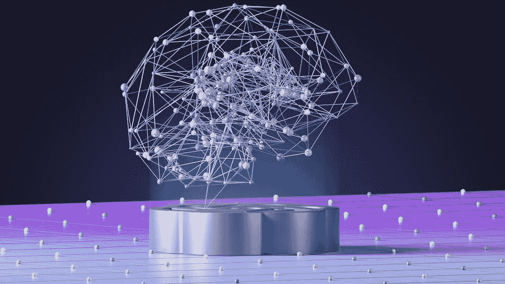
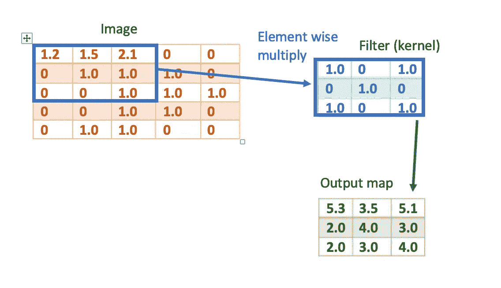
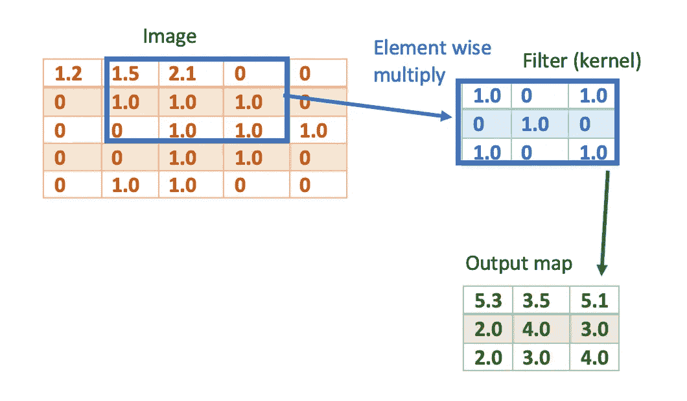
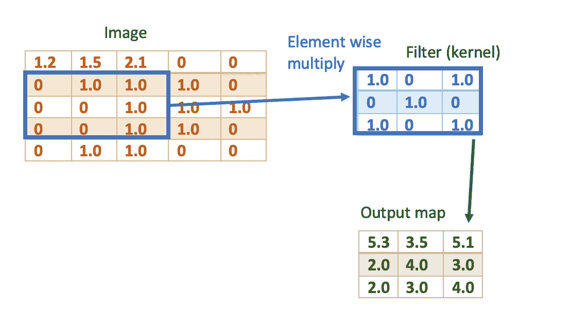
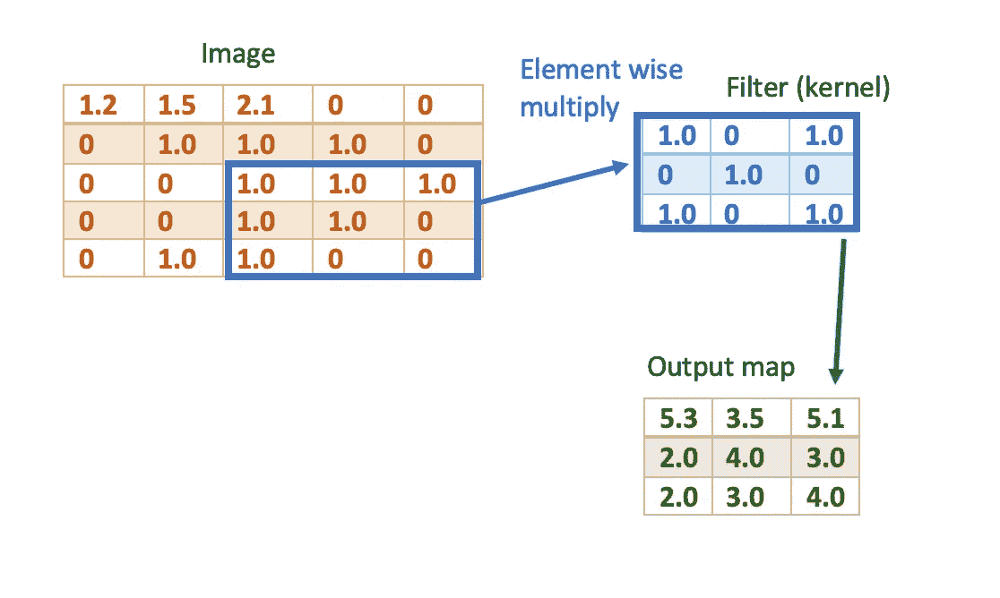
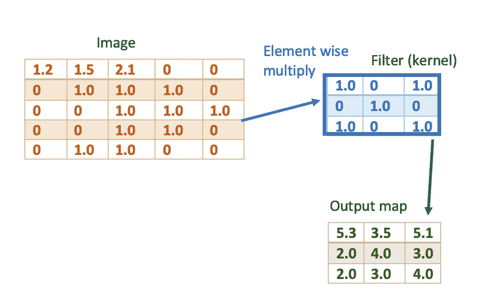
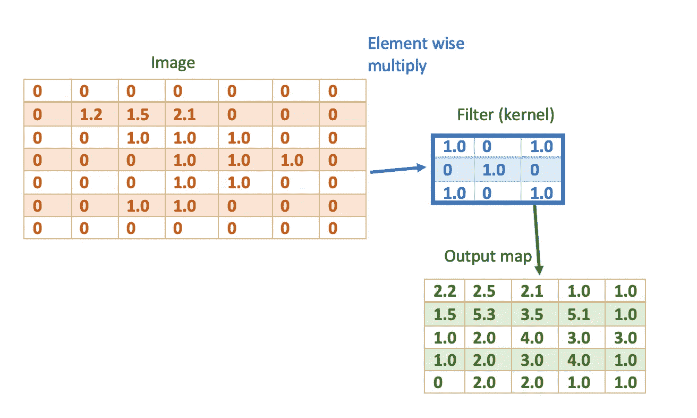
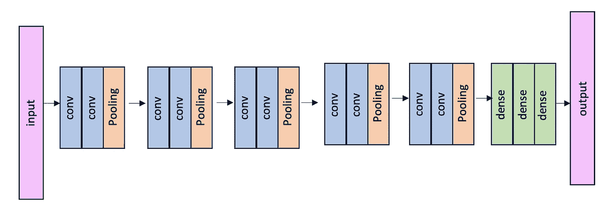

# 卷积神经网络入门

> 原文：[`towardsdatascience.com/convolutional-neural-networks-for-beginners-c1de55eee2b2`](https://towardsdatascience.com/convolutional-neural-networks-for-beginners-c1de55eee2b2)

## 卷积神经网络的基础知识

 [Mina Ghashami](https://medium.com/@mina.ghashami?source=post_page-----c1de55eee2b2--------------------------------)

·发布在 [Towards Data Science](https://towardsdatascience.com/?source=post_page-----c1de55eee2b2--------------------------------) ·6 分钟阅读·2023 年 10 月 17 日

--

图片来自 [unsplash.com](https://unsplash.com/photos/an-abstract-image-of-a-sphere-with-dots-and-lines-nGoCBxiaRO0)

我写这篇文章是作为我在[*Interview Kickstart*](https://www.interviewkickstart.com/)讲授的一个讲座的准备工作之一，目的是帮助专业人士进入顶级科技公司。如果你正在准备面试或者只是打基础，这篇文章也许对你有帮助。

在这篇文章中，我们将深入探讨卷积神经网络及其基本原理。我们将从卷积操作是什么开始，然后继续了解卷积层是什么以及卷积网络是如何构建的。

让我们开始吧。

卷积神经网络（CNNs）由多个“卷积层”组成。这些层执行“卷积操作”。卷积是信号和图像处理中的一个基本操作。让我们首先了解一下这个操作是什么。

## 什么是卷积操作？

卷积是内核（滤波器）与输入特征图之间的数学操作。

内核通常是一个小矩阵，例如 3x3 或 5x5。输入始终是具有高度、宽度和通道的特征图。卷积操作的工作原理是*内核在输入上滑动*，*计算内核与输入的局部区域之间的点积*。这种点积乘法和求和会在输出特征图中产生一个值。

当滤波器在所有位置滑动时，它会生成一个称为*输出特征图*的 2D 激活图。对于滤波器（卷积核）在图像或输入特征图上的每一次滑动，我们计算逐元素的点积并将它们加在一起。这就产生了输出图中的一个值：

卷积操作 — 作者图片

接下来，我们将滤波器向右滑动到输入图的另一个局部区域，它会生成输出图中的另一个条目：

卷积操作 — 图片由作者提供

我们将其全部向右滑动，直到无法继续向右滑动，然后回到最左侧，并向下滑动一个条目：

卷积操作 — 图片由作者提供

对于这个示例，最后一个卷积操作会在右下角的最远点进行：

卷积操作 — 图片由作者提供

现在，让我们看看卷积层，它是卷积神经网络 (CNN) 的关键构建块。

## 什么是卷积层？

> 卷积层像其他层一样，由多个神经元组成。卷积层中的每个神经元都有一组权重定义其滤波器（卷积核）。该滤波器与输入（或前一层的输出）进行卷积，以生成一个二维激活图。

在前向传播过程中，卷积层中一个神经元的输入是一个具有 [高度, 宽度, 通道] 维度的 3D 体积。该层中的每个神经元都有一组权重定义其卷积核（滤波器）。

这个滤波器具有小的空间范围（例如 3x3），但在输入深度上完全扩展。这意味着它与输入进行卷积（逐元素相乘和求和），并在深度上完全扩展，生成一个二维激活图作为输出。每个神经元的输出维度是 [高度, 宽度, 1]。

如果我们将一个卷积层中所有神经元的输出图堆叠在一起，那么我们将得到一个维度为 [高度, 宽度, 通道] 的输出；其中通道是层中神经元的数量。通道是结果的深度。

现在，让我们看看这个层的参数和超参数：

**参数：** 层的参数是卷积核的权重，这些权重最初是随机初始化的，但在训练过程中会被学习和优化。

**超参数：** 层的超参数如下：

+   1) 层中的神经元数量

+   2) 滤波器大小（例如 2x2, 3x3）；通常，层中的所有神经元具有相同大小的滤波器

+   *3) 步幅：* 即每次移动滤波器的步数，可以是向右或向下。

+   *3) 零填充：*零填充是指将卷积层的输入在其边界周围填充零的技术。这有助于在整个网络中保持空间分辨率；否则，随着深度的增加，空间信息可能会很快丢失。零填充主要有两种类型：

+   *3–1) 相同填充* — 填充使输出大小与输入大小匹配。需要填充 *(kernel_size — 1) / 2*。

+   *3–2) 有效填充* — 不使用填充。输出会缩小 *kernel_size — 1*。

所以如果我们使用一个 3x3 的内核，我们将对输入的每个维度进行 1 像素的零填充。请参见下面的示例，其中输入图像为 5x5，内核为 3x3。没有零填充的情况下，输出激活图为 3x3。正如我们所见，空间维度没有被保留。

无填充 — 图片来源：作者

但如果我们进行零填充，我们可以保留输入图像的空间维度。如下所示，输出激活图为 5x5。

使用零填充 — 图片来源：作者

## 卷积神经网络是什么？

> 卷积神经网络（CNN）是一种由多个卷积层、池化层和全连接层组成的神经网络。它通常用于处理网格状拓扑，例如图像。

如上所述，**卷积层**对输入进行卷积操作，使用一组可学习的滤波器。它们一起构建特征图层次结构。

**池化层**（最大池化或平均池化）对特征图进行下采样，以减少计算量。

**全连接层**通常是 CNN 中的最后几层，它们将所有神经元连接在一起并执行分类任务。

这里我们看到一个 CNN 的图像：

图片来源：作者

这篇文章的主题到此结束。在接下来的文章中，我们将查看一些著名的 CNN 模型架构，用于图像分类任务。

# 关键要点

1.  一些术语：每个*通道*也称为特征图。*内核*也称为滤波器。*感受野*是指神经元在输入图像中查看和提取特征的区域。

1.  卷积层中的所有神经元具有相同的内核（滤波器）大小。这一点很重要，以便我们可以将所有输出激活图叠加在一起。

1.  CNN 可以轻松扩展到大图像，因为卷积滤波器仅在局部应用。

1.  卷积层中的神经元数量与滤波器或内核的数量相同。它们定义了输出特征图中的通道数。

1.  卷积层中的神经元具有独立的内核；它们不共享权重。

# 总结

卷积神经网络（CNN）是网格处理神经网络，由卷积层、池化层和全连接层组成。卷积层中的每个神经元对应一个滤波器（内核）。在前向传播过程中，每个滤波器与输入体进行卷积，生成该滤波器的 2D 激活图。多个滤波器产生多个激活图，这些激活图在深度维度上堆叠。然后，池化层（最大池化或平均池化）将其下采样到较小的尺寸。在神经网络的最后，有一个或多个全连接层来帮助进行图像分类任务。

如果你有任何问题或建议，请随时联系我：

电子邮件：mina.ghashami@gmail.com

LinkedIn: [`www.linkedin.com/in/minaghashami/`](https://www.linkedin.com/in/minaghashami/)
