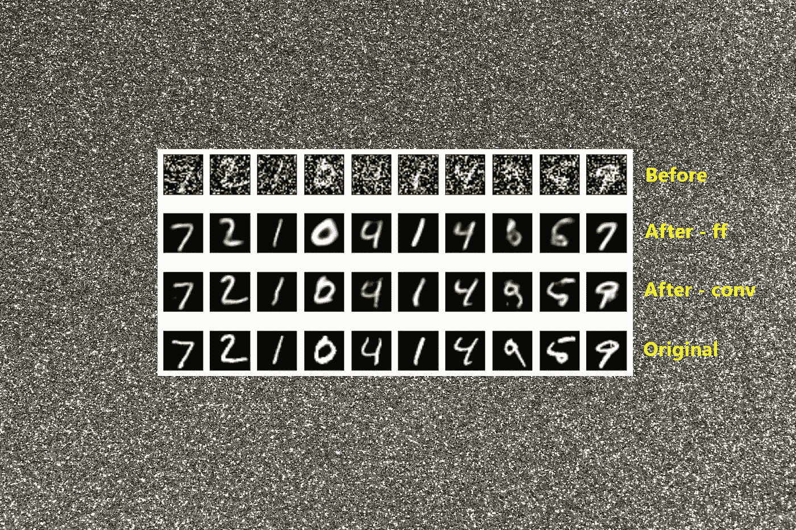
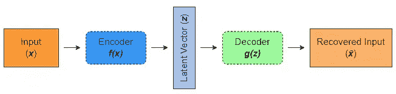
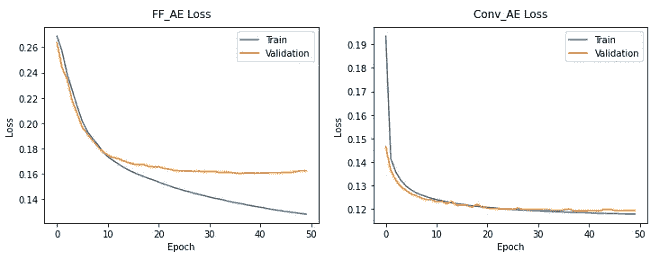
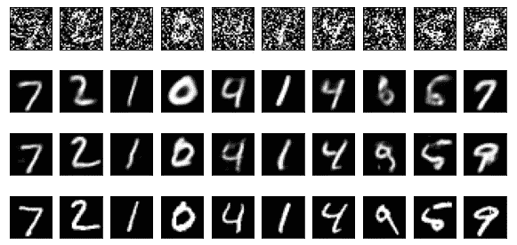

# 卷积自编码器与前馈自编码器在图像去噪中的比较

> 原文：[`towardsdatascience.com/convolutional-vs-feedforward-autoencoders-for-image-denoising-2fe2e9aed71d`](https://towardsdatascience.com/convolutional-vs-feedforward-autoencoders-for-image-denoising-2fe2e9aed71d)

## Kaveti 自编码器的应用

## 使用卷积和前馈自编码器清理损坏的图像

[](https://rukshanpramoditha.medium.com/?source=post_page-----2fe2e9aed71d--------------------------------)[](https://towardsdatascience.com/?source=post_page-----2fe2e9aed71d--------------------------------) [Rukshan Pramoditha](https://rukshanpramoditha.medium.com/?source=post_page-----2fe2e9aed71d--------------------------------)

·发表于[Towards Data Science](https://towardsdatascience.com/?source=post_page-----2fe2e9aed71d--------------------------------) ·阅读时间 9 分钟·2023 年 1 月 24 日

--



图片由[皮埃尔·巴敏](https://unsplash.com/@bamin?utm_source=unsplash&utm_medium=referral&utm_content=creditCopyText)提供，来自[Unsplash](https://unsplash.com/photos/_EzTds6Fo44?utm_source=unsplash&utm_medium=referral&utm_content=creditCopyText)（作者稍作修改）

*你想了解卷积自编码器如何在图像去噪中优于前馈自编码器吗？*

如果‘*是*’，请继续阅读这篇文章。

# 不同类型的自编码器

自编码器有许多实际应用。图像去噪就是其中之一。

图像去噪指的是从损坏的图像中去除噪声，以获得干净的图像。

用于图像去噪的自编码器特别被称为**去噪自编码器**。

我们已经在以下文章中涵盖了自编码器的基础知识。

```py
**Prerequisites
-------------**
01\. [An Introduction to Autoencoders in Deep Learning](https://rukshanpramoditha.medium.com/an-introduction-to-autoencoders-in-deep-learning-ab5a5861f81e)
02\. Autoecnoder Latent Representation and Hidden Layers
03\. [Autoecnoder Latent Representation and Latent Vector Dimension](https://rukshanpramoditha.medium.com/how-the-dimension-of-autoencoder-latent-vector-affects-the-quality-of-latent-representation-c98c38fbe3c3)
04\. Dimensionality Reduction with Autoencoders
05\. Creating Shallow and Deep Autoencoders in Keras

**Optional
--------**
06\. Convolutional Neural Network (CNN) Architecture
07\. Coding a Convolutional Neural Network (CNN)
08\. [Acquire, Understand and Prepare the MNIST Dataset](https://rukshanpramoditha.medium.com/acquire-understand-and-prepare-the-mnist-dataset-3d71a84e07e7)
09\. [Keras Sequential API and Functional API](https://rukshanpramoditha.medium.com/two-different-ways-to-build-keras-models-sequential-api-and-functional-api-868e64594820)
10\. [Plotting the Learning Curve](https://rukshanpramoditha.medium.com/plotting-the-learning-curve-to-analyze-the-training-performance-of-a-neural-network-4a35818d01f2)
11\. Image representation in deep learning
```

简单回顾一下，自编码器是一种神经网络架构，包含三个关键元素：**编码器**、**解码器**和**潜在向量**。

这些关键元素之间的关系如下图所示。



**自编码器的结构**（图片作者提供）

编码器（函数***f***) 接收输入***x*** 并将其转换为潜在向量***z***。解码器（函数***g***) 接收***z*** 作为输入，并从潜在向量中恢复输入***x***。恢复的输入大致与***x*** 相同，因此表示为***x̄***。

潜在向量可以具有与输入相同或更高的维度（在**超完备自编码器**的情况下），也可以具有远低于输入的维度（在**欠完备自编码器**的情况下）。

然而，对于图像去噪应用，潜在向量应该比输入的维度更低。

复杂的自编码器有许多隐藏层。它们被称为**深层（多层）自编码器**。相比之下，具有单一隐藏层的自编码器称为**浅层（原始）自编码器**。

我们在实际应用中总是使用深层自编码器，包括图像去噪，因为浅层自编码器无法有效捕捉数据中的重要关系。

自编码器可以使用密集层和卷积层来创建。

当自编码器的编码器和解码器部分仅由密集（全连接或 MLP）层组成时，这种自编码器被称为**前馈自编码器**。

当自编码器的编码器部分由卷积层（下采样层）组成，解码器部分由转置卷积层（上采样层）组成时，这种自编码器被称为**卷积自编码器**。

在这里，我们将比较这两种类型的输出。

# 自编码器如何从受损图像中去除噪声

在使用自编码器的图像生成应用中，我们通常将自编码器模型训练为：

```py
autoencoder.fit(train_images, train_images)
```

这就像告诉模型“使用训练数据学习关系，以生成几乎与原始图像相同的新图像”。然后，我们可以调用`autoencoder.predict(test_images)`来使用模型生成新图像。

在使用自编码器的图像去噪应用中，我们通常将自编码器模型训练为：

```py
autoencoder.fit(train_images_noisy, train_images)
```

这就像告诉模型“使用有噪声（受损）的训练数据学习关系，以去除相同领域图像中的噪声”。然后，我们可以调用`autoencoder.predict(test_images)`来去噪相同领域的新受损图像。

有噪声（受损）的数据是通过向原始数据中添加一些随机（随机）噪声来创建的。噪声遵循以 0 为均值、标准差为 0.7 的高斯（正态）分布。

```py
import numpy as np

noise = np.random.normal(loc=0.0, scale=0.7, size=train_images.shape)
train_images_noisy = train_images + noise
```

> 当我们训练去噪自编码器时，编码器部分保留了最重要的信息，去除训练数据中的任何不必要的噪声，并创建该数据的低维潜在（压缩）表示。然后，解码器部分从该压缩表示中恢复干净的图像。训练好的模型可以用于清理相同领域的新受损图像 — 作者

# 建立模型：卷积和前馈自编码器

## 我们使用的数据集

我们将使用**MNIST 数据集**（见文末的引用）来构建这两个自编码器模型。这个数据集已经预加载到 tf.keras 中。

要学习如何获取和准备 MNIST 数据集以用于深度学习应用，请阅读我的文章，[*获取、理解和准备 MNIST 数据集*](https://rukshanpramoditha.medium.com/acquire-understand-and-prepare-the-mnist-dataset-3d71a84e07e7)。

## 方法

我们将使用 MNIST 数据构建一个卷积自编码器和一个前馈自编码器，并比较这两个模型的输出。在训练过程中，为了比较目的，这两个模型具有相同的损失函数、优化器、批量大小和轮数。

然而，这两种架构有显著差异，因为前馈自编码器具有密集层，而卷积自编码器具有卷积层和反卷积层。

## 训练模型并进行预测

运行以下代码后，你将获得训练好的自编码器模型及其训练历史记录，同时也会得到在新数据上的预测结果。

```py
import numpy as np
import tensorflow as tf
import matplotlib.pyplot as plt
from tensorflow.keras import Model, Input
from tensorflow.keras.datasets import mnist
from tensorflow.keras.layers import Dense, Conv2D, MaxPooling2D, Conv2DTranspose

# Load the MNIST dataset
(train_images, _), (test_images, _) = mnist.load_data()

###########################
# Feedforward Autoencoder #
###########################

# Reshape data for the dense layer input
train_images = np.reshape(train_images, (-1, 784))
test_images = np.reshape(test_images, (-1, 784))

# Scale the data
train_images = train_images.astype('float32') / 255
test_images = test_images.astype('float32') / 255

# Add Gaussian noise to the data
noise = np.random.normal(loc=0.0, scale=0.7, size=train_images.shape)
train_images_noisy = train_images + noise

noise = np.random.normal(loc=0.0, scale=0.7, size=test_images.shape)
test_images_noisy = test_images + noise

# Clip the noisy data by 0 and 1:
# This is because adding noise may push the normalized pixel values 
# into invalid values of less than 0 or greater than 1
# So, we need to clip pixel values greater than 1 to 1.0 and
# less than 0 to 0.0
train_images_noisy = np.clip(train_images_noisy, 0., 1.)
test_images_noisy = np.clip(test_images_noisy, 0., 1.)

latent_vec_dim = 16
input_dim = 784

# Define the input layer
input_layer = Input(shape=(input_dim,))

# Define the feedforward (ff) autoencoder architecture
# First build the encoder with dense layers
x = Dense(500, activation='sigmoid')(input_layer)
x = Dense(300, activation='sigmoid')(x)
x = Dense(100, activation='sigmoid')(x)
encoder = Dense(latent_vec_dim, activation='tanh')(x)

# Then build the decoder with dense layers
x = Dense(100, activation='sigmoid')(encoder)
x = Dense(300, activation='sigmoid')(x)
x = Dense(500, activation='sigmoid')(x)
decoder = Dense(input_dim, activation='sigmoid')(x)

# Connect both encoder and decoder
ff_autoencoder = Model(input_layer, decoder, name="ff_autoencoder")

# Compile the model
ff_autoencoder.compile(loss='binary_crossentropy', optimizer='adam')

# Train the model
history_ff = ff_autoencoder.fit(train_images_noisy, train_images, epochs=50, 
                                batch_size=128, shuffle=True,
                                validation_data=(test_images_noisy, test_images))

# Denoise new images (prediction)
ff_autoencoder_denoised_images = ff_autoencoder.predict(test_images_noisy)

# Clear the history of the previous model
# Otherwise, you’ll run out of memory or 
# will get abnormal results due to clutter from old models and layers.
tf.keras.backend.clear_session()

# Load the MNIST dataset again
(train_images, _), (test_images, _) = mnist.load_data()

#############################
# Convolutional Autoencoder #
#############################

# Reshape data for the convolutional layer input
train_images = np.reshape(train_images, (len(train_images), 28, 28, 1))
test_images = np.reshape(test_images, (len(test_images), 28, 28, 1))

# Scale the data
train_images = train_images.astype('float32') / 255
test_images = test_images.astype('float32') / 255

# Add Gaussian noise to the data
noise = np.random.normal(loc=0.0, scale=0.7, size=train_images.shape)
train_images_noisy = train_images + noise

noise = np.random.normal(loc=0.0, scale=0.7, size=test_images.shape)
test_images_noisy = test_images + noise

# Clip the noisy data by 0 and 1 as before
train_images_noisy = np.clip(train_images_noisy, 0., 1.)
test_images_noisy = np.clip(test_images_noisy, 0., 1.)

# Define the input layer
input_layer = Input(shape=(28, 28, 1))

# Define the convolutional (conv) autoencoder architecture
# First build the encoder with convolutional layers
x = Conv2D(64, (3, 3), activation="relu", padding="same")(input_layer)
x = MaxPooling2D((2, 2), padding='same')(x)

x = Conv2D(64, (3, 3), activation="relu", padding="same")(x)
encoder = MaxPooling2D((2, 2), padding='same')(x)

# Then build the decoder with transposed convolutional layers
x = Conv2DTranspose(64, (3, 3), strides=2, activation="relu", padding="same")(encoder)
x = Conv2DTranspose(64, (3, 3), strides=2, activation="relu", padding="same")(x)
decoder = Conv2D(1, (3, 3), activation="sigmoid", padding="same")(x)

# Connect both encoder and decoder
conv_autoencoder = Model(input_layer, decoder, name="conv_autoencoder")

# Compile the model
conv_autoencoder.compile(loss='binary_crossentropy', optimizer='adam')

# Train the model
history_conv = conv_autoencoder.fit(train_images_noisy, train_images,
                                    epochs=50, batch_size=128, shuffle=True, 
                                    validation_data=(test_images_noisy, test_images))

# Denoise new images (prediction)
conv_autoencoder_denoised_images = conv_autoencoder.predict(test_images_noisy)
```

如果仅使用 CPU 运行此代码，将需要很长时间。为了加快速度，你可以使用[Colab 免费 GPU](https://rukshanpramoditha.medium.com/how-to-use-google-colab-free-gpu-to-run-deep-learning-code-incredibly-faster-760604d26c7e)或[自己笔记本上的 GPU](https://rukshanpramoditha.medium.com/setting-up-a-deep-learning-workplace-with-an-nvidia-graphics-card-gpu-for-windows-os-b6bff06eeec7)，如果有的话。

我不会逐行解释代码，因为我已经在之前的文章中讨论了所有这些内容。

## 绘制学习曲线

现在，我们可以绘制两个模型的学习曲线，以分析这两个网络的训练表现。为此，我们可以使用两个模型的*history*对象。

```py
# Plot training and validation loss scores
# against the number of epochs
fig, (ax1, ax2) = plt.subplots(1, 2, figsize=(12, 4))

ax1.plot(history_ff.history['loss'], label='Train')
ax1.plot(history_ff.history['val_loss'], label='Validation')
ax1.set_title('FF_AE Loss', pad=12)
ax1.set_xlabel('Epoch')
ax1.set_ylabel('Loss')
ax1.legend(loc='upper right')

ax2.plot(history_conv.history['loss'], label='Train')
ax2.plot(history_conv.history['val_loss'], label='Validation')
ax2.set_title('Conv_AE Loss', pad=12)
ax2.set_xlabel('Epoch')
ax2.set_ylabel('Loss')
ax2.legend(loc='upper right')

plt.savefig("Learning_Curves.png")
```



**学习曲线**（图片由作者提供）

+   **左图：** 显示了前馈自编码器的训练性能。模型在第 35 轮之后似乎*轻微*过拟合。

+   **右图：** 显示了卷积自编码器的训练性能。模型处于刚刚好的状态，即模型既没有欠拟合也没有过拟合。

## 可视化输出

现在，我们比较两个模型的输出。为了比较，我还将添加原始图像及其损坏（噪声）版本。

让我们来看一下输出结果。

```py
# Visualize image outputs
n = 10
plt.figure(figsize=(10, 5))

for i in range(n):
    # Display noisy images
    ax = plt.subplot(4, n, i + 1)
    plt.imshow(test_images_noisy[i].reshape(28, 28))
    plt.gray()
    ax.get_xaxis().set_visible(False)
    ax.get_yaxis().set_visible(False)

    # Display denoised images by feedforward autoencoder
    ax = plt.subplot(4, n, i + 1 + n)
    plt.imshow(ff_autoencoder_denoised_images[i].reshape(28, 28))
    plt.gray()
    ax.get_xaxis().set_visible(False)
    ax.get_yaxis().set_visible(False)

    # Display denoised images by convolutional autoencoder
    ax = plt.subplot(4, n, i + 1 + 2*n)
    plt.imshow(conv_autoencoder_denoised_images[i].reshape(28, 28))
    plt.gray()
    ax.get_xaxis().set_visible(False)
    ax.get_yaxis().set_visible(False)

    # Display original images for comparison purposes
    ax = plt.subplot(4, n, i + 1 + 3*n)
    plt.imshow(test_images[i].reshape(28, 28))
    plt.gray()
    ax.get_xaxis().set_visible(False)
    ax.get_yaxis().set_visible(False)

plt.savefig("Comparisons.png")
```



（图片由作者提供）

+   **第 1 行：** 代表在添加中心（均值）为 0，标准差为 0.7 的高斯噪声后损坏的图像。我们将这些图像输入到自编码器中，以获得干净的图像。

+   **第 2 行：** 代表由前馈自编码器清理（去噪/预测）后的图像。图像的内容可以被识别，并且与原始图像非常接近。

+   **第 3 行：** 代表由卷积自编码器清理（去噪/预测）后的图像。图像的内容可以很容易地识别，并且几乎与原始图像相同。原因是卷积层可以保持图像中相邻像素之间的空间结构。这在密集层中是不可能实现的。

+   **第 4 行：** 代表了为比较目的而添加的原始图像。

# 结论

> 卷积自编码器在图像去噪方面优于前馈自编码器，因为卷积自编码器中的卷积层可以保持图像中邻近像素之间的空间结构 — 作者

今天的文章到此结束。

**如有任何问题或反馈，请告诉我。**

## 如何进行人工智能课程？


（截图由作者提供）

## 支持我作为作者

*我希望你喜欢阅读这篇文章。如果你愿意支持我作为作者，请考虑* [***注册会员***](https://rukshanpramoditha.medium.com/membership) *以获得对 Medium 的无限制访问。每月仅需 $5，我将从你的会员费用中获得一部分。*

[](https://rukshanpramoditha.medium.com/membership?source=post_page-----2fe2e9aed71d--------------------------------) [## 使用我的推荐链接加入 Medium - Rukshan Pramoditha

### 阅读 Rukshan Pramoditha（以及 Medium 上成千上万其他作者）的每一篇故事。您的会员费用将直接...

rukshanpramoditha.medium.com](https://rukshanpramoditha.medium.com/membership?source=post_page-----2fe2e9aed71d--------------------------------)

## 加入我的私人邮件列表

*再也不会错过我精彩的故事了。通过* [***订阅我的邮件列表***](https://rukshanpramoditha.medium.com/subscribe)*，你将会在我发布故事时直接收到。*

非常感谢你的持续支持！下篇文章见。祝大家学习愉快！

## MNIST 数据集信息

+   **引用：** Deng, L., 2012. 用于机器学习研究的手写数字图像的 MNIST 数据库。**IEEE 信号处理杂志**, 29(6), 第 141–142 页。

+   **来源：** [`yann.lecun.com/exdb/mnist/`](http://yann.lecun.com/exdb/mnist/)

+   **许可：** *Yann LeCun*（纽约大学 Courant 研究所）和 *Corinna Cortes*（谷歌实验室，纽约）持有 MNIST 数据集的版权，该数据集在 *创意共享署名-相同方式共享 4.0 国际许可证* 下提供 ([**CC BY-SA**](https://creativecommons.org/licenses/by-sa/4.0/))。你可以在 [这里](https://rukshanpramoditha.medium.com/dataset-and-software-license-types-you-need-to-consider-d20965ca43dc#6ade) 了解更多关于不同数据集许可证类型的信息。

[Rukshan Pramoditha](https://medium.com/u/f90a3bb1d400?source=post_page-----2fe2e9aed71d--------------------------------)

**2023–01–24**
