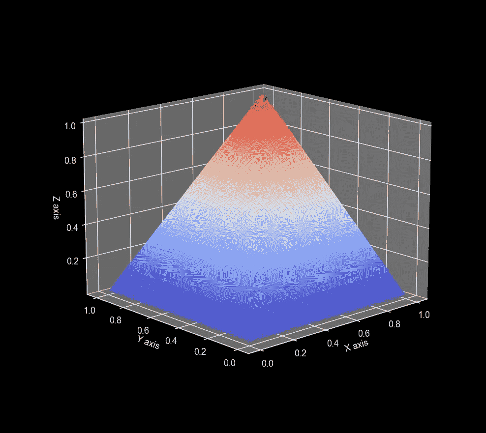

# Copulas: 一份**必备指南**及其在时间序列预测中的应用

> 原文：[`towardsdatascience.com/copulas-an-essential-guide-applications-in-time-series-forecasting-f5c93dcd6e99?source=collection_archive---------2-----------------------#2023-03-06`](https://towardsdatascience.com/copulas-an-essential-guide-applications-in-time-series-forecasting-f5c93dcd6e99?source=collection_archive---------2-----------------------#2023-03-06)

## 什么是**copula**函数，为什么我们需要它们

 [Nikos Kafritsas](https://medium.com/@nikoskafritsas?source=post_page-----f5c93dcd6e99--------------------------------)

·

[关注](https://medium.com/m/signin?actionUrl=https%3A%2F%2Fmedium.com%2F_%2Fsubscribe%2Fuser%2Fbec849d9e1d2&operation=register&redirect=https%3A%2F%2Ftowardsdatascience.com%2Fcopulas-an-essential-guide-applications-in-time-series-forecasting-f5c93dcd6e99&user=Nikos+Kafritsas&userId=bec849d9e1d2&source=post_page-bec849d9e1d2----f5c93dcd6e99---------------------post_header-----------) 发表在 [Towards Data Science](https://towardsdatascience.com/?source=post_page-----f5c93dcd6e99--------------------------------) · 14 分钟阅读 · 2023 年 3 月 6 日

--

一个 3D 高斯 Copula（作者提供的图片）

Copulas 是用于建模多个分布之间依赖关系的函数。

它们主要用于金融应用，如投资组合风险评估和对冲基金管理。它们在 2008 年引起了关注，当时发现量化科学家在计算中误用了 copulas，[未能预测重大事件。](http://samueldwatts.com/wp-content/uploads/2016/08/Watts-Gaussian-Copula_Financial_Crisis.pdf)

尽管如此，copulas 仍然是极好的数学工具。研究 copulas 的一个引人注目的原因是它们在 **时间序列预测** 模型中有着广泛的应用。

在过去的几年里，许多 **深度学习预测** 模型开始在其架构中融入统计学概念。这是好事，因为社区正在从传统的“*堆叠带有注意力机制的 Transformer 块*”方法转向使用 *优雅的统计技术*。

在这篇文章中，我们讨论：

+   一些统计学中的基础概念。

+   为什么 copulas（依赖函数）很有用。

+   如何在 Python 中创建高斯 copulas。

+   使用 copulas 进行时间序列预测的现代深度学习模型。
