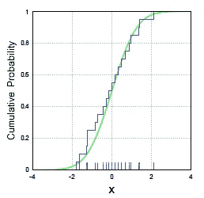
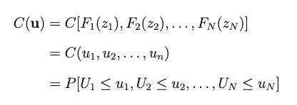

# Copulas：时间序列预测中的基本指南与应用

> 原文：[`towardsdatascience.com/copulas-an-essential-guide-applications-in-time-series-forecasting-f5c93dcd6e99`](https://towardsdatascience.com/copulas-an-essential-guide-applications-in-time-series-forecasting-f5c93dcd6e99)

## 什么是 copula 函数，我们为什么需要它们

[](https://medium.com/@nikoskafritsas?source=post_page-----f5c93dcd6e99--------------------------------)[](https://towardsdatascience.com/?source=post_page-----f5c93dcd6e99--------------------------------) [Nikos Kafritsas](https://medium.com/@nikoskafritsas?source=post_page-----f5c93dcd6e99--------------------------------)

·发表于[数据科学前沿](https://towardsdatascience.com/?source=post_page-----f5c93dcd6e99--------------------------------) ·阅读时间 14 分钟·2023 年 3 月 6 日

--


3D 高斯 copula（图由作者提供）

Copulas 是建模多个分布之间依赖关系的函数。

它们主要用于金融应用，如投资组合风险评估和对冲基金管理。它们在 2008 年声名鹊起，当时发现定量科学家在计算中误用 copulas，导致[未能预测重大事件](http://samueldwatts.com/wp-content/uploads/2016/08/Watts-Gaussian-Copula_Financial_Crisis.pdf)。

尽管如此，copulas 仍然是很棒的数学工具。研究 copulas 的一个有力理由是它们在**时间序列预测**模型中有着广泛的应用。

在过去几年里，许多**深度学习预测**模型开始将统计学概念融入其架构中。这是件好事，因为社区正在从传统的“*堆叠变换器块与注意力*”方法转向使用*优雅的统计技术*。

在这篇文章中，我们讨论：

+   一些统计学的入门概念。

+   为什么 copulas 有用。

+   如何在 Python 中创建高斯 copulas。

+   使用 copulas 进行时间序列预测的现代深度学习模型。

让我们深入了解。

> 我推出了[**AI Horizon Forecast**](https://aihorizonforecast.substack.com/)**，**这是一个专注于时间序列和创新 AI 研究的新闻通讯。订阅[这里](https://aihorizonforecast.substack.com/)以拓宽你的视野！

# 入门概念 — 可选

如果以下术语：

+   [概率积分变换](https://en.wikipedia.org/wiki/Probability_integral_transform)

+   [逆采样](https://en.wikipedia.org/wiki/Inverse_transform_sampling)

+   [经验累积分布函数](https://en.wikipedia.org/wiki/Empirical_distribution_function)

对你来说可能是未知的，我建议你也阅读这一部分。

Copulas 很容易理解，但如果你不熟悉上述概念，可能一开始会让你感到困惑。

**概率积分变换** 假设我们有一个连续随机变量 `X`**。

然后，`X` 的 **CDF** (*累积分布函数*)，称为 `F_x`，生成一个 **均匀** 随机变量 `U`。具体来说：


该技术表明我们可以将任何连续随机变量转换为均匀分布。稍后我们将通过可视化演示这些技术如何工作。

**反向采样** 你是否曾经想过像 R 语言中的 `rnorm()` 和 Python 中的 `np.random.randn()` 这样的分布生成函数是如何生成样本的？

他们使用采样技术，其中一种被称为 *反向采样*。有许多采样技术——一些比 *反向采样* 更复杂和更快速。

*反向采样* 只是 *概率积分变换* 定理的逆。给定我们之前生成的均匀样本，我们可以通过原始随机变量 `X` 的 **逆累积分布函数**，用符号 `F(x)^(-1)` 表示，来得到原始 `X` 分布。具体来说：


两种技术都使用 CDF：

+   **概率积分变换** 使用 **CDF** 将我们的样本从 `[a,b]`->`[0,1]` 转换，（其中 `[a,b]` 是函数的定义域）。

+   **反向采样** 使用 **逆 CDF** 将我们的均匀样本转换回函数的原始样本：`[0,1]`->`[a,b]`。

**图 1** 更清楚地展示了这两种技术的工作原理：


**图 1：** 红色线是 **概率积分变换**，蓝色线是 *反向采样*（图片由作者提供）

现在，我将通过 Python 中的几个图表演示这些技术是如何工作的。我们的计划如下：

1.  从 beta 分布 **B**~(10,3) 生成样本。

1.  使用 *概率积分变换* 从 beta 分布创建均匀样本。

1.  使用 *反向采样* 从 **第 2 步** 的均匀样本中重建原始 beta 样本(10,3)。

```py
import numpy as np
import matplotlib.pyplot as plt
import seaborn as sns
import pandas as pd
from scipy import stats
sns.set(rc={'figure.figsize':(8,3)})

# Step 1: Create a histogram from beta(10,3)
# we start by drawing 1000 samples
beta1 = stats.distributions.beta(a=10, b=3).rvs(1000)
ax = sns.histplot(beta1, kde=True, stat='density')
plt.xlabel("beta1", fontsize=14)
plt.ylabel("Density", fontsize=14)
plt.title("Histogram of beta(10,3)", fontsize=15)
plt.show()

# Step 2: Create a uniform distibution from beta(10,3)
# using the integral probability transform
u1 = stats.beta.cdf(beta1,a=10, b=3)
ax = sns.histplot(u1, stat='density')
plt.xlabel("u1", fontsize=14)
plt.ylabel("Density", fontsize=14)
plt.title("Histogram of uniform samples from beta(10,3) CDF", fontsize=15)
plt.show()

# Step 3: Use inverse sampling to generate beta(10,3) samples
# from the previous uniform samples
# notice that ppf is the inverse cumulative distribution function 
beta_transformed = stats.beta.ppf(u1,a=10, b=3)
ax = sns.histplot(beta_transformed, kde=True, stat='density')
plt.xlabel("beta1", fontsize=14)
plt.ylabel("Density", fontsize=14)
plt.title("Histogram of transformed beta(10,3)", fontsize=15)
plt.show()
```


**图 2：**（顶部）原始 beta 分布，（中间）beta 的 CDF 均匀样本，（底部）变换后的 beta 分布（图片由作者提供）

因此，我们回到了原始分布。你也可以尝试其他连续变量。

让我们尝试 gamma 分布。我们保持其他不变，只是将 beta 替换为 gamma：

```py
sns.set(rc={'figure.figsize':(8,3)})

# Step 1: Create a histogram from gamma
gamma1 = stats.distributions.gamma(a=1, loc=0).rvs(1000)
ax = sns.histplot(gamma1, kde=True, stat='density')
plt.xlabel("gamma1", fontsize=14)
plt.ylabel("Density", fontsize=14)
plt.title("Histogram of gamma", fontsize=15)
plt.show()

# Step 2: Create a uniform distibution from gamma
u1 = stats.gamma.cdf(gamma1, a=1, loc=0 )
ax = sns.histplot(u1, stat='density')
plt.xlabel("gamma1", fontsize=14)
plt.ylabel("Density", fontsize=14)
plt.title("Histogram of uniform samples from gamma CDF", fontsize=15)
plt.show()

# Step 3: Use inverse sampling to generate gamma samples
gamma_transformed = stats.gamma.ppf(u1,a=1, loc=0)
ax = sns.histplot(gamma_transformed, kde=True, stat='density')
plt.xlabel("gamma1", fontsize=14)
plt.ylabel("Density", fontsize=14)
plt.title("Histogram of transformed gamma", fontsize=15)
plt.show()
```


**图 3：**（顶部）原始 gamma 分布，（中间）gamma 的 CDF 均匀样本，（底部）变换后的 gamma 分布（图片由作者提供）

**注意事项：**

+   如果你使用更多的样本，图形将更好地逼近原始分布。

+   *逆采样*并不适用于所有分布——例如，因为它们的逆 CDF 未明确定义（如在二元分布中）。在这种情况下，我们使用其他采样方法，如[Metropolis-Hastings Monte Carlo](https://en.wikipedia.org/wiki/Metropolis%E2%80%93Hastings_algorithm)等。

如果你更喜欢**R**，这是一个使用伽马分布的示例：

```py
gamma1 <- rgamma(1e6, shape=1)
hist(gamma1, main='gamma distribution', cex.main=1.3, cex.lab=1.3, cex.axis=1.3, prob='true')

# pgamma is the cdf of gamma
u <- pgamma(gamma1, shape=1)
hist(u, main='Histogram of uniform samples from gamma CDF', cex.main=1.3, cex.lab=1.3, cex.axis=1.3, prob='true')

# qgamma is the inverted cdf of gamma
gamma_transformed <- qgamma(u, shape=1)
hist(gamma_transformed, main='Histogram of transformed gamma', cex.main=1.3, cex.lab=1.3, cex.axis=1.3,prob='true')
```


**图 4：**（左）原始伽马分布，（中）伽马分布累积分布函数的均匀样本，（右）变换后的伽马分布（图像作者提供）

再次，我们得到相同的结果。

## **经验分布函数**

通常，我们数据的原始分布是未知的。

或者，我们想建立一个不依赖于分布的模型，不对基础数据做假设。

在这种情况下，经验分布显得很有用。它是一种强大且简单的方法，提供了**非参数**的总体累积分布函数（CDF）估计。

因此，我们可以估计数据的 CDF，而不管其基础分布如何。它定义如下：

设`X_1`、`X_2`、…、`X_n`为来自具有 CDF `F(x)`的总体的样本，样本大小为`n`。那么**经验 CDF** `F_n(x)`定义为：


如果那个公式让你困惑，这里有一个更直观的解释：

+   从一个未知分布中取`N`个样本。

+   对这些样本进行排序，并将它们放在 x 轴上。

+   开始绘制一个‘阶梯函数’风格的线——每当你在 x 轴上遇到一个数据点时，将阶梯增加`1/N`。

为了清楚起见，这个过程记录在**图 5：**



**图 5：** 正态分布的累积分布函数（绿色）及其经验累积分布函数（蓝色）（来源：[1]）

你取的样本越多，经验分布就会越接近真实分布。[Kolmogorov-Smirnov 检验](https://en.wikipedia.org/wiki/Kolmogorov%E2%80%93Smirnov_test)正是这样做的。

具体来说，这个测试通过构建和比较样本的*经验 CDF*与假设的*CDF*来确定你的未知数据样本的分布。如果两个 CDF 接近，你的未知数据样本可能符合假设的分布。

接下来，在本文中，我们将略微不同地使用经验 CDF：从来自未知总体的数据中创建 copulas。

# Copulas

在介绍 copulas 的数学之前，我们首先讨论为什么我们需要它们。

# 我们为什么需要 copulas？

假设我们有一组随机变量。每个随机变量在集合中反映了不同的‘*实体*’，例如

+   一个投资组合中的证券。

+   一家商店产品的销售数字。

+   各家庭的电能消耗模式。

> **挑战 1：** 我们可以用什么数学概念来解释这些实体？

我们可以使用 **多变量分布** — 一种最优地描述我们数据的分布。

> **挑战 2：** 如果我告诉你这些实体 **不是** 相同分布的呢？

+   如果每个实体有不同的行为，我们 **不能** 假设它们遵循相同的分布。

+   最重要的是，每个实体可能会影响其他实体 — 我们 **不能** 假设它们是独立的。以 *产品自相残杀* 为例：在零售中，一款成功的产品会从其类别中的类似商品中抢走需求。

因此，每个 *实体* 可能有不同的分布。此外，我们还应该找到一种方法来建模它们的相关性，因为在大多数实际场景中，独立性通常不可行。

我们可以用 **连结函数** 来解决这两个挑战。

# 连结函数

假设我们有一个随机向量 `**z**` **。** 你可以把随机向量看作是随机变量的集合：


接下来，设 `F_j` 为 `z_j` 的边际 CDF，`j ∈ [1,N]`。利用之前的 *概率积分变换*，我们得到：


然后，我们定义一个连结函数 `**C** : [0,1] → [0,1]^N` 作为 `[u_1, u_2, … u_N]` 的联合 CDF：



这就是连结函数的定义。或者，用简单的英语说：

> 连结函数只是多个随机变量的多变量 CDF，具有均匀边际 U~[0,1]

注意函数的 **定义域** 和 **值域**：例如，一个有两个变量的连结函数定义域是 [0,1]²，值域是 [0,1]。如果你感到困惑，不用担心，我会稍后详细解释如何绘制连结函数。

为了更清晰地说明，我们写出连结函数：


此外，连结函数的最大优势在于任何 CDF `**F(z)**` 都可以用连结函数 `**C**` 及其边际 `F_j` 表示。这也被称为 ***斯克拉尔定理：***


因此，**我们可以使用连结函数表示任何 CDF 函数**。注意第二行，我们使用了 *概率积分变换*。

# 高斯连结函数

*斯克拉尔定理* 非常有用。我们尝试表示一个多变量高斯分布。换句话说，**我们将创建一个高斯连结函数**。

为了简单起见，我们将创建一个 **二元** 高斯连结函数 (`N = 2`)

首先，考虑一个二元高斯分布 `[Z_1, Z_2]`**。**


然后，高斯连结函数表示如下：


**高斯连结函数公式**

其中 `Φ` 是标准正态分布的 CDF，`Φ_2` 是由相关系数 `**ρ**` 参数化的 `**[**Z_1, Z_2**]**` 的联合 CDF。让我们分解上述高斯连结函数的方程：

+   **第 1 行：** 我们从通用连结函数定义开始。

+   **第 2 行：** 我们使用逆采样技巧将我们的均匀边际转换为高斯分布。

+   **第 3 行：** 我们重新格式化方程以表示高斯 Copula。**最后一行是正式的高斯 Copula 公式。**

如果你对数学仍感到困惑，请不用担心。在下一节中，我们将逐步展示如何绘制高斯 Copulas。

# 高斯 Copulas 实践

要编码和绘制高斯 Copula，我们需要 3 件事：

1.  `N` 个连续变量，来自任何连续分布。

1.  高斯 Copula 公式。

1.  要决定我们的随机变量之间的相关程度 — 就是前面提到的相关因子 `**ρ**`。

为了保持我们的例子简单，我们将使用 2 个随机变量而不是 `N`**。** 由于这两个分布是联合 Copula CDF 的一部分，我们将它们称为 **边际分布：**


**表 1：** 高斯 Copula 公式

这就是理论背景。我们现在拥有绘制 Copula 所需的一切。

现在，让我们开始绘制边际分布：

```py
mean1 = 0
std1 = 1
mean2 = 0
std2 = 1

x = np.linspace(-5, 5, 100)
y = np.linspace(-5, 5, 100)

z1=np.random.normal(mean1, std1, 1000)
z2=np.random.normal(mean2, std2, 1000)

df_normal=pd.DataFrame({'z1':z1, 'z2':z2})
h = sns.jointplot(x='z1', y='z2', data=df_normal)

h.set_axis_labels('z1 (normal)', 'z2 (normal)', fontsize=13);
h.plot_joint(sns.kdeplot, color="r", zorder=0, levels=6)
h.plot_marginals(sns.rugplot, color="r", height=-.15, clip_on=False)
```


**图 6：** Z1 和 Z2 的联合散点图

接下来，我们将高斯变量转换为均匀变量，使用 *概率积分变换*。记住，Copulas 以均匀边际 u1 和 `u2` 作为输入。

```py
u1 = norm.cdf(z1)
u2 = norm.cdf(z2)

df_uniform=pd.DataFrame({'u1':u1, 'u2':u2})
h = sns.jointplot(x='u1', y='u2', data=df_uniform)

h.set_axis_labels('u1 (uniform)', 'u2 (uniform)', fontsize=14);
h.plot_joint(sns.kdeplot, color="r", levels=1)
h.plot_marginals(sns.rugplot, color="r")
```


**图 7：** u1 和 u2 的联合散点图 — 两者都是均匀分布

计算出 `u1` 和 `u2` 变量后，我们可以将它们输入到高斯 Copula 中。

唯一剩下要配置的是 Copula 的相关因子 `**ρ**`，它决定了两个分布的相关程度。我们使用 `**ρ**=0.8`

高斯 Copula 图显示在 **图 8** 中。为了创建 Copula，我们将使用 **表 1** 中显示的转换：

```py
# Gaussian copula: C(u1,u2) = Φ2[ Φ^-1(u1), Φ^-2(u2) ]

#sort the results to make the plot smoother
u1=np.sort(u1)
u2=np.sort(u2)

# make the last sample exactly 1 to make the plot smoother
u1[-1]=1
u2[-1]=1

x1=stats.norm.ppf(u1)  # Φ^-1(u1)
x2=stats.norm.ppf(u2)  # Φ^-1(u2)

# Parameters of Φ2
mu_x = 0
variance_x = 1
mu_y = 0
variance_y = 1
# the covariance parameter is what parameterizes the Gaussian copula
cov=0.8

X, Y = np.meshgrid(x1,x2)
pos = np.empty(X.shape + (2,))
pos[:, :, 0] = X; pos[:, :, 1] = Y

#remember phi2_ is just a multivariate normal CDF
rv = stats.multivariate_normal([mu_x, mu_y], [[variance_x, cov], [cov, variance_y]])
phi2 = rv.cdf(pos) 

X, Y = np.meshgrid(u1,u2)

fig = plt.figure(figsize=(10,10))
ax = fig.add_subplot(projection='3d')
ax.plot_surface(X, Y, phi2, cmap=cm.coolwarm, linewidth=0)
ax.invert_yaxis()
ax.set_xlabel('X axis')
ax.set_ylabel('Y axis')
ax.set_zlabel('Z axis')
ax.set_title('Gaussian Copula of (z1,z2)', fontdict={'fontsize': 18})
plt.show()
```


**图 8：** 来自 2 个高斯分布的高斯 Copula 图

试验 `**ρ**` 以观察图形的变化。也可以修改均值和方差向量。

同样，请注意 **图 8** 中，Copulas 的输入和输出都在 [0,1] 范围内。记住之前我们如何定义 Copulas（`**C** : [0,1] → [0,1]^N`，其中 `N` 是边际数 — 这里我们有 2 个）

现在，到了关键问题的时候：

> **挑战 3：** 为什么我们需要高斯 Copula 而不是多变量高斯 PDF？毕竟，高斯 Copula 只是一个多变量 CDF。

+   嗯，一个多变量高斯 PDF 只需要高斯边际分布。

+   使用 Copulas，我们可以使用 *概率积分变换* 将 **任何连续分布** 转换为均匀边际 — **同时保持** 依赖结构。

+   换句话说，Copulas 的输入可以是任何连续随机变量的混合。

## **实验：使用 Beta 和 Gamma 作为边际分布**

让我们做一些图示以演示上述观点。

我们将使用一个 beta 和一个 gamma 随机变量，而不是使用两个标准正态分布作为输入——并且仍然得到一个高斯 Copula。

实际上，我们可以使用任何连续分布作为输入。此外，我们可以假设我们的 Copula 对底层数据分布一无所知。为了实现这一点，我们可以使用*经验 CDF*，它计算输入数据的 CDF，无论数据如何分布。

请记住，我们的 Copula 输入分布可以代表任何随机事件，比如产品销售。为了清楚起见，我们将使用一个 beta 和一个 gamma 分布：

```py
from statsmodels.distributions.empirical_distribution import ECDF

# Gaussian copula: C(u1,u2) = Φ2[ Φ^-1(u1), Φ^-2(u2) ]
x = np.linspace(-5, 5, 100)
y = np.linspace(-5, 5, 100)

# draw our data samples from 2 distributions, a beta and a gamma - 
beta1 = stats.distributions.beta(a=10, b=3).rvs(1000)
gamma1 = stats.distributions.gamma(a=1, loc=0).rvs(1000)

# - we use the emprical cdf instead of beta's or gamma's cdf
# - we do this to show that copulas can be computed regardless of the
#   underlying distributions
ecdf1 = ECDF(beta1)       # F(beta1) = u1
ecdf2 = ECDF(gamma1)      # F(gamma1) = u2

# small correction to remove infinities
ecdf1.y[0]=0.0001
ecdf2.y[0]=0.0001

x1=stats.norm.ppf(ecdf1.y) # Φ^-1(u1)
x2=stats.norm.ppf(ecdf2.y) # Φ^-1(u1)

# Parameters of Φ2
mu_x = 0
variance_x = 1
mu_y = 0
variance_y = 1
cov=0.8

X, Y = np.meshgrid(x1,x2)
pos = np.empty(X.shape + (2,))
pos[:, :, 0] = X; pos[:, :, 1] = Y

#remember phi2 is just a multivariate normal CDF
rv = stats.multivariate_normal([mu_x, mu_y], [[variance_x, cov], [cov, variance_y]])
phi2=rv.cdf(pos)

X, Y = np.meshgrid(ecdf1.y,ecdf2.y)

fig = plt.figure(figsize=(10,10))
ax = fig.add_subplot(projection='3d')
ax.plot_surface(X, Y, phi2, cmap=cm.coolwarm, linewidth=0)
ax.invert_yaxis()
ax.set_xlabel('X axis')
ax.set_ylabel('Y axis')
ax.set_zlabel('Z axis')
ax.set_title('Gaussian Copula of (beta,gamma)', fontdict={'fontsize': 18})
plt.show()
```


**图 9:** 来自 beta 和 gamma 分布的高斯 Copula 图

就这样。我们得到了相同的结果。你可以在[这里](https://jovian.com/nkafr/copulas-medium)找到包含所有图表的笔记本。

注意，还有其他类型的 Copulas，例如**阿基米德 Copulas**。每种 Copula 类型都有其优缺点。例如，阿基米德 Copulas 更擅长建模重尾或偏斜分布。

在这篇文章中，我们重点关注了高斯 Copulas，因为它们更容易理解——并且在时间序列应用中非常丰富。

# 如何作为数据科学家使用 Copulas

除非你是计量经济学家或量化数据科学家，否则不太可能使用 Copulas。在医学领域也有一些稀有的应用案例。

然而，Copulas 再次浮现。它们在**深度学习**模型中找到了众多应用，尤其是在时间序列预测中。

让我们来看看其中的一些：

## *深度 GPVAR: 深度高斯过程向量自回归模型*

亚马逊流行的 TS 预测模型[**DeepAR**](https://medium.com/towards-data-science/deepar-mastering-time-series-forecasting-with-deep-learning-bc717771ce85)**的改进版和新颖版本**。

**深度 GPVAR[2]**使用 LSTM 网络对高斯 Copula 进行参数化。通过应用高斯 Copula，*深度 GPVAR* 共同建模了数千个时间序列，考虑了它们之间的相互依赖性。

记住我们之前提到的**产品相互侵蚀**：假设你的数据集由多个时间序列组成，每个时间序列表示一个产品的销售。如果一个产品突然畅销，它很可能会影响类似产品的销售。

如果你想要一个捕捉多个时间序列间相互依赖的模型，那么*深度 GPVAR* 是一个理想的选择。

## TACTiS: Transformer-注意力 Copulas 用于时间序列

**TACTiS[3]**是一个新颖的基于转换的 TS 预测模型，也使用 Copulas。

该模型由 ServiceNow 团队发布——即突破性的[***N-BEATS***](https://medium.com/towards-data-science/n-beats-time-series-forecasting-with-neural-basis-expansion-af09ea39f538)模型的开发团队。

*TaCTICS* 通过使用 transformer 架构来估计高维时间序列的联合分布，该架构学习模仿非参数化 copulas。虽然 *TaCTICS* 不假设 copulas 遵循特定的分布（这就是它们是非参数化的原因），但模型使用注意力机制来估计它们。

此外，该模型可以处理数百个时间序列，支持预测和插值，处理未对齐和非均匀采样的数据，并能够在训练期间适应缺失数据。

## CopulaCPTS：用于多步骤时间序列预测的 Copula Conformal 预测

**CopulaCPTS[4]** 也是一个革命性的模型，它结合了 copulas 和一种有前景的方法，称为 *conformal prediction*。

*CopulaCPTS* 基于 conformal prediction，这是一种无分布的量化不确定性的方法，提供良好校准的预测区间。

此外，*CopulaCPTS* 利用 copulas 捕捉多个时间步之间的不确定性。得益于 copulas，该模型在现有的基于 conformal 的实现上有所改进，使得预测能够扩展到多个步骤。

# 结束语

Copulas 是建模变量间复杂依赖关系的重要工具，尤其是在高维数据分析的背景下。

此外，深度学习的最新进展引发了对它们的新兴趣，特别是在时间序列预测领域。

我们看到了 3 篇在其架构中使用 copulas 的新颖论文：

+   *Deep GPVAR 使用 LSTM* 来参数化高斯 copula 并模拟高斯过程。

+   *TaCTICS* 使用注意力机制来制定非参数化 copulas。

+   *CopulaCPTS* 还从数据中经验性地创建非参数化 copulas。

*Deep GPVAR 和 TaCTICS* 是开源的，所以可以随意查看。此外，*Deep GPVAR* 是亚马逊预测套件的一部分。*TaCTICS* 相比其他基于 Transformer 的预测模型声称具有 SOTA 性能。

不用说，在阅读并理解了本文后，你将更容易理解前述论文。

总的来说，copulas 的复兴突显了在广泛应用中建模变量间复杂依赖关系的重要性。此外，它们在深度学习模型中的持续使用表明，copulas 在可预见的未来将继续发挥关键作用。

# 感谢阅读！

+   在 [Linkedin](https://www.linkedin.com/in/nikos-kafritsas-b3699180/) 上关注我！

+   订阅我的 [新闻通讯](https://aihorizonforecast.substack.com/welcome)，AI Horizon Forecast！

[## AutoGluon-TimeSeries : 创建强大的集成预测 — 完整教程](https://aihorizonforecast.substack.com/p/autogluon-timeseries-creating-powerful?source=post_page-----f5c93dcd6e99--------------------------------)

### 亚马逊的时间序列预测框架涵盖了所有内容。

[aihorizonforecast.substack.com](https://aihorizonforecast.substack.com/p/autogluon-timeseries-creating-powerful?source=post_page-----f5c93dcd6e99--------------------------------)

# 参考资料

[1] 实证分布函数，[维基百科，](https://en.wikipedia.org/wiki/Empirical_distribution_function) 许可证：公有领域

[2] Salinas 等人 [*High-Dimensional Multivariate Forecasting with Low-Rank Gaussian Copula Processes*](https://arxiv.org/pdf/1910.03002.pdf)

[3] Drouin 等人 [*TACTiS: Transformer-Attentional Copulas for Time Series*](https://arxiv.org/abs/2202.03528)，ICML（2022 年 6 月）

[4] Sun 等人 [*Copula Conformal Prediction for Multi-Step Time Series Forecasting*](https://arxiv.org/pdf/2212.03281.pdf)

*所有图片均由作者创作，除非另有说明*
