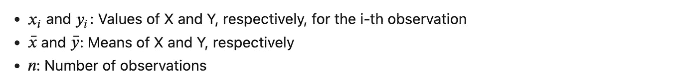

# 相关性——当 Pearson 的 r 不足以满足需求时

> 原文：[`towardsdatascience.com/correlation-when-pearsons-r-is-not-enough-aded72308635`](https://towardsdatascience.com/correlation-when-pearsons-r-is-not-enough-aded72308635)

## 各种相关性方法的比较

[](https://medium.com/@fmnobar?source=post_page-----aded72308635--------------------------------)[](https://towardsdatascience.com/?source=post_page-----aded72308635--------------------------------) [Farzad Mahmoodinobar](https://medium.com/@fmnobar?source=post_page-----aded72308635--------------------------------)

·发表于 [Towards Data Science](https://towardsdatascience.com/?source=post_page-----aded72308635--------------------------------) ·阅读时间 15 分钟·2023 年 2 月 1 日

--


仅有一个关键会解锁，由 [DALL.E 2](https://openai.com/dall-e-2/)

我们对“相关性并不意味着因果关系”这句话非常熟悉，但让我们通过一个实际例子来理解混淆相关性与因果关系可能带来的影响。1998 年 2 月，一篇[论文](https://pubmed.ncbi.nlm.nih.gov/9500320/)发表，声称某些疫苗与儿童自闭症之间存在因果关联。这篇论文后来被发现是欺诈性的，并于 2010 年[撤回](https://pubmed.ncbi.nlm.nih.gov/20137807/)。可以想象，这样的主张对那些基于这篇论文的发现未接种疫苗的人的生活产生了什么影响，那里相关性被误认为是因果关系。

在这篇文章中，我们将深入探讨相关性，以更好地理解它是什么。我们将学习根据研究中的变量类型，推荐使用的相关性方法。最后，我们将在 Python 环境中实现一些最常见的方法。

[](https://medium.com/@fmnobar/membership?source=post_page-----aded72308635--------------------------------) [## 通过我的推荐链接加入 Medium - Farzad Mahmoodinobar

### 阅读 Farzad（和 Medium 上的其他作者）的每一个故事。你的会员费直接支持 Farzad 和其他人…

medium.com](https://medium.com/@fmnobar/membership?source=post_page-----aded72308635--------------------------------)

# 什么是相关性？

相关性是衡量两个感兴趣变量之间关系（或关联）的统计度量。它使用“相关系数”来量化这种关系的*方向*和*强度*。让我们深入了解相关系数的概念知识：

+   **范围和方向：** 相关系数的范围（几乎总是——我们会讨论例外情况）从-1 到 1，包括这两个值。正负取决于两个变量之间的关系方向。

+   **解释：** 值为 1 表示两个变量之间存在完全的正相关（即一个增加，另一个也按相同比例增加，反之亦然）。另一方面，值为-1 表示两个变量之间存在完全的负相关（即一个增加，另一个按相同比例减少，反之亦然）。值为 0 表示当一个变量变化时，另一个变量保持不变。

+   **测量：** 测量相关性的方法有多种。在本文中，我们将探讨各种测量方法。

现在我们已经熟悉了什么是相关性，让我们深入探讨各种计算相关性的方法。

*(所有图片，除非另有说明，均由作者提供。)*

# 相关性方法的总体比较

下表提供了我们将在本文中讨论的各种相关性方法的概述和比较。这个表格是未来使用的很好的参考。


相关性方法比较

让我们更详细地讨论这些方法。

# 数据集

为了实现一些相关性方法，我们将使用来自 [UCI 机器学习库](https://archive-beta.ics.uci.edu/dataset/10/automobile)（CC BY 4.0）的数据集，其中包括车价和与每个车价相关的车属性。我已经清理和筛选了数据，可以从 [这个链接](https://gist.github.com/fmnobar/c9b4029e08e97978a9a53f4eb034b16f) 下载。我们将查看车价与发动机大小或燃料类型的相关性。对于其余的方法，我们将现场创建小数据集进行实施。

让我们将车的数据导入到 Pandas 数据框中，然后在散点图中可视化价格和发动机大小，以更好地了解这两个变量之间的视觉关系。

```py
# Import libraries
import numpy as np
import pandas as pd
import seaborn as sns
from scipy import stats
import matplotlib.pyplot as plt
%matplotlib inline

# Read the data
df = pd.read_csv('auto-cleaned.csv')

# Create the scatterplot
sns.regplot(data = df, x = 'price', y = 'engine-size', fit_reg = False, color = 'purple')

# Add labels for X and Y axes
plt.xlabel('Price')
plt.ylabel('Engine Size')
plt.show()
```

结果：


车价与发动机大小的散点图

散点图显示随着价格的上涨，发动机大小也在增加。因此，我们期望相关性为正。让我们看看计算是否支持这一点。

# 相关性计算方法

# 1\. 皮尔逊相关系数

这是最广泛使用的相关性测量。皮尔逊相关系数（PCC），也称为皮尔逊的*r*，是衡量两个变量之间线性相关性的指标。正如定义所示，这种方法假设两个变量之间存在线性关系，因此不适用于非线性关系。该相关性还假设变量大致服从正态分布。

从数学上讲，它可以通过以下方式计算：


Pearson 的 *r*



## 1.1\. Pearson 的相关系数——实现

幸运的是，我们不必自己进行数学计算。让我们使用 Python 计算数据集中价格和发动机大小之间的 Pearson 的 r。

```py
# Calculate Pearson's r
stats.pearsonr(df['price'], df['engine-size'])
```

结果：


统计量“~0.89”是我们寻找的相关系数。正如我们所预期的那样，两者之间存在正相关（且相对较强）。“p 值”是对零假设检验的结果，零假设认为所提供的数据分布是无相关且正态分布的。在这个例子中，p 值是一个非常小的数字，意味着我们可以拒绝零假设（即存在相关性）。

# 2\. Spearman 的排名相关系数

也称为 Spearman 的 𝜌（读作“rho”），是一种衡量两个变量之间排名相关性的指标，它衡量两个变量之间的关系如何被单调函数描述。概念上，这比听起来要简单得多，一旦我们定义了“排名相关性”和“单调函数”。

+   **排名相关性：** 排名相关性衡量的是两个数据集之间的顺序相似性，相对于彼此（请记住，PCC 并没有直接测量相对排名）。

+   **单调函数：** 如果一个函数保持其参数的给定顺序，即在输入值增加时，函数始终增加或始终减少，则称该函数为单调函数（这听起来与我们定义的相关性非常相似）。单调关系与线性关系之间有区别。线性关系是一种特殊的单调关系，其中增长率保持不变——换句话说，与线性关系不同，单调关系中的变化量（增加或减少）可以有所不同。

从数学上讲，当所有 n 个排名都是不同的整数时，它的计算方法如下：


Spearman 的排名相关系数

其中：


## 2.1\. Spearman 的排名相关系数——实现

让我们看看如何在 Python 中计算相同的两个变量——价格和发动机大小。

```py
# Calculate Spearman's rho
stats.spearmanr(df['price'], df['engine-size'])
```

结果：


结果与 Pearson 的 *r* 非常相似，正如预期的那样。

# 3\. Kendall's Tau

Kendall's Tau，记作𝛕，是一种非参数排名相关性测量方法。我们从之前的相关性方法中知道了排名相关性的含义。非参数意味着它不依赖于基础数据的概率分布。Kendall's Tau 是非参数的，因为它仅基于数据的相对排序来测量排名相关性（而不是数据的具体值）。

从数学上讲，Kendall’s Tau 可以通过两种不同的方式计算，它们的唯一不同之处在于如何将其归一化到 -1 到 1 的范围内。我们将在此处定义两种方法以供参考：


Kendall’s Tau — b

其中：


Kendall’s Tau — c

其中：


一致对意味着两个观察值相对于其他观察值的排名方式相同。例如，假设：


然后，两个观察对是 (x_1, x_2) 和 (y_1, y_2)。如果 x_1 的排名高于 x_2，则 y_1 的排名也高于 y_2，这一对观察被认为是一致的。反之则为不一致。

## 3.1. Kendall’s Tau — 实现

让我们看看如何在 Python 中计算这两个 Kendall’s Tau 的解释，以便对价格和发动机大小这两个变量进行相同的计算。

```py
# Calculate Kendall's Tau
tau_b = stats.kendalltau(df['price'], df['engine-size'], variant = 'b')
tau_c = stats.kendalltau(df['price'], df['engine-size'], variant = 'c')

print(f"Kendall's Tau (b) is: {tau_b}")
print(f"Kendall's Tau (c) is: {tau_c}")
```

结果：


类似于其他相关性测量，存在一个正相关以及一个非常小的“p 值”，这表明存在相关性。正如预期的那样，Tau b 或 c 的两个实现之间没有很大的差异。

# 4. 点二列

点二列相关系数测量一个二值（或二分）变量与一个连续变量之间的相关性。二值或二分变量是指仅取两个值的变量（例如 0 或 1，女性或男性等）。例如，Pearson’s *r* 测量两个 **连续** 变量之间的相关性。但是，在处理一个二值变量和一个连续变量的情况下，我们可以使用点二列相关系数。

点二列相关系数的计算方法如下：


点二列相关系数

其中：


## 4.1. 点二列 — 实现

在我们的数据集中，燃料类型可以是汽油或柴油，我们可以将其用作二值变量。首先，我们将创建一个名为“fuel-type-binary”的新列，其中汽油的值为 0，柴油的值为 1。然后我们计算燃料类型与汽车价格之间的点二列相关系数。

```py
# Create the new column for the binary values
df['fuel-type-binary'] = df['fuel-type'].replace({'gas' : 0, 'diesel' : 1})

# Calculate Point-Biserial correlation coefficient
stats.pointbiserialr(df['price'], df['fuel-type-binary'])
```

结果：


# 5. Phi 系数

Phi 系数（即均方列联系数），用 ɸ 表示，是另一种用于测量两个变量之间的关联（或相关性）的指标，但仅在两个变量都是二值或二分变量时使用。如果你是专注于分类的机器学习从业者，你可能也知道它作为 Matthews 相关系数（MCC）。在机器学习中，MCC 用作二值或多类分类的质量度量。

从数学上讲，ɸ 对于两个二元变量 X 和 Y 定义如下：


其中：


上述表格表示被称为“列联表”。接下来，让我们看看如何在 Python 中实现 Phi 系数。为了完整性，我们将介绍两种方法。

## 5.1\. Phi 系数 — 在 Pandas 中的实现

我们将在下面的代码块中采取以下步骤：

1.  导入必要的包

    2\. 从两个假设的二元变量 X 和 Y 创建一个数据框

    3\. 创建一个列联表

    4\. 计算 Phi 系数

```py
# Import necessary packages
import pandas as pd
import math

# Create a dataframe from two assumed binary variables of X and Y
df = pd.DataFrame({'X': [1, 1, 0, 0, 1, 0], 'Y': [1, 0, 1, 1, 0, 1]})

# Create a contingency table
table = pd.crosstab(df['X'], df['Y'])

# Extract the values from the table
n11 = table.iloc[0,0]
n10 = table.iloc[0,1]
n01 = table.iloc[1,0]
n00 = table.iloc[1,1]

# Calculate the phi coefficient
coef = (n11*n00 - n10*n01) / (math.sqrt((n11+n10)*(n11+n01)*(n00+n10)*(n00+n01)))

print(f"Phi Coefficient: {coef}")
```

结果：


这并不难计算，但仍然相对手动且容易出错。让我们看看第二种方法，这种方法更为直接。

## 5.2\. Phi 系数 — 在 scikit-learn 中的实现

记住 Phi 系数也被称为 Matthews 相关系数（MCC）吗？scikit-learn 库中正好包含了它，所以让我们看看如何实现它，按照以下步骤：

1.  导入必要的包

    2\. 创建两个假设的二元变量

    3\. 计算 MCC

```py
# Import necessary packages
from sklearn.metrics import matthews_corrcoef

# Create two assumed binary variables
X = [1, 1, 0, 0, 1, 0]
Y = [1, 0, 1, 1, 0, 1]

# Calculate MCC
mcc = matthews_corrcoef(X, Y)
print(f"Matthews Correlation Coefficient: {mcc}")
```

结果：


正如预期的那样，这个数字与我们在第一种方法中生成的数字完全相同。

> **专业提示：** 这种方法旨在衡量二元（以及多类别）分类的质量，我们在这个例子中使用它来计算两个变量之间的关联。在机器学习中，典型的应用是使用 MCC 来衡量分类问题中真实值与预测值的相关性或关联性。我们这里的方法是合适的，并且生成了正确的结果，但这是一个重要的警告，以防你决定将来使用 MCC。

# 6\. Cramer’s V

Cramer’s V（也称为 Cramer’s Phi，记作 V）是两个类别（**名义**）变量之间的关联（或相关性）度量。这与 Phi 系数非常相似，但它更为广泛，因为它可以应用于 *n*n* 列联表（与只能应用于二元变量的 ɸ 不同）。

> **重要说明：** 这是本文中唯一一个范围为 0 到 1（包括 0 和 1）的度量（相比于其他相关性度量，其范围为 -1 到 1，包括 -1 和 1）。

Cramer’s V 可以按如下方式计算：


其中：


## 6.1\. Cramer’s V — 实现

让我们看一个实现 Cramer’s V 的例子。我们将采取以下步骤：

1.  导入必要的库

    2\. 创建一个包含 X 和 Y 两个变量的数据框，每个变量有两个不同的类别

    3\. 创建一个列联表

    4\. 计算卡方统计量

    5\. 计算 Cramer’s V

```py
# Import necessary libraries
import pandas as pd
import math

# Create a dataframe
df = pd.DataFrame({'X': ['A', 'A', 'B', 'B', 'A', 'B'], 'Y': ['W', 'X', 'W', 'W', 'X', 'W']})

# Create a contingency table
table = pd.crosstab(df['X'], df['Y'])

#Calculate the chi-squared statistic and the p-value
chi2, p, dof, expected = stats.chi2_contingency(table)

#Calculate Cramer's V
V = math.sqrt(chi2 / (table.values.sum()*min(table.shape[0]-1, table.shape[1]-1)))

print(f"Cramer's V: {V}")
```

结果：


# 7\. 多序列相关性

多序列相关性是衡量两个分类（**有序**）变量之间的关联（或相关性）。由于这些是有序变量，因此相关性考虑了关联的强度和方向（因此范围为 -1 到 1，与 Cramer’s V 不同）。多序列相关性的一个特例是四分位相关性，仅用于二元或二分变量——我们将在帖子后面讨论这一点。

# 8\. 部分相关性

部分相关性是控制一个或多个混杂因素的情况下，两个变量之间的相关性度量。混杂因素是与独立变量和依赖变量（即输出）相关的变量。换句话说，部分相关性衡量的是在从这种关系中去除一个或多个其他变量的影响后，两个变量之间的关联（或相关性）。

一个常见的混杂因素示例是研究吸烟（X）与肺癌（Y）之间关系的研究。在这项研究中，年龄（Z）是一个混杂因素。吸烟者通常年纪较大，而年龄本身也是肺癌的风险因素。因此，年龄（Z）可以影响吸烟（X）和肺癌（Y）。然后，部分相关性可以用来控制 Z 的混杂效应（即从研究中去除年龄的影响），然后研究将集中在控制环境下吸烟（X）与肺癌（Y）之间的相关性。

部分相关性可以按如下方式计算：


部分相关性

协方差和方差的计算方法如下：


我们将介绍在 Python 中实现部分相关性的两种方法，一种是直接计算这种相关性，另一种是使用 Python 库简化过程。

## 8.1\. 部分相关性 — 在 Pandas 中的实现

部分相关性的公式看起来很复杂，但可以很容易地在 Python 中实现。让我们看看一个例子，我们将采取以下步骤：

1.  导入必要的软件包

    2\. 创建包含 X、Y 和 Z 变量的数据框

    3\. 计算 X 和 Y 之间的部分相关性，同时控制 Z

```py
# Import necessary packages
import pandas as pd

# Create a dataframe of X, Y and Z variables
data = {
    'X': [1, 1, 9, 0, 1, 8, 10, 7, 10, 0, 1, 9, 0, 6, 2, 6, 9, 0, 9, 7], 
    'Y': [8, 2, 4, 3, 0, 1, 6, 0, 5, 6, 10, 3, 2, 7, 4, 5, 6, 0, 5, 10],
    'Z': [0, 2, 1, 1, 2, 2, 7, 7, 2, 6, 4, 4, 7, 7, 6, 6, 1, 6, 4, 7]
}

df = pd.DataFrame(data)

# Create a correlation matrix
corr_matrix = df.corr()

x_y_correlation = corr_matrix.loc['X', 'Y']
x_z_correlation = corr_matrix.loc['X', 'Z']
y_z_correlation = corr_matrix.loc['Y', 'Z']

# Calculate the Partial Correlation between X and Y, while controlling for Z
partial_correlation_xy_z = (x_y_correlation - (x_z_correlation * y_z_correlation)) / ((1 - (x_z_correlation ** 2)) * (1 - (y_z_correlation ** 2))) ** 0.5

print(f"Partial Correlation (between X and Y, while controlling for Z): {partial_correlation_xy_z}")
```

结果：


## 8.2\. 部分相关性 — 在 Pingouin 中的实现

之前的方法有助于理解部分相关性的概念，但创建每个相关性并使用公式计算部分相关性并不高效——这也增加了人为错误的机会。在下面的代码块中，我们将利用 [pingouin](https://pingouin-stats.org/build/html/index.html) 库来简化过程，通过以下步骤进行：

1.  导入必要的软件包

    2\. 创建包含 X、Y 和 Z 变量的数据框

    3\. 计算 X 和 Y 之间的部分相关，同时控制 Z

```py
# Import necessary packages
import pandas as pd
import pingouin as pg

# Create a dataframe of X, Y and Z variables
data = {
    'X': [1, 1, 9, 0, 1, 8, 10, 7, 10, 0, 1, 9, 0, 6, 2, 6, 9, 0, 9, 7], 
    'Y': [8, 2, 4, 3, 0, 1, 6, 0, 5, 6, 10, 3, 2, 7, 4, 5, 6, 0, 5, 10],
    'Z': [0, 2, 1, 1, 2, 2, 7, 7, 2, 6, 4, 4, 7, 7, 6, 6, 1, 6, 4, 7]
}
df = pd.DataFrame(data)

# Calculate the Partial Correlation between X and Y, while controlling for Z
partial_correlation_xy_z = pg.partial_corr(data = df, x='X', y='Y', covar='Z', method = 'pearson')

print(partial_correlation_xy_z)
```

结果：


结果有助于理解，因为还有额外的字段。让我们来看一下这些字段所传达的信息 ([source](https://pingouin-stats.org/build/html/generated/pingouin.partial_corr.html#pingouin.partial_corr))：

+   n：样本大小

+   r：部分相关系数

+   CI95%：r 的 95% 参数置信区间

+   p-val：p 值

请注意，我们决定在这个具体实现中使用 Pearson 的 *r*，使用了 `method = ‘pearson’`。另一种选择是通过包含 `method = ‘spearman’` 来使用 Spearman 𝜌。

# 9\. 四分相关系数

四分相关系数是多重相关系数的一个特殊情况，用于测量两个二元（或二分）变量之间的关联。回忆一下，Phi 系数也测量两个二元变量之间的关联。区别在于 Phi 系数假设数据服从正态分布，而四分相关系数假设双变量正态分布。换句话说，四分相关系数假设二元变量是从一个服从正态分布的连续变量生成的，而 Phi 相关系数则假设二元变量本身服从正态分布。四分相关系数在基础连续变量不可直接观察但可以假设为正态分布的情况下非常有用。这种情况在心理学、医学、营销和/或社会科学研究中很常见，其中基础行为不可直接观察（例如，自我报告的政治观点与实际投票行为之间的关联）。

# 结论

在这篇文章中，我们讨论了理解相关性及其测量方法的重要性。根据被调查变量的类型，推荐使用特定类型的相关性。然后，我们介绍了最常见的相关性方法及其在 Python 环境中的实现方法。

# 感谢阅读！

如果你觉得这篇文章有帮助，请在 Medium 上关注我并订阅以接收我的最新文章！
