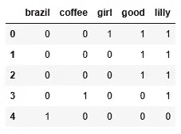

# CountVectorizer 提取文本特征的详细教程

> 原文：[`towardsdatascience.com/countvectorizer-to-extract-features-from-texts-in-python-in-detail-0e7147c10753`](https://towardsdatascience.com/countvectorizer-to-extract-features-from-texts-in-python-in-detail-0e7147c10753)


照片来源：[Towfiqu barbhuiya](https://unsplash.com/@towfiqu999999?utm_source=medium&utm_medium=referral) 于 [Unsplash](https://unsplash.com/?utm_source=medium&utm_medium=referral)

## 使用 CountVectorizer 在 Sklearn 中高效工作的所有必备知识

[](https://rashida00.medium.com/?source=post_page-----0e7147c10753--------------------------------)[](https://towardsdatascience.com/?source=post_page-----0e7147c10753--------------------------------) [Rashida Nasrin Sucky](https://rashida00.medium.com/?source=post_page-----0e7147c10753--------------------------------)

·发表于 [Towards Data Science](https://towardsdatascience.com/?source=post_page-----0e7147c10753--------------------------------) ·阅读时间 7 分钟·2023 年 10 月 21 日

--

任何自然语言处理（NLP）项目最基本的数据处理是将文本数据转换为数值数据。只要数据是文本形式，我们无法对其进行任何计算操作。

有多种方法可以进行文本到数值数据的转换。本教程将解释其中最基本的向量化方法之一，即 scikit-learn 库中的 CountVectorizer 方法。

这个方法非常简单。它将每个单词的出现频率作为数值。一个例子会让它更清楚。

在以下代码块中：

+   我们将导入 CountVectorizer 方法。

+   调用该方法。

+   将文本数据适配到 CountVectorizer 方法中，并转换为数组。

```py
import pandas as pd 
from sklearn.feature_extraction.text import CountVectorizer 

#This is the text to be vectorized
text = ["Hello Everyone! This is Lilly. My aunt's name is also Lilly. I love my aunt.\
        I am trying to learn how to use count vectorizer."]

cv= CountVectorizer() 
count_matrix = cv.fit_transform(text)
cnt_arr = count_matrix.toarray()
cnt_arr
```

输出：

```py
array([[1, 1, 2, 1, 1, 1, 1, 2, 1, 2, 1, 2, 1, 1, 2, 1, 1, 1]],
      dtype=int64)
```

这里我有表示上面文本数据的数值。

> **我们如何知道哪些值代表文本中的哪些单词？**

为了澄清这一点，将数组转换为 DataFrame，其中列名将是单词本身，将会很有帮助。

```py
cnt_df = pd.DataFrame(data = cnt_arr, columns = cv.get_feature_names())
cnt_df
```


图片来源：作者

现在，它显示得很清楚。单词‘also’的值为 1，这意味着‘also’在测试中仅出现了一次。单词‘aunt’在文本中出现了两次。所以，单词‘aunt’的值为 2。

在最后一个例子中，所有的句子都在一个字符串中。所以，我们为四个句子只得到了一个数据行。让我们重新排列文本，看看会发生什么：

```py
text = ["Hello Everyone! This is Lilly", 
        "My aunt's name is also Lilly",
        "I love my aunt",
        "I am trying to learn how to use count vectorizer"]
cv= CountVectorizer() 
count_matrix = cv.fit_transform(text)
cnt_arr = count_matrix.toarray()
cnt_arr
```

输出：

```py
array([[0, 0, 0, 0, 1, 1, 0, 1, 0, 1, 0, 0, 0, 1, 0, 0, 0, 0],
       [1, 0, 1, 0, 0, 0, 0, 1, 0, 1, 0, 1, 1, 0, 0, 0, 0, 0],
       [0, 0, 1, 0, 0, 0, 0, 0, 0, 0, 1, 1, 0, 0, 0, 0, 0, 0],
       [0, 1, 0, 1, 0, 0, 1, 0, 1, 0, 0, 0, 0, 0, 2, 1, 1, 1]],
      dtype=int64)
```

这一次，我们有一个二维数组，其中每个字符串在文本中都有一个单独的列表。将这个数组放入 DataFrame 中：

```py
cnt_df = pd.DataFrame(data = cnt_arr, columns = cv.get_feature_names())
cnt_df
```


图片由作者提供

仔细查看这个 DataFrame。所有单词都作为列名存在。每一行代表文本中的一个字符串，列中的值显示了单词在该字符串中出现的次数。如果单词没有出现，值为零。

在 `sklearn` 库的 [CountVectorizer 方法](https://scikit-learn.org/stable/modules/generated/sklearn.feature_extraction.text.CountVectorizer.html) 中，有一些值得检查的参数。

> lowercase

如果你注意到，默认情况下 `CountVectorizer` 方法将所有单词转换为小写。如果你不希望这样，你需要将 `lowercase` 设置为 `False`。

```py
cv= CountVectorizer(lowercase=False) 
count_matrix = cv.fit_transform(text)
cnt_arr = count_matrix.toarray()
cnt_df = pd.DataFrame(data = cnt_arr, columns = cv.get_feature_names())
```


图片由作者提供

现在，单词以文本中的原样形式被取出。单词 ‘My’ 在 DataFrame 中出现了两次，分别为 ‘My’ 和 ‘my’。

> stop_words

`stop_words` 是我们认为对分析不必要的单词。在我们的文本中，我可能认为‘also’、‘is’和‘to’是不必要的单词。我可以简单地排除它们，这在大多数分析或机器学习模型的数据处理过程中是非常重要的一部分。这里我们只有 4 个字符串。但在实际的分析中，我们需要处理成千上万的字符串。成千上万的字符串可能涉及成千上万的单词，每个单词都成为一个特征。如果我们可以排除一些频繁出现的或对模型不那么必要的单词，将节省大量计算工作。

`CountVectorizer` 方法本身为许多主要语言提供了默认的停用词列表。这里是一个例子。

```py
cv= CountVectorizer(stop_words='english') 
count_matrix = cv.fit_transform(text)
cnt_arr = count_matrix.toarray()
cnt_df = pd.DataFrame(data = cnt_arr, columns = cv.get_feature_names())
cnt_df
```


图片由作者提供

看！许多单词都被去除了！

如果你认为已经去除的单词不够，或者去除了太多单词，请提供你自己的 `stop_words` 列表。例如，如果我只想排除‘also’、‘is’、‘am’ 和 ‘to’，我会像这样提供 `stop_words` 列表：

```py
cv= CountVectorizer(stop_words=['also', 'is', 'am', 'to']) 
```

> max_df

这是一种去除单词的方式。如果我们使用 `max_df = 0.5`，这意味着如果一个单词出现在超过 50%的文档或字符串中，那么该单词将被去除。`max_df` 也可以使用整数值。例如，`max_df = 20` 意味着如果一个单词存在于超过 20 个文档中，它将被去除。

为了演示这一点，我创建了一个新文本：

```py
text = ["lilly is a good girl", 
        "lilly is a good student",
        "lilly is very good in math", 
        "lilly loves coffee", 
        "She is from Brazil"]
cnt_vect = CountVectorizer(max_df=0.75)
count_mtrx = cnt_vect.fit_transform(text)
cnt_arr = count_mtrx.toarray()
cnt_df = pd.DataFrame(data = cnt_arr, columns=cnt_vect.get_feature_names())
cnt_df
```


图片由作者提供

‘Lilly’ 出现在 5 个文档中的 4 个中。因此它被去除了。‘is’ 也是如此。

> min_df

这与 `max_df` 相反。如果一个文档出现的比例或指定的次数少于 `min_df`，则该文档会被排除。在这个例子中，我使用了与上一个例子相同的文本，并将 `min_df` 设置为 `2`。因此，任何在少于 2 个文档中出现的单词将被去除。

```py
cnt_vect = CountVectorizer(min_df=2)
count_mtrx = cnt_vect.fit_transform(text)
cnt_arr = count_mtrx.toarray()
cnt_df = pd.DataFrame(data = cnt_arr, columns=cnt_vect.get_feature_names())
cnt_df
```


图片由作者提供

由于我们只有 3 个单词剩下，因为我们只有 5 个文档。这在机器学习项目中可能很有用。

> 当我们试图提取趋势时，只有在成千上万的文档中的几个文档中偶尔出现的词汇并不太有帮助。
> 
> `max_features`

这是另一个有用的功能。当我们有成千上万的词汇时，计算开销大且耗时。如果我们总共有 10000 个词汇，那么就有 10000 个特征。现在，如果你认为根据词频只有前 2000 个词汇可能足够好，你可以简单地使用 `max_features = 2000`。这里甚至没有这么多词汇。所以，我会使用 `max_features = 5`。

```py
cnt_vect = CountVectorizer(max_features=5, stop_words='english')
count_mtrx = cnt_vect.fit_transform(text)
cnt_arr = count_mtrx.toarray()
cnt_df = pd.DataFrame(data = cnt_arr, columns=cnt_vect.get_feature_names())
cnt_df
```



作者提供的图片

这里是出现频率最高的五个词。

## 结论

这篇文章尝试解释 CountVectorizer 方法以及如何最好地使用这种文本处理方法。我在这里解释的参数如果正确使用，可以使你的分析或自然语言处理模型更加高效。这些参数可以单独使用，也可以根据需要将其中的一些参数组合在一起。实验的空间很大。现在有更复杂的方法来向量化文本数据，但这种简单的方法在许多情况下仍然有效。

随时可以在 [Twitter](https://twitter.com/rashida048) 上关注我，并点赞我的 [Facebook](https://www.facebook.com/rashida.smith.161) 页面。

如果你想要这个教程的视频版本，这里是链接：

## 更多阅读

[完整的 Python 探索性数据分析](https://pub.towardsai.net/a-complete-exploratory-data-analysis-in-python-a2148daac072?source=post_page-----0e7147c10753--------------------------------) [## 完整的 Python 探索性数据分析

### 数据清洗、分析、可视化、特征选择、预测建模

[30 个非常有用的 Pandas 函数用于日常数据分析任务](https://pub.towardsai.net/a-complete-exploratory-data-analysis-in-python-a2148daac072?source=post_page-----0e7147c10753--------------------------------) [](/30-very-useful-pandas-functions-for-everyday-data-analysis-tasks-f1eae16409af?source=post_page-----0e7147c10753--------------------------------) [## 30 个非常有用的 Pandas 函数用于日常数据分析任务

### Pandas 备忘单

[6 个处理缺失值的技巧](https://towardsdatascience.com/30-very-useful-pandas-functions-for-everyday-data-analysis-tasks-f1eae16409af?source=post_page-----0e7147c10753--------------------------------) [](/6-tips-for-dealing-with-null-values-e16d1d1a1b33?source=post_page-----0e7147c10753--------------------------------) [## 6 个处理缺失值的技巧

### 包括迭代方法、均值和中位数填充与分组、均值和中位数填充

[详细的 Python 多项式回归教程：概述、实现和过拟合](https://pub.towardsai.net/a-detailed-tutorial-on-polynomial-regression-in-python-overview-implementation-and-overfitting-e319fc7e5b8f?source=post_page-----0e7147c10753--------------------------------) 

### 完整的 Python 代码

[pub.towardsai.net](https://pub.towardsai.net/a-detailed-tutorial-on-polynomial-regression-in-python-overview-implementation-and-overfitting-e319fc7e5b8f?source=post_page-----0e7147c10753--------------------------------) ## 使用 GradientTape 进行 TensorFlow 模型训练

### 使用 GradientTape 更新权重

[towardsdatascience.com ## 使用自编码器方法进行 TensorFlow 和 Keras 的异常检测

### 一种前沿的无监督方法，用于去噪、降维、异常检测等

[towardsdatascience.com
